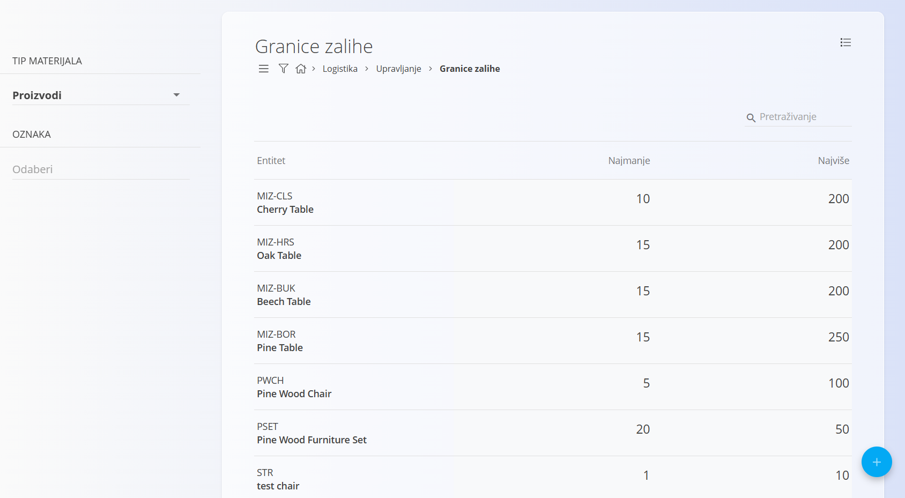
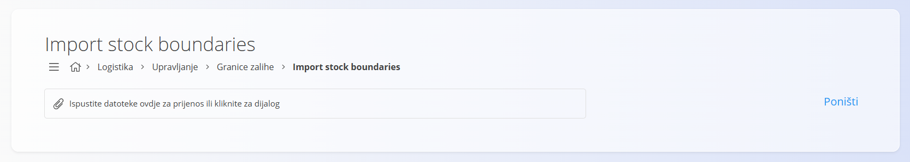

<!-- app_route: /management/warehouse/stock-boundaries -->
<!-- app_label: Granice zalihe -->
<!-- canonical_source_url: https://github.com/Tom-PIT/Connected.Docs/blob/main/hr/Domene/Logistika/Upravljanje/GraniceZalihe.md -->
<!-- canonical_source_title: Granice zalihe -->

# Granice zalihe

Ovaj popis predstavlja granice zalihe za pojedine materijale ili proizvode u sustavu. Svaki zapis definira minimalnu i maksimalnu dopuštenu količinu zalihe za određeni materijal ili proizvod, čime se održava optimalna razina zaliha te sprječavaju nestašice i prekomjerne zalihe.

> [!TIP]
> Za potpuni prikaz funkcionalnosti pogledajte video **[Granice zalihe](https://www.youtube.com/watch?v=rcbxvffOBdM)**.

## Shema

| Polje | Opis |
|-------|------|
| **Entitet** | Materijal ili proizvod na koji se primjenjuju granice zalihe. Prikazuje se sa svojom šifrom i nazivom. |
| **Najmanje** | Minimalna dopuštena količina zalihe za odabrani materijal ili proizvod. Kada količina padne ispod ove vrijednosti, sustav označava stanje na [Nadzornoj ploči](../Pogledi/NadzornaPloca.md). |
| **Najviše** | Maksimalna dopuštena količina zalihe za odabrani materijal ili proizvod. Kada količina premaši ovu vrijednost, sustav označava stanje na [Nadzornoj ploči](../Pogledi/NadzornaPloca.md). |

## Upravljanje

Za pristup ovom dokumentu idite na **Logistika / Upravljanje / Granice zalihe** u [navigaciji](../../../Zajednicko/UI/Navigacija.md).

### Popis granica zalihe

Korisničko sučelje prikazuje popis svih materijala i njihovih definiranih granica zalihe. Koristite odabir **Tip materijala** na lijevoj strani za filtriranje rezultata prema kategoriji te filtar **Oznaka** za dodatno sužavanje prikazanih zapisa.

Svaki zapis prikazuje **Entitet**, **Najmanje** i **Najviše** količine zalihe. Ako vrijednost za **Najmanje** ili **Najviše** nije definirana, prikazuje se **0**.

Granice zalihe mogu se uređivati izravno u prikazu popisa klikom na numeričku vrijednost u stupcu **Najmanje** ili **Najviše** te unosom nove vrijednosti. Promjene se automatski spremaju nakon ažuriranja polja.



Količine zalihe koje su manje od definirane minimalne ili veće od definirane maksimalne vrijednosti vizualno su označene na [Nadzornoj ploči](../Pogledi/NadzornaPloca.md).

## Radnje

### Uvoz granica zalihe

Kliknite [akcijski gumb](../../../Zajednicko/UI/AkcijskiGumb.md) i odaberite **Uvoz**.

Opcija **Uvoz** omogućuje skupno stvaranje ili ažuriranje granica zalihe pomoću CSV datoteke. Pripremite datoteku s obaveznim poljima (**Entitet**, **Najmanje**, **Najviše**) i učitajte je kako bi se zapisi automatski dodali ili ažurirali.



Kliknite **Poništi** za povratak na popis bez uvoza.

#### Primjer CSV strukture

```csv
Šifra materijala;Tip materijala;Najmanje;Najviše;
M-0001;1;10;100;
M-0002;2;0;250;
M-0003;3;50;0;
M-0004;4;20;80;
```

## Izbornik

Izbornik pruža dodatne radnje dostupne na ovoj stranici.

Dostupne radnje:

- **Izvoz u CSV**

Za više informacija pogledajte [**Radnje izbornika**](../../../Zajednicko/Koncepti/RadnjeIzbornika.md).