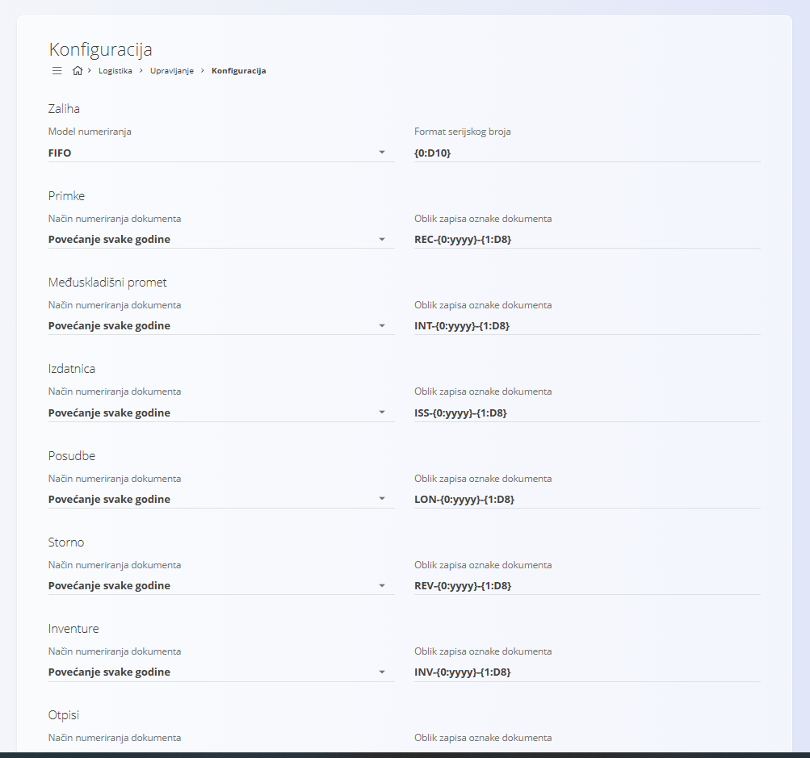

<!-- app_route: /management/warehouse/configuration -->
<!-- app_label: Konfiguracija logistike -->
<!-- canonical_source_url: https://github.com/Tom-PIT/Connected.Docs/blob/main/hr/Domene/Logistika/Upravljanje/KonfiguracijaLogistike.md -->
<!-- canonical_source_title: Konfiguracija logistike -->

# Konfiguracija logistike

Konfigurirajte postavke **Logistike** koje određuju ponašanje zaliha, format serijskih brojeva i numeriranje logističkih dokumenata. Sve promjene spremaju se automatski.

Za pristup ovom dokumentu idite na **Logistika / Upravljanje / Konfiguracija** u [navigaciji](../../../Zajednicko/UI/Navigacija.md).

## Postavke zaliha

| Polje | Opis |
|-------|------|
| **Model numeriranja** | Pravilo koje određuje način izdavanja robe sa zalihe:   • **FIFO:** prvo se izdaje najstarija zaliha   • **LIFO:** prvo se izdaje najnovija zaliha   • **Najbolji rok trajanja:** prvo se izdaje roba s najranijim datumom isteka. |
| **Format serijskog broja** | Format koji sustav koristi za automatsko generiranje serijskih brojeva. Na primjer, **{0:D10}** generira serijske brojeve s deset znamenki i vodećim nulama, kao što su **0000000001**, **0000000002** itd. |

> [!TIP]
>
> Koristite dosljedan format serijskih brojeva kako biste olakšali skeniranje i praćenje artikala.

## Numeriranje dokumenata

Odaberite način numeriranja i oblik zapisa oznake za logističke dokumente, kao što su **Primke**, **Izdatnice** i **Međuskladišni promet**.

| Polje | Opis |
|-------|------|
| **Način numeriranja dokumenta** | • **Povećanje svake godine:** numeracija se ponovno pokreće na početku svake godine.   • **Povećanje:** numeracija se kontinuirano povećava bez resetiranja. |
| **Oblik zapisa oznake dokumenta** | Predložak koji određuje način generiranja oznake dokumenta (na primjer: prefiks, godina i redni broj). |