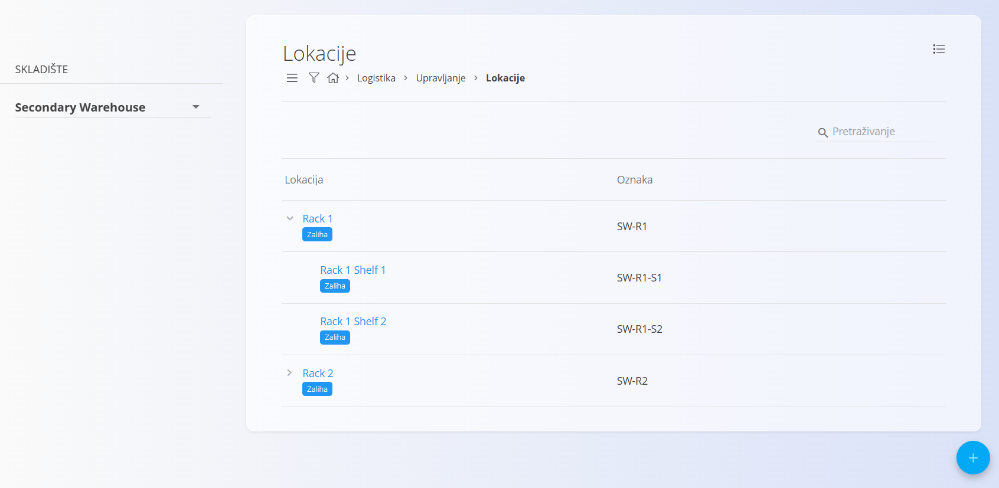

<!-- app_route: /management/warehouse/locations -->
<!-- app_label: Lokacije -->
<!-- canonical_source_url: https://github.com/Tom-PIT/Connected.Docs/blob/main/hr/Domene/Logistika/Upravljanje/Lokacije.md -->
<!-- canonical_source_title: Lokacije -->

# Lokacije

Ova šifrarnica sadrži lokacije unutar pojedinih [skladišta](Skladišta.md). Svaka lokacija predstavlja određeno područje ili podjelu skladišta, poput regala, police ili pretinca, te omogućuje preciznu organizaciju i praćenje robe unutar skladišta.

Za pristup ovoj šifrarnici idite na **Logistika / Upravljanje / Lokacije** u [navigaciji](../../../Zajednicko/UI/Navigacija.md).

> [!TIP]
> Za potpuni prikaz rada pogledajte video **[Warehouses and warehouse locations](https://www.youtube.com/watch?v=3sEE9Mrtx6M)**.

## Shema

| Polje | Opis |
|-------|------|
| **Šifra** | Jedinstvena šifra lokacije. Šifra se obično definira tako da odražava hijerarhiju skladišta. |
| **Naziv** | Naziv lokacije, primjerice **Regal 1** ili **Polica 2**. |
| **Nadređena lokacija** | Definira lokaciju unutar koje se nalazi trenutna lokacija. Na primjer, polica može pripadati određenom regalu. |
| **Opis** | Kratak opis lokacije. Ovo polje nije obavezno. |
| **Duguje** | Konto glavne knjige koje se koristi za knjiženje dugovne strane. |
| **Na teret** | Konto glavne knjige koje se koristi za knjiženje potražne strane. |

## Upravljanje

### Popis lokacija

Sučelje prikazuje popis svih lokacija za odabrano skladište. Za promjenu skladišta koristite odabir skladišta na lijevoj strani. Ako još nije unesena nijedna lokacija, popis je prazan.



Svaka lokacija prikazuje oznaku **Zaliha**, koja otvara pregled zalihe za odabranu lokaciju.

Više informacija potražite u dokumentu [Pregled zalihe po lokaciji](../Pogledi/PogledNaZalihePremaLokacijama.md).

## Akcije

Kliknite [akcijski gumb](../../../Zajednicko/UI/AkcijskiGumb.md) za prikaz dostupnih akcija:

- **Uvoz**
- **Nova**

### Uvoz lokacija

Kliknite akcijski gumb i odaberite **Uvoz** za otvaranje sučelja za uvoz. Lokacije možete uvesti iz **CSV** datoteke. Ova je mogućnost korisna prilikom postavljanja složenih skladišnih struktura s većim brojem regala, polica i pretinaca.


Povucite CSV datoteku u područje za prijenos ili kliknite kako biste otvorili dijalog za odabir datoteke. Datoteka mora sadržavati sva potrebna polja u ispravnom formatu.

Nakon uvoza možete pregledati i po potrebi urediti uvezene lokacije na zaslonu **Lokacije**.

Kliknite **Poništi** za povratak bez uvoza.

> [!NOTE]
> Svaka lokacija mora biti povezana s postojećim **skladištem**, stoga prije uvoza provjerite jesu li sva potrebna [**skladišta**](Warehouses.md) već definirana.

#### Primjer CSV strukture

```csv
WarehouseCode,Code,Name,ParentLocationCode,Description
MAIN,CR01,Central rack,,Main central rack in the warehouse
MAIN,CR01-SH01,Shelf 1,CR01,First shelf in the central rack
MAIN,CR01-SH02,Shelf 2,CR01,Second shelf in the central rack
SEC,SEC-R1,Rack 1,,Rack in secondary warehouse
```

### Dodavanje nove lokacije

Kliknite akcijski gumb i odaberite **Nova** za ručno dodavanje nove lokacije.

Obrazac sadrži sljedeća polja:

- **Šifra**
- **Naziv**
- **Nadređena lokacija**
- **Opis**
- **Duguje**
- **Na teret**


Nakon unosa potrebnih podataka kliknite **Dodaj** za spremanje lokacije ili **Poništi** za povratak na popis.

### Uređivanje lokacije

Za uređivanje postojeće lokacije kliknite njezin **Naziv** na popisu. Sustav otvara obrazac za uređivanje s postojećim podacima.

Kliknite **Spremi** za potvrdu promjena ili **Poništi** za odustajanje od izmjena.

### Brisanje lokacije

Na zaslonu za uređivanje kliknite **Izbriši** kako biste otvorili dijalog za potvrdu:

**Jeste li sigurni da želite izbrisati ovaj zapis?**

Ako potvrdite brisanje, lokacija se trajno uklanja. U suprotnom se zapis ne mijenja.

> [!NOTE]
> Lokacija se može izbrisati samo ako nije povezana s drugim zapisima, poput zalihe ili skladišnih transakcija.

## Izbornik

Izbornik sadrži dodatne akcije dostupne na ovoj stranici.

Dostupne akcije:

- **Ispis oznaka lokacija skladišta**

Više informacija o akcijama izbornika potražite u dokumentu [**Akcije izbornika**](../../../Common/Concepts/MenuActions.md).