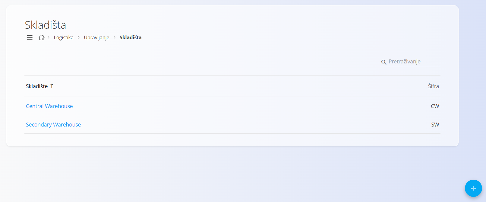
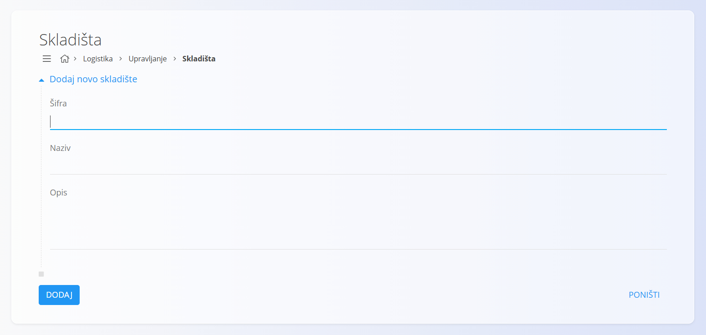

<!-- app_route: /management/warehouse/warehouses -->
<!-- app_label: Skladišta -->
<!-- canonical_source_url: https://github.com/Tom-PIT/Connected.Docs/blob/main/hr/Domene/Logistika/Upravljanje/Skladista.md -->
<!-- canonical_source_title: Skladišta -->

# Skladišta

Ova šifrarnica sadrži skladišta koja se koriste u cijelom sustavu. Svako skladište predstavlja fizičku ili logičku lokaciju za pohranu robe te se koristi u skladišnim, logističkim i inventurnim procesima.

Za pristup ovoj šifrarnici idite na **Logistika / Upravljanje / Skladišta** u [navigaciji](../../../Zajednicko/UI/Navigacija.md).

> [!TIP]
> Za potpuni prikaz rada pogledajte video **[Warehouses and warehouse locations](https://www.youtube.com/watch?v=3sEE9Mrtx6M)**.

## Shema

| Polje | Opis |
|-------|------|
| **Šifra** | Jedinstvena oznaka skladišta. Šifra mora biti jedinstvena unutar šifrarnice. |
| **Naziv** | Naziv skladišta. |
| **Opis** | Kratak opis skladišta. Ovo polje nije obavezno. |

## Upravljanje

### Popis skladišta

Sučelje prikazuje popis svih skladišta. Ako još nije uneseno nijedno skladište, popis je prazan.

Popis prikazuje osnovne informacije o svakom skladištu, uključujući njegov naziv i šifru.

## Akcije

Kliknite [akcijski gumb](../../../Zajednicko/UI/AkcijskiGumb.md) za dodavanje novog skladišta.

Obrazac sadrži sljedeća polja:

- **Šifra**
- **Naziv**
- **Opis**

Nakon unosa potrebnih podataka kliknite **Dodaj** za spremanje skladišta ili **Poništi** za povratak na popis.

## Uređivanje

Za uređivanje postojećeg skladišta kliknite njegov **Naziv** na popisu. Sustav otvara obrazac za uređivanje s postojećim podacima.

Kliknite **Spremi** za potvrdu promjena ili **Poništi** za odustajanje od izmjena.

## Brisanje

Na zaslonu za uređivanje kliknite **Izbriši** kako biste otvorili dijalog za potvrdu:

**Jeste li sigurni da želite izbrisati ovaj zapis?**

Ako potvrdite brisanje, skladište se trajno uklanja. U suprotnom se zapis ne mijenja.

> [!NOTE]
> Skladište se može izbrisati samo ako nije povezano s drugim zapisima, poput skladišnih transakcija ili kretanja robe.