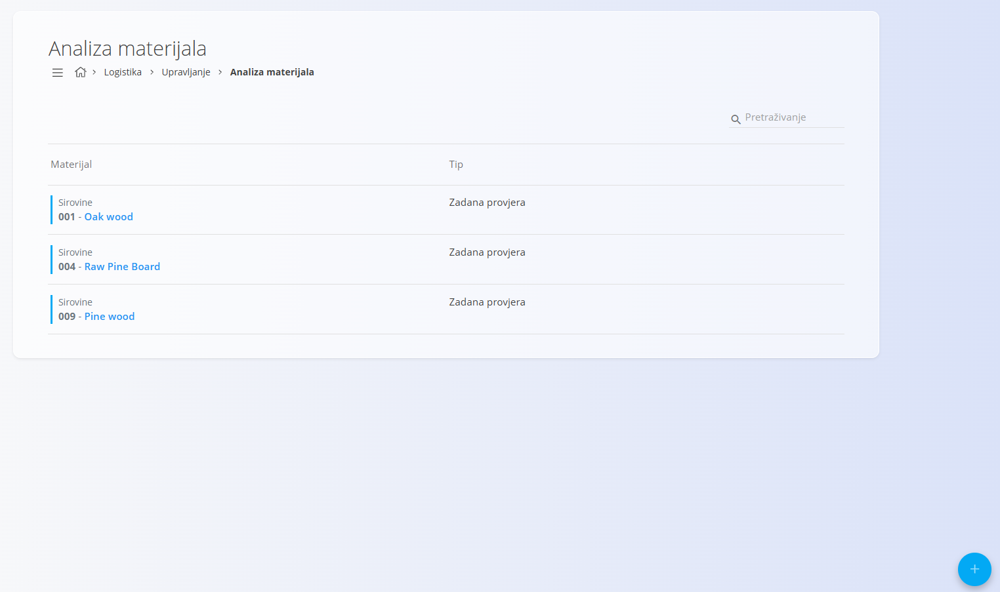
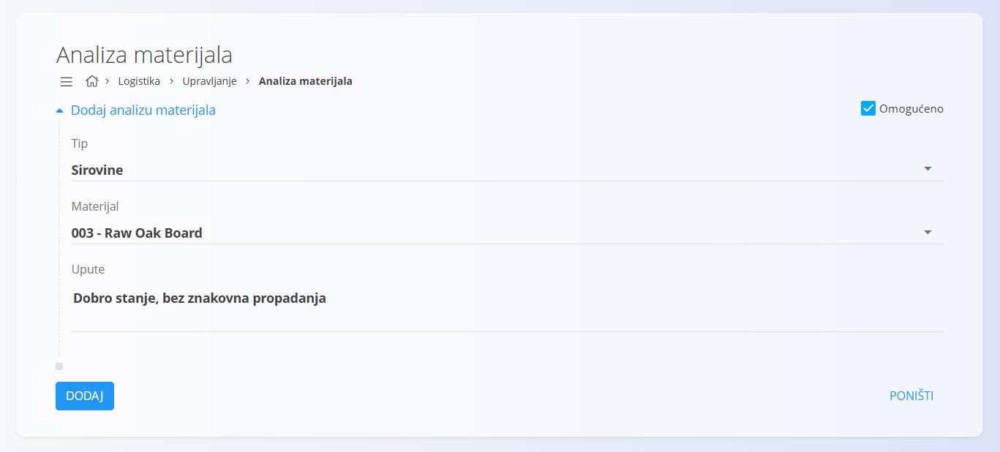

<!-- app_route: /management/warehouse/material-analysis -->
<!-- app_label: Upravljanje analizama materijala -->
<!-- canonical_source_url: https://github.com/Tom-PIT/Connected.Docs/blob/main/hr/Domene/Logistika/Upravljanje/UpravljanjeAnalizamaMaterijala.md -->
<!-- canonical_source_title: Upravljanje analizama materijala -->

# Upravljanje analizama materijala

Definirajte analize ili provjere koje se mogu provoditi nad materijalima (npr. kemijske, vizualne ili dimenzijske provjere). Definirane analize mogu se kasnije odabrati prilikom provođenja kontrole kvalitete materijala.

> [!NOTE]
> Novi zapisi su prema zadanim postavkama omogućeni kako bi se mogli odmah koristiti.

> [!TIP]
> Za detaljan prikaz funkcionalnosti pogledajte video **[Upravljanje analizama materijala](https://www.youtube.com/watch?v=AgCVA8labrw)**.

Za pristup ovom dokumentu idite na **Logistika / Upravljanje / Analiza materijala** u [navigaciji](../../../Zajednicko/UI/Navigacija.md).

## Shema

| Polje | Opis |
|-------|------|
| **Tip** | Vrsta materijala na koju se analiza odnosi (proizvod, poluproizvod, sirovina ili repro materijal) (obavezno). |
| **[Materijali](../../RobaIUsluge/Materijali/README.md)** | Materijal za koji se definira analiza (obavezno). |
| **Upute** | Opis postupka izvođenja analize i kriterija prihvatljivosti (obavezno). |
| **Omogućeno** | Određuje je li analiza dostupna za odabir. Prema zadanim postavkama je uključeno. |

## Popis analiza

Popis prikazuje sve definirane analize s pripadajućim tipom materijala.

Svaki zapis sadrži:

- tip materijala
- naziv materijala
- status analize

Status zapisa prikazan je bojom s lijeve strane:

- **Plava** označava omogućenu analizu.
- **Siva** označava onemogućenu analizu.

## Ustvariti analizu materijala

1. Kliknite [akcijski gumb](../../../Zajednicko/UI/AkcijskiGumb.md).

   

2. Ispunite podatke:
    - Odaberite **Tip** materijala.
    - Odaberite **Materijal**.
    - Unesite **Upute** za izvođenje analize.
    - Po potrebi uključite ili isključite opciju **Omogućeno**.

3. Kliknite **Dodaj**.

## Urediti analizu materijala

Otvorite analizu iz popisa, izmijenite potrebne podatke i kliknite **Spremi**.

## Izbrisati analizu materijala

Otvorite analizu i kliknite **Izbriši**.