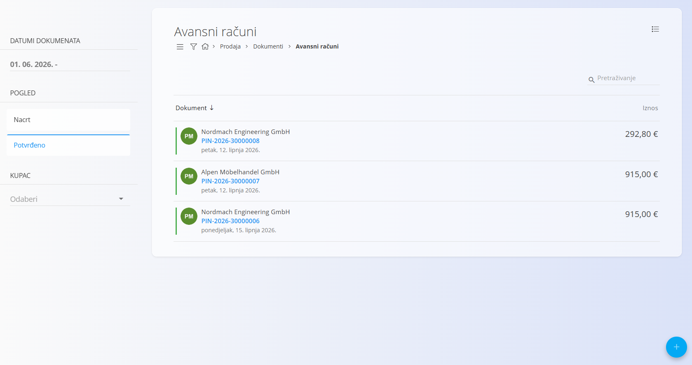
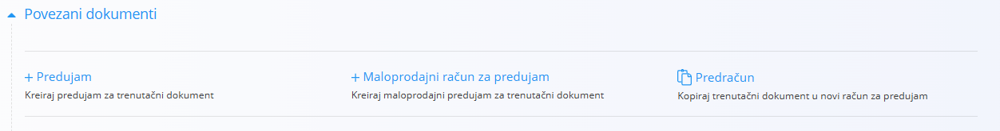
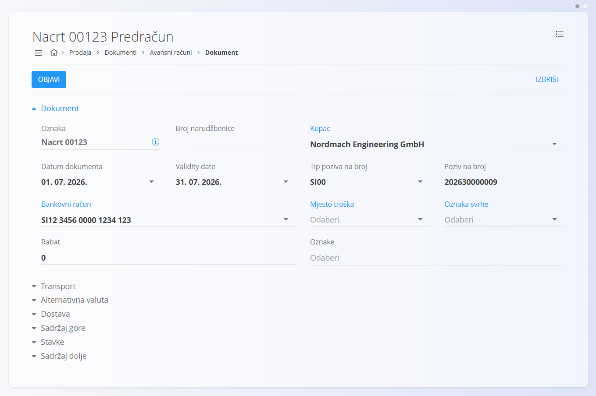
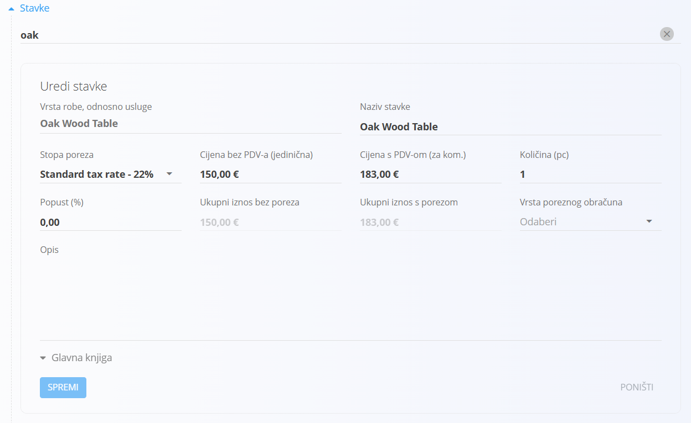
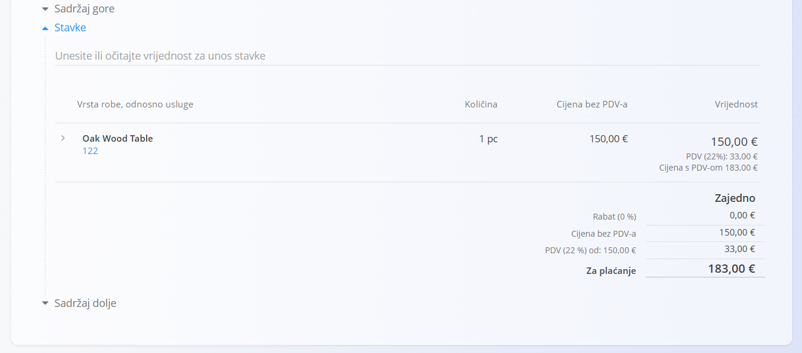

<!-- app_route: /sales/documents/proforma-invoices -->
<!-- app_label: Avansni računi -->
<!-- canonical_source_url: https://github.com/Tom-PIT/Connected.Docs/blob/main/hr/Domene/Prodaja/Dokumenti/AvansniRacuni.md -->
<!-- canonical_source_title: Avansni računi -->

# Avansni računi

**Avansni račun** je preliminarni dokument za naplatu koji se koristi za dostavljanje detaljne ponude kupcu prije isporuke robe ili usluga. Ne uzrokuje računovodstvene niti skladišne promjene, već služi kao potvrđena komercijalna ponuda.

Avansni računi obično se kreiraju iz potvrđene [**Ponude**](Ponude.md), ali se mogu kreirati i samostalno putem [akcijskog gumba](../../../Zajednicko/UI/AkcijskiGumb.md).

Za pristup ovoj stranici idite na **Prodaja / Dokumenti / Avansni računi**.

## Kako se avansni računi uklapaju u prodajni proces

Avansni računi koriste se kao međukorak prilikom potvrđivanja komercijalnih uvjeta s kupcem.

Prodajni proces izgleda ovako:

1. Kreirajte **[Ponudu](Ponude.md)** i objavite je nakon što kupac prihvati uvjete.
2. Pretvorite potvrđenu ponudu u **Avansni račun** putem **Povezani dokumenti → + Predračun** ili ga kreirajte ručno.
3. Pošaljite avansni račun kupcu kao službenu ponudu.
4. (Opcionalno) Kreirajte jedan ili više **[Predujmova](Predujmovi.md)** iz potvrđenog avansnog računa.
5. Pretvorite avansni račun u konačni **[Izlazni račun](IzlazniRacuni.md)** nakon isporuke robe ili usluga.
6. Po potrebi stornirajte avansni račun pomoću funkcije [**Storna**](../../Logistika/Dokumenti/Storno.md).

Potvrđeni avansni račun služi isključivo u informativne svrhe i nema utjecaja na financijsko ni skladišno stanje.

## Shema

<strong>Dokument</strong>

| Polje | Opis |
|-------|------|
| [**Oznaka**](../../../Zajednicko/UI/OznakeDokumenata.md) | Sistemski generirana oznaka avansnog računa. |
| **Broj narudžbenice** | Opcionalna referenca na narudžbenicu kupca. |
| **Kupac** | Kupac kojem je dokument namijenjen, odabire se iz [**Poslovnog imenika**](../../../Zajednicko/Upravljanje/PoslovniImenik.md) (obavezno). |
| **Datum dokumenta** | Datum kreiranja avansnog računa. |
| **Datum valjanosti** | Datum do kojeg vrijede cijene i uvjeti (obavezno). |
| **Tip poziva na broj** | Vrsta poziva na broj koja će se koristiti na dokumentu (obavezno). |
| **Poziv na broj** | Poziv na broj temeljen na odabranom tipu. |
| **[Bankovni račun organizacije](../Upravljanje/BankovniRacuniOrganizacije.md)** | Bankovni račun prikazan na dokumentu (obavezno). |
| **[Mjesto troška](../../../Zajednicko/Upravljanje/MjestaTroska.md)** | Opcionalna dodjela mjesta troška. |
| **Oznaka svrhe** | Opcionalna oznaka svrhe dokumenta. |
| **Rabat** | Ukupni rabat primijenjen na dokument. |
| **Sadržaj gore** | Uvodni tekst iz [**Preddefiniranih tekstova**](../../../Zajednicko/Upravljanje/UnaprijedPripremljeniTekstovi.md). |
| **Sadržaj dolje** | Završni ili pravni tekst iz [**Preddefiniranih tekstova**](../../../Zajednicko/Upravljanje/UnaprijedPripremljeniTekstovi.md). |

<strong>Transport, Alternativna valuta i Dostava</strong>

| Polje | Opis |
|-------|------|
| **[Uvjeti isporuke](../../../Zajednicko/Upravljanje/UvjetiIsporuke.md)** | Uvjeti isporuke dogovoreni s kupcem. |
| **[Način transporta](../../../Zajednicko/Upravljanje/VrstaTransporta.md)** | Način transporta dogovoren s kupcem. |
| [**Alternativna valuta**](../../../Zajednicko/Upravljanje/Valute.md) | Alternativna valuta koja se koristi na dokumentu. |
| [**Tečaj](../Upravljanje/DevizniTecajevi.md)** | Tečaj alternativne valute u odnosu na zadanu valutu. |
| **Dostava** | Podaci o dostavnoj adresi i prijevozniku. |

<strong>Intrastat</strong>

| Polje | Opis |
|-------|------|
| [**Država otpreme**](../../../Zajednicko/Upravljanje/Drzave.md) | Država iz koje se roba otprema. Vrijednost se obično preuzima iz Intrastat konfiguracije artikla. |
| [**Vrsta transakcije**](../../Racunovodstvo/Upravljanje/Intrastat/VrsteTransakcija.md) | Klasifikacija vrste transakcije za Intrastat izvještavanje. |
| [**Mjesto isporuke**](../../Racunovodstvo/Upravljanje/Intrastat/MjestaIsporuke.md) | Mjesto isporuke prema Intrastat pravilima. |

<strong>Stavke</strong>

| Polje | Opis |
|-------|------|
| **Artikl** | Roba, usluga ili druga stavka dokumenta. |
| **Naziv stavke** | Naziv odabrane stavke (može se uređivati ako je dopušteno). |
| [**Stopa poreza**](../../../Zajednicko/Upravljanje/PorezneStope.md) | Porezna stopa primijenjena na stavku. |
| **Cijena bez PDV-a (jedinična)** | Jedinična cijena bez poreza. |
| **Cijena s PDV-om (jedinična)** | Jedinična cijena s porezom. |
| **Količina** | Količina odabrane stavke. |
| **Popust (%)** | Postotak popusta primijenjen na stavku. |
| **Ukupni iznos bez poreza** | Izračunati ukupni iznos bez poreza. |
| **Ukupni iznos s porezom** | Ukupan iznos s porezom. |
| **Vrsta poreznog obračuna** | Određuje način obračuna PDV-a kod posebnih poreznih pravila. |
| **Opis** | Dodatni opis stavke. |
| **Koristi alternativnu valutu** | Izražava iznos stavke u alternativnoj valuti prema tečaju dokumenta. |

<strong>Glavna knjiga i Intrastat</strong>

| Polje | Opis |
|-------|------|
| **Glavna knjiga - Konto prihoda/rashoda** | Konto glavne knjige na koji se knjiži iznos stavke. |
| **Glavna knjiga - Konto poreza** | Konto glavne knjige za knjiženje poreza. |
| [**Intrastat - Carinska tarifa**](../../Racunovodstvo/Upravljanje/Intrastat/CarinskeTarife.md) | Tarifni broj robe za Intrastat izvještavanje. |
| **Intrastat - Zemlja podrijetla** | Zemlja podrijetla robe. |
| **Intrastat - Neto masa (kg)** | Neto masa za statističko izvještavanje. |
| **Intrastat - Statistička vrijednost** | Statistička vrijednost robe za Intrastat. |

## Upravljanje

Avansni računi mogu biti u stanjima **Nacrt** i **Potvrđeno**.

### Popis

Popis je moguće filtrirati prema:

- **Datumu dokumenta**
- **Prikazu** (Nacrt / Potvrđeno)
- **Kupcu**

Svaki red prikazuje:

- Naziv kupca
- Oznaku dokumenta
- Datum dokumenta
- Iznos dokumenta

Dokumenti u stanju **Nacrt** mogu se uređivati, dok su potvrđeni avansni računi zaključeni osim ako nisu stornirani.

## Radnje

### Kreiranje novog avansnog računa

Avansni računi mogu se kreirati na dva načina:

- Izravno sa zaslona **Avansni računi** pomoću [akcijskog gumba](../../../Zajednicko/UI/AkcijskiGumb.md).
- Iz potvrđene [**Ponude**](Ponude.md), putem **Povezani dokumenti → + Predračun**.

  U tom slučaju polja poput kupca, datuma valjanosti i stavki automatski su unaprijed popunjena.

Nakon što započnete novi avansni račun:

1. Upotrijebite [akcijski gumb](../../../Zajednicko/UI/AkcijskiGumb.md) ili odaberite **Povezani dokumenti → + Predračun** na potvrđenoj ponudi.

2. Ispunite (ili uredite) potrebna zaglavlja dokumenta:

   - [**Kupac**](../../../Zajednicko/Upravljanje/PoslovniImenik.md)
   - **Datum dokumenta**
   - **Datum valjanosti**
   - **Rabat** (nije obavezno)
   - **Tip poziva na broj** / **Poziv na broj**
   - [**Bankovni račun organizacije**](../Upravljanje/BankovniRacuniOrganizacije.md)

   

3. Dodajte stavke u odjeljku **Stavke** unosom ili skeniranjem **serijskog broja**, **EAN-a** ili **naziva artikla**. Sustav prikazuje sve odgovarajuće rezultate.

   

4. Spremite dodanu stavku.

   

   Za više informacija o radu sa stavkama pogledajte [**Stavke dokumenata**](../../../Zajednicko/Koncepti/Stavke.md).

5. Kada je dokument spreman, kliknite **Objavi**.

Objavom dokument prelazi iz stanja **Nacrt** u stanje **Potvrđeno**.

> [!NOTE]
> Potvrđeni avansni računi više se ne mogu uređivati, ali se mogu koristiti za kreiranje **Predujmova** ili kao osnova za **Izlazni račun**.

## Uređivanje avansnog računa

Avansni račun u stanju **Nacrt** može se slobodno uređivati.

Možete promijeniti:

- Zaglavlje dokumenta
- Alternativnu valutu
- Podatke o dostavi
- Transport
- Stavke (artikle, količine, cijene i poreze)
- Sadržaj gore i sadržaj dolje

Nakon objave dokument prelazi u stanje **Potvrđeno** te više nije moguće njegovo uređivanje.

### Privici

U odjeljku **Privici** možete priložiti i upravljati datotekama povezanima s dokumentom, poput fotografija, PDF dokumenata, certifikata ili druge prateće dokumentacije.

Za detaljne upute pogledajte [**Privici**](../../../Zajednicko/Koncepti/Privici.md).

### Povezani dokumenti

Odjeljak **Povezani dokumenti** omogućuje kreiranje povezanih dokumenata te prikazuje već povezane dokumente.

Za više informacija pogledajte [**Povezani dokumenti**](../../../Zajednicko/Koncepti/PovezaniDokumenti.md).

Uobičajene radnje:

- **[+ Predujam](Predujmovi.md)** – Kreira predujam iz potvrđenog avansnog računa te automatski preuzima kupca, iznose i reference.
- **Predračun** – Kopira trenutni dokument u novi avansni račun.
- **[Ponuda](Ponude.md)** – Prikazuje izvornu ponudu (ako postoji), čime omogućuje sljedivost od ponude do avansnog računa.

> [!NOTE]
> Dostupne radnje ovise o statusu dokumenta (**Nacrt** ili **Potvrđeno**). Automatski popunjeni podaci ovise o izvornom dokumentu.

#### Alternativna valuta

Odjeljak **Alternativna valuta** omogućuje iskazivanje cijena u valuti različitoj od zadane valute sustava. To se najčešće koristi kod međunarodne prodaje. Tečajevi se preuzimaju iz šifrarnika [**Tečajevi**](../Upravljanje/DevizniTecajevi.md).

Nakon odabira alternativne valute sve se cijene automatski preračunavaju prema odabranom tečaju.

#### Transport i Intrastat

Ako je u **Sustav / Konfiguracija / Intrastat** uključena opcija **Obveznik**, na obrascu dokumenta prikazuju se dodatni odjeljci **Transport** i **Intrastat**.

- **Transport** – Podaci o načinu prijevoza robe.
- **Intrastat** – Podaci potrebni za Intrastat izvještavanje.

> [!NOTE]
> Većina Intrastat vrijednosti preuzima se iz šifrarnika artikala te ih nije moguće slobodno unositi na dokumentu.

#### Dostava

Odjeljak **Dostava** određuje adresu isporuke robe. Podaci se automatski preuzimaju s kupca, ali ih je moguće promijeniti za pojedini dokument.

Promjene vrijede samo za trenutni dokument i ne mijenjaju matične podatke kupca.

#### Stavke

Stavke definiraju robu ili usluge na dokumentu, njihove količine, cijene, poreze i popuste.

##### Glavna knjiga

Odjeljak **Glavna knjiga** određuje konta na koja će se knjižiti prihodi, rashodi i porezi prilikom knjiženja dokumenta.

Prilikom knjiženja:

- Neto iznos knjiži se na konto prihoda ili rashoda.
- Iznos poreza knjiži se na konto poreza.
- Sustav automatski kreira odgovarajuća knjiženja.

Dostupna konta definirana su u [**Kontnom planu**](../../Racunovodstvo/Upravljanje/GlavnaKnjiga/KontniPlan.md).

##### Intrastat

Ako je Intrastat omogućen i dokument se odnosi na kupca iz druge države članice EU, u obrascu stavke prikazuje se dodatni odjeljak **Intrastat**.

Ta su polja obavezna za prekogranične transakcije kada je organizacija obveznik Intrastata.

### Brisanje avansnog računa

Dokument u stanju **Nacrt** može se obrisati samo ako ne sadrži nijednu stavku.

Ako dokument sadrži stavke:

1. Otvorite izbornik dokumenta.
2. Odaberite **Obriši sve stavke**.
3. Nakon što dokument više nema stavki kliknite **Izbriši**.

Ako želite obrisati samo jednu stavku:

1. Otvorite stavku klikom na njezin serijski broj.
2. U prozoru za uređivanje kliknite **Izbriši**.

> [!NOTE]
> Potvrđeni avansni računi ne mogu se obrisati, ali ih je moguće **stornirati** ili **vratiti u nacrt**.

## Izbornik

Izbornik sadrži dodatne radnje dostupne na ovom dokumentu.

Dostupne radnje:

- **Ispis**
- **Izvoz u PDF**
- **Pošalji e-poštom**
- **Obriši sve stavke** (samo za nacrte)
- **Storniraj dokument**
- **Vrati u nacrt**

Za više informacija pogledajte [**Radnje izbornika**](../../../Zajednicko/Koncepti/RadnjeIzbornika.md).

> [!NOTE]
> Storno poništava financijski učinak potvrđenog avansnog računa. Za više informacija pogledajte **[Storna](../../Logistika/Dokumenti/Storno.md)**.