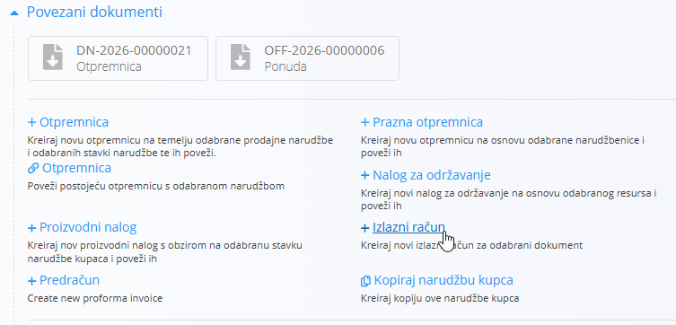
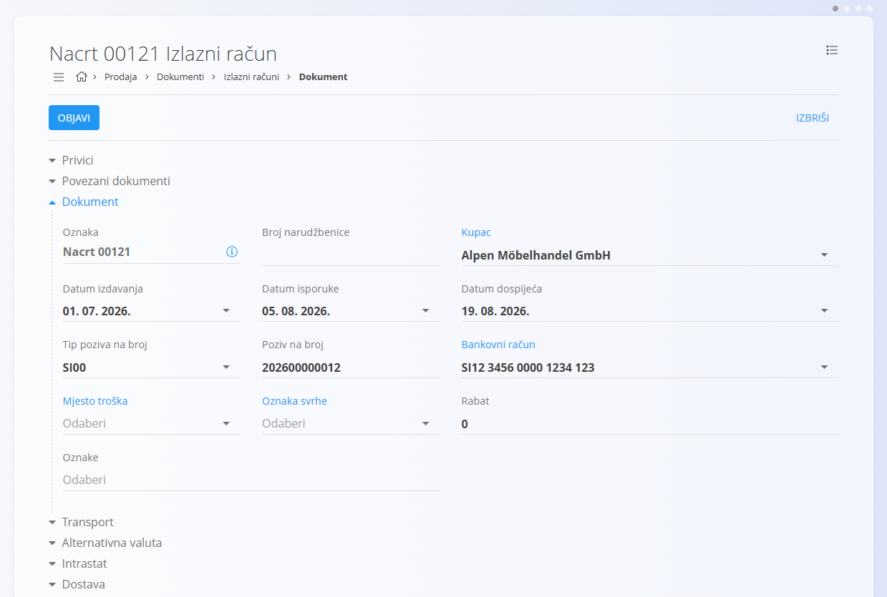
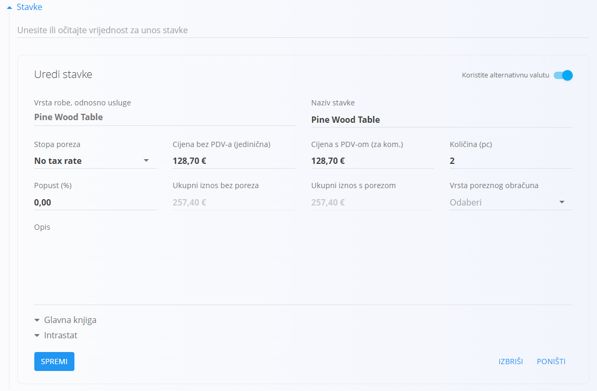
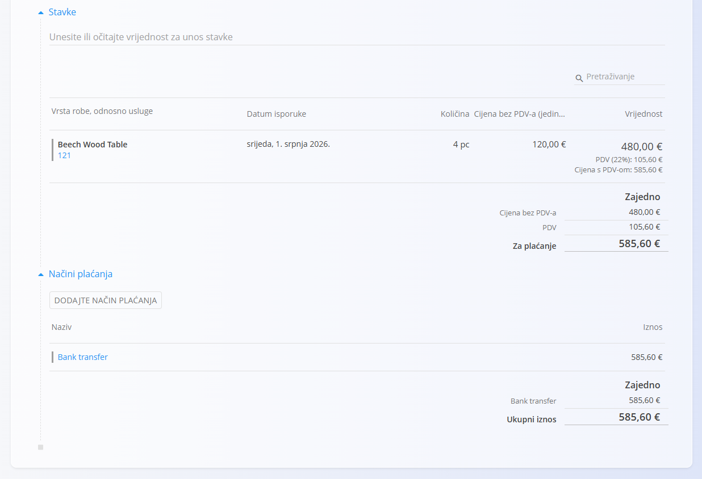

<!-- app_route: /prodaja/dokumenti/izlazni-racuni -->
<!-- app_label: Izlazni računi -->
<!-- app_navigation_hint: Otvorite Izlazne račune, zatim kliknite akcijski gumb za izradu novog računa u statusu nacrta. -->
<!-- canonical_source_url: https://github.com/Tom-PIT/Connected.Docs/blob/main/hr/Domene/Prodaja/Dokumenti/IzlaniRacuniIzrada.md -->
<!-- canonical_source_title: Kako kreirati izlazni račun -->

# Kako kreirati izlazni račun

Novi [izlazni računi](IzlazniRacuni.md) mogu se kreirati:

- ručno sa zaslona **Izlazni računi** pomoću [akcijskog gumba](../../../Zajednicko/UI/AkcijskiGumb.md)
- iz povezanih prodajnih dokumenata putem **Povezani dokumenti → + Izlazni račun**

Podržani izvorni dokumenti uključuju:

- obrađene [narudžbe kupca](NarudzbeKupca.md)
- [otpremnice](Otpremnice.md)

Kada se račun kreira iz drugog dokumenta, sustav automatski popunjava većinu podataka, uključujući kupca, podatke o dostavi i stavke.

## Korak 1 — Kreiranje dokumenta

Kreirajte novi izlazni račun u statusu **Nacrt** na jedan od sljedećih načina:

- Kliknite [akcijski gumb](../../../Zajednicko/UI/AkcijskiGumb.md) na zaslonu **Izlazni računi**.
- Koristite **Povezani dokumenti → + Izlazni račun** iz povezanog prodajnog dokumenta (npr. [Narudžbe kupca](NarudzbeKupca.md) ili [Otpremnice](Otpremnice.md)).

Kreira se novi izlazni račun u statusu **Nacrt**. Ako je račun kreiran iz drugog dokumenta, većina polja bit će unaprijed popunjena.

## Korak 2 — Ispunite zaglavlje dokumenta

Ispunite glavna polja zaglavlja u gornjem dijelu obrasca. Ako račun kreirate iz povezanog dokumenta, većina tih podataka automatski se preuzima iz izvornog dokumenta:

- [**Kupac**](../../../Zajednicko/Upravljanje/PoslovniImenik.md)
- **Datum izdavanja**
- **Datum isporuke**
- **Datum dospijeća** (obavezno)
- **Tip poziva na broj / Poziv na broj**
- [**Bankovni račun organizacije**](../Upravljanje/BankovniRacuniOrganizacije.md)
- [**Način plaćanja**](../Upravljanje/NaciniPlacanja.md)

## Korak 3 — Dodajte stavke

Dodajte stavke u odjeljak **Stavke**. Stavke određuju robu ili usluge koje se fakturiraju, njihove količine, cijene, poreze i popuste. Svaka stavka predstavlja pojedini proizvod, uslugu ili drugu robu.

Za dodavanje nove stavke:

1. Upišite ili skenirajte **serijski broj**, **EAN** ili **naziv robe ili usluge** u traku **Stavke**. Sustav prikazuje sve odgovarajuće rezultate.
2. Odaberite željenu stavku s popisa.
3. Po potrebi prilagodite **količinu**, **cijenu**, **popust** ili **porezne podatke**, a zatim kliknite **Spremi**.

4. Nastavite dodavati onoliko stavki koliko je potrebno. Nakon spremanja stavka se prikazuje na popisu:

Za više informacija o radu sa stavkama pogledajte [**Stavke dokumenta**](../../../Zajednicko/Koncepti/StavkeDokumenta.md).

### Knjigovodstvo

Odjeljak **Knjigovodstvo** određuje način knjiženja dokumenta u glavnu knjigu. Definira koja se konta koriste za knjiženje prihoda, rashoda i poreza prilikom spremanja i knjiženja dokumenta.

Prilikom knjiženja dokumenta:

- **Neto iznos** knjiži se na odabrano konto prihoda ili rashoda.
- **Iznos poreza** knjiži se na odabrano konto poreza.
- Sustav automatski kreira odgovarajuća knjiženja u glavnoj knjizi.

Dostupna konta definirana su u **[Kontnom planu](../../Racunovodstvo/Upravljanje/GlavnaKnjiga/KontniPlan.md)**.

## Korak 4 — Konfiguracija dodatnih odjeljaka

### Alternativna valuta

Odjeljak **Alternativna valuta** omogućuje iskazivanje cijena u valuti različitoj od zadane valute sustava. To se najčešće koristi kod međunarodne prodaje. Tečajevi se preuzimaju iz šifrarnika [**Devizni tečajevi**](../Upravljanje/DevizniTecajevi.md).

Nakon odabira alternativne valute cijene dokumenta automatski se preračunavaju prema odabranom tečaju.

### Dostava

Pregledajte ili prilagodite podatke u odjeljku **Dostava**.

Odjeljak **Dostava** određuje adresu na koju će roba biti isporučena. Podaci se automatski preuzimaju iz podataka kupca, ali ih je moguće promijeniti za pojedini dokument.

Ove vrijednosti koriste se na ispisanom dokumentu i u povezanim logističkim dokumentima, ali ne mijenjaju osnovne podatke kupca.

### Transport i Intrastat

Kada je **Intrastat** postavljen na **Obveznik** u **Sustav / Konfiguracija / Intrastat**, u dokumentu postaju dostupni dodatni odjeljci.

- **Transport** – koristi se za unos logističkih podataka o načinu isporuke robe.
- **Intrastat** – koristi se za unos podataka potrebnih za Intrastat izvještavanje. Ova se polja prikazuju samo kada je u sustavu omogućeno Intrastat izvještavanje.

> [!NOTE]
> Više Intrastat vrijednosti preuzima se iz **šifrarnika robe** (Intrastat konfiguracije), primjerice država i vrsta transakcije. Ta polja nije moguće slobodno mijenjati za pojedini dokument, već ovise o unaprijed definiranim matičnim podacima.

#### Intrastat podaci

Kada je omogućeno Intrastat izvještavanje i transakcija uključuje kupca iz druge države članice Europske unije, u obrascu za uređivanje stavke prikazuje se dodatni odjeljak **Intrastat**.

Ovaj odjeljak prikuplja statističke podatke potrebne za Intrastat izvještavanje.

Ta su polja obavezna za prekogranične transakcije unutar Europske unije kada je organizacija obveznik Intrastata.

### Privici

Koristite odjeljak **Privici** za prijenos i upravljanje datotekama povezanima s dokumentom, poput fotografija, PDF dokumenata, certifikata ili druge prateće dokumentacije.

Za detaljne upute pogledajte [**Privici**](../../../Zajednicko/Koncepti/Privici.md).

### Sadržaj gore i Sadržaj dolje

Unaprijed popunjeni odjeljci sadržaja omogućuju dodavanje unaprijed pripremljenih tekstova na početak ili kraj računa. To je korisno za uključivanje standardnih uvjeta poslovanja, uputa za plaćanje ili drugih informacija koje trebaju biti prikazane na ispisanom dokumentu.

Sadržaj se odabire iz [**Unaprijed pripremljenih tekstova**](../../../Zajednicko/Upravljanje/UnaprijedPripremljeniTekstovi.md).

### Načini plaćanja

Načini plaćanja prikazuju se pri dnu dokumenta.

Kliknite **Dodaj način plaćanja** kako biste računu dodijelili [**način plaćanja**](../Upravljanje/NaciniPlacanja.md). Ovo polje služi samo kao informacija i samo po sebi ne pokreće financijske transakcije. Koristi se za evidentiranje načina na koji kupac namjerava platiti račun.

## Korak 5 — Objava izlaznog računa

Kada je račun spreman, kliknite **Objavi** pri vrhu stranice. Objavom dokument prelazi iz statusa **Nacrt** u **Obrađen**, zaključuju se ukupni iznosi te postaju dostupni izvoz u računovodstvo i daljnja obrada.

> [!NOTE]
> Nakon objave izlazni račun više nije moguće uređivati niti obrisati. Ako je potrebno ispraviti dokument, koristite radnju **[Storniraj dokument](../../Logistika/Dokumenti/Storna.md)** iz izbornika.