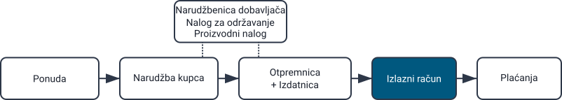
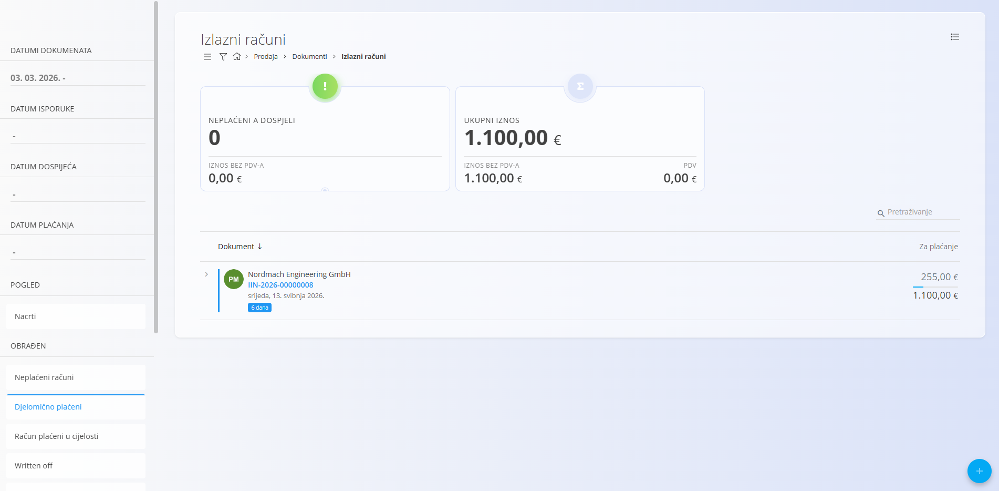
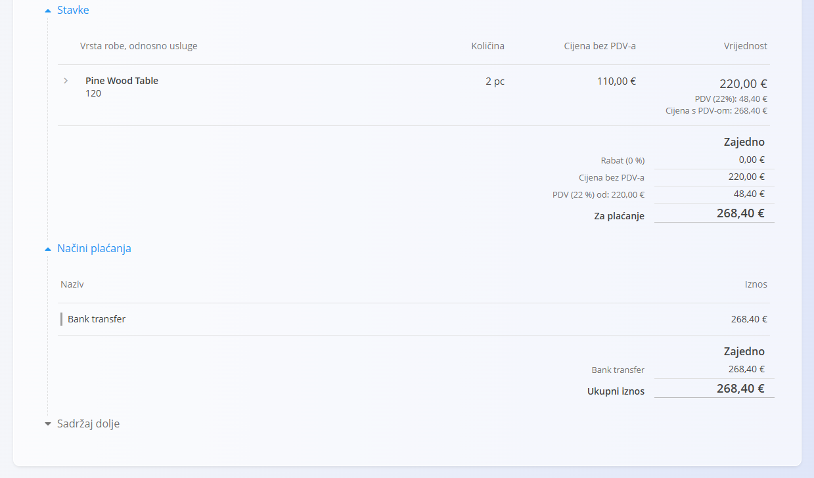
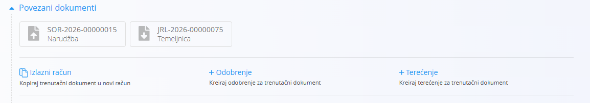
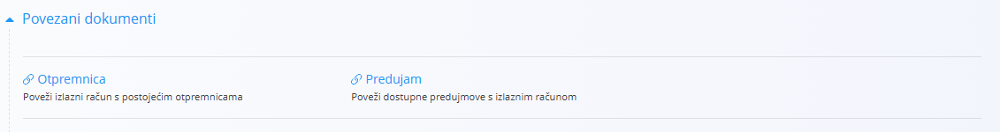
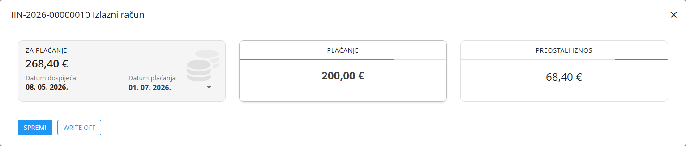
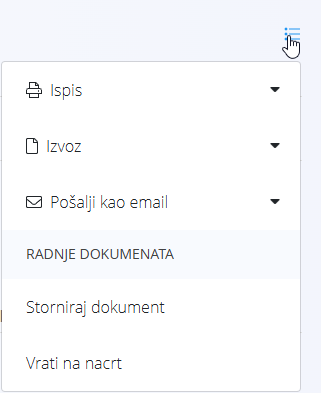

<!-- app_route: /sales/documents/issued-invoices -->
<!-- app_label: Izlazni računi -->
<!-- canonical_source_url: https://github.com/Tom-PIT/Connected.Docs/blob/main/hr/Domene/Prodaja/Dokumenti/IzlaniRacuni.md -->
<!-- canonical_source_title: Izlazni računi -->

# Izlazni računi

**Izlazni računi** su financijski dokumenti koji se šalju kupcima radi naplate potvrđene prodaje. Sadrže pregled isporučene robe ili usluga, poreze, datume dospijeća i odabrane načine plaćanja. Na stranici **Izlazni računi** također možete evidentirati djelomična ili potpuna plaćanja za svaki račun.

Za pristup ovoj stranici idite na **Prodaja / Dokumenti / Izlazni računi** u [navigaciji](../../../Zajednicko/UI/Navigacija.md).

## Kako se izlazni računi uklapaju u prodajni proces

Izlazni računi obično predstavljaju završni korak prodajnog procesa:

1. Kupac prihvati **[Ponudu](Ponude.md)**.
2. Kreira se i izvršava **[Narudžba kupca](NarudzbeKupca.md)**.
3. Roba se isporučuje putem **[Otpremnica](Otpremnice.md)** i povezanih izdatnica.
4. Na kraju se kreira izlazni račun (najčešće iz otpremnice ili narudžbe kupca) i šalje kupcu na plaćanje.

Izlazni računi mogu se po potrebi kreirati i ručno kao samostalni dokumenti.

## Shema

<strong>Dokument</strong>

| Polje | Opis |
|-------|------|
| [**Oznaka**](../../../Zajednicko/UI/OznakeDokumenata.md) | Jedinstvena oznaka računa koju generira sustav. |
| **Broj narudžbenice** | Opcionalna referenca na broj narudžbenice kupca. |
| **Kupac** | Kupac kojem je račun namijenjen, odabire se iz [**Poslovnog imenika**](../../../Zajednicko/Upravljanje/PoslovniImenik.md) (obavezno). |
| **Datum izdavanja** | Datum izdavanja računa. |
| **Datum isporuke** | Datum isporuke robe ili izvršenja usluge. |
| **Datum dospijeća** | Rok plaćanja prikazan kupcu (obavezno). |
| **Tip poziva na broj** | Vrsta poziva na broj koja se koristi za plaćanje (obavezno). |
| **Poziv na broj** | Poziv na broj temeljen na odabranom tipu poziva na broj. |
| [**Bankovni računi organizacije**](../Upravljanje/BankovniRacuniOrganizacije.md) | Bankovni račun na koji se očekuje uplata, odabire se iz šifrarnika bankovnih računa organizacije (obavezno). |
| [**Mjesto troška**](../../../Zajednicko/Upravljanje/MjestaTroska.md) | Opcionalna dodjela prihoda mjestu troška. |
| **Oznaka svrhe** | Opcionalna oznaka svrhe plaćanja, ako je konfigurirana. |
| **Rabat** | Ukupni rabat primijenjen na cijeli račun. |
| **Sadržaj gore** | Uvodni tekst iz [**Unaprijed pripremljenih tekstova**](../../../Zajednicko/Upravljanje/UnaprijedPripremljeniTekstovi.md). |
| **Sadržaj dolje** | Završni ili pravni tekst iz [**Unaprijed pripremljenih tekstova**](../../../Zajednicko/Upravljanje/UnaprijedPripremljeniTekstovi.md). |
| **Način plaćanja** | Način plaćanja odabran iz [**Načina plaćanja**](../Upravljanje/NaciniPlacanja.md). |

<strong>Transport, Alternativna valuta i Dostava</strong>

| Polje | Opis |
|-------|------|
| [**Uvjeti isporuke**](../../../Zajednicko/Upravljanje/UvjetiIsporuke.md) | Uvjeti isporuke dogovoreni s kupcem. |
| [**Način transporta**](../../../Zajednicko/Upravljanje/VrstaTransporta.md) | Način transporta dogovoren s kupcem. |
| [**Alternativna valuta**](../../../Zajednicko/Upravljanje/Valute.md) | Alternativna valuta koja se koristi u dokumentu. |
| [**Tečaj**](../Upravljanje/DevizniTecajevi.md) | Tečaj alternativne valute u odnosu na zadanu valutu. |
| **Dostava** | Podaci o dostavnoj službi i adresi isporuke. |

<strong>Intrastat</strong>

| Polje | Opis |
|-------|------|
| [**Država otpreme**](../../../Zajednicko/Upravljanje/Drzave.md) | Država iz koje je roba otpremljena. Ova vrijednost obično se preuzima iz Intrastat konfiguracije materijala. |
| [**Vrsta transakcije**](../../Racunovodstvo/Upravljanje/Intrastat/VrsteTransakcija.md) | Klasifikacija vrste transakcije za Intrastat izvještavanje. |
| [**Mjesto isporuke**](../../Racunovodstvo/Upravljanje/Intrastat/MjestaIsporuke.md) | Označava mjesto isporuke robe prema pravilima Intrastata. |

<strong>Stavke</strong>

| Polje | Opis |
|-------|------|
| **Roba ili usluga** | Roba, usluga ili druga stavka dodana na račun. |
| **Naziv stavke** | Naziv odabrane stavke koji se prikazuje na računu. |
| [**Porezna stopa**](../../../Zajednicko/Upravljanje/PorezneStope.md) | Porezna stopa primijenjena na stavku. |
| **Cijena bez PDV-a (jedinična)** | Jedinična cijena bez PDV-a. |
| **Cijena s PDV-om (jedinična)** | Jedinična cijena s uključenim PDV-om. |
| **Količina** | Količina stavke. |
| **Popust (%)** | Popust primijenjen na stavku. |
| **Vrijednost bez PDV-a** | Ukupna vrijednost stavke bez PDV-a. |
| **Vrijednost s PDV-om** | Ukupna vrijednost stavke s PDV-om. |
| **Način obračuna PDV-a** | Određuje način obračuna PDV-a za posebne porezne slučajeve (trokutna trgovina, prijenos porezne obveze, izvoz usluga, usluge prijevoza, putnički prijevoz, turističke agencije te carinski postupci 42 i 63). |
| **Opis** | Dodatni opis stavke. |
| **Koristi alternativnu valutu** | Omogućuje prikaz iznosa stavke u alternativnoj valuti definiranoj na dokumentu. |

<strong>Knjigovodstvo i Intrastat</strong>

| Polje | Opis |
|-------|------|
| **Knjigovodstvo - Konto prihoda / rashoda** | Konto glavne knjige na koji se knjiži vrijednost stavke. |
| **Knjigovodstvo - Konto PDV-a** | Konto glavne knjige na koji se knjiži PDV stavke. |
| [**Intrastat – Tarifa**](../../Racunovodstvo/Upravljanje/Intrastat/Tarife.md) | Tarifni broj za Intrastat izvještavanje. |
| **Intrastat – Država podrijetla** | Država podrijetla robe. |
| **Intrastat – Neto težina (kg)** | Neto težina za statističko izvještavanje. |
| **Intrastat – Statistička vrijednost** | Statistička vrijednost robe za Intrastat izvještavanje. |

## Upravljanje

### Statusi dokumenta

Izlazni računi koriste statuse temeljene na plaćanju:

- **Nacrt** – Račun još nije objavljen i svi podaci mogu se slobodno uređivati.

- **Obrađen** – Račun je objavljen i postaje službeni financijski dokument. Nakon objave moguće je mijenjati samo ograničen broj podataka, a dokument više nije moguće obrisati.

    - **Neplaćeni računi** – Račun je izdan, ali nije evidentirano nijedno plaćanje.
    - **Djelomično plaćeni računi** – Evidentirano je jedno ili više plaćanja, ali dio iznosa još nije podmiren.
    - **Računi plaćeni u cijelosti** – Račun je u potpunosti podmiren i nema preostalog iznosa.
    - **Written off** – Račun je otpisan.

Status dokumenta određuje koje su radnje dostupne (evidencija plaćanja, storno, izvoz i slično) te način prikaza dokumenta na popisu.

### Popis

Na popisu se prikazuju svi izlazni računi koji odgovaraju odabranim filtrima i datumskom rasponu.

**Pokazatelji**

Na vrhu popisa sustav prikazuje ključne pokazatelje koji sažimaju trenutno filtrirane podatke. Prikazuju se sljedeći pokazatelji:

- **Neplaćeni i dospjeli** (interaktivno) – Broj i ukupna vrijednost računa kojima je istekao rok plaćanja i koji još nisu plaćeni. Klikom na pokazatelj prikazuju se samo ti računi.
- **Ukupni iznos** – Ukupni bruto iznos svih računa u trenutnom prikazu.

Pokazatelji se ažuriraju prema filtrima na lijevoj strani:

- **Datumi dokumenta**
- **Datum isporuke**
- **Datum dospijeća**
- **Datum plaćanja**
- **Pogled**
    - **Nacrti**
    - **Obrađen**
    - **Neplaćeni računi**
    - **Djelomično plaćeni**
    - **Računi plaćeni u cijelosti**
    - **Written off**
- **Kupac**
- **Način plaćanja**

Koristite polje **Pretraživanje** za brzo pronalaženje računa prema oznaci, kupcu ili drugim prikazanim podacima.

## Radnje

### Kreiranje novog izlaznog računa

Za kreiranje novog izlaznog računa kliknite [akcijski gumb](../../../Zajednicko/UI/AkcijskiGumb.md) na zaslonu **Izlazni računi**.

Za detaljan postupak pogledajte vodič [**Kako kreirati izlazni račun**](IzlazniRacuniIzrada.md).

### Uređivanje izlaznog računa

Kliknite bilo koji izlazni račun na popisu kako biste otvorili njegove detalje. Dokumenti u statusu **Nacrt** mogu se slobodno uređivati. Dokument je podijeljen u više proširivih odjeljaka.

Dok je račun u statusu **Nacrt**, možete uređivati:

- [Polja zaglavlja](IzlazniRacuniIzrada.md#korak-2--ispunite-zaglavlje-dokumenta)
- [**Alternativnu valutu**](IzlazniRacuniIzrada.md#alternativna-valuta)
- [**Transport i Intrastat**](IzlazniRacuniIzrada.md#transport-i-intrastat)
- [**Dostavu**](IzlazniRacuniIzrada.md#dostava)
- [**Stavke**](IzlazniRacuniIzrada.md#korak-3--dodajte-stavke) – dodavanje, uređivanje ili uklanjanje stavki računa
- [**Načine plaćanja**](IzlazniRacuniIzrada.md#nacini-placanja)
- [**Sadržaj gore** i **Sadržaj dolje**](IzlazniRacuniIzrada.md#sadrzaj-gore-i-sadrzaj-dolje) – odabir unaprijed pripremljenih tekstova iz [Predložaka klauzula za izlazne račune](../Upravljanje/PredlosciKlauzulaZaIzdaneRacune.md).

#### Povezani dokumenti

Odjeljak **Povezani dokumenti** omogućuje kreiranje povezanih dokumenata te prikazuje sve dokumente koji su već povezani s trenutnim računom.

Za više informacija o povezivanju dokumenata i sljedivosti pogledajte [**Povezani dokumenti**](../../../Zajednicko/Koncepti/PovezaniDokumenti.md).

> [!NOTE]
> Dostupne radnje u odjeljku **Povezani dokumenti** ovise o vrsti dokumenta i njegovom statusu.

Primjer povezanih dokumenata za novi dokument u statusu **Nacrt**:

Dostupne radnje mogu uključivati:

- **Izlazni račun** – Kopira trenutni dokument u novi izlazni račun.
- [**+ Odobrenje**](Odobrenja.md) – Kreira novo odobrenje.
- [**+ Terećenje**](Terecenja.md) – Kreira novo terećenje.
- [**Otpremnica**](Otpremnice.md) – Povezuje postojeću otpremnicu.
- [**Predujam**](Predujmovi.md) – Povezuje postojeći predujam.

### Objava računa

Kada je račun spreman, kliknite **Objavi** kako biste ga potvrdili i premjestili iz statusa **Nacrt**. Nakon objave postaju dostupne sve radnje vezane uz izlazni račun.

### Evidentiranje plaćanja

Nakon objave računa koristite gumb **Plaćanje** za evidentiranje zaprimljenih uplata.

U dijalogu za plaćanje prikazuju se:

- **Za plaćanje** – Ukupan iznos računa i datum dospijeća.
- **Plaćanje** – Iznos koji se trenutno evidentira i datum plaćanja.
- **Preostali iznos** – Preostali dug nakon evidentiranja uplate.

Za isti račun moguće je evidentirati više uplata tijekom vremena. Sustav automatski ažurira status računa:

- **Neplaćeni računi** – Nije evidentirana nijedna uplata.
- **Djelomično plaćeni** – Evidentirana je jedna ili više uplata, ali dio iznosa još nije podmiren.
- **Računi plaćeni u cijelosti** – Preostali iznos jednak je nuli.

> [!NOTE]
> Kada je račun u cijelosti podmiren, prikazuje se u pogledu **Računi plaćeni u cijelosti**. Djelomično plaćeni računi prikazuju se u pogledu **Djelomično plaćeni**, a neplaćeni u pogledu **Neplaćeni računi**.

### Brisanje izlaznog računa

Izlazni račun moguće je obrisati samo dok je u statusu **Nacrt** i **ako ne sadrži nijednu stavku**.

Ako račun još uvijek sadrži stavke:

1. Otvorite izbornik dokumenta u gornjem desnom kutu.
2. Odaberite **Izbriši sve stavke**.
3. Nakon uklanjanja svih stavki kliknite **Izbriši**.

Ako želite ukloniti samo pojedinu stavku:

1. Kliknite stavku kako biste otvorili zaslon za uređivanje.
2. Kliknite **Izbriši**.

> [!NOTE]
> Brisanje je moguće samo za dokumente u statusu **Nacrt**.
> Dokumente u statusu **Obrađen** nije moguće obrisati, ali ih je moguće **stornirati** ili **vratiti u nacrt**.

## Izbornik

Ova stranica sadrži radnje izbornika na dva mjesta.

Radnje su dostupne putem gumba **Izbornik** u gornjem desnom kutu popisa ili dokumenta.

### Izbornik popisa

Izbornik popisa sadrži radnje koje se primjenjuju na trenutno prikazani popis.

Dostupne radnje:

- **Izvoz u CSV**
    - **Dokumenti** – Izvozi sve izlazne račune s popisa.
    - **Stavke** – Izvozi sve stavke svih izlaznih računa s popisa.

### Izbornik dokumenta

Izbornik dokumenta sadrži radnje za trenutno otvoreni dokument.

Dostupne radnje:

- **Ispis**
- **Izvoz u PDF**
- **Pošalji kao email**
- **Izbriši sve stavke** (samo za nacrte)
- **Storniraj dokument**
- **Vrati na nacrt**

Za više informacija pogledajte [**Radnje izbornika**](../../../Zajednicko/Koncepti/RadnjeIzbornika.md).

