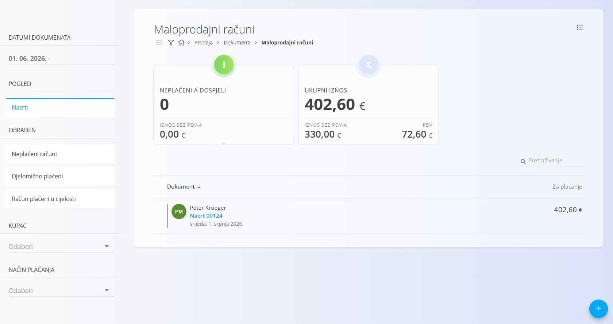
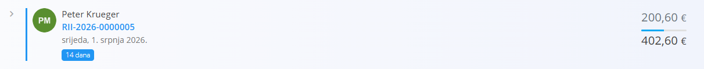
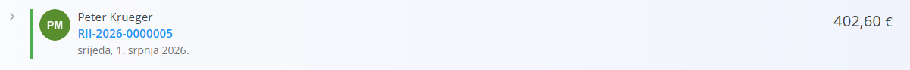
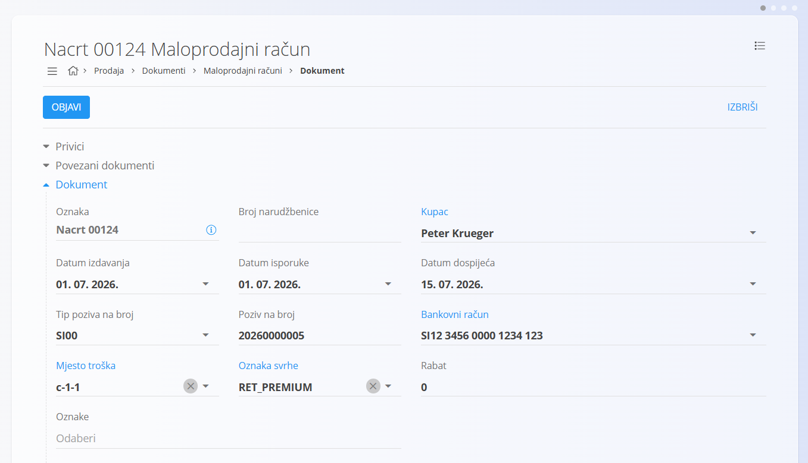
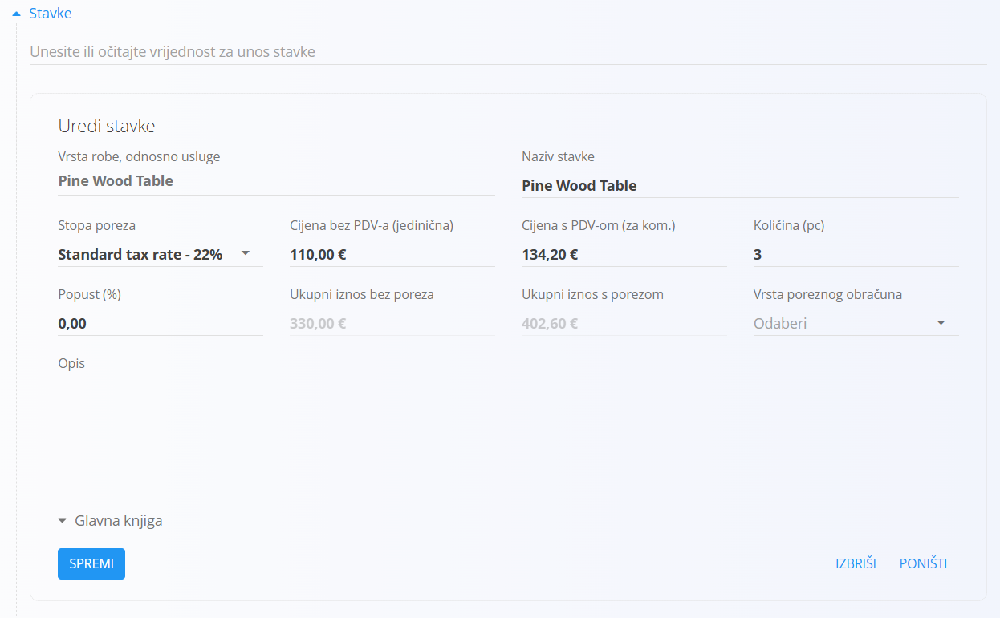
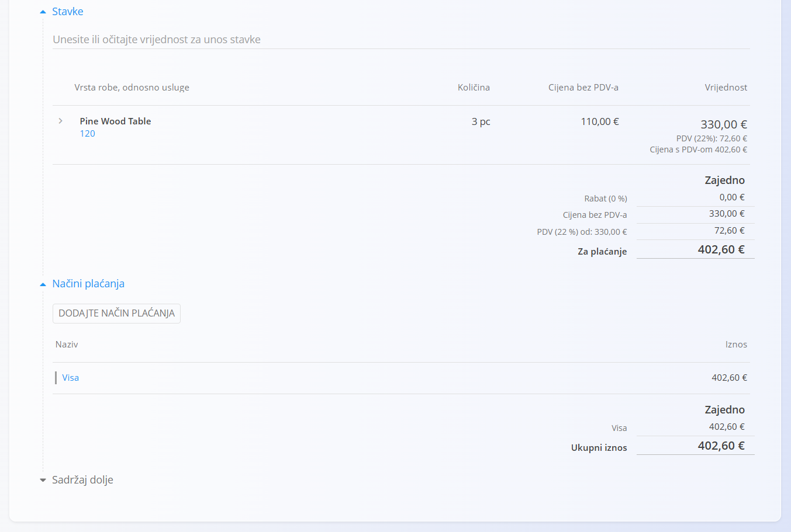
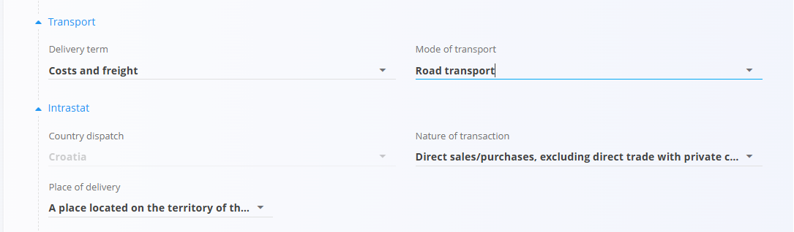
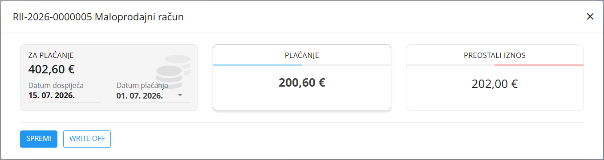

<!-- app_route: /sales/documents/retail-issued-invoices -->
<!-- app_label: Maloprodajni računi -->
<!-- canonical_source_url: https://github.com/Tom-PIT/Connected.Docs/blob/main/hr/Domene/Prodaja/Dokumenti/MaloprodajniRacuni.md -->
<!-- canonical_source_title: Maloprodajni računi -->

# Maloprodajni računi

**Maloprodajni račun** je prodajni dokument koji se koristi za izravnu prodaju krajnjim kupcima u trgovini. Obično se kreira kada kupac kupuje robu odmah, bez prethodne ponude ili narudžbe kupca. Maloprodajni računi podržavaju trenutno ili naknadno evidentiranje plaćanja, ali **ne utječu na stanje zaliha**. Promjene zaliha moraju se evidentirati zasebno pomoću logističkih dokumenata.

Za pristup ovom dokumentu otvorite **Prodaja / Dokumenti / Maloprodajni računi**.

## Kako se maloprodajni računi uklapaju u prodajni proces

Maloprodajni računi namijenjeni su izravnoj prodaji u trgovini:

1. Kupac dolazi u trgovinu i odabire jedan ili više artikala.
2. Ručno se kreira **Maloprodajni račun** pomoću [akcijskog gumba](../../../Zajednicko/UI/AkcijskiGumb.md).
3. Dokument se objavljuje i automatski prelazi u status **Neplaćeni računi**.
4. Plaćanja se evidentiraju izravno na dokumentu (potpuna ili djelomična).
5. Dokument automatski prelazi u status **Djelomično plaćeni** ili **Računi plaćeni u cijelosti**, ovisno o evidentiranim uplatama.
6. Zaliha se ažurira zasebno pomoću dokumenta [**Izdatnica**](../../Logistika/Dokumenti/Izdatnice.md) (ili [**Otpremnica**](Otpremnice.md) + [**Izdatnica**](../../Logistika/Dokumenti/Izdatnice.md) ako se roba isporučuje).

## Upravljanje zalihama

Maloprodajni računi **ne smanjuju stanje zaliha**, bez obzira na status plaćanja.

Za ažuriranje zaliha:

- Kreirajte dokument **[Izdatnica](../../Logistika/Dokumenti/Izdatnice.md)** ili
- Kreirajte **[Otpremnicu](Otpremnice.md)** nakon koje slijedi **[Izdatnica](../../Logistika/Dokumenti/Izdatnice.md)**.

## Uvjeti za fiskalizaciju maloprodajnog računa (ako je fiskalizacija omogućena)

Kako bi se maloprodajni račun mogao fiskalizirati, moraju biti ispunjeni sljedeći uvjeti:

1. **Konfiguracija osobe:** Osoba koja kreira račun mora imati upisan **OIB** u svom zapisu [**Resurs**](../../Resursi/Upravljanje/Resursi.md).
2. **Konfiguracija sustava:** Sustav mora biti konfiguriran za fiskalizaciju te moraju biti definirane potrebne [**postavke fiskalizacije**](../../Sustav/Postavke/ProdajaMaloprodajaSISettings.md).
3. **Konfiguracija blagajne:** Blagajna koja se koristi za transakciju mora biti konfigurirana. Ovu konfiguraciju tijekom implementacije postavlja **Tom PIT** i korisnik je ne može mijenjati. Blagajne se definiraju u dokumentu **[Mjesta troška](../../../Zajednicko/Upravljanje/MjestaTroska.md)**.

Kada su svi uvjeti ispunjeni, maloprodajni račun može se fiskalizirati prilikom objave, čime se osigurava usklađenost s poreznim propisima za maloprodaju.

> [!NOTE]
> Tom PIT Connected trenutačno podržava fiskalizaciju maloprodajnih računa u **Sloveniji** i **Hrvatskoj**. Fiskalizacija je postupak prijave prodajnih transakcija poreznoj upravi u stvarnom vremenu radi usklađenosti s lokalnim poreznim propisima.

## Shema

<strong>Dokument</strong>

| Polje | Opis |
|-------|------|
| [**Oznaka**](../../../Zajednicko/UI/OznakeDokumenata.md) | Sistemski generirana oznaka maloprodajnog računa. |
| **Broj narudžbenice** | Neobavezna referenca koju je dostavio kupac. |
| **Kupac** | Kupac odabran iz [**Poslovnog imenika**](../../../Zajednicko/Upravljanje/PoslovniImenik.md) (obavezno). Dostupni su samo kontakti klasificirani kao **Kupac** i **Osoba**. |
| **Datum izdavanja** | Datum izdavanja računa. |
| **Datum isporuke** | Datum predaje ili isporuke robe. |
| **Datum dospijeća** | Rok plaćanja (obavezno). |
| **Tip poziva na broj** | Vrsta poziva na broj (obavezno). |
| **Poziv na broj** | Poziv na broj prema odabranom tipu. |
| [**Bankovni račun organizacije**](../Upravljanje/BankovniRacuniOrganizacije.md) | Bankovni račun na koji se prima uplata (obavezno). |
| [**Mjesto troška**](../../../Zajednicko/Upravljanje/MjestaTroska.md) | Neobavezna dodjela mjesta troška. |
| **Oznaka svrhe** | Neobavezna oznaka svrhe transakcije. |
| **Rabat** | Ukupni rabat primijenjen na račun. |
| **Sadržaj gore** | Uvodni tekst iz [**Unaprijed definiranih tekstova**](../../../Zajednicko/Upravljanje/UnaprijedPripremljeniTekstovi.md). |
| **Sadržaj dolje** | Završni ili zakonski tekst iz [**Unaprijed definiranih tekstova**](../../../Zajednicko/Upravljanje/UnaprijedPripremljeniTekstovi.md). |

<strong>Transport, alternativna valuta i dostava</strong>

| Polje | Opis |
|--------|------|
| [**Uvjeti isporuke**](../../../Zajednicko/Upravljanje/UvjetiIsporuke.md) | Uvjeti isporuke dogovoreni s kupcem. |
| [**Način transporta**](../../../Zajednicko/Upravljanje/VrstaTransporta.md) | Način prijevoza dogovoren s kupcem. |
| [**Alternativna valuta**](../../../Zajednicko/Upravljanje/Valute.md) | Alternativna valuta koja se koristi na dokumentu. |
| [**Tečaj**](../Upravljanje/DevizniTecajevi.md) | Tečaj alternativne valute u odnosu na zadanu valutu. |
| **Dostava** | Podaci o dostavnoj službi i adresi isporuke. |

<strong>Stavke</strong>

| Polje | Opis |
|--------|------|
| **Artikl** | Artikl, usluga ili sredstvo odabrano za stavku. |
| **Naziv stavke** | Prikazani naziv odabrane stavke (može se uređivati ako je dopušteno). |
| [**Porezna stopa**](../../../Zajednicko/Upravljanje/PorezneStope.md) | Porezna stopa primijenjena na stavku. |
| **Cijena bez PDV-a (jedinična)** | Jedinična cijena bez poreza. |
| **Cijena s PDV-om (za kom.)** | Jedinična cijena s porezom (izračunava se automatski). |
| **Količina** | Količina odabranog artikla. |
| **Popust (%)** | Postotak popusta primijenjen na stavku. |
| **Ukupni iznos bez poreza** | Ukupni iznos bez poreza. |
| **Ukupni iznos s porezom** | Ukupni iznos s porezom. |
| **Vrsta poreznog obračuna** | Određuje način obračuna PDV-a za posebne porezne slučajeve. |
| **Opis** | Neobavezni opis stavke. |
| **Koristi alternativnu valutu** | Prikazuje iznose stavke u alternativnoj valuti definiranoj na dokumentu. |

<strong>Glavna knjiga i Intrastat</strong>

| Polje | Opis |
|--------|------|
| **Glavna knjiga - Konto prihoda/rashoda** | Konto glavne knjige za knjiženje prihoda ili rashoda. |
| **Glavna knjiga - Konto poreza** | Konto glavne knjige za knjiženje PDV-a. |
| [**Intrastat – Tarifa**](../../Racunovodstvo/Upravljanje/Intrastat/Tarife.md) | Tarifni broj za Intrastat izvještavanje. |
| **Intrastat – Zemlja podrijetla** | Zemlja podrijetla robe. |
| **Intrastat – Neto masa (kg)** | Neto masa za statističko izvještavanje. |
| **Intrastat – Statistička vrijednost** | Statistička vrijednost robe za Intrastat izvještavanje. |

## Upravljanje

Maloprodajni računi prolaze kroz sljedeće statuse:

- **Nacrti**
- **Neplaćeni računi**
- **Djelomično plaćeni**
- **Računi plaćeni u cijelosti**

### Pregled

Popis je moguće filtrirati prema:

- **Datumima dokumenta**
- **Pogledu** (Nacrti, Obrađeni, Neplaćeni računi, Djelomično plaćeni, Računi plaćeni u cijelosti)
- **Kupcu**
- **Načinu plaćanja**

Svaki red prikazuje:

- Naziv kupca
- Oznaku dokumenta
- Datum dokumenta
- Plaćeni iznos i ukupni iznos

Ako je evidentirana djelomična uplata, dokument prelazi u status **Djelomično plaćeni**. Na popisu se prikazuju ukupni iznos i već plaćeni iznos. Zapis je označen **plavom** bojom s lijeve strane.

Kada je račun u cijelosti plaćen, prelazi u status **Računi plaćeni u cijelosti**. Na popisu se prikazuje plaćeni iznos, a zapis je označen **zelenom** bojom s lijeve strane.

## Radnje

### Kreiranje novog maloprodajnog računa

Maloprodajni računi mogu se kreirati samo ručno.

1. Kliknite [akcijski gumb](../../../Zajednicko/UI/AkcijskiGumb.md) kako biste kreirali novi nacrt maloprodajnog računa.

   

2. Odaberite **Kupca**. Dostupni su samo zapisi koji su u [**Poslovnom imeniku**](../../../Zajednicko/Upravljanje/PoslovniImenik.md) klasificirani kao **Kupac** i **Osoba**.

   

3. Ispunite obavezna zaglavlja dokumenta, kao što su **Datum dospijeća**, **Tip poziva na broj** i **Bankovni račun organizacije**.

4. Dodajte stavke u odjeljku **Stavke** unosom ili skeniranjem naziva ili oznake artikla.

   

5. Spremite stavke i provjerite ukupne iznose.

   Za više informacija o radu sa stavkama dokumenta pogledajte [**Stavke dokumenta**](../../../Zajednicko/Koncepti/Stavke.md).

6. Dodajte **Načine plaćanja** na dnu dokumenta.

   

7. Kliknite **Objavi** kako biste potvrdili račun.

   Dokument prelazi u status **Neplaćeni računi**.

#### Odjeljci Transport i Intrastat

Ako je u **Sustav / Konfiguracija / Intrastat** opcija **Intrastat** postavljena na **Obveznik**, na obrascu dokumenta prikazuju se dodatni odjeljci.

- **Transport** – Koristi se za unos podataka o načinu prijevoza robe.
- **Intrastat** – Koristi se za unos podataka potrebnih za Intrastat izvještavanje. Ovaj odjeljak prikazuje se samo ako je Intrastat omogućen u sustavu.

> [!NOTE]
> Dio vrijednosti vezanih uz Intrastat preuzima se iz **šifrarnika** (Intrastat konfiguracija), primjerice država i priroda transakcije. Ova polja nije moguće slobodno uređivati na dokumentu, već ovise o unaprijed definiranim matičnim podacima.

#### Odjeljak Dostava

Odjeljak **Dostava** određuje adresu na koju će roba biti isporučena. Vrijednosti se automatski preuzimaju iz podataka kupca, ali ih je moguće promijeniti za pojedini dokument.

Ove vrijednosti utječu na ispis dokumenta i povezane logističke dokumente, ali ne mijenjaju matične podatke kupca.

#### Stavke

Stavke definiraju proizvode, usluge ili sredstva koja se prodaju, zajedno s njihovim količinama, cijenama, porezima i popustima. Svaka stavka predstavlja jedan proizvod, uslugu ili sredstvo.

#### Glavna knjiga

Odjeljak **Glavna knjiga** određuje način knjiženja dokumenta u glavnu knjigu. Definira konta koja se koriste za knjiženje prihoda, rashoda i poreza.

Prilikom knjiženja dokumenta:

- **Neto iznos** knjiži se na odabrano konto prihoda ili rashoda.
- **Iznos poreza** knjiži se na odabrano konto poreza.
- Sustav automatski kreira odgovarajuća knjiženja u glavnoj knjizi.

Dostupna konta definirana su u dokumentu [**Kontni plan**](../../Racunovodstvo/Upravljanje/GlavnaKnjiga/KontniPlan.md).

#### Intrastat

Ako je Intrastat omogućen i transakcija uključuje kupca iz druge države članice EU, u obrascu za uređivanje stavke prikazuje se dodatni odjeljak **Intrastat**.

Ovaj odjeljak služi za unos statističkih podataka potrebnih za Intrastat izvještavanje.

Ta su polja obavezna za prekogranične transakcije unutar EU kada je organizacija obveznik Intrastata.

### Evidentiranje plaćanja

Plaćanja se evidentiraju pomoću gumba **Plaćanje** na vrhu dokumenta.

U dijalogu za plaćanje prikazuju se:

- **Za plaćanje** – Ukupan iznos računa i datum dospijeća.
- **Plaćanje** – Iznos koji se upravo plaća i datum plaćanja.
- **Preostali iznos** – Preostali dug nakon evidentiranja uplate.

Na istom dokumentu moguće je evidentirati više uplata tijekom vremena. Sustav automatski ažurira status dokumenta:

- **Neplaćeni računi** – Nije evidentirana nijedna uplata.
- **Djelomično plaćeni** – Evidentirane su djelomične uplate, ali postoji preostali dug.
- **Računi plaćeni u cijelosti** – Preostali iznos jednak je nuli.

> [!NOTE]
> Kada je račun u cijelosti podmiren evidentiranim uplatama, prikazuje se u pogledu **Računi plaćeni u cijelosti**. Djelomično plaćeni računi prikazuju se u pogledu **Djelomično plaćeni**, a neplaćeni u pogledu **Neplaćeni računi**.

### Brisanje maloprodajnog računa

Dokumenti u statusu **Nacrt** mogu se izbrisati u prikazu za uređivanje **samo ako ne sadrže nijednu stavku**.

Ako nacrt još uvijek sadrži stavke:

1. Otvorite izbornik dokumenta (gornji desni kut).
2. Odaberite **Izbriši sve stavke** kako biste uklonili sve stavke odjednom.
3. Kada dokument više ne sadrži nijednu stavku, kliknite **Izbriši**.

Ako želite izbrisati samo jednu stavku:

1. Kliknite oznaku stavke kako biste otvorili prozor **Uredi stavku**.
2. Kliknite **Izbriši**.

> [!NOTE]
> Obrađeni maloprodajni računi **ne mogu se izbrisati**, ali ih je moguće [**stornirati**](../../Logistika/Dokumenti/Storna.md) ili **vratiti u nacrt**.

## Izbornik

Ova stranica sadrži radnje izbornika na dva mjesta.

Radnje izbornika dostupne su putem gumba **Izbornik** u gornjem desnom kutu popisa ili dokumenta.

### Izbornik popisa

Izbornik popisa omogućuje radnje nad trenutno prikazanim popisom.

Dostupne radnje:

- **Izvoz u CSV** – Dostupne su dvije vrste izvještaja:
    - **Dokumenti** – Izvozi sve maloprodajne račune s popisa.
    - **Stavke** – Izvozi sve stavke svih maloprodajnih računa s popisa.

### Izbornik dokumenta

Izbornik dokumenta omogućuje radnje nad trenutno otvorenim dokumentom.

Dostupne radnje:

- **Ispis**
- **Izvoz u PDF**
- **Pošalji kao e-mail**
- **Izbriši sve stavke** (samo za nacrte)
- **[Storniraj dokument](../../Logistika/Dokumenti/Storna.md)**
- **Vrati u nacrt**

Za više informacija o radnjama izbornika pogledajte [**Radnje izbornika**](../../../Zajednicko/Koncepti/RadnjeIzbornika.md).