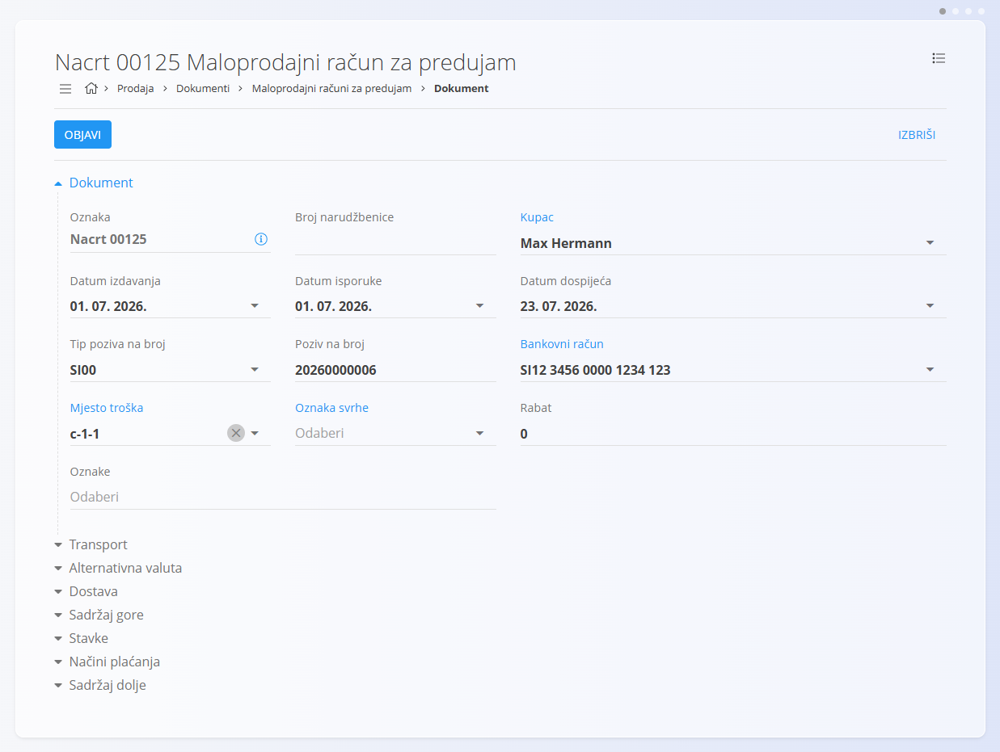
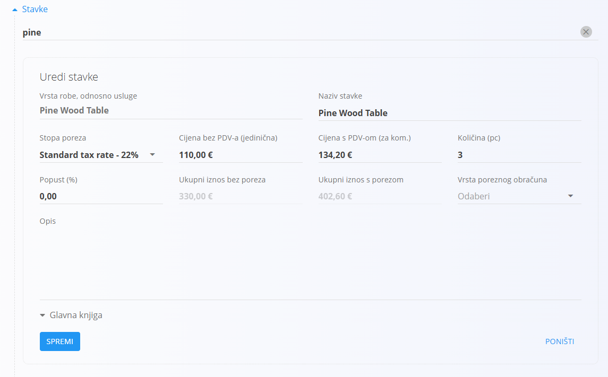
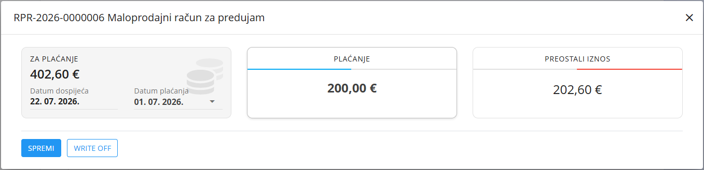

<!-- app_route: /sales/documents/retail-prepayments -->
<!-- app_label: Maloprodajni računi za predujam -->
<!-- canonical_source_url: https://github.com/Tom-PIT/Connected.Docs/blob/main/en/Domains/Sales/Documents/MaloprodajniRacuniZaPredujam.md -->
<!-- canonical_source_title: Maloprodajni računi za predujam -->

# Maloprodajni računi za predujam

**Maloprodajni račun za predujam** prodajni je dokument koji se koristi u maloprodaji za evidentiranje prodaje u obliku računa za predujam uz fleksibilno evidentiranje plaćanja.

Najčešće se koristi kada kupac robu kupuje osobno, a plaćanje se može evidentirati odmah ili naknadno.

Maloprodajni računi za predujam podržavaju isti tijek plaćanja kao i maloprodajni računi te se mogu ispisati ili poslati kupcu u bilo kojoj fazi.

Za pristup ovom dokumentu otvorite **Prodaja / Dokumenti / Maloprodajni računi za predujam** u [navigaciji](../../../Zajednicko/UI/Navigacija.md).

## Uloga maloprodajnih računa za predujam u prodajnom procesu

Maloprodajni računi za predujam koriste se za izravnu maloprodaju:

1. Kupac dolazi u trgovinu i odabire jedan ili više artikala.
2. Ručno se kreira **Maloprodajni račun za predujam** pomoću [akcijskog gumba](../../../Zajednicko/UI/AkcijskiGumb.md).
3. Dokument se objavljuje i prelazi u status **Neplaćeni računi**.
4. Plaćanja se evidentiraju pomoću gumba **Plaćanje**:
    - Djelomična plaćanja premještaju dokument u status **Djelomično plaćeni**.
    - Potpuna uplata premješta dokument u status **Računi plaćeni u cijelosti**.
5. Račun za predujam može se ispisati ili poslati kupcu.
6. Zaliha se ažurira zasebno pomoću dokumenta [**Izdatnica**](../../Logistika/Dokumenti/Izdatnica.md) ili [**Otpremnice**](Otpremnice.md) nakon koje slijedi izdatnica.

Maloprodajni računi za predujam **ne utječu na stanje zaliha**.

## Upravljanje zalihama

Maloprodajni računi za predujam **ne smanjuju stanje zaliha**, bez obzira na status plaćanja.

Za ažuriranje zaliha:

- Kreirajte [**Izdatnicu**](../../Logistika/Dokumenti/Izdatnica.md), ili
- Kreirajte [**Otpremnicu**](Otpremnice.md), a zatim [**Izdatnicu**](../../Logistika/Dokumenti/Izdatnica.md).

## Shema

<strong>Dokument</strong>

| Polje | Opis |
|-------|------|
| [**Oznaka**](../../../Zajednicko/UI/OznakeDokumenata.md) | Sistemski generirana oznaka dokumenta. |
| **Broj narudžbenice** | Opcionalna referenca koju je dostavio kupac. |
| **Kupac** | Obavezno. Odabire se iz [**Poslovnog imenika**](../../../Zajednicko/Upravljanje/PoslovniImenik.md). Dostupni su samo zapisi klasificirani kao **Kupac** i **Osoba**. |
| **Datum izdavanja** | Datum kreiranja dokumenta. |
| **Datum isporuke** | Datum isporuke ili preuzimanja. |
| **Datum dospijeća** | Rok plaćanja (obavezno). |
| **Tip poziva na broj** | Vrsta poziva na broj (obavezno). |
| **Poziv na broj** | Poziv na broj koji se koristi pri plaćanju. |
| [**Bankovni račun organizacije**](../Upravljanje/BankovniRacuniOrganizacije.md) | Račun na koji se primaju uplate (obavezno). |
| [**Mjesto troška**](../../../Zajednicko/Upravljanje/MjestaTroska.md) | Opcionalna raspodjela troškova. |
| **Oznaka svrhe** | Opcionalna oznaka svrhe plaćanja. |
| **Rabat** | Ukupni rabat primijenjen na dokument. |
| **Sadržaj gore** | Uvodni tekst iz [**Preddefiniranih tekstova**](../../../Zajednicko/Upravljanje/UnaprijedPripremljeniTekstovi.md). |
| **Sadržaj dolje** | Završni ili zakonski tekst iz [**Preddefiniranih tekstova**](../../../Zajednicko/Upravljanje/UnaprijedPripremljeniTekstovi.md). |

<strong>Transport, alternativna valuta i dostava</strong>

| Polje | Opis |
|-------|------|
| [**Uvjeti isporuke**](../../../Zajednicko/Upravljanje/UvjetiIsporuke.md) | Uvjeti isporuke dogovoreni s kupcem. |
| [**Vrsta transporta**](../../../Zajednicko/Upravljanje/VrstaTransporta.md) | Način prijevoza dogovoren s kupcem. |
| [**Alternativna valuta**](../../../Zajednicko/Upravljanje/Valute.md) | Alternativna valuta koja se koristi na dokumentu. |
| [**Tečaj**](../Upravljanje/DevizniTecajevi.md) | Tečaj alternativne valute u odnosu na zadanu valutu. |
| **Dostava** | Podaci o dostavi i adresi isporuke. |

<strong>Stavke</strong>

| Polje | Opis |
|-------|------|
| **Artikl** | Proizvod, usluga ili sredstvo odabrano za ovu stavku. |
| **Naziv stavke** | Naziv odabrane stavke (može se uređivati ako je dopušteno). |
| [**Stopa poreza**](../../../Zajednicko/Upravljanje/PorezneStope.md) | Porezna stopa primijenjena na stavku. |
| **Cijena bez PDV-a (jedinična)** | Jedinična cijena bez poreza. |
| **Cijena s PDV-om (za kom.)** | Jedinična cijena s porezom. |
| **Količina** | Količina odabranog artikla. |
| **Popust (%)** | Postotak popusta primijenjen na neto cijenu. |
| **Ukupni iznos bez poreza** | Izračunati neto iznos (jedinična cijena × količina − popust). |
| **Ukupni iznos s porezom** | Ukupni iznos s porezom. |
| **Vrsta poreznog obračuna** | Definira način obračuna poreza kada se primjenjuju posebna pravila PDV-a. |
| **Opis** | Opcionalni dodatni opis stavke. |
| **Koristi alternativnu valutu** | Omogućuje prikaz iznosa stavke u odabranoj alternativnoj valuti. |

<strong>Detalji glavne knjige i Intrastata</strong>

| Polje | Opis |
|-------|------|
| **Glavna knjiga - Konto prihoda/rashoda** | Konto glavne knjige na koji se knjiži neto iznos stavke. |
| **Glavna knjiga - Konto poreza** | Konto glavne knjige na koji se knjiži iznos poreza. |
| [**Intrastat – Carinska tarifa**](../../Racunovodstvo/Upravljanje/Intrastat/CarinskeTarife.md) | Tarifna oznaka robe za Intrastat izvještavanje. |
| **Intrastat – Zemlja podrijetla** | Zemlja podrijetla robe. |
| **Intrastat – Neto masa (kg)** | Neto masa robe za statističko izvještavanje. |
| **Intrastat – Statistička vrijednost** | Statistička vrijednost robe za Intrastat izvještavanje. |

## Upravljanje

Maloprodajni računi za predujam podržavaju sljedeće statuse:

- **Nacrt**
- **Neplaćeni računi**
- **Djelomično plaćeni**
- **Računi plaćeni u cijelosti**

Nakon objave dokumenta postaje dostupan gumb **Plaćanje** za evidentiranje uplata.

### Pregled

Popis je moguće filtrirati prema:

- **Datumima dokumenata**
- **Pogledu**
    - Nacrti
    - Neplaćeni računi
    - Djelomično plaćeni
    - Računi plaćeni u cijelosti
- **Kupcu**

Svaki red prikazuje:

- Kupca
- Oznaku dokumenta
- Datum dokumenta
- Plaćeni iznos
- Ukupni iznos

## Radnje

### Kreiranje novog maloprodajnog računa za predujam

Maloprodajni računi za predujam mogu se kreirati samo ručno.

1. Kliknite [akcijski gumb](../../../Zajednicko/UI/AkcijskiGumb.md) kako biste kreirali novi nacrt maloprodajnog računa za predujam.

   

2. Odaberite **Kupca**. Dostupni su samo zapisi koji su u [**Poslovnom imeniku**](../../../Zajednicko/Upravljanje/PoslovniImenik.md) klasificirani kao **Kupac** i **Osoba**.

   

3. Ispunite obavezna polja zaglavlja: **Datum dospijeća**, **Tip poziva na broj**, **Poziv na broj** i **[Bankovni račun organizacije](../Upravljanje/BankovniRacuniOrganizacije.md)**.

4. Dodajte stavke u odjeljku **Stavke** unosom ili skeniranjem serijskog broja, EAN koda ili naziva artikla.

   

   Za više informacija o radu sa stavkama dokumenta pogledajte [**Stavke dokumenta**](../../../Zajednicko/Koncepti/Stavke.md).

5. Spremite stavke.

6. Na dnu dokumenta odaberite **Način plaćanja**.

   

7. Kada je dokument spreman, kliknite **Objavi**.

   Dokument prelazi iz statusa **Nacrt** u **Neplaćeni računi**.

#### Odjeljci Transport i Intrastat

Ako je u **Sustav / Konfiguracija / Intrastat** opcija **Intrastat** postavljena na **Obveznik**, na obrascu dokumenta postaju dostupni dodatni odjeljci.

- **Transport** – Koristi se za evidentiranje podataka o načinu isporuke robe.
- **Intrastat** – Koristi se za unos podataka potrebnih za Intrastat izvještavanje. Ova polja prikazuju se samo kada je Intrastat omogućen u sustavu.

> [!NOTE]
> Više vrijednosti vezanih uz Intrastat preuzima se iz **šifrarnika materijala** (konfiguracija Intrastata), kao što su država i priroda transakcije. Ta se polja ne mogu slobodno unositi na dokumentu, već ovise o unaprijed definiranim matičnim podacima.

#### Odjeljak Dostava

Odjeljak **Dostava** određuje adresu na koju će roba biti isporučena. Vrijednosti se automatski preuzimaju iz podataka kupca, ali se mogu promijeniti za pojedini dokument.

Ove vrijednosti utječu na ispis dokumenta i povezane logističke dokumente, ali ne mijenjaju matične podatke kupca.

#### Stavke

Stavke definiraju artikle, njihove količine, cijene, poreze i popuste. Svaka stavka predstavlja jedan proizvod, uslugu ili sredstvo.

Za više informacija o radu sa stavkama dokumenta pogledajte [**Stavke dokumenta**](../../../Zajednicko/Koncepti/Stavke.md).

##### Detalji glavne knjige

Odjeljak **Glavna knjiga** određuje kako će se dokument knjižiti u glavnu knjigu. Definira konta koja će se koristiti za knjiženje prihoda, rashoda i poreza prilikom knjiženja dokumenta.

Prilikom knjiženja dokumenta:

- Neto iznos knjiži se na odabrano konto prihoda ili rashoda.
- Iznos poreza knjiži se na odabrano konto poreza.
- Sustav automatski kreira odgovarajuće temeljnice u glavnoj knjizi.

Dostupna konta definirana su u **[Kontnom planu](../../Racunovodstvo/Upravljanje/GlavnaKnjiga/KontniPlan.md)**.

##### Intrastat detalji

Ako je Intrastat omogućen i transakcija uključuje kupca iz druge države članice Europske unije, u obrascu za uređivanje stavke prikazuje se dodatni odjeljak **Intrastat**.

Ovaj odjeljak služi za unos statističkih podataka potrebnih za Intrastat izvještavanje.

Ta su polja obavezna za prekogranične transakcije unutar Europske unije kada je organizacija obveznik Intrastata.

### Evidentiranje plaćanja

Plaćanja se evidentiraju pomoću gumba **Plaćanje** na vrhu dokumenta.

U dijaloškom okviru za plaćanje prikazani su:

- **Za plaćanje** – Ukupan iznos računa i datum dospijeća.
- **Plaćanje** – Iznos koji se evidentira kao uplata i datum plaćanja.
- **Preostali iznos** – Nepodmireni iznos nakon evidentiranja uplate.

Tijekom vremena moguće je evidentirati više uplata. Sustav automatski ažurira status dokumenta:

- **Neplaćeni računi** – Nije evidentirana nijedna uplata.
- **Djelomično plaćeni** – Evidentirana je jedna ili više uplata, ali dio iznosa još nije podmiren.
- **Računi plaćeni u cijelosti** – Cijeli iznos dokumenta je podmiren.

> [!NOTE]
> Kada je dokument u cijelosti podmiren, prikazuje se u pregledu **Računi plaćeni u cijelosti**. Djelomično plaćeni dokumenti prikazuju se u pregledu **Djelomično plaćeni**, a neplaćeni u pregledu **Neplaćeni računi**.

### Uređivanje maloprodajnog računa za predujam

Maloprodajni račun za predujam može se uređivati dok je u statusu **Nacrt**.

Moguće je uređivati:

- Zaglavlje dokumenta
- Stavke
- Podatke o dostavi
- Tekstove sadržaja

Nakon objave dokument se više ne može uređivati, osim ako se vrati u status **Nacrt** (ako je to dopušteno).

### Brisanje maloprodajnog računa za predujam

Dokumenti u statusu **Nacrt** mogu se obrisati iz prikaza za uređivanje **samo ako ne sadrže stavke**.

Ako dokument još uvijek sadrži stavke:

1. Otvorite izbornik dokumenta u gornjem desnom kutu.
2. Odaberite **Izbriši sve stavke** kako biste uklonili sve stavke odjednom.
3. Kada dokument više ne sadrži nijednu stavku, kliknite **Izbriši**.

Ako želite obrisati samo jednu stavku:

1. Kliknite serijski broj stavke kako biste otvorili prozor **Uredi stavku**.
2. Kliknite **Izbriši**.

> [!NOTE]
> Objavljeni dokumenti **ne mogu se obrisati**, ali ih je moguće [stornirati](../../Logistika/Dokumenti/Storno.md) ili **vratiti u nacrt**.

## Izbornik

Izbornik pruža dodatne radnje dostupne na ovoj stranici.

Dostupne radnje:

- **Ispis**
- **Izvoz u PDF**
- **Pošalji kao email**
- **[Storniraj dokument](../../Logistika/Dokumenti/Storno.md)**
- **Vrati na nacrt**

Za više informacija o radnjama izbornika pogledajte [**Radnje izbornika**](../../../Zajednicko/Koncepti/RadnjeIzbornika.md).

> [!NOTE]
> Storno poništava financijski učinak objavljenog maloprodajnog računa za predujam. Za više informacija pogledajte **[Storna](../../Logistika/Dokumenti/Storno.md)**.