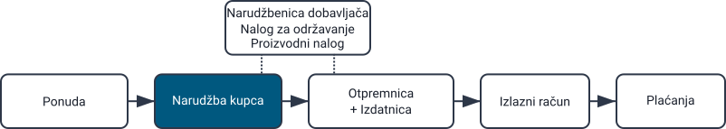
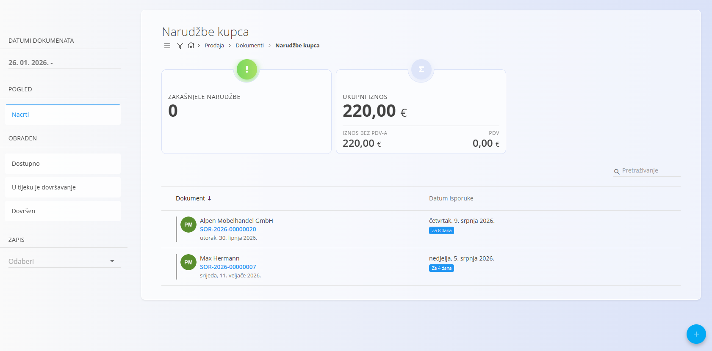
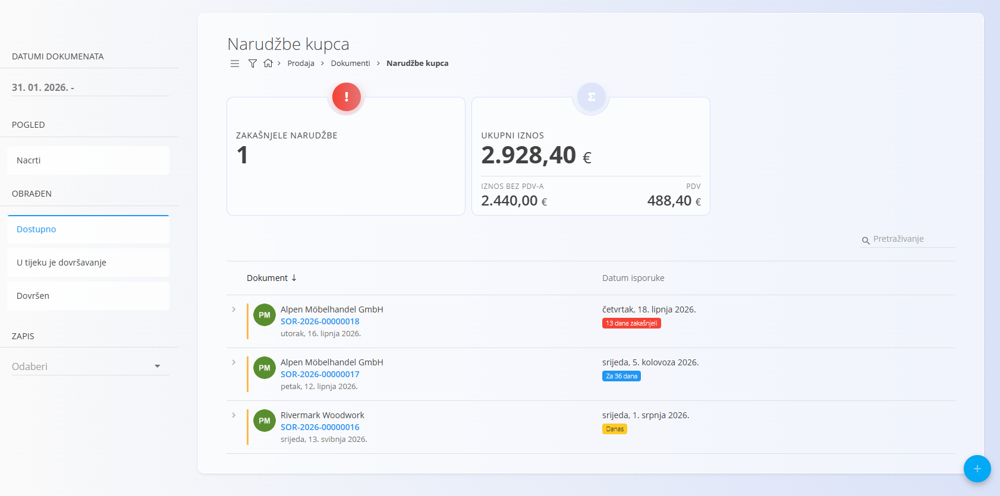
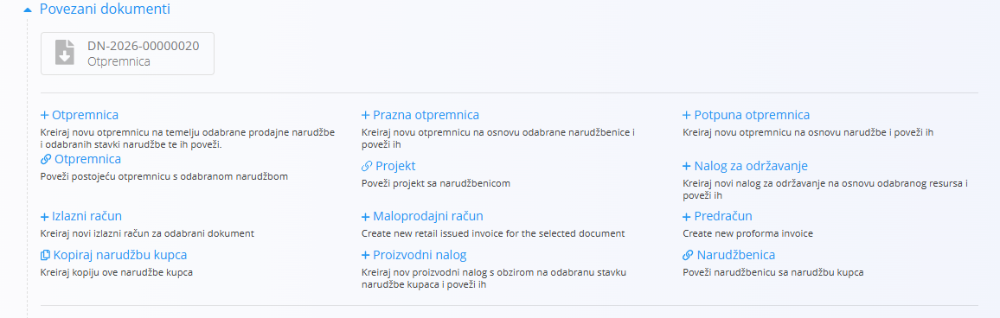
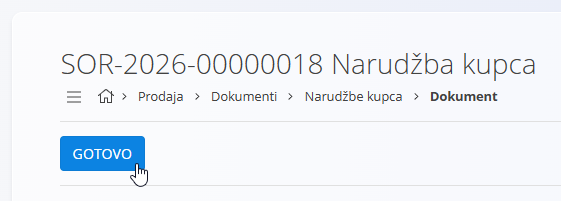

<!-- app_route: /sales/documents/sales-orders -->
<!-- app_label: Narudžbe kupca -->
<!-- canonical_source_url: https://github.com/Tom-PIT/Connected.Docs/blob/main/hr/Domene/Prodaja/Dokumenti/NarudzbeKupca.md -->
<!-- canonical_source_title: Narudžbe kupca -->

# Narudžbe kupca

**Narudžba kupca** predstavlja potvrđenu namjeru kupca za kupnju robe ili usluga. Obično nastaje iz odobrene **[Ponude](Ponude.md)**, ali može se izraditi i samostalno.

Narudžbe kupca određuju *što* će kupac primiti, *kada* će biti isporučeno i *pod kojim uvjetima*, te predstavljaju osnovu za isporuku, proizvodnju, nabavu i izdavanje računa.

Za pristup ovom dokumentu idite na **Prodaja / Dokumenti / Narudžbe kupca** u [navigaciji](../../../Zajednicko/UI/Navigacija.md).

## Kako se narudžbe kupca uklapaju u prodajni proces

Narudžbe kupca predstavljaju jedan od glavnih koraka prodajnog procesa:

1. Izradi se **[Ponuda](Ponude.md)**.
2. Nakon što kupac potvrdi ponudu, iz nje se putem **[Povezanih dokumenata](Ponude.md#povezani-dokumenti)** kreira **Narudžba kupca**.
3. Narudžba kupca pokreće daljnje poslovne procese:
   - [**Otpremnice**](Otpremnice.md)
   - [**Proizvodni nalozi**](../../Proizvodnja/Dokumenti/ProizvodniNalozi.md)
   - [**Nalozi za održavanje**](../../Odrzavanje/Dokumenti/NaloziZaOdrzavanje.md)
   - [**Narudžbenice**](../../Nabava/Dokumenti/Narudzbenice.md)
   - [**Izlazni računi**](IzlazniRacuni.md)

Nakon što je narudžba u potpunosti izvršena i fakturirana, prelazi u završno stanje.

> [!NOTE]
> Vaša tvrtka može koristiti sve ili samo pojedine korake ovog procesa, ovisno o vrsti poslovanja (primjerice, uslužne tvrtke možda neće koristiti otpremnice).

## Shema

<strong>Dokument</strong>

| Polje | Opis |
|-------|------|
| [**Oznaka**](../../../Zajednicko/UI/OznakeDokumenata.md) | Sistemski generirana oznaka narudžbe kupca. |
| **Kupac** | Kupac kojem je narudžba namijenjena, odabire se iz [Poslovnog imenika](../../../Zajednicko/Upravljanje/PoslovniImenik.md) (obavezno). |
| **Datum dokumenta** | Datum izrade narudžbe kupca. |
| **Datum isporuke** | Planirani datum isporuke (obavezno). |
| **Rabat** | Opcionalni popust primijenjen na cijelu narudžbu kupca. |
| **Narudžbenica** | Opcionalna poveznica na povezanu [narudžbenicu](../../Nabava/Dokumenti/Narudzbenice.md). |
| [**Načini plaćanja**](../Upravljanje/NaciniPlacanja.md) | Načini plaćanja povezani s narudžbom kupca. |

<strong>Transport, Alternativna valuta i Dostava</strong>

| Polje | Opis |
|-------|------|
| [**Uvjeti isporuke**](../../../Zajednicko/Upravljanje/UvjetiIsporuke.md) | Uvjeti isporuke dogovoreni s kupcem. |
| [**Način transporta**](../../../Zajednicko/Upravljanje/VrstaTransporta.md) | Način transporta dogovoren s kupcem. |
| [**Alternativna valuta**](../../../Zajednicko/Upravljanje/Valute.md) | Alternativna valuta koja se koristi u dokumentu. |
| [**Tečaj**](../Upravljanje/DevizniTecajevi.md) | Tečaj alternativne valute u odnosu na zadanu valutu. |
| **Dostava** | Podaci o dostavnoj službi i adresi isporuke. |

<strong>Intrastat</strong>

| Polje | Opis |
|-------|------|
| [**Država otpreme**](../../../Zajednicko/Upravljanje/Drzave.md) | Država iz koje je roba otpremljena. Ova se vrijednost obično preuzima iz Intrastat konfiguracije robe. |
| [**Vrsta transakcije**](../../Racunovodstvo/Upravljanje/Intrastat/VrsteTransakcija.md) | Vrsta transakcije za Intrastat izvještavanje. |
| [**Mjesto isporuke**](../../Racunovodstvo/Upravljanje/Intrastat/MjestaIsporuke.md) | Označava mjesto isporuke prema pravilima Intrastata. |

<strong>Stavke</strong>

| Polje | Opis |
|-------|------|
| [**Roba ili usluga**](../../RobaIUsluge/RobaIUsluge/RobaIUsluge.md) | Roba ili usluga koja se naručuje. |
| **Datum isporuke** | Planirani datum isporuke stavke. |
| **Količina** | Količina robe ili usluge. |
| **Cijena bez PDV-a (jedinična)** | Jedinična cijena preuzeta iz konfiguracije robe ili odgovarajućeg [cjenika](../../RobaIUsluge/RobaIUsluge/Cjenici.md). |
| **Popust (%)** | Opcionalni popust primijenjen na pojedinu stavku. |
| [**Porezne stope**](../../../Zajednicko/Upravljanje/PorezneStope.md) | Primijenjena porezna stopa. |
| [**Intrastat – Tarifa**](../../Racunovodstvo/Upravljanje/Intrastat/Tarife.md) | Tarifni broj za Intrastat izvještavanje. |
| **Intrastat – Država podrijetla** | Država podrijetla robe. |
| **Intrastat – Neto težina (kg)** | Neto težina za statističko izvještavanje. |
| **Intrastat – Statistička vrijednost** | Statistička vrijednost robe za Intrastat izvještavanje. |
| **Vrijednost** | Ukupna vrijednost stavke (količina × jedinična cijena, umanjena za popuste). |

## Upravljanje

### Statusi dokumenata

Dokumenti tijekom svog životnog ciklusa prolaze kroz nekoliko mogućih stanja:

- **Nacrti** – Dokument još nije objavljen. Sva polja mogu se slobodno uređivati.
- **Obrađen** – Dokument je objavljen. Više ga nije moguće obrisati niti slobodno uređivati.
    - **Dostupno** – Dokument je spreman za daljnju obradu.
    - **U tijeku je dovršavanje** – Dokument je djelomično obrađen.
    - **Dovršen** – Sve radnje povezane s dokumentom su završene.

### Pregled popisa

Popis prikazuje sve narudžbe kupca zajedno s njihovim trenutnim statusom i planiranim datumima isporuke.

Na vrhu popisa prikazani su pokazatelji koji se izračunavaju prema trenutno primijenjenim filtrima:

- **Zakašnjele narudžbe** – Narudžbe kojima je prošao planirani datum isporuke, a još nisu dovršene.
- **Ukupni iznos** – Ukupna vrijednost svih narudžbi obuhvaćenih aktivnim filtrima.

**Nacrti:**

**Dostupno (objavljene):**

Filtri uključuju:

- **Datumi dokumenata**
- **Nacrti**
- **Obrađen:** Dostupno, U tijeku je dovršavanje, Dovršen
- **Kupac**
- **Zapis**
- **Tražilicu**

## Radnje

### Izrada narudžbe kupca

Za izradu nove narudžbe kupca kliknite [akcijski gumb](../../../Zajednicko/UI/AkcijskiGumb.md).

Za detaljne upute pogledajte dokument [**Izrada narudžbe kupca**](NarudzbeKupcaIzrada.md).

### Uređivanje narudžbe kupca

Kliknite narudžbu kupca na popisu kako biste otvorili njezin pregled za uređivanje. Dostupne radnje ovise o statusu dokumenta. Dok je narudžba u statusu **Nacrti**, možete uređivati sve odjeljke:

- Zaglavlje dokumenta (datumi, kupac)
- [**Alternativna valuta**](NarudzbeKupcaIzrada.md#alternativna-valuta)
- [**Transport i Intrastat**](NarudzbeKupcaIzrada.md#transport-i-intrastat)
- [**Dostava**](NarudzbeKupcaIzrada.md#dostava)
- [**Stavke**](NarudzbeKupcaIzrada.md#korak-3--dodavanje-stavki) – dodavanje, uređivanje ili uklanjanje stavki
- [**Načini plaćanja**](NarudzbeKupcaIzrada.md#nacini-placanja) – definiranje načina plaćanja kupca

#### Povezani dokumenti

Odjeljak **Povezani dokumenti** omogućuje izradu i povezivanje drugih poslovnih dokumenata te prikazuje već povezane dokumente.

Više informacija o povezivanju dokumenata, sljedivosti i izradi povezanih dokumenata potražite u dokumentu [**Povezani dokumenti**](../../../Zajednicko/Koncepti/PovezaniDokumenti.md).

> [!NOTE]
> Dostupne radnje u odjeljku **Povezani dokumenti** ovise o vrsti i statusu dokumenta.

Dostupne radnje uključuju:

- [**+ Otpremnica**](Otpremnice.md)
- **+ Prazna [otpremnica](Otpremnice.md)**
- **+ Potpuna [otpremnica](Otpremnice.md)**
- **Poveži postojeću [otpremnicu](Otpremnice.md)**
- [**+ Proizvodni nalog**](../../Proizvodnja/Dokumenti/ProizvodniNalozi.md)
- [**+ Nalog za održavanje**](../../Odrzavanje/Dokumenti/NaloziZaOdrzavanje.md)
- [**+ Izlazni račun**](IzlazniRacuni.md)
- **+ Maloprodajni račun**
- **+ Predračun**
- **Projekt**
- **Narudžbenica**
- **Kopiraj narudžbu kupca**

### Objava narudžbe kupca

Kada je nacrt dovršen, kliknite **Objavi** na vrhu stranice kako biste objavili narudžbu. Objavljena narudžba kupca prelazi u stanje **Dostupno**, čime postaju dostupne dodatne radnje nad dokumentom.

> [!NOTE]
> Klikom na **Objavi** dokument se potvrđuje i prelazi iz stanja **Nacrti** u skupinu stanja **Obrađen**.

Objava narudžbe kupca ima sljedeće učinke:

- Dokument prelazi u stanje **Dostupno**.
- Uređivanje dokumenta je ograničeno.
- Omogućene su dodatne radnje u odjeljku **Povezani dokumenti**.

### Dovršavanje narudžbe kupca

Nakon što je objavljena narudžba kupca završena, primjerice kada je iz nje izrađena [**Otpremnica**](Otpremnice.md) ili [**Izlazni račun**](IzlazniRacuni.md), kliknite **Gotovo**:

Dovršavanje narudžbe kupca ima sljedeće učinke:

- Dokument prelazi iz stanja **Dostupno** u stanje **Dovršen**.
- Daljnje uređivanje dokumenta je ograničeno.
- Većina radnji u odjeljku **Povezani dokumenti** više nije dostupna.

> [!NOTE]
> Dovršavanje narudžbe kupca predstavlja administrativnu radnju kojom se završava njezin životni ciklus. Tom se radnjom **ne izvršavaju** dodatna skladišna ni financijska knjiženja — ona nastaju kroz povezane dokumente, poput otpremnica ili izlaznih računa.

### Brisanje narudžbe kupca

Dokumente u stanju **Nacrti** moguće je obrisati u prikazu za uređivanje, **samo ako ne sadrže stavke**.

Ako nacrt još uvijek sadrži stavke:

1. Otvorite izbornik dokumenta u gornjem desnom kutu.
2. Odaberite **Obriši sve stavke** kako biste uklonili sve stavke odjednom.
3. Nakon što dokument više ne sadrži stavke, kliknite **Izbriši**.

Ako želite obrisati samo jednu stavku:

1. Kliknite stavku kako biste otvorili zaslon **Uredi stavku**.
2. Kliknite **Izbriši**.

Više informacija o radu sa stavkama dokumenta potražite u dokumentu [**Stavke dokumenta**](../../../Zajednicko/Koncepti/Stavke.md).

> [!NOTE]
> Obrisati je moguće samo narudžbe kupca u stanju **Nacrti**. Nakon objave dokument više nije moguće obrisati, već ga je potrebno vratiti u stanje **Nacrti**.

## Izbornik

Izbornik sadrži dodatne radnje dostupne na ovom zaslonu.

Dostupne radnje:

- **Ispis**
- **Izvoz u PDF**
- **Uvoz stavki**
- **Obriši sve stavke** (samo za nacrte)
- **Vrati u nacrte**

Više informacija o radnjama izbornika potražite u dokumentu [**Radnje izbornika**](../../../Zajednicko/Koncepti/RadnjeIzbornika.md).

> [!NOTE]
> Storniranje poništava financijski učinak knjiženog dokumenta. Više informacija potražite u dokumentu **[Storna](../../Logistika/Dokumenti/Storna.md)**.