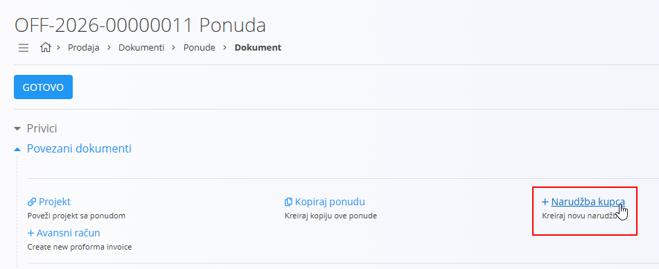
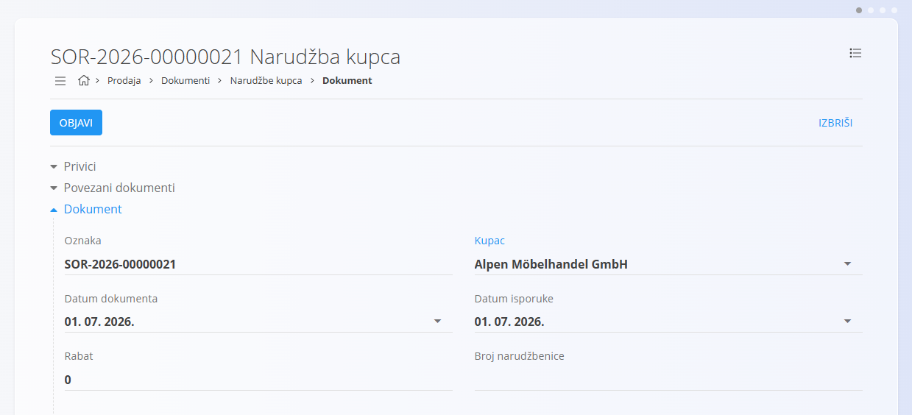
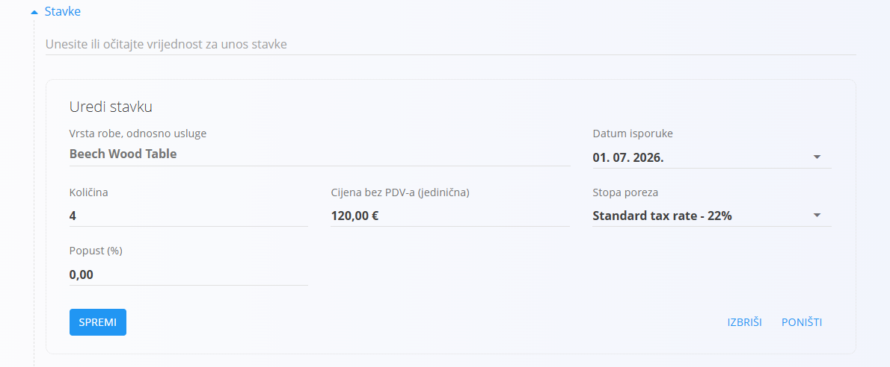

<!-- app_route: /sales/documents/sales-orders -->
<!-- app_label: Narudžbe kupca -->
<!-- app_navigation_hint: Otvorite Narudžbe kupca, zatim kliknite akcijski gumb za izradu nove narudžbe u nacrtu. -->
<!-- canonical_source_url: https://github.com/Tom-PIT/Connected.Docs/blob/main/hr/Domene/Prodaja/Dokumenti/NarudzbeKupca.md -->
<!-- canonical_source_title: Kako izraditi narudžbu kupca -->

# Kako izraditi narudžbu kupca

Nove narudžbe kupca mogu se izraditi:

- ručno sa zaslona **Narudžbe kupca** pomoću [akcijskog gumba](../../../Zajednicko/UI/AkcijskiGumb.md)
- iz objavljene [ponude](Ponude.md) putem **Povezani dokumenti → + Narudžba kupca**

> [!NOTE]
>
> - Ručno izrađene narudžbe kupca započinju s praznim poljima.
> - Kada se narudžba kupca izradi iz ponude, većina polja automatski se popunjava podacima iz izvornog dokumenta, uključujući kupca, podatke o isporuci i stavke.

## Korak 1 — Izrada dokumenta

Izradite novu narudžbu kupca u statusu nacrta na jedan od sljedećih načina:

- Izravno sa zaslona **Narudžbe kupca** pomoću [akcijskog gumba](../../../Zajednicko/UI/AkcijskiGumb.md).
- Iz objavljene [ponude](Ponude.md), putem **Povezani dokumenti → + Narudžba kupca**. U tom se slučaju većina polja — poput kupca, podataka o isporuci i stavki — automatski popunjava na temelju ponude.

## Korak 2 — Unos podataka dokumenta

Unesite **Kupca**, **Datum dokumenta** i **Datum isporuke** (ili ih pregledajte ako su već unaprijed popunjeni).

## Korak 3 — Dodavanje stavki

Dodajte stavke u odjeljak **Stavke**. Stavke određuju naručenu robu ili usluge te njihove količine, cijene, poreze i popuste. Svaka stavka predstavlja jedan proizvod ili uslugu.

Za dodavanje nove stavke:

1. U traku za unos stavki upišite ili skenirajte **serijski broj**, **EAN** ili **naziv robe ili usluge** (ili pregledajte unaprijed popunjenu vrijednost). Sustav prikazuje **sve odgovarajuće materijale i serijske brojeve**. Ako postoji više rezultata, odaberite odgovarajući s popisa.

   

2. Po potrebi prilagodite **Količinu**, **Datum isporuke** ili ostala polja.
3. Kliknite **Spremi** kako biste potvrdili dodanu stavku.
4. Ponovite korak 1 za dodavanje dodatnih stavki.

Za više informacija o radu sa stavkama dokumenata pogledajte [**Stavke dokumenata**](../../../Zajednicko/Koncepti/Stavke.md).

Spremljena stavka:

### Intrastat podaci

Kada je omogućen Intrastat, u odjeljku **Stavke** prikazuju se dodatna polja:

- **Tarifa**
- **Država podrijetla**
- **Neto težina**
- **Statistička vrijednost**

Ta su polja potrebna za Intrastat izvještavanje, ali ne utječu na obradu narudžbe kupca.

## Korak 4 — Konfiguracija dodatnih odjeljaka

### Dostava

Pregledajte ili prilagodite podatke u odjeljku **Dostava**.

Odjeljak Dostava određuje adresu na koju će roba biti isporučena. Vrijednosti se automatski preuzimaju iz podataka kupca, ali ih je moguće izmijeniti za pojedini dokument.

Ovi podaci koriste se na ispisanim dokumentima i u povezanim logističkim dokumentima, ali ne mijenjaju osnovne podatke kupca.

### Alternativna valuta

Odjeljak **Alternativna valuta** omogućuje iskazivanje cijena dokumenta u valuti različitoj od zadane valute sustava. Najčešće se koristi kod međunarodne prodaje. Tečajevi se preuzimaju iz [Deviznih tečajeva](../Upravljanje/DevizniTecajevi.md).

Nakon odabira alternativne valute cijene u dokumentu automatski se preračunavaju prema odabranom tečaju.

### Transport i Intrastat

Kada je u **Sustav / Konfiguracija / Intrastat** postavljeno **Obveznik**, u dokumentu postaju dostupni dodatni odjeljci.

- **Transport** – koristi se za unos logističkih podataka o načinu isporuke robe.
- **Intrastat** – koristi se za unos podataka potrebnih za Intrastat izvještavanje. Ovaj se odjeljak prikazuje samo kada je Intrastat omogućen.

> [!NOTE]
>
> Većina Intrastat vrijednosti preuzima se iz **šifrarnika robe ili usluga** (Intrastat konfiguracije), primjerice država podrijetla ili vrsta transakcije. Te se vrijednosti ne unose ručno za svaki dokument, već ovise o prethodno definiranim osnovnim podacima.

### Načini plaćanja

Načini plaćanja prikazuju se pri dnu dokumenta.

Kliknite **Dodajte način plaćanja** kako biste narudžbi dodijelili [način plaćanja](../Upravljanje/NaciniPlacanja.md). Ovaj podatak služi isključivo kao informacija te sam po sebi ne pokreće financijske transakcije. Koristi se za evidenciju načina na koji kupac namjerava platiti narudžbu.

### Privici

Koristite odjeljak **Privici** za prijenos i upravljanje datotekama povezanima s dokumentom, poput fotografija, PDF dokumenata, certifikata ili druge prateće dokumentacije.

Za detaljne upute pogledajte [**Privici**](../../../Zajednicko/Koncepti/Privici.md).

## Korak 5 — Objava dokumenta

Kliknite **Objavi** pri vrhu stranice.

Nakon objave narudžba kupca prelazi u status **Obrađen → Dostupno**, čime postaju dostupne povezane radnje, kao što su izrada **Otpremnice**, **Prazne otpremnice**, **Potpune otpremnice**, **Izlaznog računa**, **Proizvodnog naloga**, **Naloga za održavanje**, **Predračuna** ili povezivanje s postojećim dokumentima putem odjeljka [**Povezani dokumenti**](NarudzbeKupca.md#povezani-dokumenti).