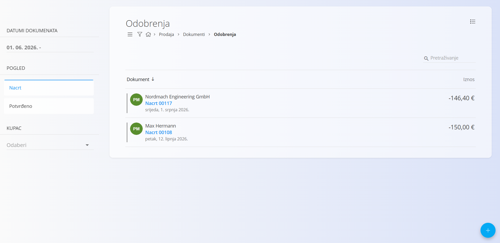
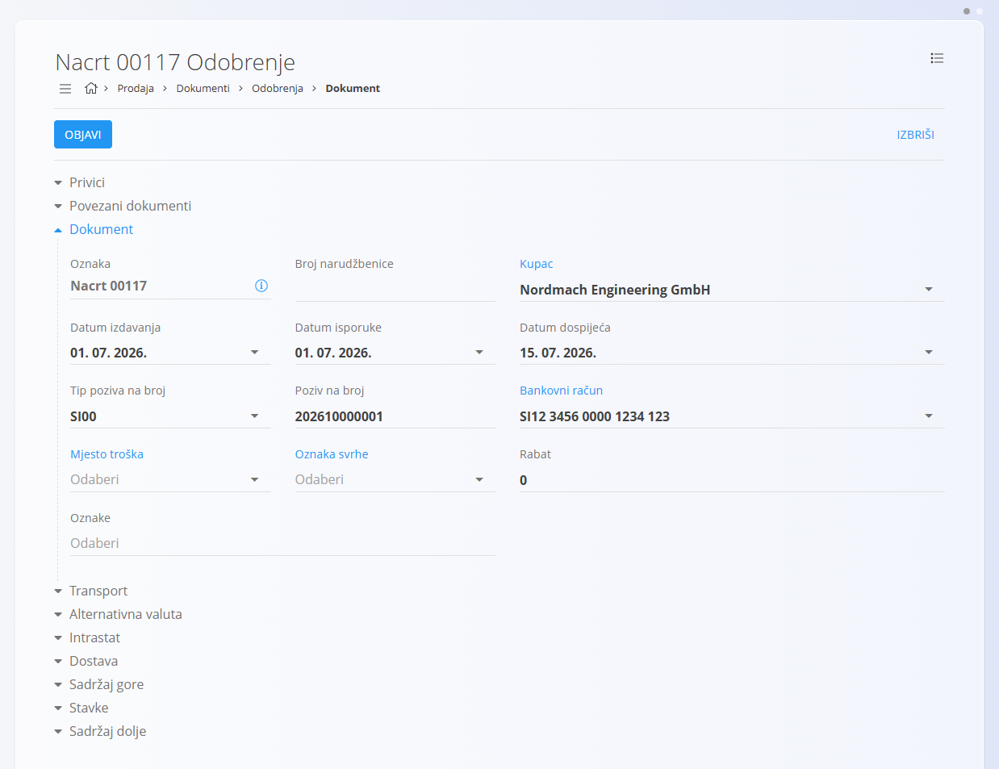
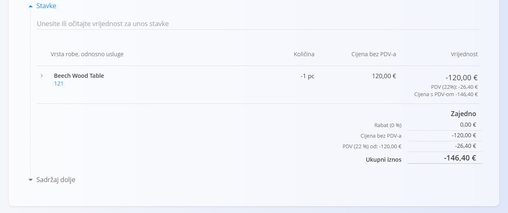
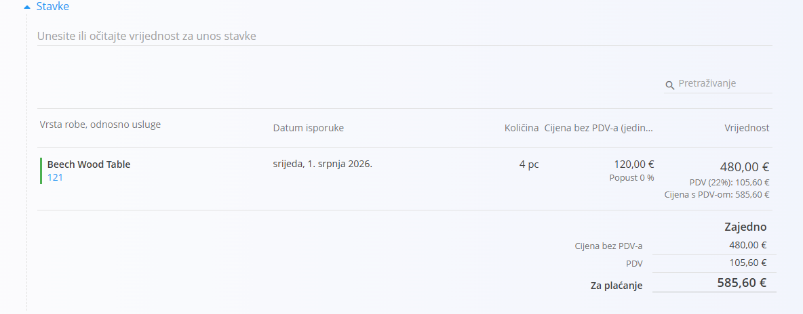
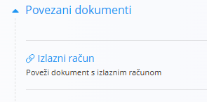
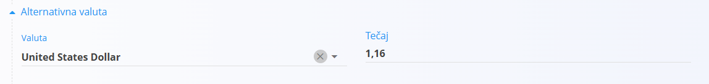
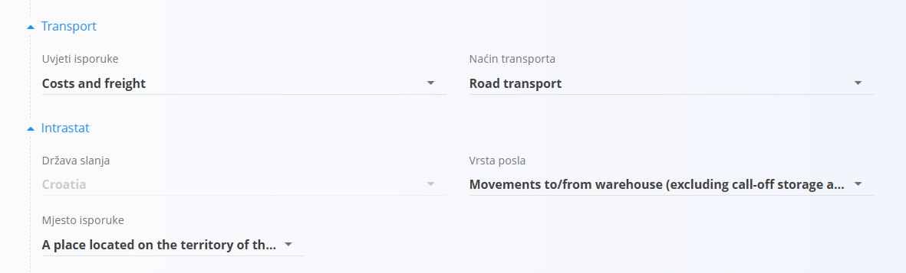
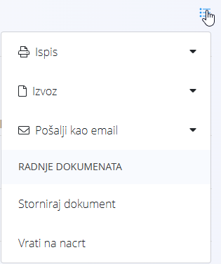

<!-- app_route: /sales/documents/credit-notes -->
<!-- app_label: Odobrenja -->
<!-- canonical_source_url: https://github.com/Tom-PIT/Connected.Docs/blob/main/hr/Domene/Prodaja/Dokumenti/Odobrenja.md -->
<!-- canonical_source_title: Odobrenja -->

# Odobrenja

**Odobrenje** je prodajni dokument koji se koristi za umanjenje ili poništenje cijelog ili dijela već izdanog izlaznog računa. Najčešće se izrađuje kada se roba vraća, kada je došlo do pogreške u obračunu ili kada je nakon izdavanja računa potrebno izvršiti ispravak.

Odobrenja smanjuju otvoreno dugovanje kupca. Za povećanja ili dodatna terećenja pogledajte **[Terećenja](Terecenja.md)**.

> [!TIP]
> Trenutni pregled **terećenja i odobrenja** za svakog kupca možete jednostavno pregledati u prikazu **[Kartice tvrtki](../Pogledi/KarticeTvrtke.md)**.

Za pristup ovom dokumentu idite na **Prodaja / Dokumenti / Odobrenja**.

## Kako se odobrenja uklapaju u prodajni proces

Odobrenja se koriste nakon što je izlazni račun već izdan:

1. Izdajte **[Izlazni račun](IzlazniRacuni.md)** za isporučenu robu ili usluge.
2. Utvrdite potrebu za ispravkom (povrat robe, odobrenje popusta ili ispravak cijene).
3. Izradite **Odobrenje** povezano s izlaznim računom ili kao samostalni dokument.
4. Pregledajte i objavite odobrenje kako bi prešlo u status **Potvrđeno**.
5. Iznos odobrenja umanjuje otvoreno stanje kupca ili se vraća kupcu prema ugovorenim uvjetima plaćanja.
6. Ako je odobrenje izrađeno pogreškom, stornirajte ga (pogledajte **[Storna](../../Logistika/Dokumenti/Storno.md)**).

Odobrenja utječu samo na računovodstvo i ne utječu na stanje zaliha.

## Shema

<strong>Dokument</strong>

| Polje | Opis |
|-------|------|
| [**Oznaka**](../../../Zajednicko/UI/OznakeDokumenata.md) | Sistemski generirana oznaka odobrenja. |
| **Broj narudžbenice** | Opcionalna referenca na broj narudžbenice kupca. |
| **Kupac** | Kupac kojem je odobrenje namijenjeno, odabire se iz [**Poslovnog imenika**](../../../Zajednicko/Upravljanje/PoslovniImenik.md) (obavezno). |
| **Datum izdavanja** | Datum izdavanja odobrenja. |
| **Datum isporuke** | Izvorni datum isporuke robe ili usluge s računa. |
| **Datum dospijeća** | Datum dospijeća odobrenja (obavezno). |
| **Tip poziva na broj** | Vrsta poziva na broj koja se koristi na dokumentu (obavezno). |
| **Poziv na broj** | Poziv na broj prema odabranom tipu poziva na broj. |
| [**Bankovni račun**](../Upravljanje/BankovniRacuniOrganizacije.md) | Bankovni račun koji se koristi za povrat sredstava ili knjiženje (obavezno). |
| [**Mjesto troška**](../../../Zajednicko/Upravljanje/MjestaTroska.md) | Opcionalno mjesto troška za knjiženje dokumenta. |
| **Oznaka svrhe** | Opcionalna oznaka svrhe plaćanja. |
| **Rabat** | Ukupni rabat primijenjen na cijelo odobrenje. |
| **Oznake** | Oznake dodijeljene dokumentu radi lakše organizacije i pretraživanja. |
| **Sadržaj gore** | Uvodni tekst iz [**Unaprijed pripremljenih tekstova**](../../../Zajednicko/Upravljanje/UnaprijedPripremljeniTekstovi.md). |
| **Sadržaj dolje** | Završni ili pravni tekst iz [**Unaprijed pripremljenih tekstova**](../../../Zajednicko/Upravljanje/UnaprijedPripremljeniTekstovi.md). |

<strong>Transport, Alternativna valuta i Dostava</strong>

| Polje | Opis |
|-------|------|
| [**Uvjeti isporuke**](../../../Zajednicko/Upravljanje/UvjetiIsporuke.md) | Uvjeti isporuke dogovoreni s kupcem. |
| [**Način transporta**](../../../Zajednicko/Upravljanje/VrstaTransporta.md) | Način transporta koji se koristi za isporuku robe. |
| [**Alternativna valuta**](../../../Zajednicko/Upravljanje/Valute.md) | Alternativna valuta koja se koristi u dokumentu. |
| [**Tečaj**](../Upravljanje/DevizniTecajevi.md) | Tečaj alternativne valute u odnosu na zadanu valutu. |
| **Dostava** | Podaci o dostavnoj službi i adresi isporuke. |

<strong>Intrastat</strong>

| Polje | Opis |
|-------|------|
| [**Država otpreme**](../../../Zajednicko/Upravljanje/Drzave.md) | Država iz koje je roba otpremljena. Ova se vrijednost obično preuzima iz Intrastat konfiguracije robe. |
| [**Vrsta transakcije**](../../Racunovodstvo/Upravljanje/Intrastat/VrsteTransakcija.md) | Klasifikacija vrste transakcije za Intrastat izvještavanje. |
| [**Mjesto isporuke**](../../Racunovodstvo/Upravljanje/Intrastat/MjestaIsporuke.md) | Označava mjesto isporuke robe prema pravilima Intrastata. |

<strong>Stavke</strong>

| Polje | Opis |
|-------|------|
| [**Roba ili usluga**](../../RobaIUsluge/RobaIUsluge/RobaIUsluge.md) | Roba ili usluga koja se odobrava. |
| **Datum isporuke** | Datum isporuke povezan s odobrenom stavkom. |
| **Količina** | Količina robe ili usluge koja se odobrava. Vrijednost je obično negativna kako bi se smanjio prethodno obračunati iznos. |
| **Cijena bez PDV-a** | Jedinična cijena preuzeta iz izvornog dokumenta ili konfiguracije robe. |
| **Vrijednost** | Ukupna vrijednost stavke, uključujući porezne iznose i konačni iznos s PDV-om. |

<strong>Načini plaćanja</strong>

| Polje | Opis |
|-------|------|
| [**Način plaćanja**](../Upravljanje/NaciniPlacanja.md) | Način plaćanja koji se koristi za povrat sredstava ili knjiženje odobrenja. |
| **Iznos** | Iznos dodijeljen odabranom načinu plaćanja. |

## Upravljanje

Odobrenja mogu biti u statusima **Nacrt** i **Potvrđeno**.

### Prikaz popisa

Popis odobrenja može se filtrirati prema:

- **Datumima dokumenata**
- **Pogledu** (Nacrt / Potvrđeno)
- **Kupcu**

Svaki red prikazuje:

- Kupca
- Oznaku dokumenta
- Datum dokumenta
- Iznos odobrenja (negativna vrijednost)

Dokumenti u statusu **Nacrt** mogu se uređivati, dok su **Potvrđena** odobrenja konačna.

## Radnje

### Stvaranje novog odobrenja

Odobrenje se može stvoriti na dva načina:

- Putem [akcijskog gumba](../../../Zajednicko/UI/AkcijskiGumb.md) na zaslonu **Odobrenja**
- Iz postojećeg [**Izlaznog računa**](IzlazniRacuni.md) putem **Povezani dokumenti → + Odobrenje**

Nakon što započnete novo odobrenje, slijedite ove korake:

1. Stvorite novo odobrenje u statusu **Nacrt** koristeći jednu od navedenih metoda.

   

2. Ispunite obavezna polja zaglavlja, kao što su **Kupac**, **Datumi**, **Tip poziva na broj** i **Bankovni račun**.

3. Dodajte stavke u odjeljku **Stavke** unosom ili skeniranjem **naziva robe ili usluge**, **EAN-a** ili **serijskog broja**.
   - Sustav prikazuje odgovarajuće rezultate za odabir.

   

   Za više informacija o radu sa stavkama dokumenata pogledajte [**Stavke dokumenta**](../../../Zajednicko/Koncepti/Stavke.md).

4. Po potrebi uredite količine i vrijednosti te kliknite **Spremi** za potvrdu stavke.

> [!NOTE]
> Prilikom dodavanja nove stavke u **Odobrenje**, **količina je prema zadanim postavkama postavljena na `-1`**, jer odobrenja predstavljaju umanjenje prethodno izdanog računa.

5. Kada je dokument spreman, kliknite **Objavi** pri vrhu stranice.  
   Dokument prelazi iz statusa **Nacrt** u **Potvrđeno** te postaje financijski važeći.

> [!NOTE]
> Nakon objave odobrenje se više ne može uređivati. Sve ispravke potrebno je napraviti storniranjem dokumenta.

#### Stavke

Stavke definiraju robu ili usluge, njihove količine, cijene, poreze i popuste. Svaka stavka predstavlja pojedini proizvod, uslugu ili drugu robu.

##### Glavna knjiga

Odjeljak **Glavna knjiga** određuje način knjiženja dokumenta u glavnu knjigu. Definira konta koja se koriste za knjiženje prihoda, rashoda i poreza prilikom knjiženja dokumenta.

Prilikom knjiženja dokumenta:

- **Neto iznos** knjiži se na odabrano konto prihoda ili rashoda.
- **Iznos poreza** knjiži se na odabrano konto poreza.
- Sustav automatski stvara odgovarajuće temeljnice u glavnoj knjizi.

Dostupna konta definirana su u [**Kontnom planu**](../../Racunovodstvo/Upravljanje/GlavnaKnjiga/KontniPlan.md).

##### Intrastat

Kada je omogućeno **Intrastat** izvještavanje i transakcija uključuje kupca iz druge države članice EU, u obrascu za uređivanje stavke prikazuje se dodatni odjeljak **Intrastat**. Ovaj odjeljak prikuplja statističke podatke potrebne za Intrastat izvještavanje.

Ova su polja obavezna za prekogranične transakcije unutar EU ako je organizacija obveznik Intrastata.

### Uređivanje odobrenja

Uređivati se mogu samo odobrenja u statusu **Nacrt**.

Možete mijenjati:

- Zaglavlje dokumenta
- Alternativnu valutu
- Transport
- Podatke o dostavi
- Stavke
- Sadržaj gore i sadržaj dolje

Potvrđena odobrenja dostupna su samo za pregled.

#### Privici

Koristite odjeljak **Privici** za prijenos i upravljanje datotekama povezanima s dokumentom, kao što su fotografije, PDF dokumenti, certifikati ili druga prateća dokumentacija.

Detaljne upute potražite u dokumentu [**Privici**](../../../Zajednicko/Koncepti/Privici.md).

#### Povezani dokumenti

Odjeljak **Povezani dokumenti** omogućuje povezivanje prethodno izrađenog **Izlaznog računa**.

Nakon objave dokumenta odjeljak **Povezani dokumenti** više nije dostupan.

Za više informacija o povezivanju dokumenata, sljedivosti i stvaranju povezanih dokumenata pogledajte [**Povezani dokumenti**](../../../Zajednicko/Koncepti/PovezaniDokumenti.md).

#### Alternativna valuta

Odjeljak **Alternativna valuta** omogućuje iskazivanje cijena u valuti različitoj od zadane valute sustava. To se najčešće koristi kod međunarodne prodaje. Tečajevi se preuzimaju iz šifrarnika [Tečajevi](../Upravljanje/DevizniTecajevi.md).

Nakon odabira alternativne valute, cijene dokumenta automatski se preračunavaju prema odabranom tečaju.

#### Transport i Intrastat

Kada je **Intrastat** postavljen na **Obveznik** u **Sustav / Konfiguracija / Intrastat**, u obrascu dokumenta postaju dostupni dodatni odjeljci.

- **Transport** – Koristi se za unos logističkih podataka o načinu isporuke robe.
- **Intrastat** – Koristi se za unos podataka potrebnih za Intrastat izvještavanje. Ova se polja prikazuju samo kada je u sustavu omogućeno Intrastat izvještavanje.

> [!NOTE]
> Više Intrastat vrijednosti preuzima se iz šifrarnika robe (Intrastat konfiguracije), primjerice država i vrsta transakcije. Te vrijednosti nije moguće slobodno mijenjati na pojedinom dokumentu, već ovise o unaprijed definiranim matičnim podacima.

### Brisanje odobrenja

Dokumenti u statusu **Nacrt** mogu se obrisati u prikazu za uređivanje **samo ako ne sadrže nijednu stavku**.

Ako dokument i dalje sadrži stavke:

1. Otvorite izbornik dokumenta u gornjem desnom kutu.
2. Odaberite **Izbriši sve stavke** kako biste uklonili sve stavke odjednom.
3. Nakon što dokument više ne sadrži stavke, kliknite **Izbriši**.

Ako želite ukloniti samo pojedinu stavku:

1. Kliknite serijski broj ili naziv stavke kako biste otvorili zaslon **Uredi stavku**.
2. Kliknite **Izbriši**.

> [!NOTE]
> Potvrđena odobrenja **nije moguće obrisati**, ali ih je moguće **stornirati** ili **vratiti u nacrt**.

## Izbornik

Izbornik pruža dodatne radnje dostupne na ovoj stranici.

Dostupne radnje:

- **Ispis**
- **Izvoz**
- **Pošalji kao email**
- **Izbriši sve stavke** (samo za nacrte)
- **Storniraj dokument**
- **Vrati na nacrt** (ako je dopušteno)

> [!NOTE]
> Storniranjem odobrenja poništava se njegov financijski učinak.

Za više informacija o radnjama izbornika pogledajte [**Radnje izbornika**](../../../Zajednicko/Koncepti/RadnjeIzbornika.md).

