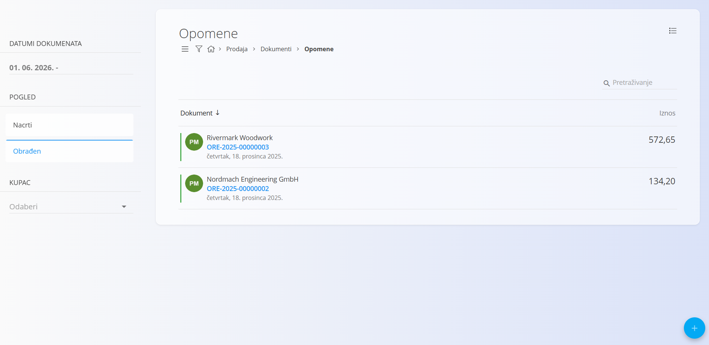
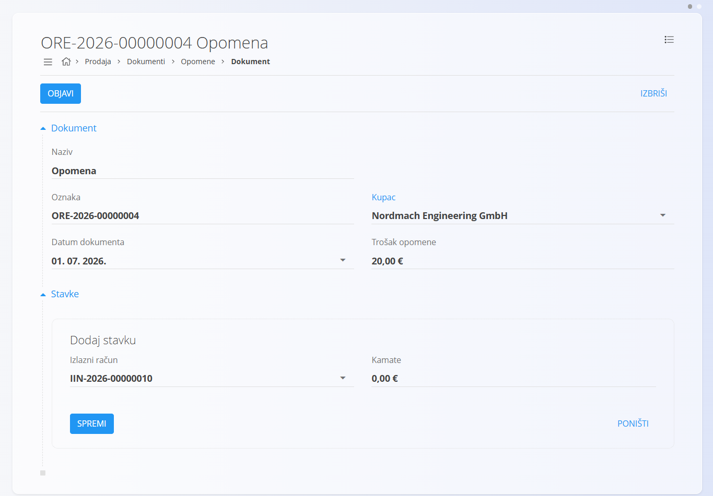
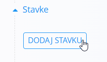
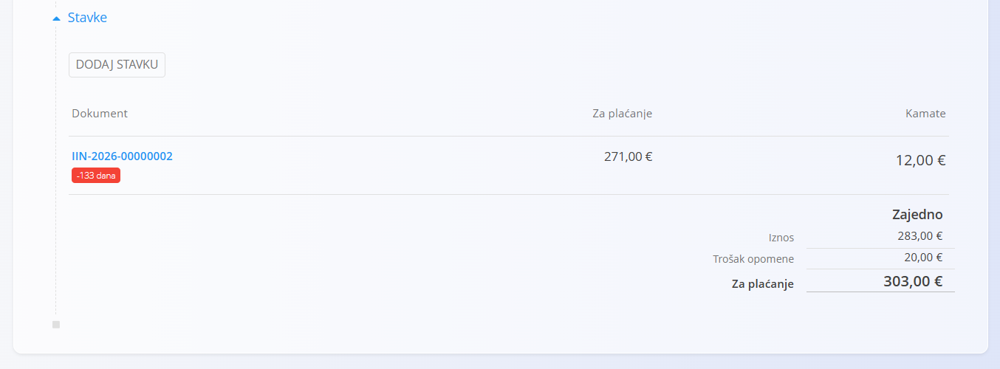

<!-- app_route: /sales/documents/overdue-reminders -->
<!-- app_label: Opomene -->
<!-- canonical_source_url: https://github.com/Tom-PIT/Connected.Docs/blob/main/hr/Domene/Prodaja/Dokumenti/Opomene.md -->
<!-- canonical_source_title: Opomene -->

# Opomene

**Opomena** je prodajni dokument koji se koristi za obavještavanje kupaca o neplaćenim izlaznim računima i zahtjev za plaćanje, uz mogućnost obračuna troška opomene i kamata.

Za pristup ovom dokumentu idite na **Prodaja / Dokumenti / Opomene** u [navigaciji](../../../Zajednicko/UI/Navigacija.md).

## Kako se opomene uklapaju u prodajni tijek rada

Uobičajeni tijek rada:

1. Pronađite **[Izlazni račun](IzlazniRacuni.md)** koji ima nepodmireni iznos nakon datuma dospijeća.
2. Izradite **Opomenu** s podacima izlaznog računa te po potrebi dodajte trošak opomene i kamate.
3. Pošaljite opomenu kupcu i evidentirajte daljnje aktivnosti.
4. Nakon podmirenja izlaznog računa više nije potrebno slati dodatne opomene.

## Shema

| Polje | Opis |
| ------ | ---- |
| [**Oznaka**](../../../Zajednicko/UI/OznakeDokumenata.md) | Sistemski generirana oznaka opomene. |
| **Naziv** | Naziv dokumenta. Zadana vrijednost je **Opomena**. |
| **Kupac** | Kupac kojem se šalje opomena, odabire se iz [Poslovnog imenika](../../../Zajednicko/Upravljanje/PoslovniImenik.md) (obavezno). |
| **Datum dokumenta** | Datum izrade opomene. |
| **Trošak opomene** | Fiksni trošak slanja opomene (npr. administrativna naknada). Može se primijeniti po dokumentu ili po stavci. |
| **Stavke** | Popis dospjelih stavki povezanih s **[Izlaznim računima](IzlazniRacuni.md)**, s pripadajućim iznosima i opcionalnim kamatama. |
| [**Izlazni račun**](IzlazniRacuni.md) | Izlazni račun za koji se šalje opomena. Nakon odabira sustav automatski učitava nepodmireni iznos. |
| **Kamate** | Iznos kamata za razdoblje kašnjenja. Unosi se ručno. |

## Upravljanje

### Pregled

Popis opomena podijeljen je na:

- **Nacrte**
- **Obrađene**

- **Nacrt** – Dokument još nije objavljen i sva polja mogu se slobodno uređivati.
- **Obrađen** – Dokument je objavljen te ga nije moguće brisati niti uređivati.

Filtri s lijeve strane omogućuju filtriranje prema:

- **Datumima dokumenta**
- **Statusu**
- **Kupcu**

## Radnje

### Izraditi novu opomenu

1. Kliknite [akcijski gumb](../../../Zajednicko/UI/AkcijskiGumb.md) kako biste izradili novu opomenu u statusu **Nacrt**.

   

2. Ispunite polja:

   - **Kupac**
   - **Datum dokumenta**
   - **Trošak opomene** (opcionalno)

3. Dodajte stavke u odjeljak **Stavke**:

   - Kliknite **Dodaj stavku**.
   - Odaberite dospjeli **[Izlazni račun](IzlazniRacuni.md)**.
   - Sustav automatski učitava **nepodmireni iznos** i primjenjuje **trošak opomene**.
   - Po potrebi ručno unesite **kamate**.

   

   Za više informacija pogledajte **[Stavke dokumenta](../../../Zajednicko/Koncepti/Stavke.md)**.

4. Kliknite **Spremi** kako biste potvrdili dodanu stavku. Ponovite prethodni korak za dodavanje dodatnih stavki.

   

5. Kada je dokument spreman, kliknite **Objavi** na vrhu stranice.

> [!NOTE]
> Klikom na **Objavi** dokument se potvrđuje i prelazi iz statusa **Nacrt** u status **Obrađen**.

## Urediti opomenu

Opomene u statusu **Nacrt** mogu se slobodno uređivati.

Kliknite opomenu na popisu kako biste otvorili njezine detalje.

Opomene u statusu **Obrađen** nije moguće uređivati.

## Izbrisati opomenu

Otvorite opomenu u statusu **Nacrt** i kliknite **Izbriši**.

Nakon potvrde brisanja dokument se trajno uklanja iz sustava.

Opomene u statusu **Obrađen** nije moguće izbrisati.

## Izbornik

Izbornik omogućuje dodatne radnje dostupne na ovom dokumentu.

Dostupne radnje:

- **Ispis**
- **Izvoz u PDF**

Za više informacija pogledajte **[Radnje izbornika](../../../Zajednicko/Koncepti/RadnjeIzbornika.md)**.