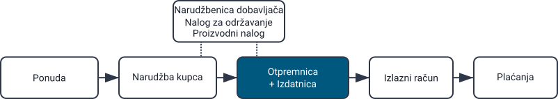
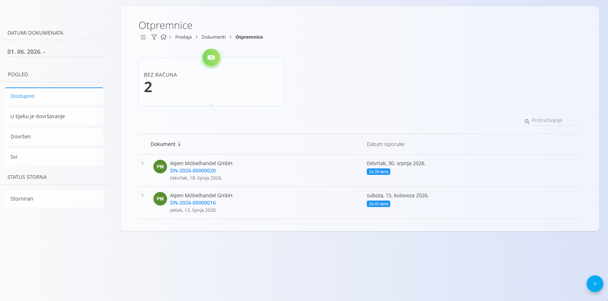
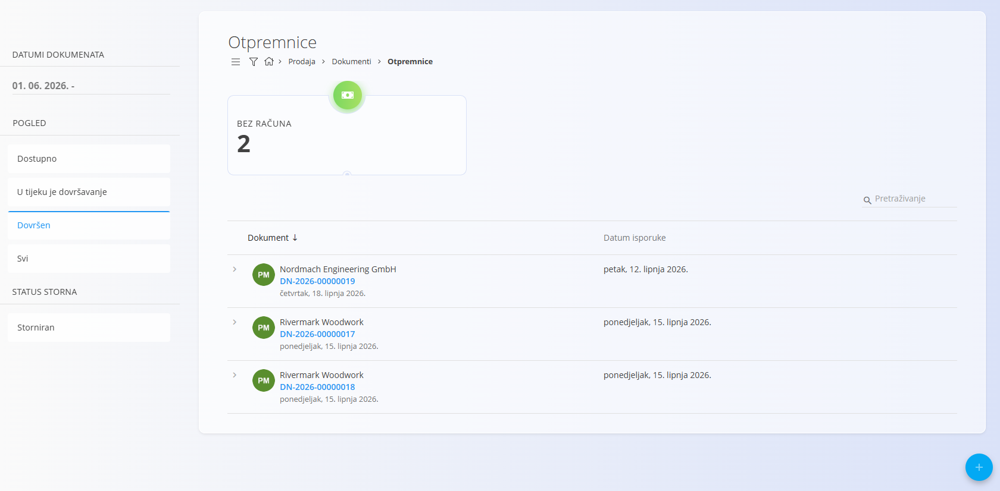
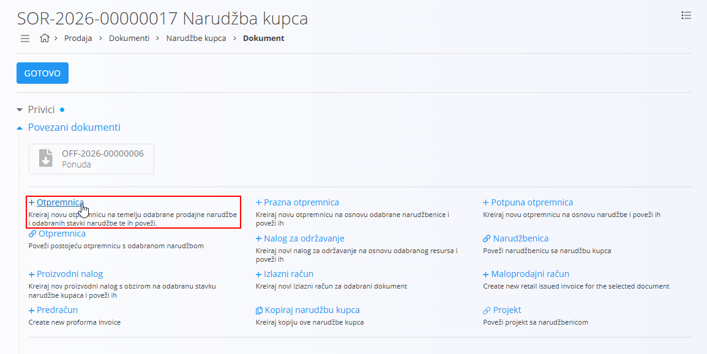
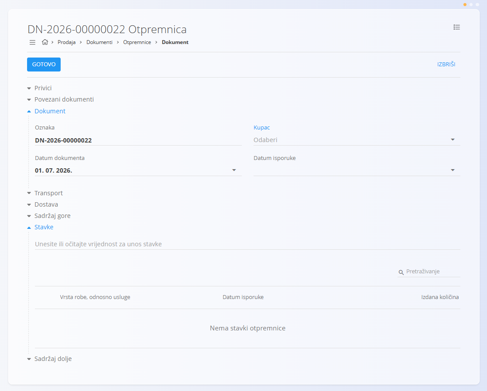
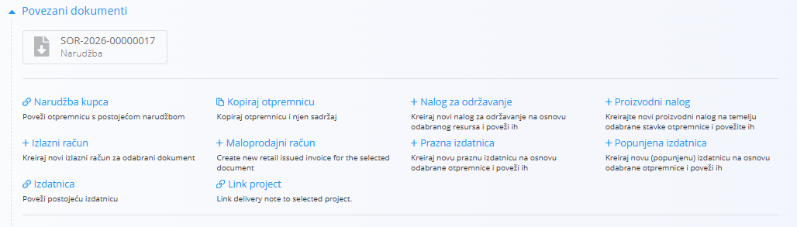
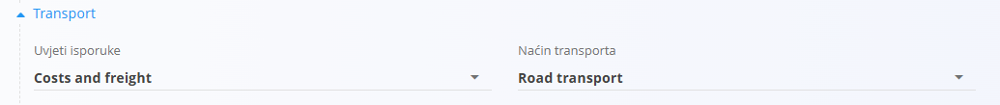

<!-- app_route: /sales/documents/delivery-notes -->
<!-- app_label: Otpremnice -->
<!-- canonical_source_url: https://github.com/Tom-PIT/Connected.Docs/blob/main/hr/Domene/Prodaja/Dokumenti/Otpremnice.md -->
<!-- canonical_source_title: Otpremnice -->

# Otpremnice

**Otpremnica** je logistički dokument koji prati robu tijekom isporuke. Potvrđuje koja se roba isporučuje, u kojim količinama i na koji datum. Otpremnice se najčešće izrađuju iz **Narudžbe kupca**, ali se po potrebi mogu izraditi i samostalno.

Otpremnica **nije** financijski dokument – prvenstveno služi za logističke procese. Nakon isporuke robe iz otpremnice se obično izrađuje **Izdatnica** (izlaz robe iz skladišta), a zatim i **Izlazni račun**.

Za pristup ovoj stranici otvorite **Prodaja / Dokumenti / Otpremnice** u [navigaciji](../../../Zajednicko/UI/Navigacija.md).

## Kako se otpremnice uklapaju u prodajni proces

Otpremnice predstavljaju poveznicu između komercijalnog i skladišnog procesa:

1. Kupac potvrdi narudžbu → izrađuje se [**Narudžba kupca**](NarudzbeKupca.md).
2. Iz narudžbe kupca korisnik izrađuje **Otpremnicu** putem *Povezani dokumenti → + Otpremnica*.
3. Kada je otpremnica spremna, izrađuje se povezana [**Izdatnica**](../../Logistika/Dokumenti/Izdatnica.md) (potpuna ili djelomična isporuka).
4. Nakon isporuke proces se nastavlja izradom [**Izlaznog računa**](IzlazniRacuni.md).

Otpremnice se također mogu kopirati, povezati s postojećim izdatnicama ili projektima te koristiti za pokretanje proizvodnih ili naloga za održavanje.

## Shema

<strong>Dokument</strong>

| Polje | Opis |
|-------|------|
| [**Oznaka**](../../../Zajednicko/UI/OznakeDokumenata.md) | Sistemski generirana oznaka otpremnice. |
| **Kupac** | Primatelj isporuke, odabire se iz [Poslovnog imenika](../../../Zajednicko/Upravljanje/PoslovniImenik.md) (obavezno). |
| **Datum dokumenta** | Datum izrade otpremnice. |
| **Datum isporuke** | Planirani datum isporuke (obavezno). |
| **Dostava – Tvrtka / Adresa** | Podaci o dostavi preuzeti iz [Poslovnog imenika](../../../Zajednicko/Upravljanje/PoslovniImenik.md). |
| **Sadržaj gore** | Opcionalni unaprijed pripremljeni uvodni tekst iz [Unaprijed pripremljenih tekstova](../../../Zajednicko/Upravljanje/UnaprijedPripremljeniTekstovi.md) (entitet: *Otpremnica*). |
| **Sadržaj dolje** | Opcionalni završni ili pravni tekst iz [Unaprijed pripremljenih tekstova](../../../Zajednicko/Upravljanje/UnaprijedPripremljeniTekstovi.md) (entitet: *Otpremnica*). |

<strong>Transport i dostava</strong>

| Polje | Opis |
|-------|------|
| [**Uvjeti isporuke**](../../../Zajednicko/Upravljanje/UvjetiIsporuke.md) | Uvjeti isporuke dogovoreni s kupcem. |
| [**Način transporta**](../../../Zajednicko/Upravljanje/VrstaTransporta.md) | Način transporta dogovoren s kupcem. |
| **Dostava** | Podaci o dostavnoj službi i adresi isporuke. |

<strong>Stavke</strong>

| Polje | Opis |
|-------|------|
| [**Roba ili usluga**](../../RobaIUsluge/RobaIUsluge/RobaIUsluge.md) | Roba ili usluga koja se isporučuje. |
| **Datum isporuke** | Datum isporuke pojedine stavke. |
| **Izdana količina** | Prikazuje koliko je jedinica već izdano (npr. *0/3* prije izdavanja, *3/3* nakon potpune isporuke). |

## Upravljanje

### Statusi dokumenta

Otpremnice koriste pojednostavljeni tijek rada:

- **Dostupno** – Otpremnica je izrađena i spremna za obradu. Ovaj status odgovara statusu *nacrta* kod drugih dokumenata. Iz otpremnice još nije izrađena [**Izdatnica**](../../Logistika/Dokumenti/Izdatnica.md), a sve količine još se mogu uređivati.

- **U tijeku je dovršavanje** – Otpremnica je djelomično obrađena. To se najčešće događa kada je izrađena [**Izdatnica**](../../Logistika/Dokumenti/Izdatnica.md) samo za dio robe ili kada isporuka još nije završena.

- **Dovršen** – Sve radnje povezane s otpremnicom su završene. Dokument se više ne može uređivati, ali ga je moguće ispisati, izvesti ili koristiti za izradu računa.

### Pregled popisa

Popis otpremnica prikazuje dokumente razvrstane prema statusu:

- **Dostupno**
- **U tijeku je dovršavanje**
- **Dovršen**
- **Svi**
- **[Storniran](../../Logistika/Dokumenti/Storno.md)** (Status storna)

**Pokazatelji prikazani na vrhu:**

- **Bez računa** (interaktivno) – Otpremnice za koje još nije izrađen izlazni račun. Klikom se prikazuju samo otpremnice koje još nemaju povezani račun.

Pokazatelji se automatski ažuriraju prema odabranim filtrima (Datumi dokumenta, Status, Status storna, Kupac).

**Primjer statusa Dostupno:**

**Primjer statusa Dovršen:**

## Radnje

### Izrada nove otpremnice

Otpremnice se mogu izraditi na dva načina:

- Sa zaslona **Otpremnice**, klikom na [akcijski gumb](../../../Zajednicko/UI/AkcijskiGumb.md).
- Iz **Narudžbe kupca** putem **Povezani dokumenti → + Otpremnica**, čime se izrađuje nova otpremnica.

Primjer nove otpremnice:

### Uređivanje otpremnice

Kliknite otpremnicu na popisu kako biste otvorili njezine pojedinosti. Dokument je podijeljen na proširive odjeljke koje je moguće uređivati:

- Privici
- Povezani dokumenti
- Dokument
- Transport
- Dostava
- Sadržaj gore
- Stavke
- Sadržaj dolje

> [!NOTE]
>
> Broj odjeljaka koje je moguće uređivati ovisi o statusu otpremnice.

#### Privici

Odjeljak **Privici** služi za prijenos i upravljanje datotekama povezanima s dokumentom, poput fotografija, PDF dokumenata, certifikata ili druge prateće dokumentacije.

Za više informacija pogledajte [**Privici**](../../../Zajednicko/Koncepti/Privici.md).

#### Povezani dokumenti

Odjeljak **Povezani dokumenti** omogućuje izradu i povezivanje operativnih te drugih povezanih dokumenata. Također prikazuje sve već povezane dokumente.

Za više informacija o povezivanju dokumenata, sljedivosti i izradi povezanih dokumenata pogledajte [**Povezani dokumenti**](../../../Zajednicko/Koncepti/PovezaniDokumenti.md).

> [!NOTE]
>
> Dostupne radnje u odjeljku **Povezani dokumenti** ovise o vrsti i statusu dokumenta.

Radnje dostupne za otpremnice u statusu **Dostupno** uključuju:

- [**Narudžba kupca**](NarudzbeKupca.md) – Poveži postojeću narudžbu kupca
- **Kopiraj otpremnicu**
- **Kopiraj otpremnicu sa sadržajem**
- **Projekt** – Poveži postojeći projekt
- [**+ Proizvodni nalog**](../../Proizvodnja/Dokumenti/ProizvodniNalozi.md)
- [**+ Nalog za održavanje**](../../Odrzavanje/Dokumenti/NaloziZaOdrzavanje.md)
- [**+ Izlazni račun**](IzlazniRacuni.md)
- **[+ Prazna izdatnica](../../Logistika/Dokumenti/Izdatnica.md)**
- **[+ Potpuna izdatnica](../../Logistika/Dokumenti/Izdatnica.md)**
- **[Izdatnica](../../Logistika/Dokumenti/Izdatnica.md)** – Poveži postojeću izdatnicu

#### Transport

Odjeljak **Transport** određuje način isporuke robe kupcu i uvjete isporuke.

Podaci uneseni u ovaj odjeljak koriste se za koordinaciju logistike, komunikaciju s kupcem i ispis prodajnih dokumenata.

### Dovršavanje otpremnice

Kada je otpremnica spremna, kliknite **Gotovo** pri vrhu stranice.

### Brisanje otpremnice

Otpremnice je moguće obrisati u prikazu za uređivanje, **samo ako ne sadrže nijednu stavku**.

Ako dokument još uvijek sadrži stavke u odjeljku **Stavke**:

1. Kliknite serijski broj ili naziv stavke kako biste otvorili zaslon **Uredi stavku**.
2. Kliknite **Izbriši** kako biste uklonili stavku.
3. Ponovite postupak za sve preostale stavke.

Kada dokument više ne sadrži nijednu stavku, kliknite **Izbriši**.

Ako potvrdite brisanje, dokument će biti trajno uklonjen.

> [!NOTE]
>
> - Otpremnicu nije moguće obrisati ako je povezana s drugim dokumentima (Izdatnice, Izlazni računi, Proizvodni nalozi itd.).
> - Dokumente u statusu **Dovršen** nije moguće obrisati — mogu se samo stornirati ili vratiti u nacrt.

## Izbornik

Izbornik omogućuje pristup dodatnim radnjama dostupnima na ovoj stranici.

Dostupne radnje:

- **Ispis**
- **Izvoz u PDF**
- **Pošalji e-poštom**
- **Ispis robe** (dovršeni dokumenti)
- **Storniraj dokument** (dovršeni dokumenti)
- **Vrati u nacrt** (dovršeni dokumenti)

Za više informacija pogledajte [**Radnje izbornika**](../../../Zajednicko/Koncepti/RadnjeIzbornika.md).

> [!NOTE]
>
> Stornirana otpremnica prikazuje se u bočnom filtru pod **Status storna → Storniran**.
