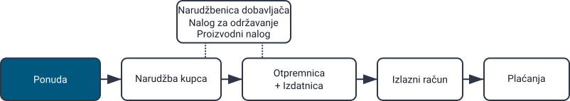
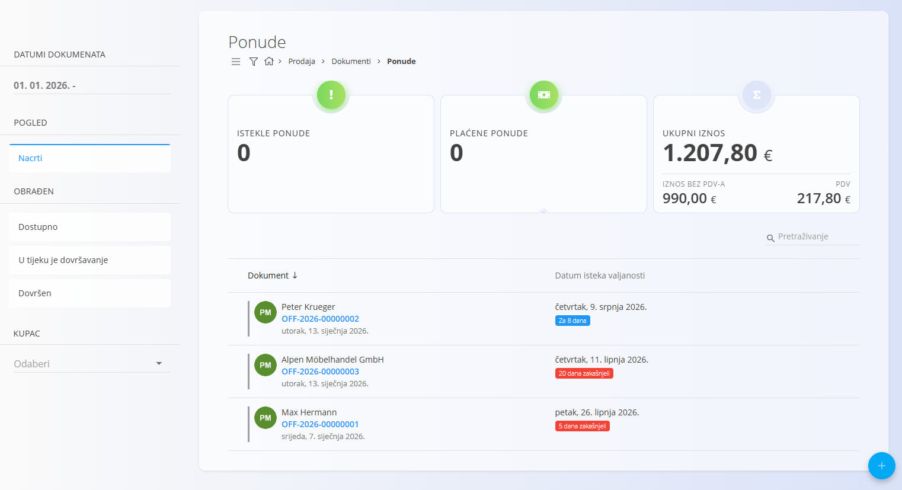
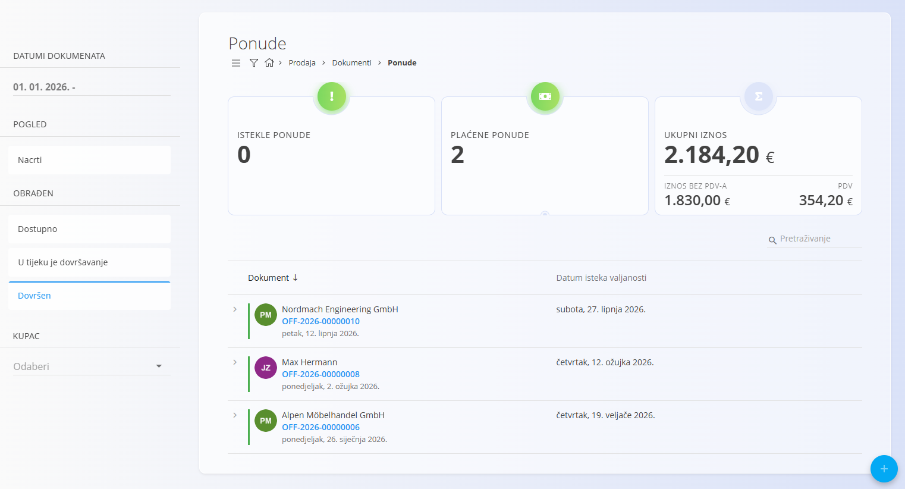
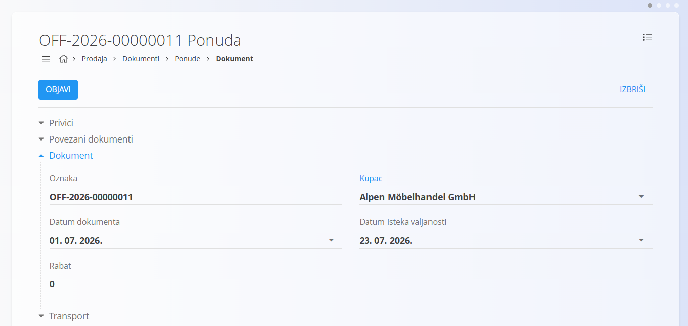
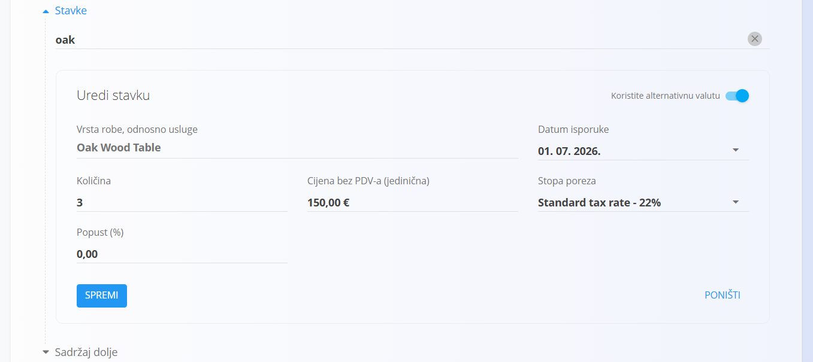
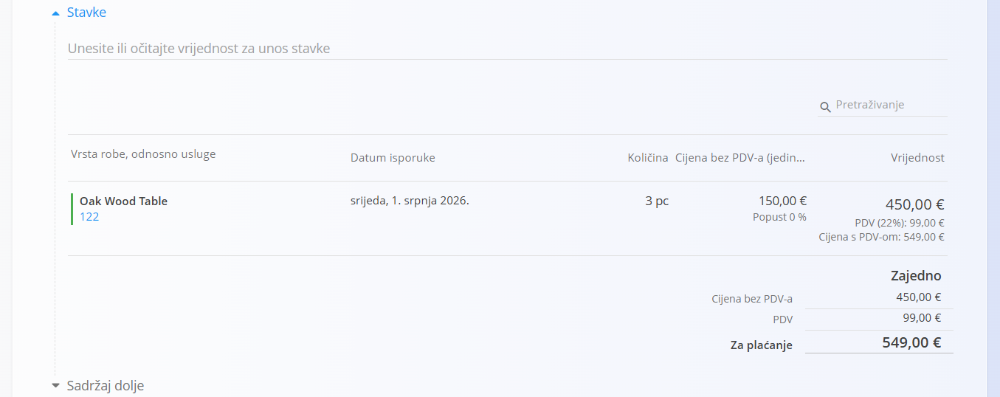
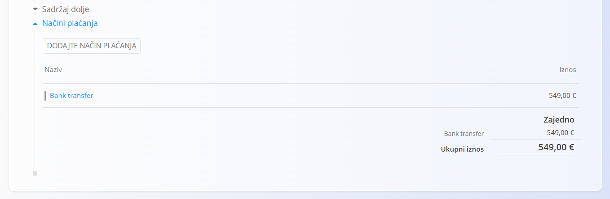
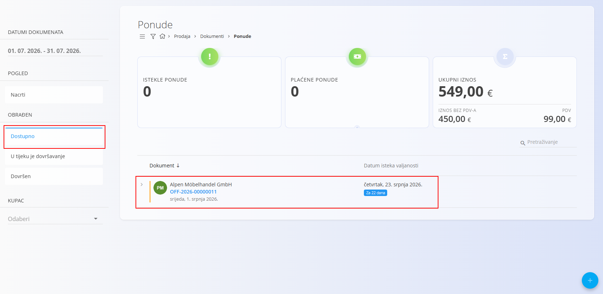
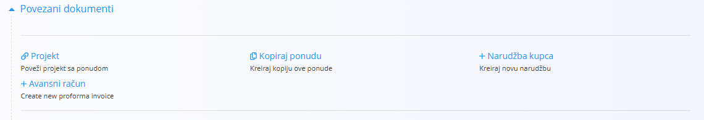
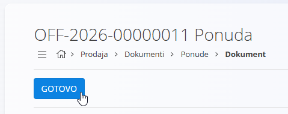

<!-- app_route: /sales/documents/offers -->
<!-- app_label: Ponude -->
<!-- canonical_source_url: https://github.com/Tom-PIT/Connected.Docs/blob/main/hr/Domene/Prodaja/Dokumenti/Ponude.md -->
<!-- canonical_source_title: Ponude -->

# Ponude

**Ponuda** je prodajni dokument koji se koristi za predstavljanje predložene cijene, količine i uvjeta isporuke kupcu prije potvrde prodaje.
Ponude omogućuju formalizaciju ponuda, usporedbu različitih cjenovnih opcija te jednostavan prijelaz na povezane dokumente, kao što su **Narudžbe kupca**, **Otpremnice** i **Izdani računi**.

Za pristup ovom dokumentu idite na **Prodaja / Dokumenti / Ponude** u [navigaciji](../../../Zajednicko/UI/Navigacija.md).

## Mjesto ponuda u prodajnom procesu

Tipičan tijek rada:

1. Izradite **Ponudu** i pošaljite je kupcu.
2. Nakon što je kupac prihvati, izradite iz nje [**Narudžbu kupca**](NarudzbeKupca.md) pomoću odjeljka [**Povezani dokumenti**](#povezani-dokumenti).
3. Iz narudžbe kupca nastavite daljnji poslovni proces — proizvodnju, nabavu, isporuku itd.
4. Na kraju izradite [**Otpremnicu**](Otpremnice.md), a zatim i [**Izdani račun**](IzlazniRacuni.md).

## Shema

<strong>Dokument</strong>

| Polje | Opis |
|-------|------|
| [**Oznaka**](../../../Zajednicko/UI/OznakeDokumenata.md) | Sistemski generirana oznaka ponude. |
| **Kupac** | Kupac kojem je ponuda namijenjena. Odabire se iz [Poslovnog imenika](../../../Zajednicko/Upravljanje/PoslovniImenik.md) (obavezno). |
| **Datum dokumenta** | Datum izrade ponude. |
| **Datum isteka valjanosti** | Datum do kojeg ponuda vrijedi (obavezno). |
| **Rabat** | Opcionalni ukupni popust primijenjen na cijelu ponudu (npr. unesite *2* za popust od **2 %**). |
| **Sadržaj gore** | Unaprijed pripremljeni uvodni tekst iz [Unaprijed pripremljenih tekstova](../../../Zajednicko/Upravljanje/UnaprijedPripremljeniTekstovi.md) (entitet: **Ponuda**). |
| **Sadržaj dolje** | Završni ili pravni tekst iz [Unaprijed pripremljenih tekstova](../../../Zajednicko/Upravljanje/UnaprijedPripremljeniTekstovi.md) (entitet: **Ponuda**). |
| [**Načini plaćanja**](../Upravljanje/NaciniPlacanja.md) | Načini plaćanja prikazani kupcu. |

<strong>Transport, Alternativna valuta i Dostava</strong>

| Polje | Opis |
|-------|------|
| [**Uvjeti isporuke**](../../../Zajednicko/Upravljanje/UvjetiIsporuke.md) | Uvjeti isporuke dogovoreni s kupcem. |
| [**Način transporta**](../../../Zajednicko/Upravljanje/VrstaTransporta.md) | Način transporta dogovoren s kupcem. |
| [**Alternativna valuta**](../../../Zajednicko/Upravljanje/Valute.md) | Alternativna valuta koja se koristi u dokumentu. |
| [**Tečaj**](../Upravljanje/DevizniTecajevi.md) | Tečaj alternativne valute u odnosu na zadanu valutu. |
| **Dostava** | Podaci o dostavnoj službi i adresi isporuke. |

<strong>Intrastat</strong>

| Polje | Opis |
|-------|------|
| [**Država otpreme**](../../../Zajednicko/Upravljanje/Drzave.md) | Država iz koje je roba otpremljena. Ova se vrijednost obično preuzima iz Intrastat konfiguracije robe. |
| [**Vrsta transakcije**](../../Racunovodstvo/Upravljanje/Intrastat/VrsteTransakcija.md) | Klasifikacija vrste transakcije koja se koristi za Intrastat izvještavanje. |
| [**Mjesto isporuke**](../../Racunovodstvo/Upravljanje/Intrastat/MjestaIsporuke.md) | Označava mjesto isporuke robe prema pravilima Intrastata. |

<strong>Stavke</strong>

| Polje | Opis |
|-------|------|
| [**Roba ili usluga**](../../RobaIUsluge/RobaIUsluge/RobaIUsluge.md) | Roba ili usluga koja se nudi. |
| **Datum isporuke** | Planirani datum isporuke stavke. |
| **Količina** | Količina robe ili usluge. |
| **Cijena bez PDV-a (jedinična)** | Jedinična cijena preuzeta iz konfiguracije robe ili odgovarajućeg [cjenika](../../RobaIUsluge/RobaIUsluge/Cjenici.md). |
| **Popust (%)** | Opcionalni popust primijenjen na pojedinu stavku. |
| [**Porezne stope**](../../../Zajednicko/Upravljanje/PorezneStope.md) | Primijenjena porezna stopa. |
| [**Intrastat – Tarifa**](../../Racunovodstvo/Upravljanje/Intrastat/Tarife.md) | Tarifni broj koji se koristi za Intrastat izvještavanje. |
| **Intrastat – Država podrijetla** | Država podrijetla robe. |
| **Intrastat – Neto težina (kg)** | Neto težina za statističko izvještavanje. |
| **Intrastat – Statistička vrijednost** | Statistička vrijednost robe za Intrastat izvještavanje. |
| **Vrijednost** | Ukupna vrijednost stavke (količina × jedinična cijena nakon primijenjenih popusta). |

## Upravljanje

### Stanja dokumenta

Dokument tijekom svog životnog ciklusa prolazi kroz sljedeća stanja:

* **Nacrt** – Dokument još nije objavljen. Sva polja mogu se uređivati.
* **Obrađen** – Dokument je obrađen te ga više nije moguće obrisati niti slobodno uređivati.

  * **Dostupno** – Dokument je spreman za daljnju obradu.
  * **U tijeku je dovršavanje** – Dokument je djelomično obrađen.
  * **Dovršen** – Sve aktivnosti povezane s dokumentom su završene.

### Pregled popisa

Popis ponuda prikazuje dokumente podijeljene na **Nacrte**, **Dostupne**, **U tijeku je dovršavanje** i **Dovršene**.

Na vrhu popisa prikazani su sljedeći pokazatelji:

* **Istekle ponude** – Ponude kojima je istekao rok valjanosti, a nisu prihvaćene ili dovršene.
* **Plaćene ponude** (interaktivno) – Prikazuje broj potpuno plaćenih ponuda. Klikom se prikazuju samo plaćene ponude.
* **Ukupni iznos** – Ukupna vrijednost svih ponuda uključenih u trenutni filter.

Filteri s lijeve strane omogućuju filtriranje prema **datumu dokumenta**, **statusu** i **kupcu**.

Primjer popisa **Dovršenih** ponuda:

## Radnje

### Izrada nove ponude

1. Kliknite [akcijski gumb](../../../Zajednicko/UI/AkcijskiGumb.md) za izradu nove ponude.

2. Ispunite polja **Kupac**, **Datum isteka valjanosti** i **Rabat** (nije obavezno).

   

3. Dodajte stavke u odjeljak **Stavke**. Upišite ili skenirajte **serijski broj**, **EAN** ili **naziv robe**.

   * Sustav prikazuje sve odgovarajuće robe i serijske brojeve. Ako postoji više rezultata, odaberite odgovarajući.

   

4. Kliknite **Spremi** kako biste potvrdili dodavanje stavke. Ponovite prethodni korak za dodavanje novih stavki.

   

   Za više informacija pogledajte [**Stavke dokumenta**](../../../Zajednicko/Koncepti/Stavke.md).

5. Odaberite [**Način plaćanja**](../Upravljanje/NaciniPlacanja.md).

   

6. Kada je dokument spreman, kliknite **Objavi** na vrhu stranice.

   

> [!NOTE]
> Klikom na **Objavi** dokument prelazi iz stanja **Nacrt** u stanje **Obrađen**, odnosno **Dostupno**.

### Uređivanje ponude

Kliknite bilo koju ponudu na popisu kako biste otvorili njezine detalje. Ponude u stanju **Nacrt** mogu se slobodno uređivati.

#### Privici

Odjeljak **Privici** služi za dodavanje i upravljanje datotekama povezanim s dokumentom, poput fotografija, PDF-ova, certifikata ili drugih priloga.

Za više informacija pogledajte [**Privici**](../../../Zajednicko/Koncepti/Privici.md).

#### Povezani dokumenti

Ponude omogućuju stvaranje povezanih dokumenata koji podržavaju cijeli poslovni proces.

> [!NOTE]
> Dostupne radnje ovise o vrsti i stanju dokumenta.

Za više informacija pogledajte [**Povezani dokumenti**](../../../Zajednicko/Koncepti/PovezaniDokumenti.md).

Najčešće radnje:

* **Projekt** – povezuje ponudu s projektom
* **Kopiraj ponudu** – izrađuje kopiju ponude
* **+ Avansni račun** – izrađuje novi avansni račun
* **+ Narudžba kupca** – izrađuje novu [Narudžbu kupca](NarudzbeKupca.md)

#### Alternativna valuta

Odjeljak **Alternativna valuta** omogućuje izdavanje dokumenta u valuti različitoj od zadane valute sustava. Tečajevi se preuzimaju iz šifranta [Devizni tečajevi](../Upravljanje/DevizniTecajevi.md).

Kada odaberete alternativnu valutu, sustav automatski preračunava sve iznose prema odabranom tečaju.

#### Transport i Intrastat

Ako je opcija **Intrastat** uključena u **Sustav / Konfiguracija / Intrastat**, prikazuju se dodatni odjeljci **Transport** i **Intrastat**.

* **Transport** služi za unos podataka o prijevozu robe.
* **Intrastat** služi za unos podataka potrebnih za Intrastat izvještavanje.

> [!NOTE]
> Dio Intrastat podataka automatski se preuzima iz šifarnika robe.

#### Dostava

Odjeljak **Dostava** određuje adresu na koju će roba biti isporučena. Podaci se automatski preuzimaju iz podataka kupca, ali ih je moguće promijeniti za pojedini dokument.

#### Stavke

Odjeljak **Stavke** sadrži robu ili usluge koje su uključene u ponudu zajedno s količinama, cijenama, porezima i popustima.

Dodavanje nove stavke:

Spremljena stavka:

> [!NOTE]
> Kada je Intrastat omogućen, u odjeljku **Stavke** prikazuju se dodatna polja potrebna za Intrastat izvještavanje.

### Dovršavanje ponude

Kada je ponuda u stanju **Dostupno**, kliknite **Gotovo**.

> [!NOTE]
> Ponuda se također automatski premješta u stanje **Dovršen** kada se iz nje putem **Povezanih dokumenata** izradi nova [**Narudžba kupca**](NarudzbeKupca.md).

### Brisanje ponude

Ponude u stanju **Nacrt** mogu se obrisati samo ako **ne sadrže nijednu stavku**.

Ako dokument sadrži stavke:

1. Otvorite stavku klikom na njezin serijski broj ili naziv.
2. Kliknite **Izbriši**.
3. Ponovite postupak za sve stavke.

Nakon što su sve stavke uklonjene, možete obrisati dokument.

> [!NOTE]
> Ponudu nije moguće obrisati ako je povezana s drugim dokumentom.

## Izbornik

Izbornik omogućuje pristup dodatnim radnjama dostupnim na ovoj stranici.

Dostupne radnje:

* **Ispis**
* **Izvoz u PDF**
* **Pošalji e-poštom**
* **Vrati u nacrt**

Za više informacija pogledajte [**Radnje izbornika**](../../../Zajednicko/Koncepti/RadnjeIzbornika.md). 
