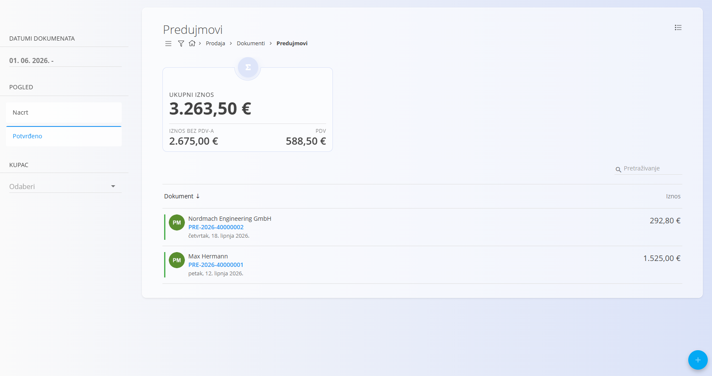
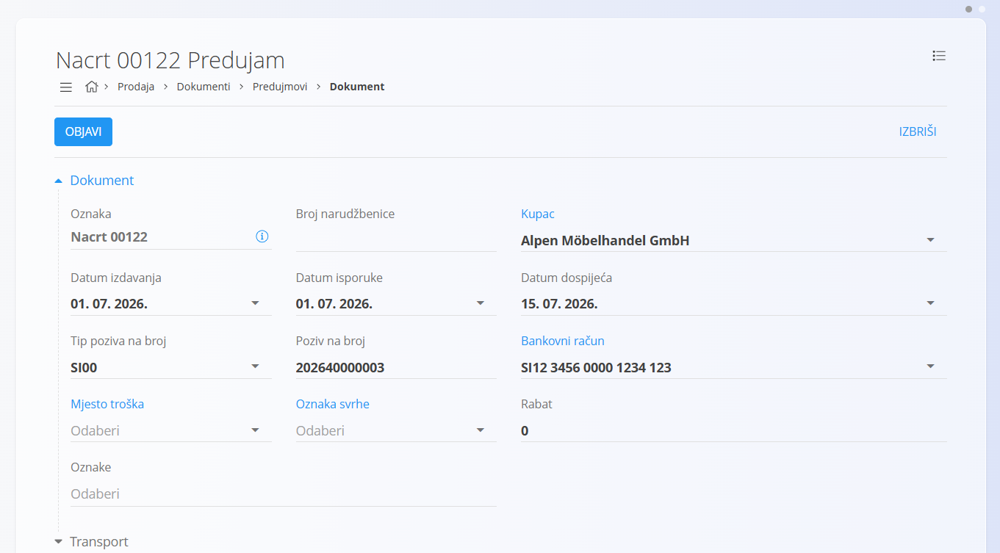
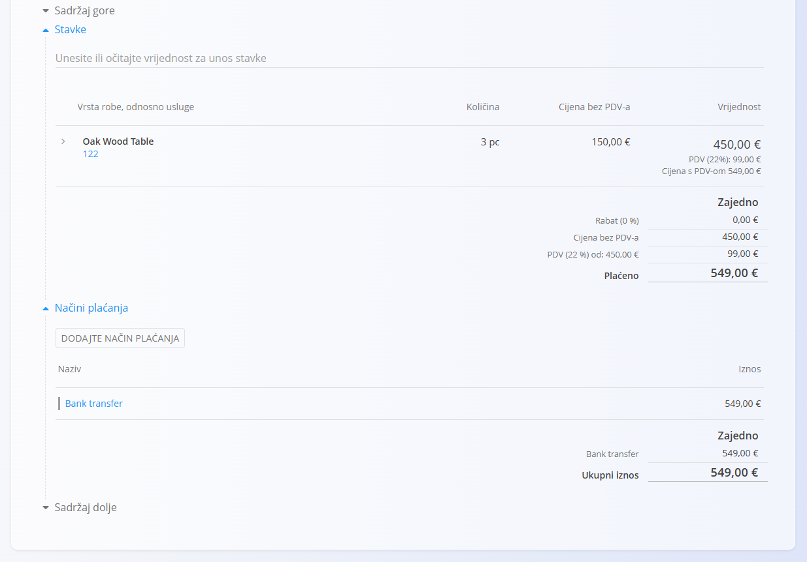
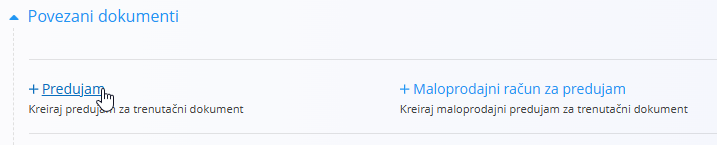
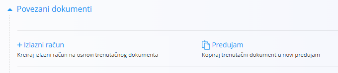

<!-- app_route: /sales/documents/prepayments -->
<!-- app_label: Predujmovi -->
<!-- canonical_source_url: https://github.com/Tom-PIT/Connected.Docs/blob/main/hr/Domene/Prodaja/Dokumenti/Predujmovi.md -->
<!-- canonical_source_title: Predujmovi -->

# Predujmovi

**Predujam** je prodajni dokument koji se koristi kada kupac unaprijed plaća dogovoreni iznos prije isporuke robe ili usluga. Evidentira primljena sredstva koja se kasnije mogu u cijelosti ili djelomično iskoristiti na [izlaznim računima](IzlazniRacuni.md). Predujmovi se mogu kreirati ručno ili izravno iz obrađenog [**avansnog računa**](AvansniRacuni.md), čime se povezuju s prodajnim procesom.

Za pristup ovom dokumentu idite na **Prodaja / Dokumenti / Predujmovi**.

## Kako se predujmovi uklapaju u prodajni proces

Predujmovi se koriste kada kupac unaprijed plati dio dogovorenog iznosa. U standardni prodajni proces uključuju se na sljedeći način:

1. Kreirajte **[Ponudu](Ponude.md)** i pretvorite je u [**avansni račun**](AvansniRacuni.md).
2. Obavite avansni račun kako bi postao dostupan za kreiranje predujma.
3. Kreirajte **Predujam** – ručno ili putem **Povezani dokumenti → + Predujam** na obrađenom avansnom računu.
4. Evidentirajte primljeni iznos i objavite predujam (prelazi u stanje **Potvrđeno**).
5. Iskoristite predujam prilikom izdavanja **[izlaznog računa](IzlazniRacuni.md)** kako biste u cijelosti ili djelomično umanjili iznos za plaćanje.
6. Stornirajte predujam ako je potrebno otkazati ili vratiti avansno plaćanje (pogledajte **[Storna](../../Logistika/Dokumenti/Storno.md)**).

Predujmovi evidentiraju primljena sredstva i ne utječu na stanje zaliha.

## Shema

<strong>Dokument</strong>

| Polje | Opis |
|-------|------|
| [**Oznaka**](../../../Zajednicko/UI/OznakeDokumenata.md) | Sistemski generirana oznaka predujma. |
| **Broj narudžbenice** | Opcionalna referenca na broj narudžbenice kupca. |
| **Kupac** | Kupac koji plaća predujam, odabire se iz [**Poslovnog imenika**](../../../Zajednicko/Upravljanje/PoslovniImenik.md) (obavezno). |
| **Datum izdavanja** | Datum izdavanja dokumenta predujma. |
| **Datum isporuke** | Planirani datum isporuke povezan s prodajom. |
| **Datum dospijeća** | Rok za uplatu predujma (obavezno). |
| **Tip poziva na broj** | Vrsta poziva na broj koja se koristi na platnim dokumentima (obavezno). |
| **Poziv na broj** | Poziv na broj generiran prema odabranom tipu. |
| [**Bankovni račun**](../Upravljanje/BankovniRacuniOrganizacije.md) | Bankovni račun na koji se zaprima predujam (obavezno). |
| [**Mjesto troška**](../../../Zajednicko/Upravljanje/MjestaTroska.md) | Opcionalna dodjela mjestu troška. |
| **Oznaka svrhe** | Opcionalna oznaka svrhe plaćanja. |
| **Rabat** | Ukupni rabat primijenjen na iznos predujma. |
| **Sadržaj gore** | Uvodni tekst iz [**Unaprijed pripremljenih tekstova**](../../../Zajednicko/Upravljanje/UnaprijedPripremljeniTekstovi.md). |
| **Sadržaj dolje** | Završni ili pravni tekst iz [**Unaprijed pripremljenih tekstova**](../../../Zajednicko/Upravljanje/UnaprijedPripremljeniTekstovi.md). |
| **Način plaćanja** | Način plaćanja odabran iz [**Načina plaćanja**](../Upravljanje/NaciniPlacanja.md). |

<strong>Transport, Alternativna valuta i Dostava</strong>

| Polje | Opis |
|-------|------|
| [**Uvjeti isporuke**](../../../Zajednicko/Upravljanje/UvjetiIsporuke.md) | Uvjeti isporuke dogovoreni s kupcem. |
| [**Način transporta**](../../../Zajednicko/Upravljanje/VrstaTransporta.md) | Način transporta dogovoren s kupcem. |
| [**Alternativna valuta**](../../../Zajednicko/Upravljanje/Valute.md) | Alternativna valuta koja se koristi u dokumentu. |
| [**Tečaj**](../Upravljanje/DevizniTecajevi.md) | Tečaj alternativne valute u odnosu na zadanu valutu. |
| **Dostava** | Podaci o dostavnoj službi i adresi isporuke. |

<strong>Intrastat</strong>

| Polje | Opis |
|-------|------|
| [**Država otpreme**](../../../Zajednicko/Upravljanje/Drzave.md) | Država iz koje je roba otpremljena. Ova se vrijednost obično preuzima iz Intrastat konfiguracije materijala. |
| [**Vrsta transakcije**](../../Racunovodstvo/Upravljanje/Intrastat/VrsteTransakcija.md) | Klasifikacija vrste transakcije za Intrastat izvještavanje. |
| [**Mjesto isporuke**](../../Racunovodstvo/Upravljanje/Intrastat/MjestaIsporuke.md) | Označava mjesto isporuke robe prema pravilima Intrastata. |

<strong>Stavke</strong>

| Polje | Opis |
|-------|------|
| [**Roba ili usluga**](../../RobaIUsluge/RobaIUsluge/RobaIUsluge.md) | Roba ili usluga odabrana za stavku. |
| **Naziv stavke** | Naziv odabrane stavke (može se uređivati ako je dopušteno). |
| [**Porezna stopa**](../../../Zajednicko/Upravljanje/PorezneStope.md) | Porezna stopa primijenjena na stavku. |
| **Cijena bez PDV-a (jedinična)** | Jedinična cijena bez PDV-a. |
| **Cijena s PDV-om (jedinična)** | Jedinična cijena s PDV-om (izračunava se automatski). |
| **Količina** | Količina odabrane robe ili usluge. |
| **Popust (%)** | Postotak popusta primijenjen na stavku. |
| **Vrijednost bez PDV-a** | Ukupna vrijednost bez PDV-a. |
| **Vrijednost s PDV-om** | Ukupna vrijednost s PDV-om. |
| **Vrsta obračuna PDV-a** | Određuje način obračuna PDV-a kada vrijede posebna pravila oporezivanja. |
| **Opis** | Dodatni opis stavke. |
| **Koristi alternativnu valutu** | Omogućuje iskazivanje stavke u alternativnoj valuti definiranoj na dokumentu. |

<strong>Glavna knjiga i Intrastat</strong>

| Polje | Opis |
|-------|------|
| **Glavna knjiga - Konto prihoda / rashoda** | Konto glavne knjige za knjiženje vrijednosti stavke. |
| **Glavna knjiga - Konto poreza** | Konto glavne knjige za knjiženje poreza. |
| [**Intrastat – Tarifa**](../../Racunovodstvo/Upravljanje/Intrastat/Tarife.md) | Tarifni broj za Intrastat izvještavanje. |
| **Intrastat – Država podrijetla** | Država podrijetla robe. |
| **Intrastat – Neto težina (kg)** | Neto težina za statističko izvještavanje. |
| **Intrastat – Statistička vrijednost** | Statistička vrijednost robe za Intrastat izvještavanje. |

## Upravljanje

Predujmovi mogu biti u stanjima **Nacrt** i **Potvrđeno**.

### Pregled popisa

Popis predujmova može se filtrirati prema:

- **Datumima dokumenta**
- **Pogledu** (Nacrt / Potvrđeno)
- **Kupcu**

Svaki red prikazuje:

- Naziv kupca
- Oznaku dokumenta
- Datum dokumenta
- Iznos predujma

Dokumenti u stanju **Nacrt** mogu se uređivati, dok su **Potvrđeni** predujmovi konačni osim ako nisu stornirani.

## Radnje

### Kreiranje novog predujma

1. Kliknite [akcijski gumb](../../../Zajednicko/UI/AkcijskiGumb.md) za kreiranje novog predujma.

   
   
2. Ispunite obavezna polja zaglavlja: **Kupac** (iz [**Poslovnog imenika**](../../../Zajednicko/Upravljanje/PoslovniImenik.md)), **Datum dospijeća**, **Tip poziva na broj**, **Poziv na broj** i **[Bankovni račun](../Upravljanje/BankovniRacuniOrganizacije.md)**.

3. Dodajte stavke u odjeljku **Stavke**. Upišite ili skenirajte **serijski broj**, **EAN** ili **naziv robe/materijala** u traku za unos stavki.
   - Sustav prikazuje odgovarajuću robu i materijale.

4. Spremite dodane stavke.

   Za više informacija o radu sa stavkama dokumenta pogledajte [**Stavke dokumenta**](../../../Zajednicko/Koncepti/Stavke.md).

5. Odaberite **[Način plaćanja](../Upravljanje/NaciniPlacanja.md)**.

    

6. Kada je dokument spreman, kliknite **Objavi** pri vrhu stranice kako biste dovršili predujam. Dokument prelazi u stanje **Potvrđeno** i postaju dostupne dodatne radnje.

> [!NOTE]
> Klikom na **Objavi** dokument se potvrđuje i prelazi iz stanja **Nacrt** u stanje **Potvrđeno**.
>
> Predujam se također može kreirati iz obrađenog [**avansnog računa**](AvansniRacuni.md) putem **+ Predujam**.
>
> 

### Uređivanje predujma

Predujam u stanju **Nacrt** može se uređivati sve dok nije objavljen.

Moguće je mijenjati:

- Polja zaglavlja (kupac, datumi, poziv na broj, bankovni račun)
- Alternativnu valutu
- Transport
- Podatke o dostavi
- Stavke (roba, količine, cijene)
- Načine plaćanja
- Sadržaj dokumenta (gore i dolje)

#### Privici

Koristite odjeljak **Privici** za prijenos i upravljanje datotekama povezanim s dokumentom, kao što su fotografije, PDF dokumenti, certifikati ili druga prateća dokumentacija.

Za detaljne upute pogledajte [**Privici**](../../../Zajednicko/Koncepti/Privici.md).

#### Povezani dokumenti

Odjeljak **Povezani dokumenti** omogućuje kreiranje povezanih dokumenata te prikazuje sve dokumente koji su već povezani s trenutnim dokumentom.

Za više informacija o povezivanju dokumenata, sljedivosti i kreiranju povezanih dokumenata pogledajte [**Povezani dokumenti**](../../../Zajednicko/Koncepti/PovezaniDokumenti.md).

> [!NOTE]
> - Dostupne radnje u odjeljku **Povezani dokumenti** ovise o vrsti dokumenta i njegovom statusu.
> - Predujmovi se mogu djelomično ili u cijelosti iskoristiti prilikom kreiranja izlaznog računa.

Dostupne radnje mogu uključivati:

- **[+ Izlazni račun](IzlazniRacuni.md)** – Kreira izlazni račun koristeći predujam.
- **Predujam** – Kopira trenutni dokument u novi predujam.

#### Alternativna valuta

Odjeljak **Alternativna valuta** omogućuje iskazivanje cijena u valuti različitoj od zadane valute sustava. Koristi se prvenstveno kod međunarodne prodaje. Tečajevi se preuzimaju iz šifrarnika [Devizni tečajevi](../Upravljanje/DevizniTecajevi.md).

Nakon odabira alternativne valute sve cijene na dokumentu automatski se preračunavaju prema odabranom tečaju.

#### Transport i Intrastat

Ako je u **Sustav / Konfiguracija / Intrastat** omogućena opcija **Obveznik**, na dokumentu postaju dostupni dodatni odjeljci.

- **Transport** – Koristi se za unos podataka o prijevozu robe.
- **Intrastat** – Koristi se za unos podataka potrebnih za Intrastat izvještavanje. Ovaj je odjeljak dostupan samo kada je Intrastat omogućen.

> [!NOTE]
> Većina Intrastat podataka preuzima se iz konfiguracije robe (Intrastat postavke materijala), poput države otpreme ili vrste transakcije.

#### Dostava

Odjeljak **Dostava** određuje mjesto isporuke robe. Podaci se automatski preuzimaju iz podataka kupca, ali ih je moguće promijeniti za pojedini dokument.

Promjene vrijede samo za trenutni dokument i ne mijenjaju podatke kupca.

#### Stavke

Stavke predstavljaju robu ili usluge na dokumentu te definiraju njihove količine, cijene, poreze i popuste.

##### Glavna knjiga

Odjeljak **Glavna knjiga** određuje na koje će se konta knjižiti vrijednost stavke i pripadajući porez.

Prilikom knjiženja dokumenta:

- Neto vrijednost knjiži se na odabrani konto prihoda ili rashoda.
- Iznos poreza knjiži se na odabrani konto poreza.
- Sustav automatski kreira odgovarajuća knjiženja u glavnoj knjizi.

Dostupna konta definirana su u [**Kontnom planu**](../../Racunovodstvo/Upravljanje/GlavnaKnjiga/KontniPlan.md).

##### Intrastat

Kada je Intrastat omogućen i dokument uključuje kupca iz druge države članice EU, na obrascu za uređivanje stavke prikazuje se dodatni odjeljak **Intrastat**.

Ova su polja obavezna za prekogranične transakcije kada je organizacija Intrastat obveznik.

### Brisanje predujma

Dokument u stanju **Nacrt** može se obrisati **samo ako ne sadrži stavke**.

Ako dokument još uvijek sadrži stavke:

1. Otvorite izbornik dokumenta (gornji desni kut).
2. Kliknite **Izbriši sve stavke**.
3. Kada dokument više nema stavki, kliknite **Izbriši**.

Ako želite obrisati samo jednu stavku:

1. Kliknite na stavku kako biste otvorili njezino uređivanje.
2. Kliknite **Izbriši**.

> [!NOTE]
> Potvrđeni predujmovi **ne mogu se obrisati**, ali ih je moguće [stornirati](../../Logistika/Dokumenti/Storno.md) ili **vratiti u nacrt**.

## Izbornik

Izbornik sadrži dodatne radnje dostupne na ovoj stranici.

Dostupne radnje:

- **Ispis**
- **Izvoz u PDF**
- **Pošalji kao email**
- **Izbriši sve stavke** (samo za nacrte)
- **[Storniraj dokument](../../Logistika/Dokumenti/Storno.md)**
- **Vrati u nacrt**

Za više informacija pogledajte [**Radnje izbornika**](../../../Zajednicko/Koncepti/RadnjeIzbornika.md).

> [!NOTE]
> Storno poništava financijski učinak potvrđenog predujma. Više informacija potražite u dokumentu **[Storna](../../Logistika/Dokumenti/Storno.md)**.