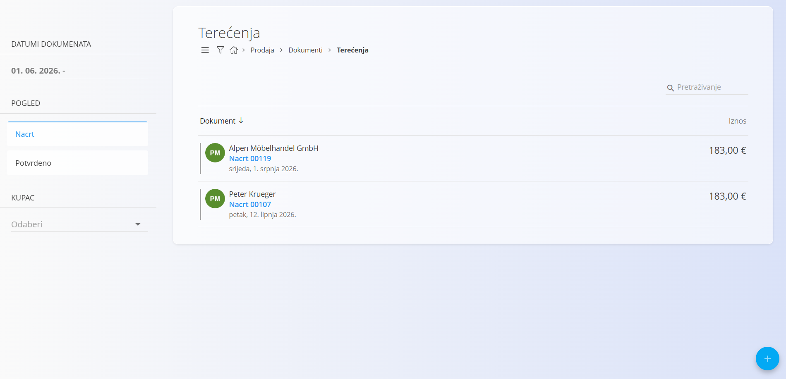
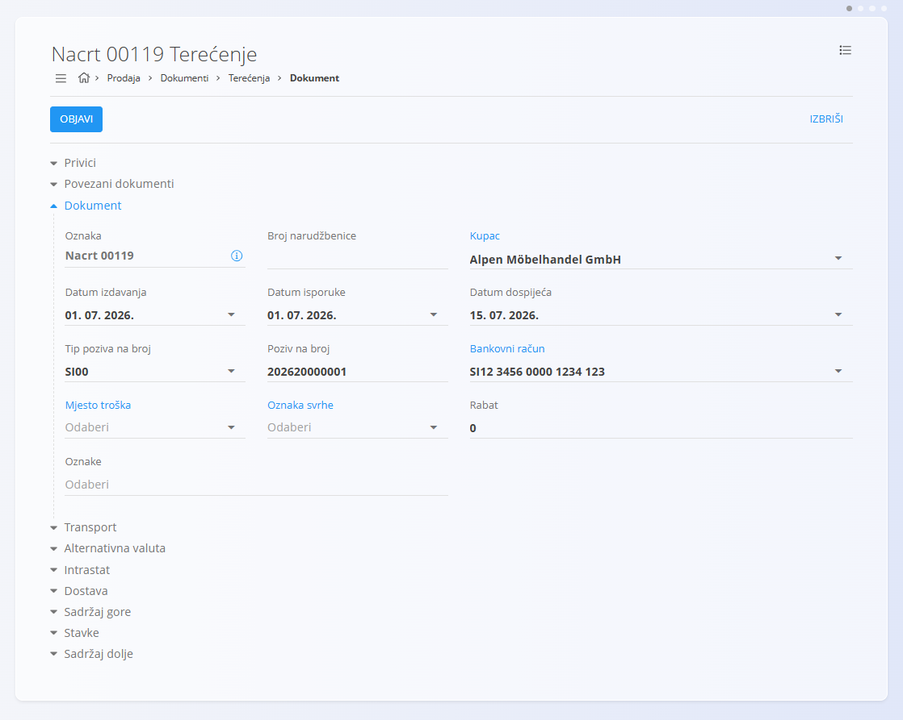
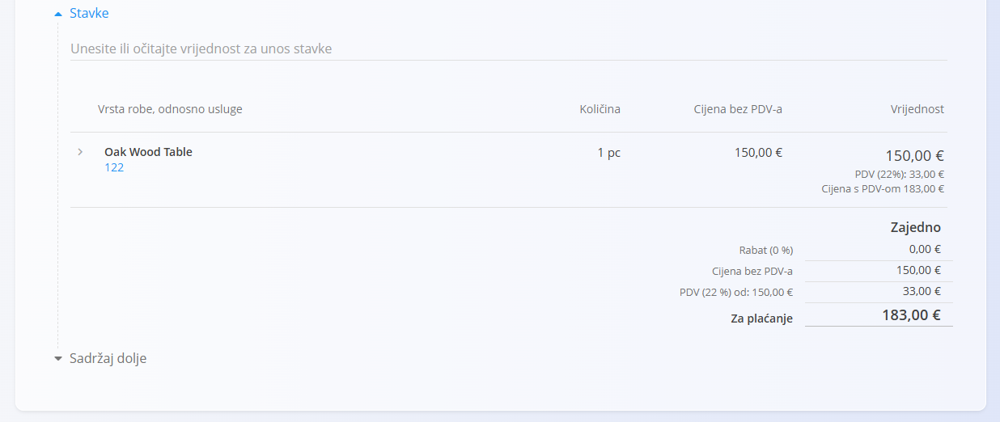

<!-- app_route: /sales/documents/debit-notes -->
<!-- app_label: Terećenja -->
<!-- canonical_source_url: https://github.com/Tom-PIT/Connected.Docs/blob/main/hr/Prodaja/Dokumenti/Terecenja.md -->
<!-- canonical_source_title: Terećenja -->

# Terećenja

**Terećenje** je prodajni dokument koji se koristi za **povećanje** iznosa koji kupac duguje nakon što je izlazni račun već izdan. Najčešće se izrađuje kada je potrebno obračunati dodatne troškove, ispraviti cijenu ili naplatiti usluge koje nisu bile uključene u izvorni račun.

Terećenja povećavaju otvoreno dugovanje kupca. Za umanjenja ili povrate pogledajte **[Odobrenja](Odobrenja.md)**.

> [!TIP]
> Trenutni pregled **terećenja i odobrenja** za svakog kupca možete jednostavno pregledati u prikazu **[Kartice tvrtki](../Pogledi/KarticeTvrtki.md)**.

Za pristup ovom dokumentu idite na **Prodaja / Dokumenti / Terećenja**.

## Kako se terećenja uklapaju u prodajni proces

Terećenja se koriste nakon što je izlazni račun već izdan:

1. Izdajte **[Izlazni račun](IzlazniRacuni.md)** za isporučenu robu ili usluge.
2. Utvrdite potrebu za dodatnim terećenjem ili ispravkom koji povećava iznos računa.
3. Izradite **Terećenje** povezano s izlaznim računom ili kao samostalni dokument.
4. Pregledajte i objavite terećenje kako bi prešlo u status **Potvrđeno**.
5. Terećeni iznos povećava otvoreno stanje kupca te se uključuje u računovodstvene evidencije.
6. Ako je terećenje izrađeno pogreškom, stornirajte ga (pogledajte **[Storna](../../Logistika/Dokumenti/Storna.md)**).

Terećenja utječu samo na računovodstvo i ne utječu na stanje zaliha.

## Shema

<strong>Dokument</strong>

| Polje | Opis |
|-------|------|
| [**Oznaka**](../../../Zajednicko/UI/OznakeDokumenata.md) | Sistemski generirana oznaka terećenja. |
| **Broj narudžbenice** | Opcionalna referenca na broj narudžbenice kupca. |
| **Kupac** | Kupac kojem je terećenje namijenjeno, odabire se iz [**Poslovnog imenika**](../../../Zajednicko/Upravljanje/PoslovniImenik.md) (obavezno). |
| **Datum izdavanja** | Datum izdavanja terećenja. |
| **Datum isporuke** | Izvorni datum isporuke robe ili usluge s računa. |
| **Datum dospijeća** | Datum dospijeća terećenja (obavezno). |
| **Tip poziva na broj** | Vrsta poziva na broj koja se koristi na dokumentu (obavezno). |
| **Poziv na broj** | Poziv na broj prema odabranom tipu poziva na broj. |
| [**Bankovni račun**](../Upravljanje/BankovniRacuniOrganizacije.md) | Bankovni račun koji se koristi za knjiženje (obavezno). |
| [**Mjesto troška**](../../../Zajednicko/Upravljanje/MjestaTroska.md) | Opcionalno mjesto troška za knjiženje dokumenta. |
| **Oznaka svrhe** | Opcionalna oznaka svrhe plaćanja. |
| **Rabat** | Ukupni rabat primijenjen na cijelo terećenje. |
| **Oznake** | Oznake dodijeljene dokumentu radi lakše organizacije i pretraživanja. |
| **Sadržaj gore** | Uvodni tekst iz [**Unaprijed pripremljenih tekstova**](../../../Zajednicko/Upravljanje/UnaprijedPripremljeniTekstovi.md). |
| **Sadržaj dolje** | Završni ili pravni tekst iz [**Unaprijed pripremljenih tekstova**](../../../Zajednicko/Upravljanje/UnaprijedPripremljeniTekstovi.md). |

<strong>Transport, Alternativna valuta i Dostava</strong>

| Polje | Opis |
|-------|------|
| [**Uvjeti isporuke**](../../../Zajednicko/Upravljanje/UvjetiIsporuke.md) | Uvjeti isporuke dogovoreni s kupcem. |
| [**Način transporta**](../../../Zajednicko/Upravljanje/VrstaTransporta.md) | Način transporta koji se koristi za isporuku robe. |
| [**Alternativna valuta**](../../../Zajednicko/Upravljanje/Valute.md) | Alternativna valuta koja se koristi u dokumentu. |
| [**Tečaj**](../Upravljanje/DevizniTecajevi.md) | Tečaj alternativne valute u odnosu na zadanu valutu. |
| **Dostava** | Podaci o dostavnoj službi i adresi isporuke. |

<strong>Intrastat</strong>

| Polje | Opis |
|-------|------|
| [**Država otpreme**](../../../Zajednicko/Upravljanje/Drzave.md) | Država iz koje je roba otpremljena. Ova se vrijednost obično preuzima iz Intrastat konfiguracije robe. |
| [**Vrsta transakcije**](../../Racunovodstvo/Upravljanje/Intrastat/VrsteTransakcija.md) | Klasifikacija vrste transakcije za Intrastat izvještavanje. |
| [**Mjesto isporuke**](../../Racunovodstvo/Upravljanje/Intrastat/MjestaIsporuke.md) | Označava mjesto isporuke robe prema pravilima Intrastata. |

<strong>Stavke</strong>

| Polje | Opis |
|-------|------|
| [**Roba ili usluga**](../../RobaIUsluge/RobaIUsluge/RobaIUsluge.md) | Roba ili usluga koja se dodatno terećuje. |
| **Datum isporuke** | Datum isporuke povezan sa stavkom. |
| **Količina** | Količina robe ili usluge koja se dodatno naplaćuje. |
| **Cijena bez PDV-a** | Jedinična cijena preuzeta iz izvornog dokumenta ili konfiguracije robe. |
| **Vrijednost** | Ukupna vrijednost stavke, uključujući porezne iznose i konačni iznos s PDV-om. |

## Upravljanje

Terećenja mogu imati statuse **Nacrt** i **Potvrđeno**.

### Pregled

Popis terećenja može se filtrirati prema:

- **Datumima dokumenta**
- **Pogledu** (Nacrt / Potvrđeno)
- **Kupcu**

Svaki red prikazuje:

- Kupca
- Oznaku dokumenta
- Datum dokumenta
- Iznos terećenja

Dokumenti u statusu **Nacrt** mogu se uređivati, dok su **Potvrđena** terećenja zaključana osim u slučaju storna.

## Radnje

### Izraditi novo terećenje

Terećenje se može izraditi na dva načina:

- putem [akcijskog gumba](../../../Zajednicko/UI/AkcijskiGumb.md) na zaslonu **Terećenja**
- iz postojećeg **[Izlaznog računa](IzlazniRacuni.md)** putem **Povezani dokumenti → + Terećenje**

Nakon pokretanja novog terećenja:

1. Izradite novi dokument u statusu **Nacrt** koristeći jedan od navedenih načina.

   

2. Ispunite obavezna zaglavlja dokumenta, kao što su **Kupac**, **Datumi**, **Tip poziva na broj** i **Bankovni račun**.

3. Dodajte stavke u odjeljku **Stavke** upisivanjem ili skeniranjem naziva robe, **EAN** oznake ili serijskog broja.
   - Sustav prikazuje odgovarajuće stavke za odabir.

   

4. Po potrebi uredite količine i iznose te kliknite **Spremi** kako biste potvrdili stavku.

   Za više informacija pogledajte **[Stavke dokumenta](../../../Zajednicko/Koncepti/StavkeDokumenta.md)**.

5. Kada je dokument spreman, kliknite **Objavi**.

   Dokument prelazi iz statusa **Nacrt** u **Potvrđeno** i postaje financijski važeći.

> [!NOTE]
> Nakon objave terećenje više nije moguće uređivati. Sve ispravke izvode se storno dokumentom.

#### Stavke

Stavke određuju robu ili usluge koje se dodatno naplaćuju, njihove količine, cijene, poreze i rabate. Svaka stavka predstavlja jednu robu ili uslugu.

Spremljena stavka:

##### Knjiga

Odjeljak **Knjiga** određuje način knjiženja dokumenta u glavnu knjigu. Definira konta koja će se koristiti za knjiženje prihoda, rashoda i poreza prilikom knjiženja dokumenta.

Prilikom knjiženja:

- neto iznos knjiži se na odabrano konto prihoda ili rashoda
- iznos poreza knjiži se na odabrano konto poreza
- sustav automatski kreira odgovarajuća knjiženja u glavnoj knjizi.

Dostupna konta definirana su u **[Kontnom planu](../../Racunovodstvo/Upravljanje/GlavnaKnjiga/KontniPlan.md)**.

##### Intrastat

Ako je omogućeno Intrastat izvještavanje i dokument uključuje kupca iz druge države članice Europske unije, u obrascu za uređivanje stavke prikazuje se dodatni odjeljak **Intrastat**.

Ovaj odjeljak sadrži statističke podatke potrebne za Intrastat izvještavanje.

Za prekogranične transakcije unutar Europske unije ta su polja obavezna ako je organizacija obveznik Intrastata.

### Urediti terećenje

Uređivati se mogu samo terećenja u statusu **Nacrt**.

Moguće je mijenjati:

- podatke dokumenta
- alternativnu valutu
- transport
- podatke dostave
- stavke
- sadržaj gore i sadržaj dolje

Terećenja u statusu **Potvrđeno** nije moguće uređivati.

#### Privici

Odjeljak **Privici** omogućuje dodavanje i upravljanje datotekama povezanima s dokumentom, kao što su fotografije, PDF dokumenti, certifikati ili druga prateća dokumentacija.

Za detaljne upute pogledajte **[Privici](../../../Zajednicko/Koncepti/Privici.md)**.

#### Povezani dokumenti

Odjeljak **Povezani dokumenti** omogućuje povezivanje postojećeg **Izlaznog računa**.

Nakon objave dokumenta odjeljak **Povezani dokumenti** više nije dostupan.

Za više informacija pogledajte **[Povezani dokumenti](../../../Zajednicko/Koncepti/PovezaniDokumenti.md)**.

#### Alternativna valuta

Odjeljak **Alternativna valuta** omogućuje iskazivanje cijena u valuti različitoj od zadane valute sustava. Najčešće se koristi kod međunarodne prodaje.

Tečajevi se preuzimaju iz šifrarnika **[Devizni tečajevi](../Upravljanje/DevizniTecajevi.md)**.

Nakon odabira alternativne valute sve cijene u dokumentu automatski se preračunavaju prema odabranom tečaju.

#### Transport i Intrastat

Ako je opcija **Intrastat** postavljena na **Obveznik** u **Sustav / Konfiguracija / Intrastat**, u dokumentu postaju dostupni dodatni odjeljci.

- **Transport** – koristi se za evidentiranje podataka o načinu prijevoza robe.
- **Intrastat** – koristi se za unos podataka potrebnih za Intrastat izvještavanje.

> [!NOTE]
> Dio Intrastat podataka automatski se preuzima iz šifrarnika robe (Intrastat konfiguracija), primjerice država otpreme ili vrsta transakcije. Te vrijednosti nije moguće proizvoljno mijenjati na dokumentu.

### Izbrisati terećenje

Dokumenti u statusu **Nacrt** mogu se izbrisati samo ako ne sadrže nijednu stavku.

Ako dokument još uvijek sadrži stavke:

1. Otvorite izbornik dokumenta.
2. Odaberite **Izbriši sve stavke**.
3. Nakon što dokument više ne sadrži stavke kliknite **Izbriši**.

Ako želite ukloniti samo pojedinu stavku:

1. Otvorite stavku klikom na njezin naziv.
2. Kliknite **Izbriši**.

> [!NOTE]
> Potvrđena terećenja nije moguće izbrisati, ali ih je moguće **stornirati** ili **vratiti u nacrt**.

## Izbornik

Izbornik omogućuje dodatne radnje nad dokumentom.

Dostupne radnje:

- **Ispis**
- **Izvoz**
- **Pošalji kao email**
- **Izbriši sve stavke** (samo za nacrte)
- **Storniraj dokument**
- **Vrati u nacrt** (ako je omogućeno)

> [!NOTE]
> Storniranje terećenja poništava njegov financijski učinak. Za više informacija pogledajte **[Storna](../../Logistika/Dokumenti/Storna.md)**.

Za više informacija o radnjama izbornika pogledajte **[Radnje izbornika](../../../Zajednicko/Koncepti/RadnjeIzbornika.md)**.

