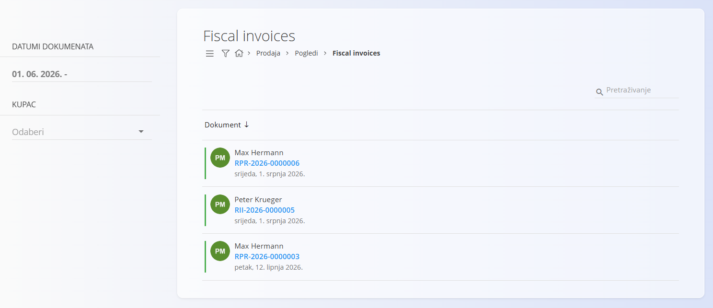

<!-- app_route: /sales/views/fiscal-invoices -->
<!-- app_label: Fiskalni računi -->
<!-- canonical_source_url: https://github.com/Tom-PIT/Connected.Docs/blob/main/hr/Domene/Prodaja/Pogledi/FiskalniRacuni.md -->
<!-- canonical_source_title: Fiskalni računi -->

# Fiskalni računi

Pogled **Fiskalni računi** prikazuje popis **izdanih maloprodajnih računa** koji su fiskalizirani i usklađeni s poreznim propisima.

Ovi se računi najčešće koriste za **maloprodajnu (B2C) prodaju** te se prijavljuju poreznim tijelima u skladu s pravilima fiskalizacije.

Za pristup ovom dokumentu idite na **Prodaja / Pogledi / Fiskalni računi** u [navigaciji](../../../Zajednicko/UI/Navigacija.md).

## Popis fiskalnih računa

Popis prikazuje sve fiskalne račune koji odgovaraju odabranim filtrima.

Za svaki račun prikazani su:

- **Broj računa**
- **Kupac**
- **Datum izdavanja**

Boja s lijeve strane svakog zapisa označava status računa:

- **Zelena** — račun je uspješno fiskaliziran i prijavljen poreznim tijelima.
- **Narančasta** — podaci još nisu poslani poreznim tijelima.

### Filtri

Filtri s lijeve strane omogućuju sužavanje popisa:

- **Datumi dokumenata** — filtrira račune prema rasponu datuma.
- **Kupac** — prikazuje račune odabranog kupca.

## Radnje

### Pregled pojedinosti

Kliknite na **broj računa** za otvaranje detaljnog prikaza fiskalnog računa ([maloprodajni račun](../Dokumenti/MaloprodajniRacuni.md)).