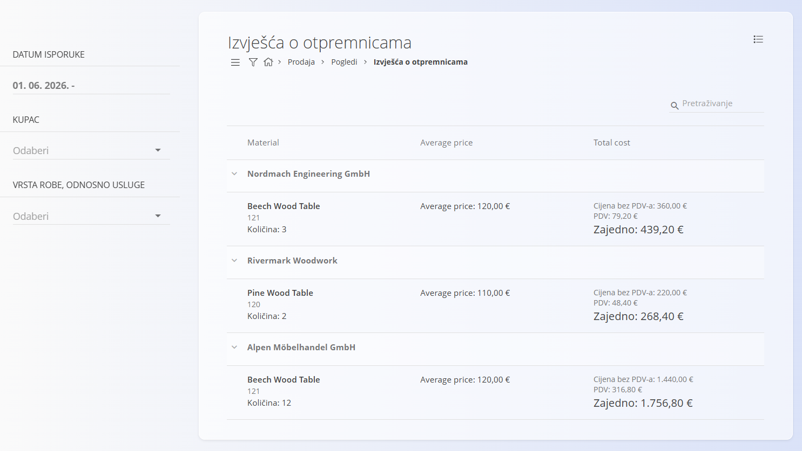

<!-- app_route: /sales/views/delivery-note-reports -->
<!-- app_label: Izvješća o otpremnicama -->
<!-- canonical_source_url: https://github.com/Tom-PIT/Connected.Docs/blob/main/hr/Domene/Prodaja/Pogledi/IzvjescaOOtpremnicama.md -->
<!-- canonical_source_title: Izvješća o otpremnicama -->

# Izvješća o otpremnicama

Pogled **Izvješća o otpremnicama** pruža objedinjeni pregled isporučenih stavki, grupiranih po kupcima. Namijenjen je analizi i izvještavanju te **ne omogućuje** izradu ili uređivanje dokumenata.

Za pristup ovom pogledu otvorite **Prodaja / Pogledi / Izvješća o otpremnicama** u [navigaciji](../../../Zajednicko/UI/Navigacija.md).

### Svrha ovog pogleda

Izvješća o otpremnicama omogućuju:

- Analizu isporučenih količina i vrijednosti po kupcima.
- Pregled povijesti isporuka za pojedine artikle.
- Analizu prosječnih cijena i ukupnih vrijednosti isporuka.
- Brz pregled rezultata isporuka bez otvaranja pojedinačnih dokumenata.

Ovaj pogled je **samo za pregled** i prikazuje podatke iz potvrđenih [**Otpremnica**](../Dokumenti/Otpremnice.md).

## Izgled i struktura

Izvješće je organizirano hijerarhijski:

- **Kupci** predstavljaju glavne grupe.
- Unutar svakog kupca prikazani su isporučeni **artikli**.
- Svaki redak artikla objedinjuje podatke iz svih odgovarajućih [**Otpremnica**](../Dokumenti/Otpremnice.md).

Za svaki artikl prikazani su:

- isporučena **količina**,
- **prosječna cijena**,
- **ukupna vrijednost**, uključujući neto iznos i PDV.

## Filtri

Filtri s lijeve strane omogućuju sužavanje prikazanih podataka:

- **Datum isporuke** – Filtrira isporuke unutar odabranog raspona datuma.
- **Kupac** – Prikazuje podatke za jednog ili više odabranih kupaca.
- **Vrsta robe, odnosno usluge** – Prikazuje podatke za jedan ili više odabranih artikala.

Filtre je moguće kombinirati kako biste dobili željeni pregled isporuka.

## Tumačenje vrijednosti

- **Količina** predstavlja ukupnu isporučenu količinu artikla.
- **Prosječna cijena** izračunava se na temelju svih isporuka istog artikla za odabranog kupca.
- **Ukupna vrijednost** prikazuje:
    - neto iznos,
    - iznos PDV-a,
    - ukupnu vrijednost.

Sve vrijednosti izračunavaju se na temelju [**Otpremnica**](../Dokumenti/Otpremnice.md) obuhvaćenih odabranim filtrima.

> [!NOTE]
> - U izvješće su uključene samo **potvrđene otpremnice**.
> - Nacrti i stornirane otpremnice nisu uključeni.
> - Pogled je namijenjen isključivo analizi i ne podržava uređivanje, storniranje ili izradu dokumenata.

Za detaljan pregled pojedinog dokumenta otvorite odgovarajuću [**Otpremnicu**](../Dokumenti/Otpremnice.md) iz izbornika **Prodaja / Dokumenti / Otpremnice**.

## Izbornik

Izbornik pruža dodatne radnje dostupne na ovom zaslonu.

Dostupne radnje:

- **Izvezi zbirno izvješće u CSV** – Izvozi zbirne količine i iznose.
- **Izvezi detaljno izvješće u CSV** – Izvozi pojedinosti svake otpremnice zasebno.

Više informacija o radnjama izbornika potražite u dokumentu [**Radnje izbornika**](../../../Zajednicko/Koncepti/RadnjeIzbornika.md).