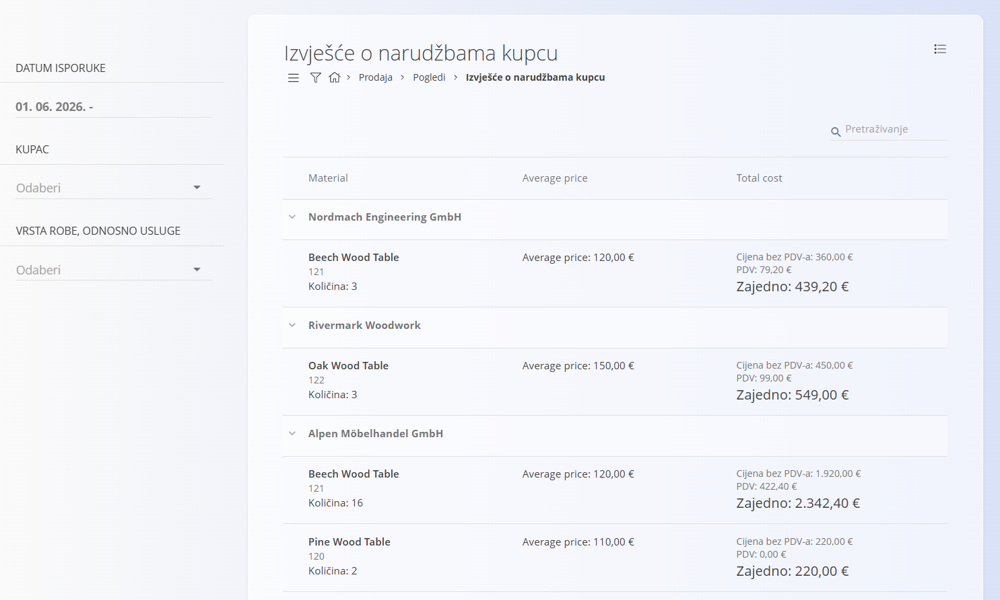

<!-- app_route: /sales/views/sales-order-reports -->
<!-- app_label: Izvješće o narudžbama kupcu -->
<!-- canonical_source_url: https://github.com/Tom-PIT/Connected.Docs/blob/main/hr/Domene/Prodaja/Pogledi/IzvjesceONarudzbamaKupcu.md -->
<!-- canonical_source_title: Izvješće o narudžbama kupcu -->

# Izvješće o narudžbama kupcu

Pogled **Izvješće o narudžbama kupcu** pruža objedinjeni pregled naručenih stavki, grupiranih po kupcu. Namijenjen je analizi i izvještavanju te **ne kreira niti mijenja dokumente**.

Za pristup ovom dokumentu idite na **Prodaja / Pogledi / Izvješće o narudžbama kupcu**.

## Namjena pogleda

Izvješće o narudžbama kupcu omogućuje:

- Analizu naručenih količina i vrijednosti po kupcu
- Pregled povijesti narudžbi za određenu robu ili uslugu
- Pregled prosječnih cijena i ukupnih vrijednosti narudžbi
- Brz uvid u rezultate narudžbi bez otvaranja pojedinačnih dokumenata

Ovaj je pogled **samo za čitanje** i prikazuje podatke iz obrađenih [**Narudžbi kupca**](../Dokumenti/NarudzbeKupca.md).

## Raspored i struktura

Izvješće je organizirano hijerarhijski:

- **Kupci** su prikazani kao glavne grupe.
- Ispod svakog kupca prikazana je naručena **roba ili usluga**.
- Svaki red robe ili usluge objedinjuje podatke iz svih relevantnih [**Narudžbi kupca**](../Dokumenti/NarudzbeKupca.md).

Za svaku robu ili uslugu izvješće prikazuje:

- Naručenu **količinu**
- **Prosječnu cijenu**
- **Ukupnu vrijednost**, uključujući cijenu bez PDV-a i PDV

## Filtri

Filtri s lijeve strane omogućuju sužavanje prikaza izvješća:

- **Datum isporuke** — filtrira narudžbe prema razdoblju isporuke.
- **Kupac** — prikazuje podatke za jednog ili više odabranih kupaca.
- **Vrsta robe, odnosno usluge** — prikazuje podatke za jednu ili više odabranih vrsta robe ili usluge.

Filtri se mogu kombinirati za precizniji prikaz podataka.

## Tumačenje vrijednosti

- **Količina** predstavlja ukupnu naručenu količinu za odabranu robu ili uslugu.
- **Prosječna cijena** izračunava se na temelju iste robe ili usluge prodane kupcu.
- **Ukupna vrijednost** prikazuje:
  - Cijenu bez PDV-a
  - Iznos PDV-a
  - Ukupan iznos

Svi iznosi izračunavaju se na temelju [**Narudžbi kupca**](../Dokumenti/NarudzbeKupca.md) koje odgovaraju odabranim filtrima.

## Napomene

- U izvješće su uključene samo **obrađene narudžbe kupca**.
- Nacrti i stornirane narudžbe kupca nisu prikazani.
- Pogled je namijenjen samo analizi i ne podržava radnje poput uređivanja, storniranja ili kreiranja dokumenata.

Za detaljne informacije na razini dokumenta otvorite povezane [**Narudžbe kupca**](../Dokumenti/NarudzbeKupca.md) iz odjeljka **Prodaja / Dokumenti / Narudžbe kupca**.

## Izbornik

Izbornik sadrži dodatne radnje dostupne na ovoj stranici.

Dostupne radnje:

- **Izvoz kumulativnog PDF-a** — objedinjuje količine i iznose u ukupne vrijednosti.
- **Izvoz detaljnog PDF-a** — izvozi pojedinosti svake narudžbe kupca zasebno.

Za više informacija o radnjama izbornika pogledajte [**Radnje izbornika**](../../../Zajednicko/Koncepti/RadnjeIzbornika.md).