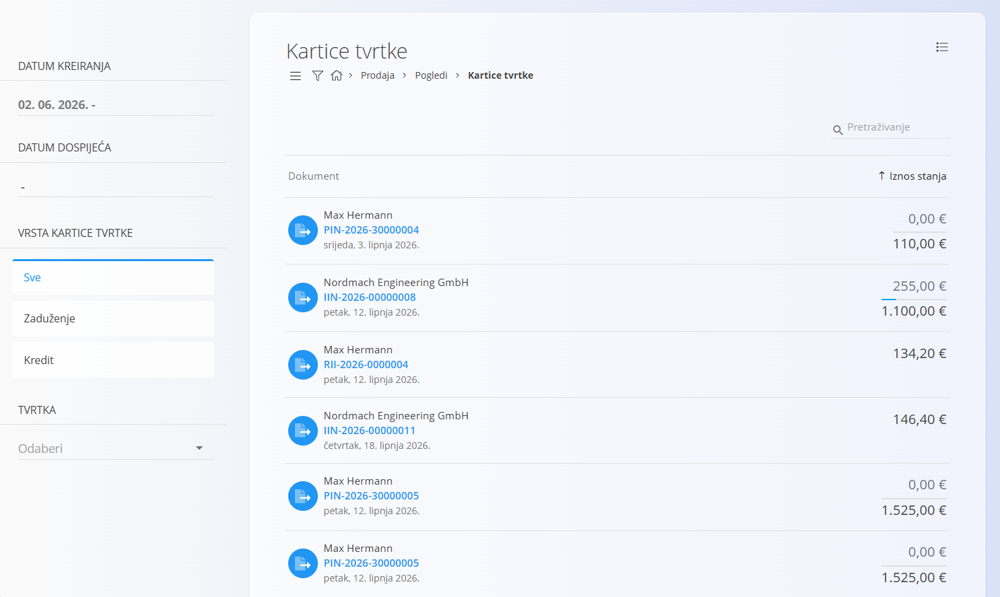
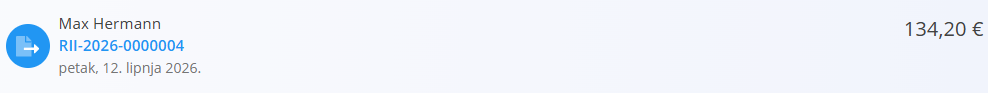
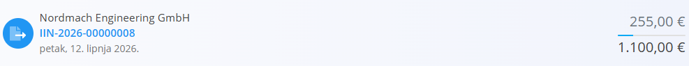
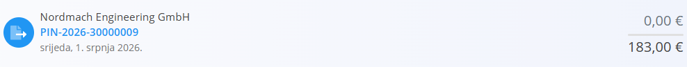
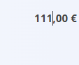

<!-- app_route: /customers/company-cards -->
<!-- app_label: Kartice tvrtke -->
<!-- canonical_source_url: https://github.com/Tom-PIT/Connected.Docs/blob/main/hr/Domene/Prodaja/Pogledi/KarticeTvrtke.md -->
<!-- canonical_source_title: Kartice tvrtke -->

# Kartice tvrtke

Pogled **Kartice tvrtke** pruža detaljan pregled svih **dugovnih i potražnih stavki** povezanih s pojedinom tvrtkom. Umjesto prikaza jedinstvenog salda, ovaj zaslon prikazuje **pojedinačne financijske dokumente** (kao što su [**Izdani računi**](../Dokumenti/IzdaniRacuni.md), [**Odobrenja**](../Dokumenti/Odobrenja.md) i [**Terećenja**](../Dokumenti/Terecenja.md)) te njihov status plaćanja.

Pogled je namijenjen praćenju otvorenih stavki i evidentiranju uplata.

Za pristup ovom dokumentu idite na **Prodaja / Pogledi / Kartice tvrtke** u [navigaciji](../../../Zajednicko/UI/Navigacija.md).

Dokument je dostupan i putem stranice [**Poslovni adresar**](../../../Zajednicko/Upravljanje/PoslovniAdresar.md), klikom na oznaku **Kartice** uz željenu tvrtku. U tom će slučaju popis biti automatski filtriran za odabranu tvrtku.

## Popis kartica tvrtke

Svaki zapis predstavlja **jedan financijski dokument**, a ne objedinjeno stanje tvrtke.

- **Zaduženje** — kupac duguje sredstva vašoj tvrtki.
- **Kredit** — vaša tvrtka duguje sredstva kupcu (npr. preplate ili odobrenja).

Klikom na redak otvara se povezani dokument.

### Filtri

Filtri s lijeve strane omogućuju sužavanje popisa:

- **Datum kreiranja** — filtrira dokumente prema datumu kreiranja.
- **Datum dospijeća** — filtrira dokumente prema datumu dospijeća.
- **Vrsta kartice tvrtke**
    - Sve
    - Zaduženje
    - Kredit
- **Tvrtka** — prikazuje dokumente odabrane tvrtke.

## Status plaćanja

Kartice tvrtke prikazuju status plaćanja svakog dokumenta pomoću prikaza plaćenog i ukupnog iznosa.

### Plaćeni dokumenti

Kod potpuno plaćenih dokumenata prikazan je samo ukupni iznos dokumenta.

To znači da:

- dokument je u cijelosti podmiren
- nema otvorenog iznosa za plaćanje

### Djelomično plaćeni dokumenti

Kod djelomično plaćenih dokumenata prikazan je plaćeni iznos te ukupni iznos dokumenta.

U ovom slučaju:

- gornji iznos predstavlja evidentirani plaćeni iznos
- donji iznos predstavlja ukupnu vrijednost dokumenta

### Neplaćeni dokumenti

Kod neplaćenih dokumenata evidentirani plaćeni iznos iznosi **0,00**, dok je ispod prikazana ukupna vrijednost dokumenta.

To znači da:

- za dokument još nije evidentirana nijedna uplata
- cijeli iznos dokumenta još je otvoren

## Radnje

### Evidentiranje uplate

Plaćeni iznos može se evidentirati izravno u popisu bez otvaranja dokumenta.

Kliknite na prikazani **plaćeni iznos**, unesite novi iznos te potvrdite promjenu.

Primjer:

- ako dokument prikazuje **0,00 €**, možete unijeti **111,00 €**
- sustav će evidentirati da je za dokument plaćeno **111,00 €**
- status dokumenta automatski će se ažurirati u skladu s evidentiranim iznosom

## Napomene

- Ovaj pogled objedinjuje dugovne i potražne dokumente radi lakšeg praćenja statusa plaćanja.
- Promjenom plaćenog iznosa evidentira se izvršena uplata za odabrani dokument.