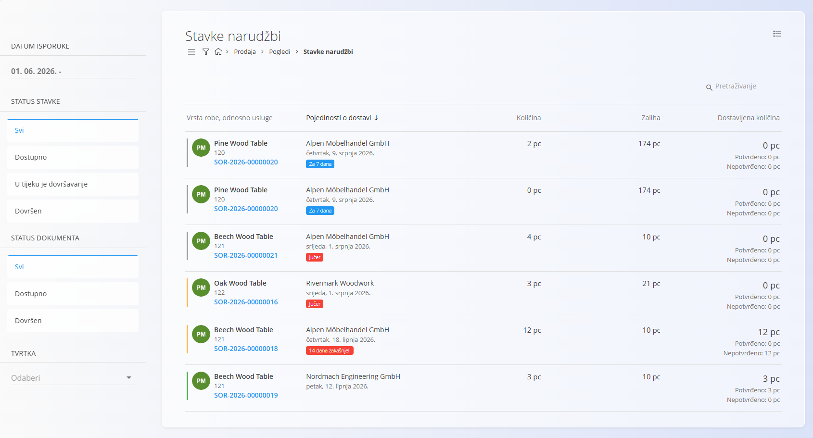

<!-- app_route: /sales/views/sales-order-details -->
<!-- app_label: Stavke narudžbi -->
<!-- canonical_source_url: https://github.com/Tom-PIT/Connected.Docs/blob/main/hr/Domene/Prodaja/Pogledi/StavkeNarudzbi.md -->
<!-- canonical_source_title: Stavke narudžbi -->

# Stavke narudžbi

Pogled **Stavke narudžbi** pruža objedinjeni popis svih stavki iz dokumenata [**Narudžbe kupca**](../Dokumenti/NarudzbeKupca.md). Umjesto prikaza dokumenata, ovaj pogled prikazuje **pojedinačne stavke narudžbi**, što omogućuje praćenje isporuka, količina i neispunjenih obveza.

Ovaj pogled služi isključivo za analizu i **ne omogućuje** izradu niti uređivanje narudžbi kupca.

Za pristup ovom pogledu otvorite **Prodaja / Pogledi / Stavke narudžbi** u [navigaciji](../../../Zajednicko/UI/Navigacija.md).

## Popis stavki narudžbi

Svaki redak predstavlja **jednu stavku narudžbe kupca** i prikazuje:

- **Vrstu robe, odnosno usluge** – Artikl koji je naručen.
- **Pojedinosti o dostavi** – Kupca i planirani datum isporuke.
- **Količinu** – Naručenu količinu.
- **Zalihu** – Trenutno raspoloživu količinu na skladištu.
- **Dostavljenu količinu** – Prikazuje potvrđene i nepotvrđene isporučene količine.
    - Primjer: *0 kom (Potvrđeno: 0 / Nepotvrđeno: 0)*.

Na taj način možete brzo pratiti koje stavke još čekaju isporuku, neovisno o samom dokumentu narudžbe.

## Filtri

Lijeva bočna traka omogućuje filtriranje prikazanih stavki:

- **Datum isporuke** – Filtrira stavke prema planiranom datumu isporuke.
- **Status stavke**
    - *Svi*
    - *Dostupno*
    - *U tijeku je dovršavanje*
    - *Dovršen*
- **Status dokumenta**
    - *Svi*
    - *Dostupno*
    - *Dovršen*
- **Tvrtka** – Prikazuje stavke za odabranu tvrtku.

## Svrha

Ovaj pogled je koristan za:

- planiranje nadolazećih isporuka,
- praćenje potpuno i djelomično isporučenih stavki,
- prepoznavanje problema u isporuci (npr. nedostatak zalihe),
- praćenje opterećenja logistike i skladišta.

Pogled nadopunjuje dokument [**Narudžbe kupca**](../Dokumenti/NarudzbeKupca.md) jer je usmjeren na **stavke narudžbi**, a ne na same dokumente.

## Izbornik

Izbornik pruža dodatne radnje dostupne na ovom zaslonu.

Dostupne radnje:

- **Izvezi zbirno izvješće u CSV** – Izvozi zbirne količine i vrijednosti.
- **Izvezi detaljno izvješće u CSV** – Izvozi pojedinosti svake stavke narudžbe zasebno.

Više informacija o radnjama izbornika potražite u dokumentu [**Radnje izbornika**](../../../Zajednicko/Koncepti/RadnjeIzbornika.md).