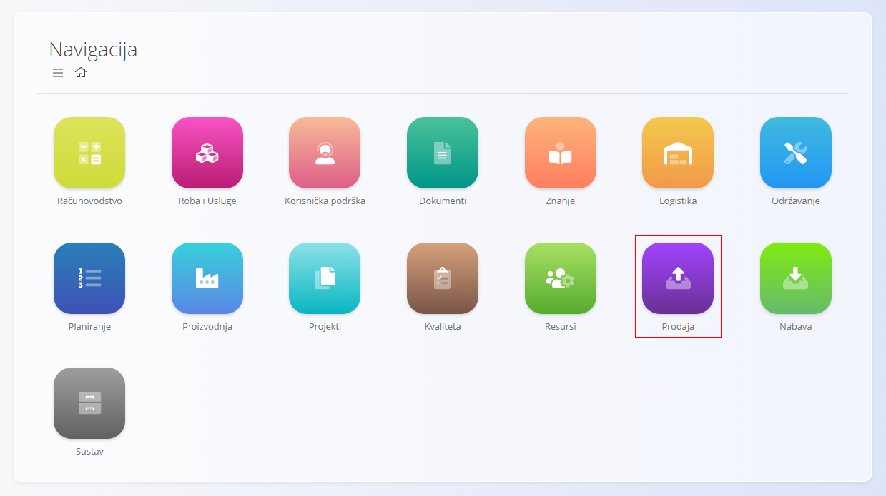
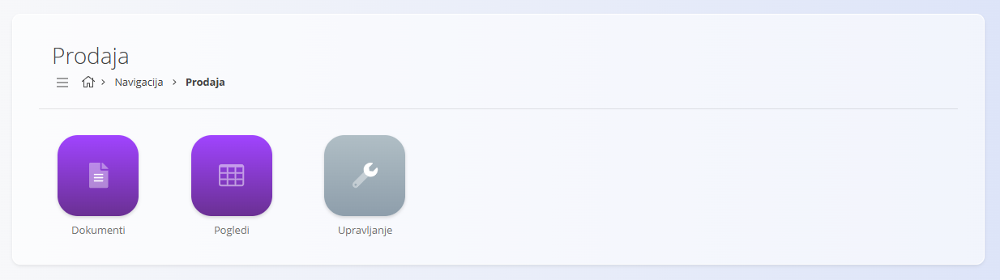
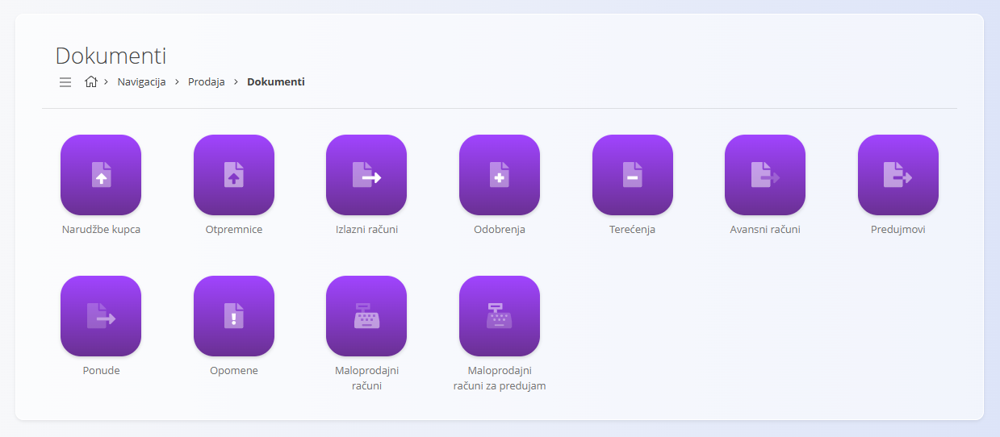
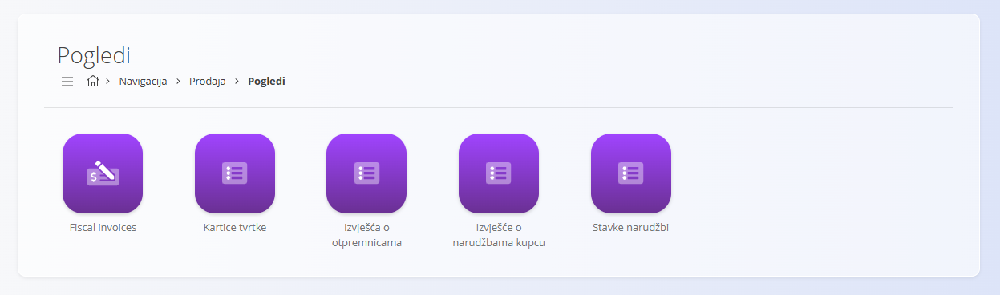
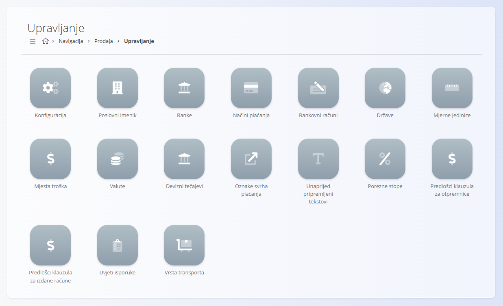

<!-- app_route: /sitemap/sales -->
<!-- app_label: Prodaja -->
<!-- canonical_source_url: https://github.com/Tom-PIT/Connected.Docs/blob/main/hr/Domene/Prodaja/README.md -->
<!-- canonical_source_title: Prodaja -->

# Prodaja

Domena **Prodaja** sadrži sve dokumente i šifrarnike potrebne za upravljanje komercijalnim procesima s kupcima. Obuhvaća dokumente kao što su [**Ponude**](Dokumenti/Ponude.md), [**Narudžbe kupca**](Dokumenti/NarudzbeKupca.md), [**Otpremnice**](Dokumenti/Otpremnice.md), [**Izlazni računi**](Dokumenti/IzlazniRacuni.md) te analitičke **[Poglede](#pogledi)** za praćenje prodajnih aktivnosti i tijeka dokumenata.

Dok domena **[Roba i usluge](../RobaIUsluge/README.md)** definira **što** se prodaje, domena **Prodaja** određuje **kako** se proizvodi i usluge nude, potvrđuju, isporučuju i fakturiraju.

Za pristup ovoj domeni otvorite **Prodaja** u [navigaciji](../../Zajednicko/UI/Navigacija.md).

> [!NOTE]
> Dostupne domene ovise o konfiguraciji sustava i poslovnom modelu pojedine tvrtke.

## Što obuhvaća domena Prodaja?

Domena je organizirana u nekoliko funkcionalnih cjelina:

- **[Dokumenti](#dokumenti)** – prodajni dokumenti koji podržavaju komercijalne procese
- **[Pogledi](#pogledi)** – analitički zasloni za praćenje prodajnih aktivnosti i rezultata
- **[Upravljanje](#upravljanje)** – šifrarnici i postavke prodajnih procesa

## Dokumenti

Odjeljak **Dokumenti** sadrži prodajne dokumente koji prate cijeli prodajni proces – od izrade ponude do izdavanja konačnog računa.

Dostupni prodajni dokumenti:

- **[Ponude](Dokumenti/Ponude.md)** – Komercijalne ponude izrađene prije potvrde narudžbe kupca.
- **[Narudžbe kupca](Dokumenti/NarudzbeKupca.md)** – Potvrđene narudžbe koje pokreću isporuku i fakturiranje.
- **[Otpremnice](Dokumenti/Otpremnice.md)** – Evidentiraju isporuku robe kupcima.
- **[Izlazni računi](Dokumenti/IzlazniRacuni.md)** – Računi izdani za isporučene proizvode ili usluge.
- **[Odobrenja](Dokumenti/Odobrenja.md)** – Dokumenti kojima se ispravljaju ili odobravaju prethodno izdani računi.
- **[Terećenja](Dokumenti/Terecenja.md)** – Dokumenti za dodatna terećenja prethodno izdanih računa.
- **[Avansni računi](Dokumenti/AvansniRacuni.md)** – Prethodni računi izdani prije isporuke ili plaćanja.
- **[Predujmovi](Dokumenti/Predujmovi.md)** – Evidencija primljenih predujmova kupaca.
- **[Opomene](Dokumenti/Opomene.md)** – Obavijesti o neplaćenim ili dospjelim računima.
- **[Maloprodajni računi](Dokumenti/MaloprodajniRacuni.md)** – Računi izdani kroz maloprodajne procese.
- **[Maloprodajni računi za predujam](Dokumenti/MaloprodajniRacuniZaPredujam.md)** – Avansni računi izdani u maloprodaji.

Svaka vrsta dokumenta doprinosi prodajnom procesu i omogućuje potpunu sljedivost od prve ponude do konačnog računa.

> [!TIP]
> Korak-po-korak upute dostupne su u dokumentima **[Izrada izlaznog računa](Dokumenti/IzlazniRacuniIzrada.md)** i **[Izrada narudžbe kupca](Dokumenti/NarudzbeKupcaIzrada.md)**.

## Pogledi

Odjeljak **Pogledi** sadrži analitičke zaslone za pregled i analizu prodajnih dokumenata.

Dostupni pogledi:

- [Fiskalni računi](Pogledi/FiskalniRacuni.md) – Pregled fiskalnih računa za maloprodaju i njihovih statusa.
- **[Kartice tvrtke](Pogledi/KarticeTvrtke.md)** – Pregled poslovnih partnera i njihove komercijalne aktivnosti.
- **[Izvješća o otpremnicama](Pogledi/IzvjescaOOtpremnicama.md)** – Analiza isporučene robe prema kupcima.
- **[Izvješće o narudžbama kupcu](Pogledi/IzvjesceONarudzbamaKupcu.md)** – Analiza potvrđenih narudžbi prema kupcima.
- **[Stavke narudžbi](Pogledi/StavkeNarudzbi.md)** – Detaljan pregled pojedinačnih stavki narudžbi.

Ovi zasloni služe isključivo za analizu podataka i ne stvaraju nove poslovne dokumente.

## Upravljanje

Odjeljak **Upravljanje** sadrži šifrarnike i postavke potrebne za konfiguraciju prodajnih procesa.

Dostupni šifrarnici i postavke:

- **[Konfiguracija](Upravljanje/KonfiguracijaProdaje.md)** – Globalne postavke koje određuju ponašanje prodajnih procesa.
- **[Poslovni imenik](../../Zajednicko/Upravljanje/PoslovniImenik.md)** – Evidencija kupaca i poslovnih partnera koja se koristi u svim prodajnim dokumentima.
- **[Banke](../../Zajednicko/Upravljanje/Banke.md)** – Definicije banaka koje se koriste na računima i u podacima za plaćanje.
- **[Načini plaćanja](Upravljanje/NaciniPlacanja.md)** – Načini plaćanja koji se koriste na prodajnim dokumentima.
- **[Bankovni računi](Upravljanje/BankovniRacuniOrganizacije.md)** – Bankovni računi organizacije koji se koriste na izlaznim računima.
- **[Države](../../Zajednicko/Upravljanje/Drzave.md)** – Popis država koje se koriste u adresama i poslovnim dokumentima.
- **[Mjerne jedinice](../../Zajednicko/Upravljanje/MjerneJedinice.md)** – Mjerne jedinice koje se koriste u prodajnim dokumentima.
- **[Mjesta troška](../../Zajednicko/Upravljanje/MjestaTroska.md)** – Klasifikacija prihoda i troškova prema mjestu troška.
- **[Valute](../../Zajednicko/Upravljanje/Valute.md)** – Valute dostupne za korištenje u cjenicima i prodajnim dokumentima.
- **[Devizni tečajevi](Upravljanje/DevizniTecajevi.md)** – Tečajevi koji se koriste za preračun valuta.
- **[Unaprijed pripremljeni tekstovi](../../Zajednicko/Upravljanje/UnaprijedPripremljeniTekstovi.md)** – Standardni tekstovi koji se mogu koristiti u prodajnim dokumentima.
- **[Porezne stope](../../Zajednicko/Upravljanje/PorezneStope.md)** – Definicije PDV-a i ostalih poreznih stopa koje se koriste pri obračunu poreza.
- **[Predlošci klauzula za otpremnice](Upravljanje/PredlosciKlauzulaZaOtpremnice.md)** – Standardne klauzule koje se umeću u otpremnice.
- **[Predlošci klauzula za izdane račune](Upravljanje/PredlosciKlauzulaZaIzdaneRacune.md)** – Standardne klauzule koje se umeću u izdane račune.
- **[Oznake svrha plaćanja](Upravljanje/OznakeSvrhaPlacanja.md)** – Oznake koje se koriste za razmjenu podataka o plaćanju i integraciju s vanjskim sustavima.
- **[Vrsta transporta](../../Zajednicko/Upravljanje/VrstaTransporta.md)** – Načini transporta koji se koriste u prodaji i logistici.
- **[Uvjeti isporuke](../../Zajednicko/Upravljanje/UvjetiIsporuke.md)** – Komercijalni uvjeti isporuke koji se primjenjuju na prodajne dokumente.

Ovi šifrarnici i postavke određuju način rada prodajnih procesa te osiguravaju dosljednu strukturu poslovnih podataka.

> [!TIP]
> Pregled svih šifrarnika dostupan je u dokumentu **[Indeks upravljanja](../../IndeksUpravljanja.md)**.