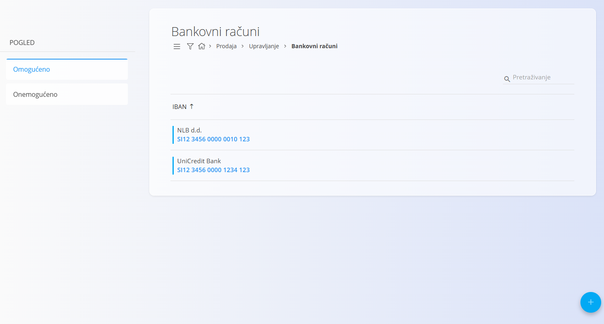
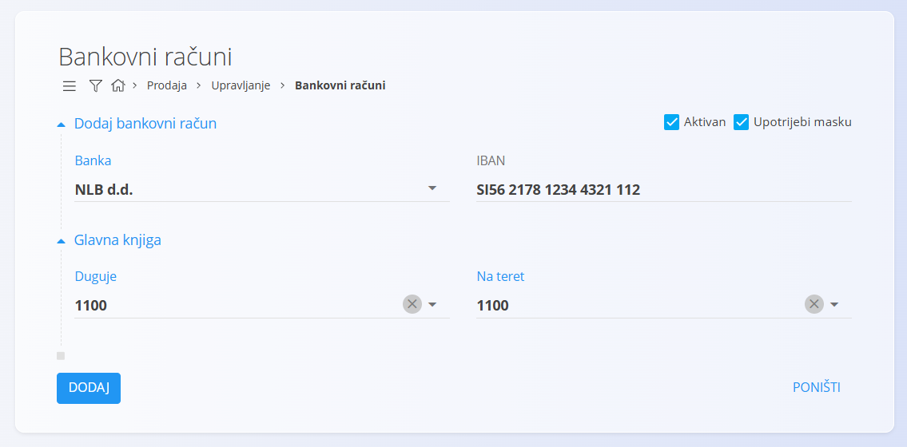

<!-- app_route: /management/common-types/organization-bank-accounts -->
<!-- app_label: Bankovni računi -->
<!-- canonical_source_url: https://github.com/Tom-PIT/Connected.Docs/blob/main/hr/Domene/Prodaja/Upravljanje/BankovniRacuniOrganizacije.md -->
<!-- canonical_source_title: Bankovni računi organizacije -->

# Bankovni računi organizacije

Bankovni računi pohranjuju IBAN račune koje vaša organizacija koristi za izdavanje računa, zaprimanje uplata i druge financijske procese. Na ovom zaslonu možete pregledavati, dodavati, omogućavati i onemogućavati bankovne račune organizacije.

Svaki zapis definira banku, njezin IBAN račun te označava je li račun aktivan i koristi li masku za prikaz IBAN-a.

Za pristup ovom dokumentu idite na **Prodaja / Upravljanje / Bankovni računi** u [navigaciji](../../../Common/UI/Navigation.md).

> [!NOTE]
> **Preduvjeti**
>
> Prije upravljanja bankovnim računima provjerite je li šifrarnik [**Banke**](../../../Common/Management/Banks.md) pravilno konfiguriran.

## Shema

| Polje | Opis |
|-------|------|
| [**Banka**](../../../Common/Management/Banks.md) | Banka kojoj račun pripada (obavezno). |
| **IBAN** | Međunarodni broj bankovnog računa (obavezno). |
| **Aktivan** | Određuje može li se račun koristiti u dokumentima (zadano označeno). |
| **Upotrijebi masku** | Određuje prikazuje li se i unosi IBAN pomoću maske radi bolje čitljivosti. |
| **Glavna knjiga – Duguje/Na teret** | Konto glavne knjige odabran iz [**Kontnog plana**](../../Accounting/Management/Ledger/ChartOfAccounts.md) koji predstavlja bankovni račun organizacije u knjigovodstvenim transakcijama. |

## Upravljanje

### Popis bankovnih računa

Na zaslonu je prikazan popis bankovnih računa. Pomoću lijevog panela možete filtrirati bankovne račune prema statusu:

- **Omogućeno**
- **Onemogućeno**

Kliknite na IBAN račun kako biste otvorili njegove pojedinosti.

## Radnje

### Dodavanje bankovnog računa

Kliknite [akcijski gumb](../../../Common/UI/ActionButton.md) za dodavanje novog bankovnog računa.

Unesite potrebne podatke:

- **Banka**
- **IBAN**
- **Aktivan** (nije obavezno)
- **Upotrijebi masku** (nije obavezno)
- odjeljak **Glavna knjiga**

<strong>Glavna knjiga</strong>

Odjeljak **Glavna knjiga** određuje konto glavne knjige koji predstavlja bankovni račun organizacije u knjigovodstvenim transakcijama.

Odabrani konto koristi se prilikom knjiženja uplata, isplata, bankovnih izvoda i usklađenja. Sve financijske transakcije povezane s ovim bankovnim računom evidentiraju se na odabranom kontu.

> [!NOTE]
> Ispravna konfiguracija glavne knjige potrebna je za točno upravljanje novčanim sredstvima, usklađenje i usklađenost sa zakonskim zahtjevima.

### Uređivanje bankovnog računa

Kliknite na IBAN račun koji želite urediti. Po potrebi ažurirajte željena polja.

### Brisanje bankovnog računa

Kliknite na IBAN račun koji želite izbrisati, a zatim na zaslonu s pojedinostima kliknite **Izbriši**.

Ako potvrdite brisanje, zapis će biti trajno uklonjen. U suprotnom neće biti promijenjen.

> [!NOTE]
> Bankovni račun moguće je izbrisati samo ako ga ne koriste drugi zapisi u sustavu.