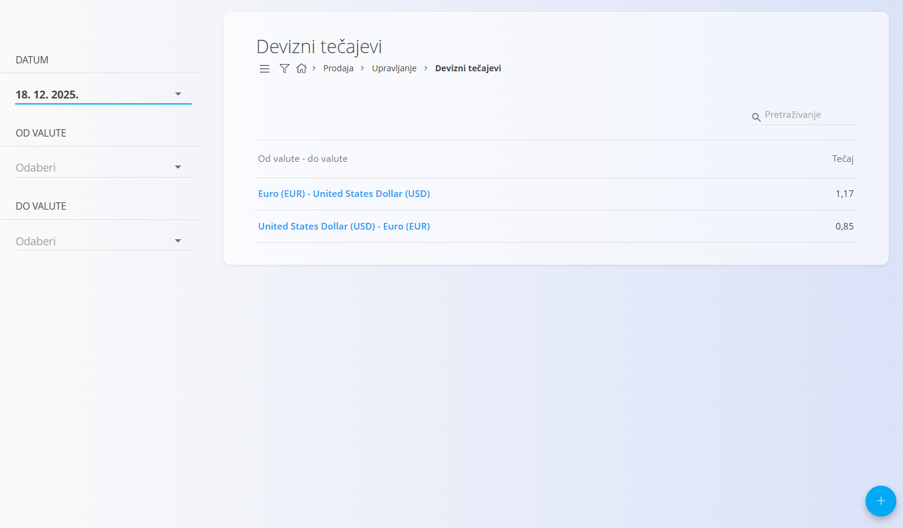
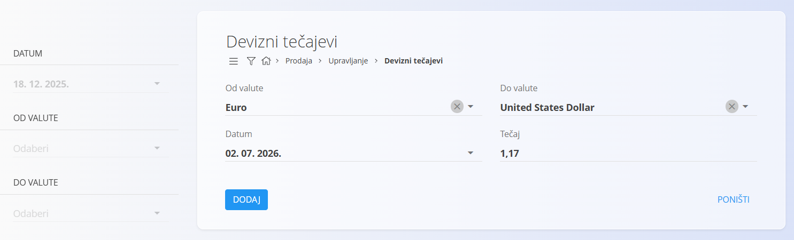

<!-- app_route: /management/common-types/exchange-rates -->
<!-- app_label: Devizni tečajevi -->
<!-- canonical_source_url: https://github.com/Tom-PIT/Connected.Docs/blob/main/hr/Domene/Prodaja/Upravljanje/DevizniTecajevi.md -->
<!-- canonical_source_title: Devizni tečajevi -->

# Devizni tečajevi

Šifrarnik **Devizni tečajevi** omogućuje definiranje tečajeva koji se koriste za preračunavanje iznosa između različitih valuta u sustavu. Tečajevi se prvenstveno koriste u modulu **Prodaja** za preračunavanje iznosa na dokumentima izrađenima u različitim valutama.

Devizni tečajevi omogućuju:

- Preračunavanje iznosa između različitih valuta
- Dosljedan obračun financijskih iznosa na prodajnim dokumentima
- Primjenu tečajeva važećih na određeni datum

Svaki tečaj definiran je za prijelaz **iz jedne valute u drugu** na određeni datum.

> [!IMPORTANT]
> Prije definiranja deviznih tečajeva potrebno je definirati [**Valute**](../../../Common/Management/Currencies.md).

Za pristup ovom dokumentu idite na **Prodaja / Upravljanje / Devizni tečajevi** u [navigaciji](../../../Common/UI/Navigation.md).

## Shema

| Polje | Opis |
|-------|------|
| [**Od valute**](../../../Common/Management/Currencies.md) | Polazna valuta koja se koristi za preračunavanje. |
| [**Do valute**](../../../Common/Management/Currencies.md) | Odredišna valuta u koju se iznos preračunava. |
| **Datum** | Datum na koji tečaj vrijedi. |
| **Tečaj** | Vrijednost tečaja koja se koristi za preračunavanje između odabranih valuta. |

## Upravljanje

Devizni tečajevi unose se ručno te se mogu definirati za različite datume i parove valuta.

### Popis

Na zaslonu je prikazan popis svih deviznih tečajeva koji odgovaraju odabranim filtrima.

Dostupni su sljedeći filtri:

- **Datum**
- **Od valute**
- **Do valute**

Svaki zapis prikazuje:

- Par valuta (**Od valute → Do valute**)
- **Tečaj**

## Radnje

### Dodavanje deviznog tečaja

Kliknite [akcijski gumb](../../../Common/UI/ActionButton.md).

Unesite:

- [**Od valute**](../../../Common/Management/Currencies.md)
- [**Do valute**](../../../Common/Management/Currencies.md)
- **Datum**
- **Tečaj**

Kliknite **Dodaj** za spremanje novog tečaja.

> [!NOTE]
>
> - Sustav automatski primjenjuje odgovarajući tečaj prilikom preračunavanja valuta.
> - Tečajevi ovise o datumu, stoga odaberite datum koji odgovara datumu dokumenta ili transakcije.
> - Za svaki smjer preračunavanja potrebno je definirati zaseban tečaj.

### Uređivanje deviznog tečaja

Kliknite na zapis kako biste otvorili njegove pojedinosti.

Možete promijeniti vrijednosti polja **Datum** i **Tečaj**.

Polja **Od valute** i **Do valute** nije moguće mijenjati nakon stvaranja zapisa.

Kliknite **Spremi** za spremanje promjena ili **Poništi** za odustajanje.

### Brisanje deviznog tečaja

Otvorite zapis, a zatim na zaslonu s pojedinostima kliknite **Izbriši**.

Ako potvrdite brisanje, zapis će biti trajno uklonjen. U suprotnom neće biti promijenjen.