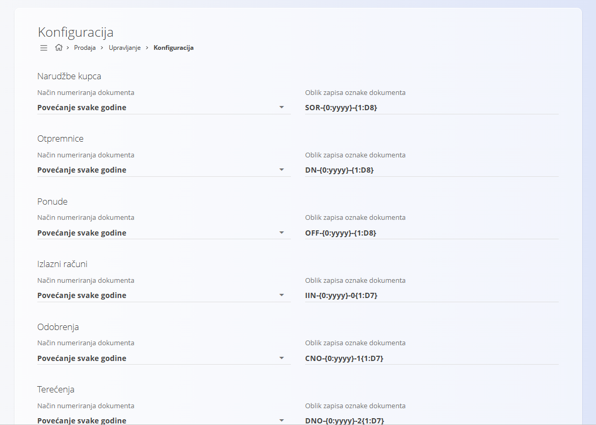

<!-- app_route: /management/sales/configuration -->
<!-- app_label: Konfiguracija prodaje -->
<!-- canonical_source_url: https://github.com/Tom-PIT/Connected.Docs/blob/main/hr/Domene/Prodaja/Upravljanje/KonfiguracijaProdaje.md -->
<!-- canonical_source_title: Konfiguracija prodaje -->

# Konfiguracija prodaje

Konfiguracija prodaje omogućuje definiranje načina numeriranja dokumenata u modulu **Prodaja**. Promjene se spremaju automatski.

Za pristup ovom dokumentu idite na **Prodaja / Upravljanje / Konfiguracija** u [navigaciji](../../../Zajednicko/UI/Navigacija.md).

## Postavke numeriranja dokumenata

Odaberite model numeriranja i oblik oznake za dokumente prodaje (Narudžbe kupca, Otpremnice, Ponude, Izlazni računi, Odobrenja, Terećenja, Predračuni, Predujmovi, Maloprodajni računi i Maloprodajni računi za predujam).

| Polje | Opis |
|-------|------|
| **Način numeriranja dokumenta** | • **Povećanje svake godine:** numeriranje započinje ispočetka svake godine.   • **Povećanje:** koristi jedinstveni slijed koji se ne resetira. |
| **Oblik zapisa oznake dokumenta** | Definira format oznake dokumenta (npr. PREFIKS-GODINA-BROJ). |
