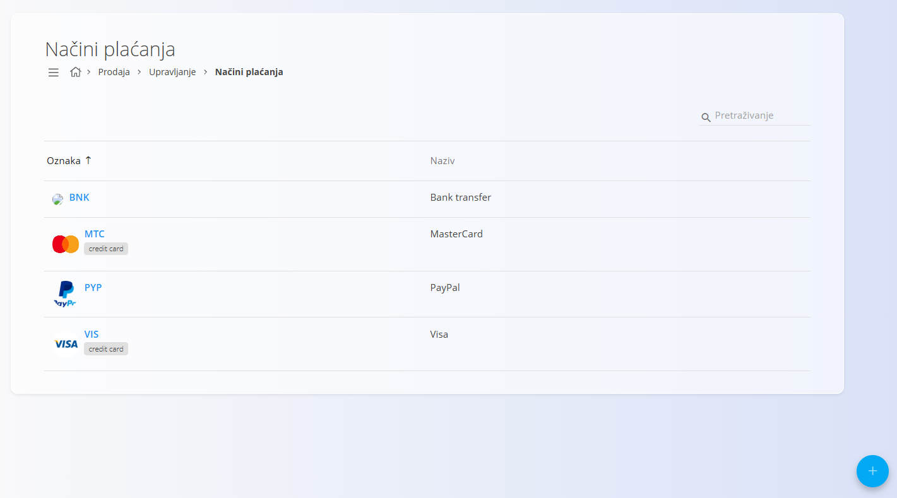
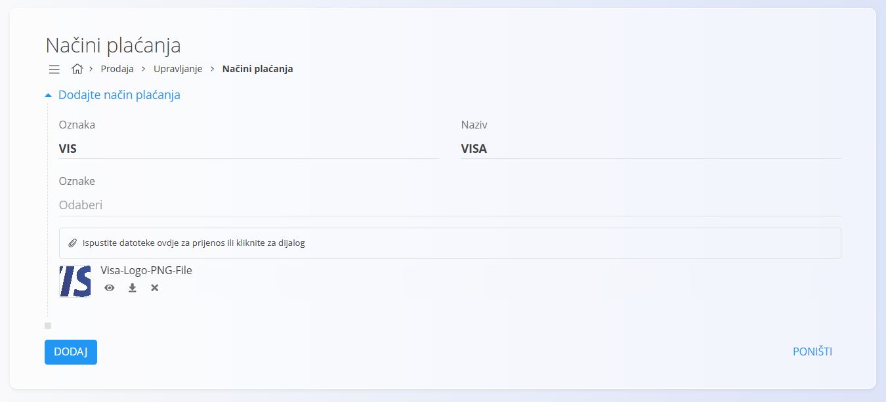

<!-- app_route: /management/common-types/payment-methods -->
<!-- app_label: Načini plaćanja -->
<!-- canonical_source_url: https://github.com/Tom-PIT/Connected.Docs/blob/main/en/Domains/Sales/Management/NaciniPlacanja.md -->
<!-- canonical_source_title: Načini plaćanja -->

# Načini plaćanja

Šifrarnik **Načini plaćanja** definira načine na koje kupci mogu platiti robu ili usluge, kao što su kreditne kartice, internetske usluge plaćanja ili drugi podržani načini. Svaki način plaćanja sadrži **oznaku**, **naziv**, neobavezne **oznake** i učitanu **ikonu** koja predstavlja pružatelja usluge plaćanja. Ovi se zapisi koriste u cijelom sustavu gdje god je potrebno odabrati način plaćanja.

Za pristup ovom dokumentu idite na **Prodaja / Upravljanje / Načini plaćanja** u [navigaciji](../../../Common/UI/Navigation.md).

## Shema

| Polje | Opis |
|-------|------|
| **Oznaka** | Kratka oznaka načina plaćanja (obavezno). |
| **Naziv** | Puni naziv načina plaćanja (obavezno). |
| **Oznake** | Neobavezne oznake za kategorizaciju (npr. *kreditna kartica*, *internetsko plaćanje*). |
| **Slika / Ikona** | Neobavezan logotip ili ikona koja vizualno predstavlja način plaćanja. |

## Upravljanje

### Popis načina plaćanja

Na zaslonu je prikazan popis svih načina plaćanja, uključujući njihovu **oznaku**, **naziv** te pridružene **oznake** i **ikone**.

Pomoću polja **Pretraživanje** možete brzo pronaći način plaćanja prema oznaci ili nazivu.

## Radnje

### Dodavanje načina plaćanja

Kliknite [akcijski gumb](../../../Common/UI/ActionButton.md) za dodavanje novog načina plaćanja.

Unesite sljedeće podatke:

- **Oznaka**
- **Naziv**
- **Oznake** (nije obavezno)
- **Slika / Ikona** (nije obavezno)

### Uređivanje načina plaćanja

Kliknite na način plaćanja koji želite urediti.

Po potrebi ažurirajte oznaku, naziv, oznake ili zamijenite učitanu sliku.

### Brisanje načina plaćanja

Kliknite na način plaćanja koji želite izbrisati, a zatim na zaslonu s pojedinostima kliknite **Izbriši**.

Ako potvrdite brisanje, zapis će biti trajno uklonjen. U suprotnom neće biti promijenjen.

> [!NOTE]
> Način plaćanja moguće je izbrisati samo ako ga ne koriste drugi zapisi u sustavu.