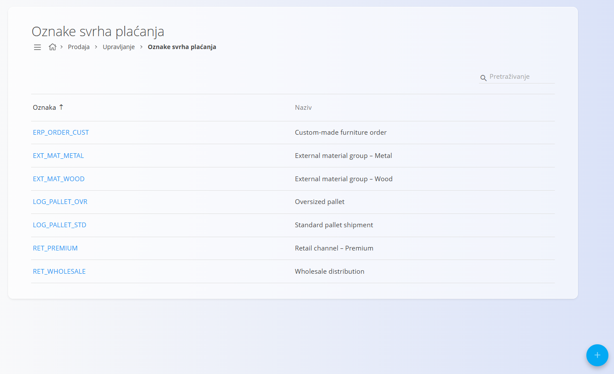
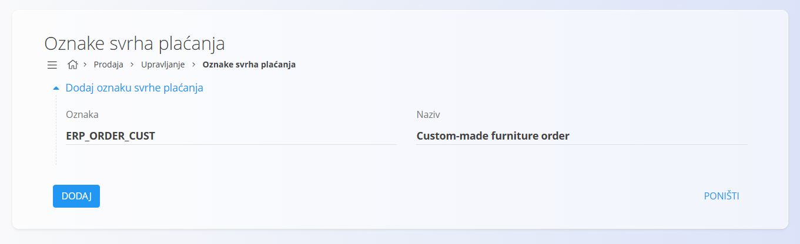

<!-- app_route: /management/common-types/external-code-sets -->
<!-- app_label: Oznake svrha plaćanja -->
<!-- canonical_source_url: https://github.com/Tom-PIT/Connected.Docs/blob/main/hr/Domene/Prodaja/Upravljanje/OznakeSvrhaPlacanja.md -->
<!-- canonical_source_title: Oznake svrha plaćanja -->

# Oznake svrha plaćanja

Šifrarnik **Oznake svrha plaćanja** omogućuje definiranje oznaka koje opisuju svrhu plaćanja na prodajnim dokumentima. Oznake se mogu koristiti za klasifikaciju dokumenata, izvještavanje ili razmjenu podataka s vanjskim sustavima.

Za pristup ovom dokumentu idite na **Prodaja / Upravljanje / Oznake svrha plaćanja** u [navigaciji](../../../Common/UI/Navigation.md).

> [!NOTE]
> Značenje pojedine oznake ovisi o načinu na koji se koristi u dokumentima ili integracijama.

## Shema

| Polje | Opis |
|-------|------|
| **Oznaka** | Jedinstvena oznaka svrhe plaćanja koja se koristi za identifikaciju. |
| **Naziv** | Naziv ili opis svrhe plaćanja. |

## Upravljanje

### Popis

Na zaslonu je prikazan popis svih definiranih oznaka svrha plaćanja.

Svaki zapis prikazuje:

- **Oznaku**
- **Naziv**

Pomoću polja **Pretraživanje** možete pretraživati oznake prema oznaci ili nazivu.

## Radnje

### Dodavanje oznake svrhe plaćanja

Kliknite [akcijski gumb](../../../Common/UI/ActionButton.md).

Unesite:

- **Oznaku**
- **Naziv**

Kliknite **Dodaj** za spremanje nove oznake.

### Uređivanje oznake svrhe plaćanja

Kliknite **oznaku** kako biste otvorili zapis.

Po potrebi promijenite vrijednosti polja **Oznaka** ili **Naziv**.

Kliknite **Spremi** za spremanje promjena ili **Poništi** za odustajanje.

### Brisanje oznake svrhe plaćanja

Otvorite zapis, a zatim na zaslonu s pojedinostima kliknite **Izbriši**.

Ako potvrdite brisanje, zapis će biti trajno uklonjen. U suprotnom neće biti promijenjen.

> [!NOTE]
> Oznaku svrhe plaćanja moguće je izbrisati samo ako nije korištena u drugim zapisima ili integracijama.