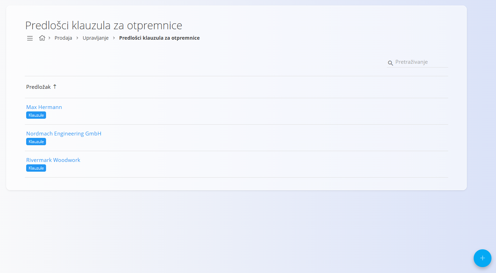
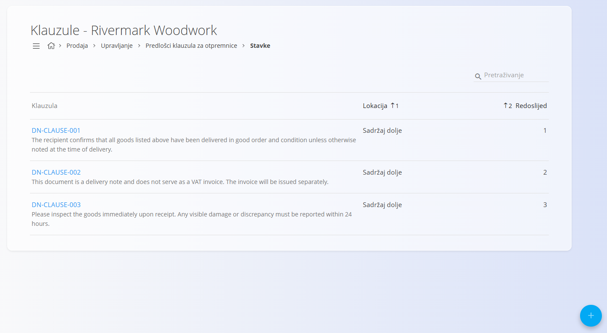
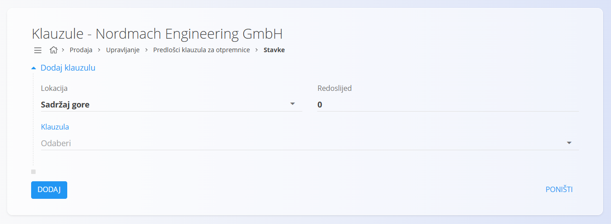

<!-- app_route: /management/sales/delivery-note-clause-templates -->
<!-- app_label: Predlošci klauzula za otpremnice -->
<!-- canonical_source_url: https://github.com/Tom-PIT/Connected.Docs/blob/main/hr/Domene/Prodaja/Upravljanje/PredlosciKlauzulaZaOtpremnice.md -->
<!-- canonical_source_title: Predlošci klauzula za otpremnice -->

# Predlošci klauzula za otpremnice

Šifrarnik **Predlošci klauzula za otpremnice** omogućuje definiranje skupova klauzula (predložaka) koji će se ispisivati na otpremnicama za određene tvrtke. Predložak sadrži jednu ili više klauzula, kao što su pravne napomene, izjave o odricanju odgovornosti ili potvrde isporuke, koje se ispisuju na vrhu ili dnu otpremnice prema definiranom redoslijedu.

Za pristup ovom dokumentu idite na **Prodaja / Upravljanje / Predlošci klauzula za otpremnice** u [navigaciji](../../../Zajednicko/UI/Navigacija.md).

> [!NOTE]
> **Preduvjeti**
>
> Prije izrade predložaka klauzula provjerite sljedeće:
>
> - Tvrtka postoji u [**Poslovnom imeniku**](../../../Zajednicko/Upravljanje/PoslovniImenik.md).
> - Tekst klauzule postoji u šifrarniku [**Unaprijed definirani tekstovi**](../../../Zajednicko/Upravljanje/UnaprijedPripremljeniTekstovi.md) (entitet: **Otpremnica**).

## Shema

### Polja predloška

| Polje | Opis |
|-------|------|
| [**Tvrtka**](../../../Zajednicko/Upravljanje/PoslovniImenik.md) | Tvrtka na koju se predložak klauzula primjenjuje (obavezno). |

### Polja klauzule

| Polje | Opis |
|-------|------|
| **Lokacija** | Određuje prikazuje li se klauzula na vrhu ili dnu otpremnice. |
| **Redoslijed** | Numerički redoslijed prikaza klauzule (npr. 1, 2, 3...). |
| [**Klauzula**](../../../Zajednicko/Upravljanje/UnaprijedPripremljeniTekstovi.md) | Unaprijed definirani tekst za entitet **Otpremnica**. |

## Upravljanje

### Popis predložaka

Na zaslonu je prikazan popis svih predložaka klauzula, grupiranih po tvrtkama.

Kliknite **Klauzule** za otvaranje popisa klauzula odabranog predloška.

Pomoću polja **Pretraživanje** možete filtrirati predloške prema nazivu tvrtke.

### Popis klauzula

Prikazane su sve klauzule dodijeljene odabranom predlošku prema definiranom redoslijedu.

Redoslijed klauzula možete promijeniti uređivanjem vrijednosti **Redoslijed**.

## Radnje

### Dodavanje predloška klauzula za otpremnice

Kliknite [akcijski gumb](../../../Zajednicko/UI/AkcijskiGumb.md) za dodavanje novog predloška.

Potrebno je unijeti samo jedno polje:

- [**Tvrtka**](../../../Zajednicko/Upravljanje/PoslovniImenik.md)

Nakon što izradite predložak, kliknite **Klauzule** kako biste otvorili uređivač klauzula.

#### Dodavanje klauzula u predložak

U uređivaču klauzula kliknite [akcijski gumb](../../../Zajednicko/UI/AkcijskiGumb.md) te odaberite:

- **Lokacija**
- **Redoslijed**
- [**Klauzula**](../../../Zajednicko/Upravljanje/UnaprijedPripremljeniTekstovi.md)

### Uređivanje predložaka i klauzula

Kliknite na **naziv tvrtke** za otvaranje predloška.

Kliknite na klauzulu koju želite urediti te po potrebi promijenite njezinu lokaciju, redoslijed ili unaprijed definirani tekst.

### Brisanje predložaka i klauzula

Otvorite predložak ili klauzulu, a zatim na zaslonu s pojedinostima kliknite **Izbriši**.

Ako potvrdite brisanje, zapis će biti trajno uklonjen. U suprotnom neće biti promijenjen.

> [!NOTE]
> Predložak klauzula ili pojedinačnu klauzulu moguće je izbrisati samo ako ih ne koriste drugi zapisi u sustavu.