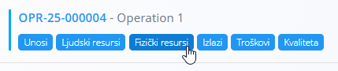
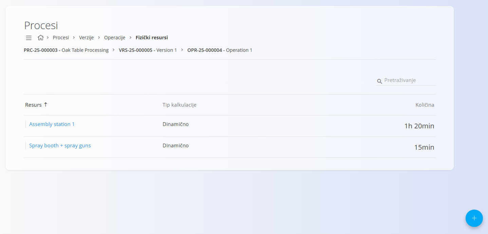
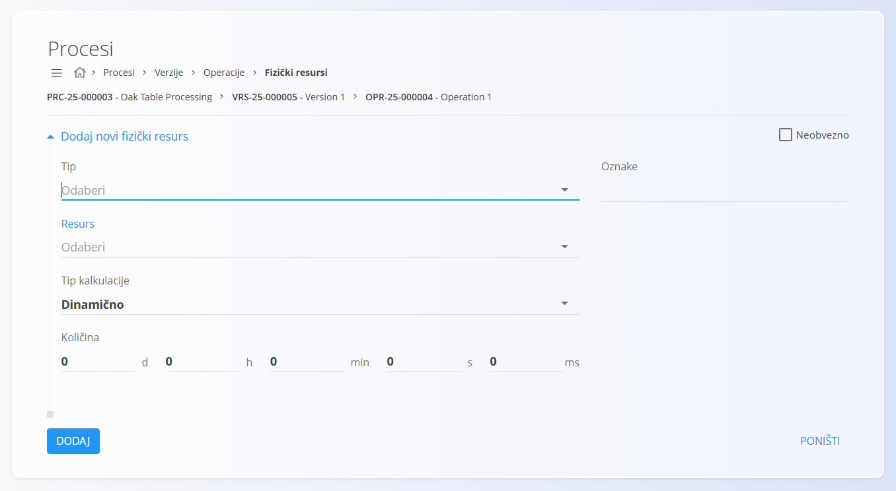

<!-- app_route: /management/processes -->
<!-- app_label: Procesi -->
<!-- app_navigation_hint: Otvorite proces, odaberite verziju, kliknite Operacije, a zatim otvorite Fizički resursi za odgovarajuću operaciju. -->
<!-- canonical_source_url: https://github.com/Tom-PIT/Connected.Docs/blob/main/hr/Domene/Proizvodnja/Upravljanje/FizickiResursi.md -->
<!-- canonical_source_title: Fizički resursi -->

# Fizički resursi

Fizički resursi određuju koji su strojevi, alati, oprema ili grupe resursa potrebni za izvođenje određene operacije unutar procesa. Svaki zapis predstavlja planirano vrijeme korištenja pojedinog fizičkog resursa.

Za pristup ovoj stranici otvorite **Proizvodnja / Upravljanje / [Procesi](Procesi.md)** u [navigaciji](../../../Zajednicko/UI/Navigacija.md), otvorite verziju procesa, kliknite [**Operacije**](Operacije.md), a zatim **Fizički resursi** za željenu operaciju.

> [!TIP]
> Za detaljan prikaz rada pogledajte video **[Human and Non-human resources](https://www.youtube.com/watch?v=iq7fQiPh_i4)**.

## Shema

| Polje | Opis |
|-------|------|
| **Tip** | Određuje vrstu fizičkog resursa: **Resurs** ili **Kategorija resursa**. |
| **Resurs** | Konkretan resurs ili kategorija resursa, ovisno o odabranom tipu. |
| **Tip kalkulacije** | Određuje način izračuna planiranog vremena: **Dinamično**, **Dinamično po seriji** ili **Statično**. |
| **Količina** | Planirano vrijeme korištenja resursa izraženo u danima, satima, minutama, sekundama i milisekundama. |
| **Oznake** | Opcionalne oznake za grupiranje i filtriranje fizičkih resursa. |
| **Neobvezno** | Kada je uključeno, resurs nije obvezan za izvođenje operacije. |

## Popis

Popis prikazuje sve fizičke resurse povezane s odabranom operacijom.

Za svaki fizički resurs prikazani su:

- Resurs
- Tip kalkulacije
- Količina

Za pronalaženje fizičkih resursa koristite **Pretraživanje**.

## Dodavanje fizičkog resursa

1. Kliknite [akcijski gumb](../../../Zajednicko/UI/AkcijskiGumb.md) u donjem desnom kutu i odaberite **Novi**.
2. Ispunite potrebna polja.

    

3. Kliknite **Dodaj**.

## Uređivanje fizičkog resursa

1. Odaberite fizički resurs iz popisa.
2. Po potrebi izmijenite podatke.
3. Kliknite **Spremi**.

## Brisanje fizičkog resursa

Za brisanje odaberite fizički resurs iz popisa i kliknite **Izbriši**.

Nakon potvrde, fizički resurs bit će uklonjen s operacije.