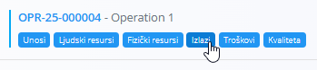
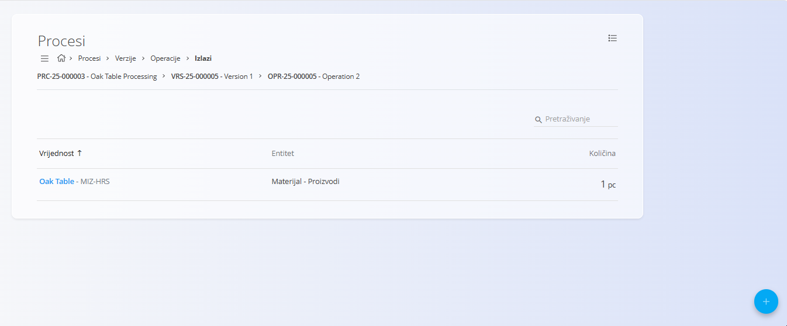
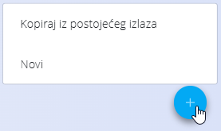
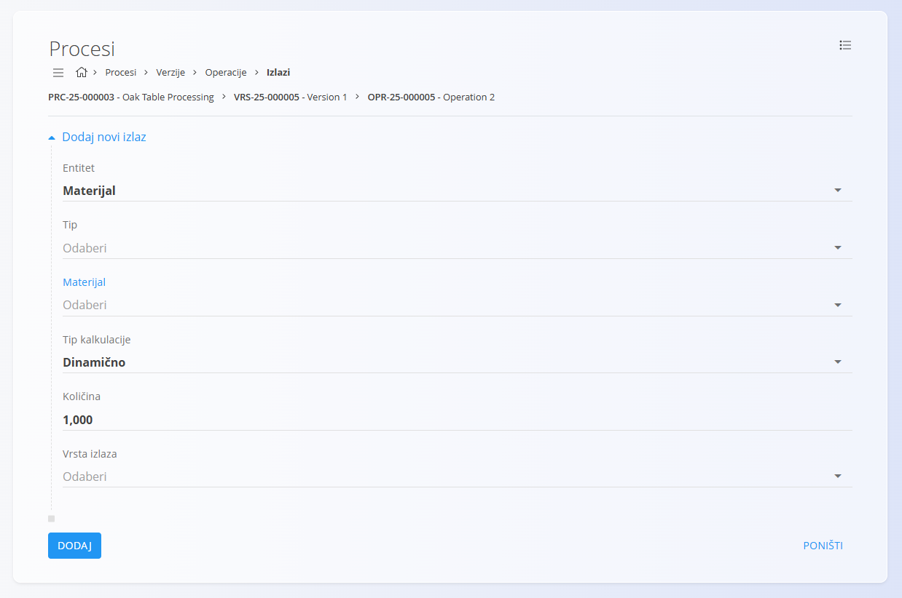

<!-- app_route: /management/processes -->
<!-- app_label: Izlazi -->
<!-- app_navigation_hint: Otvorite proces, odaberite verziju, kliknite Operacije, a zatim otvorite Izlazi za odgovarajuću operaciju. -->
<!-- canonical_source_url: https://github.com/Tom-PIT/Connected.Docs/blob/main/hr/Domene/Proizvodnja/Upravljanje/Izlazi.md -->
<!-- canonical_source_title: Izlazi -->

# Izlazi

Izlazi definiraju **materijale nastale** tijekom izvođenja operacije unutar verzije procesa. Svaki izlaz određuje koji se proizvod ili materijal proizvodi, u kojoj količini te kako se ta količina izračunava.

Izlazima se upravlja unutar pojedine **operacije**.

Za pristup ovoj stranici otvorite **Proizvodnja / Upravljanje / [Procesi](Procesi.md)** u [navigaciji](../../../Zajednicko/UI/Navigacija.md), otvorite verziju procesa, kliknite [**Operacije**](Operacije.md), a zatim **Izlazi** za željenu operaciju.

> [!TIP]
> Za detaljan prikaz rada pogledajte video **[Inputs & Outputs](https://www.youtube.com/watch?v=647sT70tNZc)**.

## Shema

| Polje | Opis |
|-------|------|
| **Entitet** | Odaberite odnosi li se izlaz na **Materijal** ili **Oznaku materijala**. |
| **Tip** | Vrsta materijala. Dostupne vrijednosti ovise o odabranom entitetu. |
| **Materijal** | Materijal ili proizvod koji nastaje izvođenjem operacije. |
| **Tip kalkulacije** | Određuje način izračuna količine: **Dinamično** ili **Statično**. |
| **Količina** | Proizvedena količina. Mjerna jedinica preuzima se s odabranog materijala. |
| **Vrsta izlaza** | Dodatna klasifikacija izlaza. |
| **Oznake** | Opcionalne oznake za grupiranje i filtriranje izlaza. |
| **Redoslijed** | Određuje redoslijed prikaza izlaza (počevši od 0). |

## Popis

Popis prikazuje sve izlaze povezane s odabranom operacijom.

Za svaki izlaz prikazani su:

- Vrijednost
- Entitet
- Količina

Za pronalaženje izlaza koristite **Pretraživanje**.

### Izbornik

Izbornik u gornjem desnom kutu omogućuje sljedeću radnju:

- **Izbriši sve izlaze** – Briše sve izlaze povezane s operacijom.

## Dodavanje izlaza

1. Kliknite [akcijski gumb](../../../Zajednicko/UI/AkcijskiGumb.md) u donjem desnom kutu i odaberite jednu od sljedećih mogućnosti:

    - **Kopiraj iz postojećeg izlaza**
    - **Novi**

    

2. Ispunite potrebna polja.

    

3. Kliknite **Dodaj**.

## Uređivanje izlaza

1. Odaberite izlaz iz popisa.
2. Po potrebi izmijenite podatke.
3. Kliknite **Spremi**.

## Brisanje izlaza

Za brisanje odaberite izlaz iz popisa i kliknite **Izbriši**.

Nakon potvrde, izlaz će biti uklonjen s operacije.