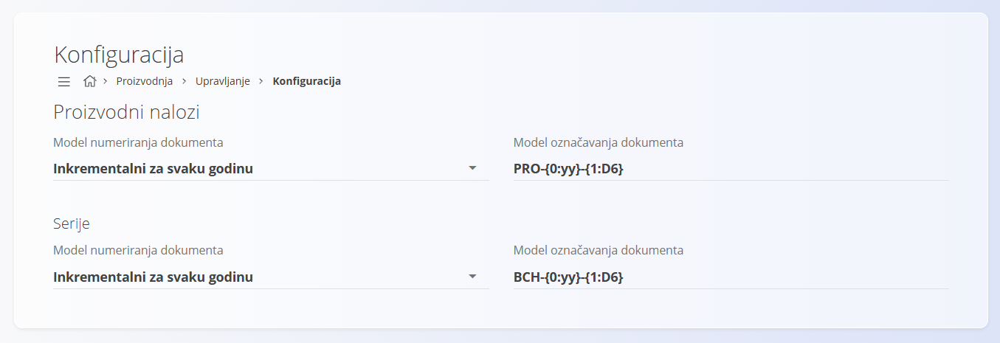

<!-- app_route: /management/production/configuration -->
<!-- app_label: Konfiguracija proizvodnje -->
<!-- canonical_source_url: https://github.com/Tom-PIT/Connected.Docs/blob/main/hr/Proizvodnja/Upravljanje/KonfiguracijaProizvodnje.md -->
<!-- canonical_source_title: Konfiguracija proizvodnje -->

# Konfiguracija proizvodnje

Na ovoj stranici konfiguriraju se postavke **Proizvodnje** koje utječu na numeriranje dokumenata. Sve promjene spremaju se automatski.

Za pristup ovoj stranici otvorite **Proizvodnja / Upravljanje / Konfiguracija** u [navigaciji](../../../Zajednicko/UI/Navigacija.md).

## Postavke numeriranja dokumenata

Odaberite model numeriranja i format oznaka za dokumente proizvodnje (proizvodni nalozi, zahtjevi, evidencije izvršavanja i zapisi kvalitete).

| Polje | Opis |
|-------|------|
| **Model numeriranja dokumenta** | • **Inkrementalni za svaku godinu** – numeriranje se ponovno pokreće na početku svake godine. • **Inkrementalni** – jedinstveni slijed numeriranja koji se nikada ne resetira. |
| **Model označavanja dokumenta** | Predložak koji definira strukturu oznake dokumenta (npr. PREFIX-GODINA-BROJ). |

