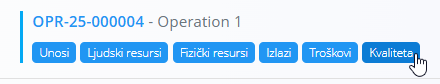
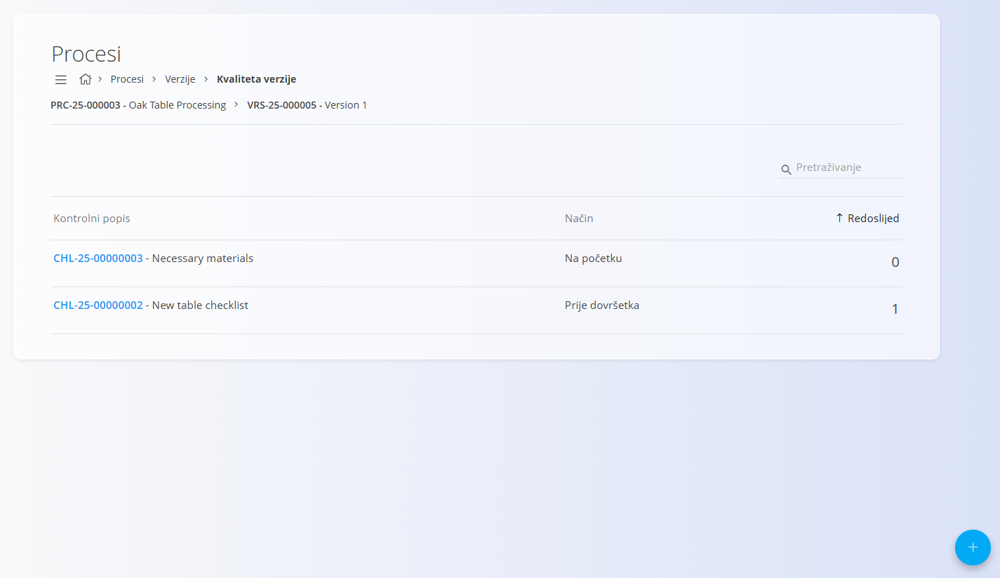
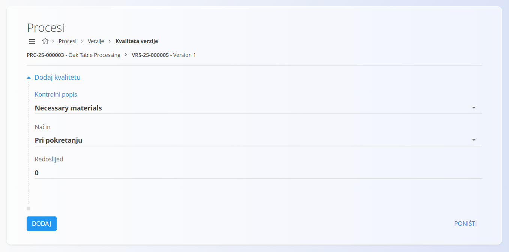
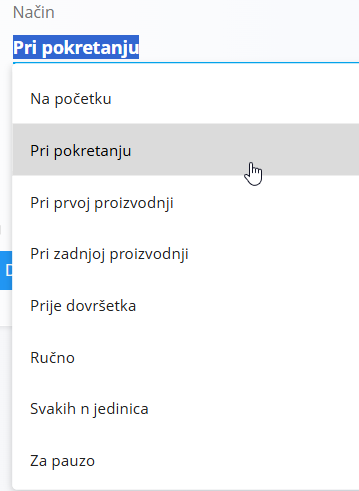

<!-- app_route: /management/processes -->
<!-- app_label: Procesi -->
<!-- app_navigation_hint: Razina procesa: otvorite proces, odaberite odgovarajuću verziju i otvorite **Kvaliteta**.
Razina operacije: otvorite proces, odaberite verziju, kliknite **Operacije**, a zatim otvorite **Kvaliteta** za odgovarajuću operaciju. -->
<!-- canonical_source_url: https://github.com/Tom-PIT/Connected.Docs/blob/main/hr/Domene/Proizvodnja/Upravljanje/KontrolniPopisiKvalitete.md -->
<!-- canonical_source_title: Kvaliteta — Kontrolni popisi izvođenja -->

# Kvaliteta — Kontrolni popisi izvođenja

Stranica **Kvaliteta** omogućuje povezivanje **[kontrolnih popisa](../../Kvaliteta/Upravljanje/KontrolniPopisi.md)** s **verzijom procesa** ili **operacijom**. Ti se kontrolni popisi koriste za provođenje koraka kontrole kvalitete tijekom proizvodnje.

Za pristup ovoj stranici kliknite **Kvaliteta** na:

- **Verziji procesa**

  

- **Operaciji**

  

> [!NOTE]
> Najprije kreirajte kontrolni popis u šifrarniku **[Kontrolni popisi](../../Kvaliteta/Upravljanje/KontrolniPopisi.md)**. Ovdje se mogu povezati samo već definirani kontrolni popisi.

> [!TIP]
> Za potpuni prikaz funkcionalnosti pogledajte video vodič **[Kvaliteta](https://www.youtube.com/watch?v=B2KX_UvDiCw)**.

## Shema

| Polje | Opis |
|------|------|
| **Kontrolni popis** | Kontrolni popis kvalitete koji će se izvršavati tijekom operacije ili verzije procesa. |
| **Način** | Određuje kada se kontrolni popis izvršava: • **Ručno** • **Prije dovršetka** • **Svakih n jedinica** • **Pri prvoj proizvodnji** • **Pri zadnjoj proizvodnji** • **Za pauzu** • **Pri pokretanju** • **Na početku** |
| **Redoslijed** | Određuje redoslijed izvršavanja kontrolnog popisa u odnosu na ostale kontrolne popise povezane s istom operacijom ili verzijom procesa. |
| **Materijal** | Neobavezni materijal na koji se kontrolni popis odnosi. Koristi se kada se kontrola kvalitete provodi za određeni materijal. Pogledajte **[Materijali](../../RobaIUsluge/Materijali/README.md)**. |
| **Period** | Određuje broj proizvedenih jedinica nakon kojeg se kontrolni popis pokreće. Ovo je polje dostupno samo kada je **Način = Svakih n jedinica**. |

## Prikaz popisa

Prilikom otvaranja stranice **Kvaliteta** prikazuju se svi kontrolni popisi povezani s odabranom verzijom procesa ili operacijom.

Redoslijed zapisa možete promijeniti izmjenom vrijednosti polja **Redoslijed**.

## Dodavanje novog kontrolnog popisa

1. Kliknite [akcijski gumb](../../../Zajednicko/UI/AkcijskiGumb.md) i odaberite **Novi**.

   

2. Odaberite **Kontrolni popis** i **Način**:

   - **Ručno** – operater ručno otvara i izvršava kontrolni popis tijekom izvođenja operacije.
   - **Prije dovršetka** – kontrolni popis mora biti dovršen prije završetka operacije.
   - **Svakih n jedinica** – kontrolni popis pokreće se periodično nakon određenog broja proizvedenih jedinica (potrebno je definirati **Period**).
   - **Pri prvoj proizvodnji** – kontrolni popis pokreće se nakon proizvodnje prve jedinice.
   - **Pri zadnjoj proizvodnji** – kontrolni popis pokreće se nakon proizvodnje posljednje jedinice.
   - **Za pauzu** – kontrolni popis pokreće se kada se operacija pauzira.
   - **Pri pokretanju** – kontrolni popis pokreće se prilikom pokretanja operacije.
   - **Na početku** – kontrolni popis pokreće se na početku operacije.

   

3. Kliknite **Dodaj**.

## Uređivanje kontrolnog popisa

1. Na popisu kliknite postojeći zapis.
2. Po potrebi izmijenite **Kontrolni popis**, **Način** ili **Redoslijed**.
3. Kliknite **Spremi**.

## Brisanje kontrolnog popisa

Otvorite željeni zapis i kliknite **Izbriši**.

Potvrdite brisanje kako biste uklonili kontrolni popis.