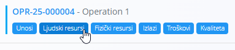
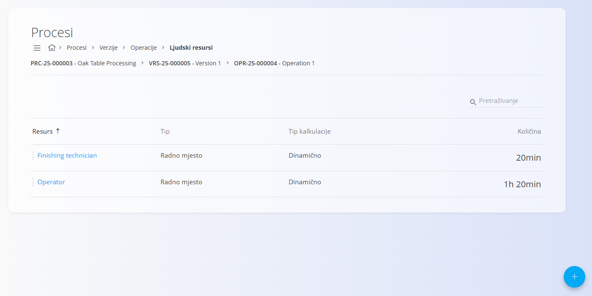
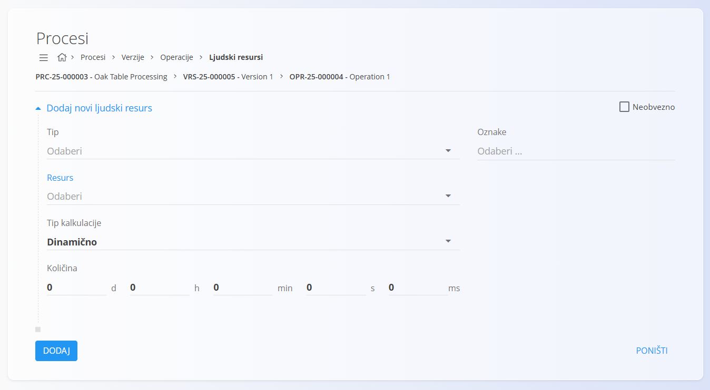

<!-- app_route: /management/processes -->
<!-- app_label: Procesi -->
<!-- app_navigation_hint: Otvorite proces, odaberite verziju, kliknite Operacije, a zatim otvorite Ljudski resursi za odgovarajuću operaciju. -->
<!-- canonical_source_url: https://github.com/Tom-PIT/Connected.Docs/blob/main/hr/Domene/Proizvodnja/Upravljanje/LjudskiResursi.md -->
<!-- canonical_source_title: Ljudski resursi -->

# Ljudski resursi

Ljudski resursi određuju koje su osobe, radna mjesta ili kompetencije potrebni za izvođenje određene operacije unutar procesa. Svaki zapis predstavlja planirano vrijeme potrebno za izvršenje operacije.

Za pristup ovoj stranici otvorite **Proizvodnja / Upravljanje / [Procesi](Procesi.md)** u [navigaciji](../../../Zajednicko/UI/Navigacija.md), otvorite verziju procesa, kliknite [**Operacije**](Operacije.md), a zatim **Ljudski resursi** za željenu operaciju.

> [!TIP]
> Za detaljan prikaz rada pogledajte video **[Human and Non-human resources](https://www.youtube.com/watch?v=iq7fQiPh_i4)**.

## Shema

| Polje | Opis |
|-------|------|
| **Tip** | Određuje vrstu ljudskog resursa: **Kompentencija**, **Radno mjesto** ili **Resurs**. |
| **Resurs** | Konkretna kompetencija, radno mjesto ili resurs, ovisno o odabranom tipu. |
| **Tip kalkulacije** | Određuje način izračuna planiranog vremena: **Dinamično** ili **Statično**. |
| **Količina** | Planirano trajanje rada izraženo u danima, satima, minutama, sekundama i milisekundama. |
| **Oznake** | Opcionalne oznake za grupiranje i filtriranje ljudskih resursa. |
| **Neobvezno** | Kada je uključeno, resurs nije obvezan za izvođenje operacije. |

## Popis

Popis prikazuje sve ljudske resurse povezane s odabranom operacijom.

Za svaki ljudski resurs prikazani su:

- Resurs
- Tip
- Tip kalkulacije
- Količina

Za pronalaženje ljudskih resursa koristite **Pretraživanje**.

## Dodavanje ljudskog resursa

1. Kliknite [akcijski gumb](../../../Zajednicko/UI/AkcijskiGumb.md) u donjem desnom kutu i odaberite **Novi**.
2. Ispunite potrebna polja.

    

3. Kliknite **Dodaj**.

## Uređivanje ljudskog resursa

1. Odaberite ljudski resurs iz popisa.
2. Po potrebi izmijenite podatke.
3. Kliknite **Spremi**.

## Brisanje ljudskog resursa

Za brisanje odaberite ljudski resurs iz popisa i kliknite **Izbriši**.

Nakon potvrde, ljudski resurs bit će uklonjen s operacije.
