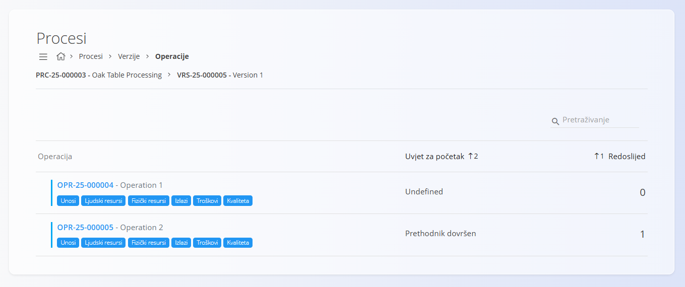
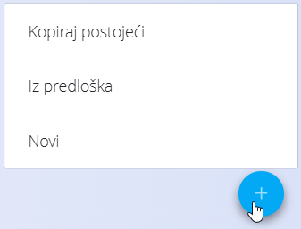
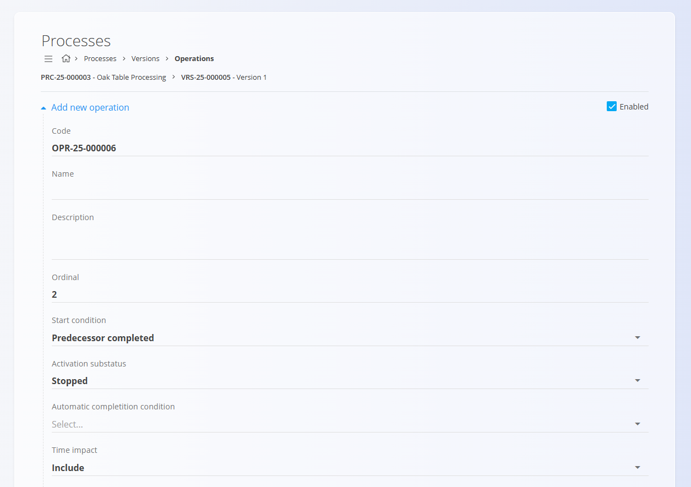
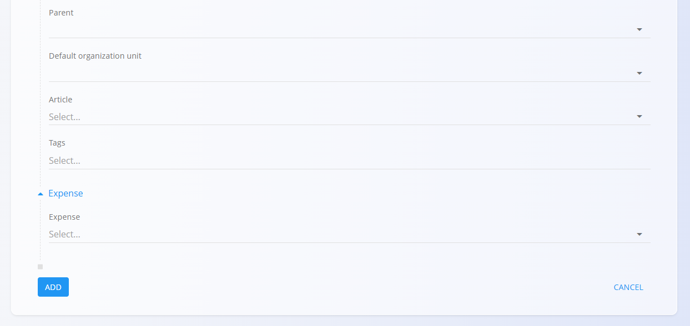

<!-- app_route: /management/processes -->
<!-- app_label: Processes -->
<!-- app_navigation_hint: Open a process, select a version, click Operations, then open the relevant operation. -->
<!-- canonical_source_url: https://github.com/Tom-PIT/Connected.Docs/blob/main/hr/Domene/Proizvodnja/Upravljanje/Operacije.md -->
<!-- canonical_source_title: Operacije -->

# Operacije

Operacije predstavljaju **pojedinačne korake unutar verzije procesa**. Svaka verzija procesa sadrži jednu ili više operacija koje se izvršavaju redoslijedom ili prema definiranim uvjetima. Operacije određuju **koji se resursi koriste**, **kojim se ulazima i izlazima upravlja**, **koliko traje pojedini korak** te **koje se organizacijske jedinice, troškovi i zahtjevi kvalitete primjenjuju**.

Za pristup operacijama:

1. Otvorite **Proizvodnja / Upravljanje / Procesi** u [navigaciji](../../../Zajednicko/UI/Navigacija.md).
2. Odaberite željeni [**Proces**](Procesi.md).
3. Otvorite **Verzije**.
4. Kliknite **Operacije**.

> [!TIP]
> Za detaljan prikaz rada pogledajte video vodič **[Operations](https://www.youtube.com/watch?v=rPyLL6pSZA0)**.

## Shema

| Polje | Opis |
|-------|------|
| [**Oznaka**](../../../Zajednicko/UI/OznakeDokumenata.md) | Automatski generirana oznaka operacije (nije moguće uređivati). |
| **Naziv** | Naziv operacije (obavezno). |
| **Opis** | Dodatni opis operacije (nije obavezno). |
| **Redoslijed** | Određuje redoslijed izvršavanja operacije unutar verzije procesa. |
| **Uvjet za početak** | Određuje kada se operacija može pokrenuti: • Nedefinirano • Prethodnik aktiviran • Prethodnik dovršen • Bilo kada |
| **Podstatus aktivacije** | Početno stanje operacije: **Pokrenut** ili **Zaustavljen**. |
| **Uvjet za automatsko dovršavanje** | Određuje hoće li se operacija automatski završiti (npr. nakon isteka vremena izvršavanja). |
| **Utjecaj vremena** | Određuje utječe li trajanje operacije na ukupno trajanje procesa: • Nedefinirano • Uključi • Isključi |
| **Nadređen** | Omogućuje postavljanje operacije kao podređene drugoj operaciji. |
| **Zadana organizacijska jedinica** | Organizacijska jedinica odgovorna za izvođenje operacije. |
| **Članak** | Poveznica na članak iz [**Baze znanja**](../../Znanje/BazaZnanja/BazaZnanja.md) s dodatnim uputama, opisima ili slikama (nije obavezno). |
| **Oznake** | Oznake za grupiranje ili kategorizaciju operacija (nije obavezno). |
| [**Trošak**](../../Nabava/Upravljanje/Troskovi.md) | Kategorija troška povezana s operacijom. |

## Popis

Popis prikazuje sve operacije definirane unutar odabrane verzije procesa.

Svaki red sadrži:

- Oznaku i naziv operacije
- Uvjet za početak
- Redoslijed
- Gumbe za brzi pristup:
    - **[Unosi](Unosi.md)** – Materijali ili artikli koji se troše tijekom operacije.
    - **[Ljudski resursi](LjudskiResursi.md)** – Zaposlenici ili radna mjesta potrebna za izvođenje operacije.
    - **[Fizički resursi](FizickiResursi.md)** – Strojevi ili oprema.
    - **[Izlazi](Izlazi.md)** – Materijali ili artikli nastali izvođenjem operacije.
    - **[Troškovi](TroskoviOperacije.md)** – Troškovi povezani s operacijom.
    - **[Kvaliteta](KontrolniPopisiKvalitete.md)** – Dodijeljeni kontrolni popisi i zahtjevi kvalitete.

Za pronalaženje operacija prema nazivu ili oznaci koristite **Pretraživanje**.

## Dodavanje operacije

1. Kliknite [akcijski gumb](../../../Zajednicko/UI/AkcijskiGumb.md) i odaberite jednu od sljedećih opcija:
    - **Novi**
    - **Iz predloška** – ako su dostupni predlošci u dokumentu [**Predlošci instanci operacija protokola**](PravilniciZaOperacije.md#dodavanje-pravilnika-za-operaciju).
    - **Kopiraj postojeći**

    

2. Ispunite potrebna polja.

    

    

3. Kliknite **Dodaj**.

## Uređivanje operacije

Za uređivanje postojeće operacije:

1. Odaberite operaciju iz popisa.
2. Po potrebi izmijenite podatke.
3. Kliknite **Spremi**.

Operacije se mogu **omogućiti** ili **onemogućiti**, čime se određuje hoće li biti dostupne tijekom izvršavanja procesa.

## Uvjeti pokretanja i redoslijed

Operacije se izvršavaju prema vrijednosti polja **Redoslijed**, osim ako je drugačije određeno u polju **Uvjet za početak**.

Primjeri:

- **Prethodnik dovršen** – operacija započinje nakon završetka prethodne operacije.
- **Prethodnik aktiviran** – operacija započinje čim prethodna operacija postane aktivna.
- **Bilo kada** – operacija se može pokrenuti neovisno o ostalim operacijama.

Ova pravila određuju tijek izvođenja procesa.

## Povezani dokumenti

Svaka operacija sadrži nekoliko dodatnih stranica koje su dokumentirane zasebno:

- **[Unosi](Unosi.md)**
- **[Ljudski resursi](LjudskiResursi.md)**
- **[Fizički resursi](FizickiResursi.md)**
- **[Izlazi](Izlazi.md)**
- **[Troškovi](TroskoviOperacije.md)**
- **[Kvaliteta](KontrolniPopisiKvalitete.md)**

Njima možete pristupiti pomoću gumba unutar retka operacije.

## Brisanje operacije

Operaciju je moguće izbrisati na stranici za uređivanje samo ako:

- nije postavljena kao nadređena drugoj operaciji
- nije korištena u aktivnim proizvodnim nalozima

Za brisanje odaberite operaciju iz popisa i kliknite **Izbriši**.

Ako je operaciju moguće izbrisati, nakon potvrde bit će trajno uklonjena iz verzije procesa.