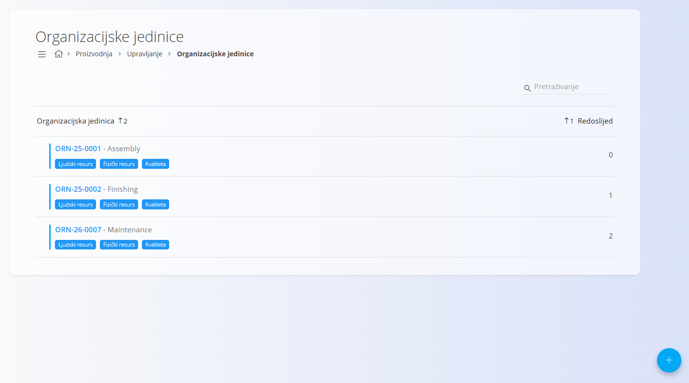
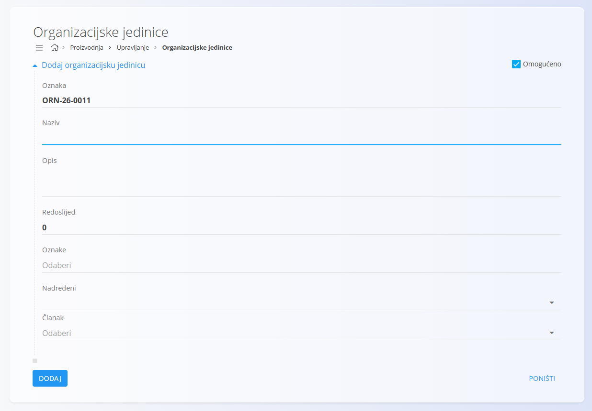
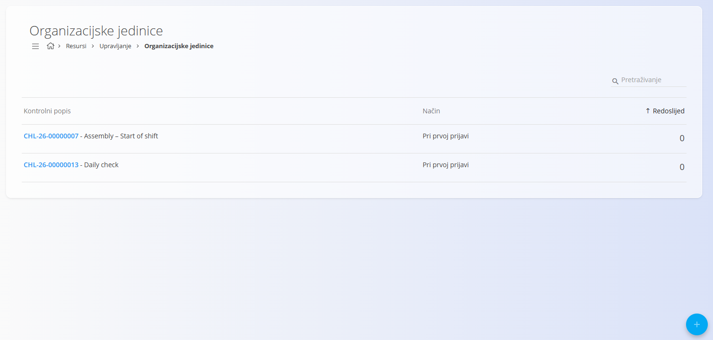
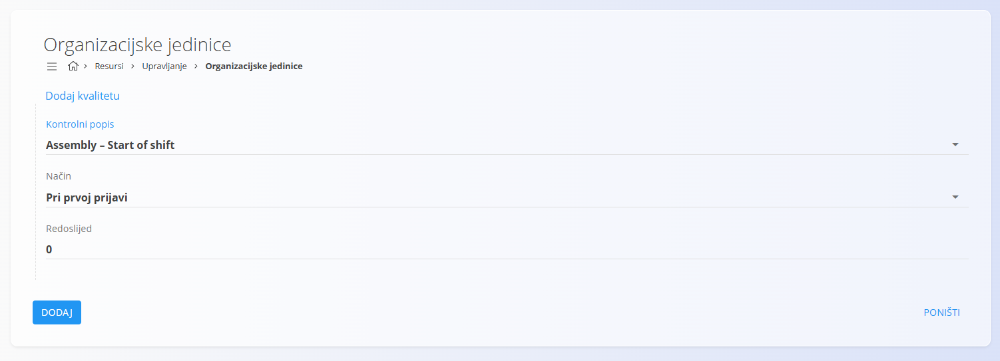
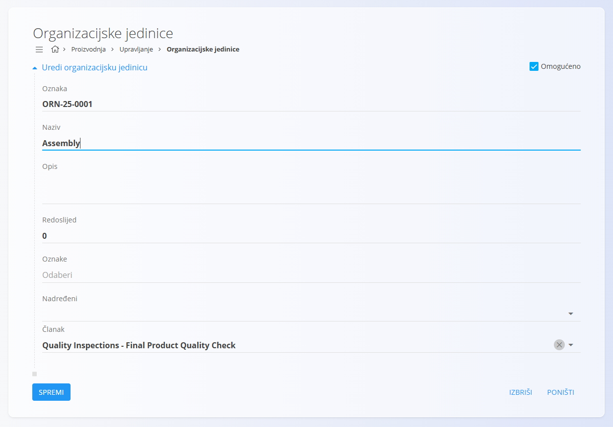

<!-- app_route: /management/resources/organization-units -->
<!-- app_label: Organizacijske jedinice -->
<!-- canonical_source_url: https://github.com/Tom-PIT/Connected.Docs/blob/main/hr/Domene/Proizvodnja/Upravljanje/OrganizacijskeJedinice.md -->
<!-- canonical_source_title: Organizacijske jedinice -->

# Organizacijske jedinice

Šifrarnik **Organizacijske jedinice** definira organizacijske cjeline koje se koriste u modulima **Proizvodnja** i **Održavanje**, primjerice proizvodne ćelije, montažne linije, odjele održavanja ili servisne timove.

Organizacijske jedinice koriste se za organizaciju proizvodnje, dodjelu operacija, filtriranje podataka i povezivanje ljudskih resursa, fizičkih resursa i kontrolnih popisa kvalitete.

Za pristup ovoj stranici otvorite **Proizvodnja / Upravljanje / Organizacijske jedinice** u [navigaciji](../../../Zajednicko/UI/Navigacija.md).

> [!TIP]
> Za detaljan prikaz rada pogledajte video **[Organization units](https://www.youtube.com/watch?v=qGkHEuOEWT4)**.

## Shema

| Polje | Opis |
|-------|------|
| [**Oznaka**](../../../Zajednicko/UI/OznakeDokumenata.md) | Jedinstvena oznaka organizacijske jedinice koju generira sustav. |
| **Naziv** | Naziv organizacijske jedinice. |
| **Opis** | Kratak opis organizacijske jedinice. |
| **Redoslijed** | Redoslijed prikaza organizacijske jedinice u popisima. |
| **Oznake** | Opcionalne oznake za grupiranje i filtriranje organizacijskih jedinica. |
| **Nadređeni** | Nadređena organizacijska jedinica u hijerarhiji. |
| **Članak** | Članak iz [Baze znanja](../../Znanje/BazaZnanja/BazaZnanja.md) povezan s organizacijskom jedinicom. |
| **Omogućeno** | Određuje je li organizacijska jedinica dostupna za korištenje. |

## Popis

Popis prikazuje sve organizacijske jedinice.

Za svaku organizacijsku jedinicu prikazani su:

- Oznaka
- Naziv
- Oznake
- Redoslijed

Za pronalaženje organizacijskih jedinica koristite **Pretraživanje**.

Plava oznaka uz zapis označava aktivnu organizacijsku jedinicu, dok siva oznaka označava neaktivnu organizacijsku jedinicu.

Gumbi na kartici omogućuju upravljanje:

- [Ljudskim resursima](LjudskiResursi.md)
- [Fizičkim resursima](FizickiResursi.md)
- Kvalitetom

## Dodavanje organizacijske jedinice

Kliknite [akcijski gumb](../../../Zajednicko/UI/AkcijskiGumb.md).

Ispunite potrebna polja.

Kliknite **Dodaj**.

## Kvaliteta

Organizacijskim jedinicama moguće je dodijeliti [kontrolne popise](../../Kvaliteta/Upravljanje/KontrolniPopisi.md) koji se izvršavaju tijekom rada organizacijske jedinice.

> [!NOTE]
> Trenutno je dostupan samo način **Pri prvoj prijavi**.

### Dodavanje kontrolnog popisa

1. Na kartici organizacijske jedinice kliknite **Kvaliteta**.
2. Kliknite [akcijski gumb](../../../Zajednicko/UI/AkcijskiGumb.md).
3. Odaberite:
   - **Kontrolni popis**
   - **Način**
   - **Redoslijed**
4. Kliknite **Dodaj**.

## Uređivanje organizacijske jedinice

1. Odaberite organizacijsku jedinicu iz popisa.
2. Po potrebi izmijenite podatke.

3. Kliknite **Spremi**.

## Brisanje organizacijske jedinice

Za brisanje odaberite organizacijsku jedinicu iz popisa i kliknite **Izbriši**.

Nakon potvrde, organizacijska jedinica bit će uklonjena iz sustava.