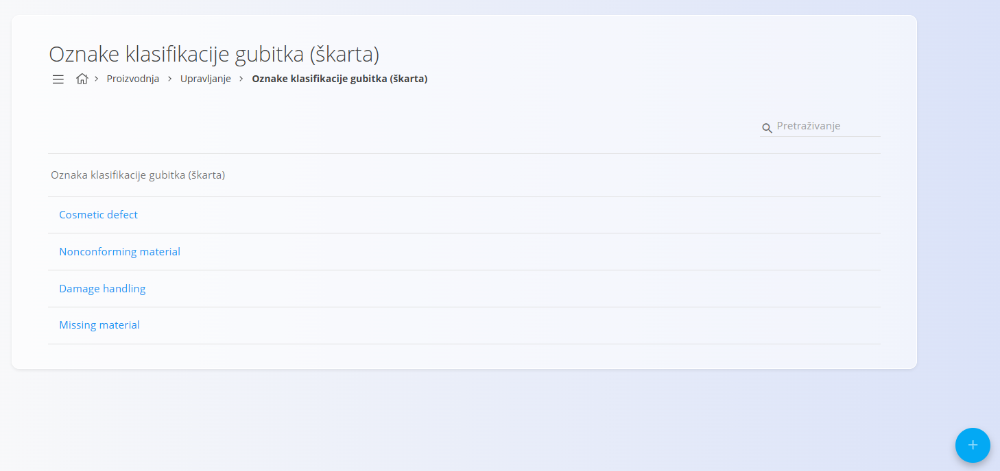

<!-- app_route: /management/incompliant-production-tags -->
<!-- app_label: Oznake klasifikacije gubitka (škarta) -->
<!-- canonical_source_url: https://github.com/Tom-PIT/Connected.Docs/blob/main/hr/Proizvodnja/Upravljanje/OznakeKlasifikacijeGubitka.md -->
<!-- canonical_source_title: Oznake klasifikacije gubitka (škarta) -->

# Oznake klasifikacije gubitka (škarta)

Oznake klasifikacije gubitka koriste se u proizvodnji za klasifikaciju i evidentiranje različitih vrsta proizvodnih gubitaka, kao što su neispravan materijal, oštećenja tijekom rukovanja ili estetski nedostaci. Ove oznake pomažu pri utvrđivanju uzroka škarta te služe kao osnova za izvještavanje i analizu proizvodnih gubitaka.

Za pristup ovoj stranici otvorite **Proizvodnja / Upravljanje / Oznake klasifikacije gubitka (škarta)** u [navigaciji](../../../Zajednicko/UI/Navigacija.md).

> [!TIP]
> Za detaljan prikaz pogledajte video **[Oznake klasifikacije gubitka](https://www.youtube.com/watch?v=pC8TELowUgA)**.

## Shema

<strong>Oznaka klasifikacije gubitka (škarta)</strong>

| Polje | Opis |
|-------|------|
| **Naziv** | Naziv kategorije proizvodnog gubitka (npr. Estetski nedostatak, Oštećenje tijekom rukovanja) (obavezno). |

## Pregled popisa

Popis prikazuje sve oznake klasifikacije gubitka definirane u sustavu. Polje **Pretraživanje** omogućuje brzo filtriranje prema nazivu.

## Dodavanje oznake klasifikacije gubitka

1. Kliknite [akcijski gumb](../../../Zajednicko/UI/AkcijskiGumb.md) u donjem desnom kutu.
2. Unesite **Naziv** kategorije proizvodnog gubitka.

    

3. Kliknite **Dodaj**.

## Uređivanje oznake klasifikacije gubitka

1. Kliknite oznaku u popisu.
2. Po potrebi promijenite **Naziv**.
3. Kliknite **Spremi**.

## Brisanje oznake klasifikacije gubitka

Za brisanje oznake otvorite njezine detalje i kliknite **Izbriši**. Nakon potvrde, oznaka se trajno uklanja iz sustava.