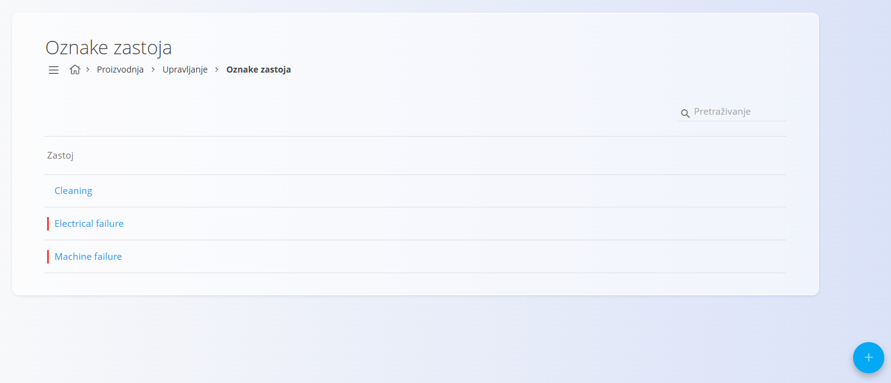
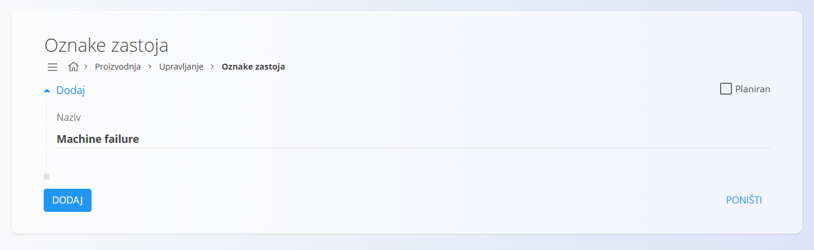
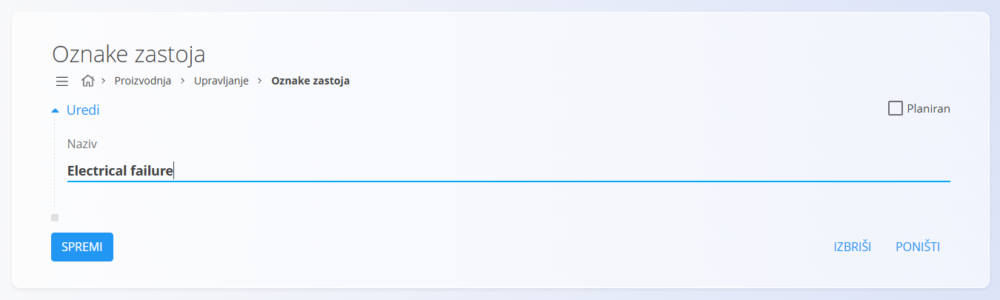

<!-- app_route: /management/downtime -->
<!-- app_label: Oznake zastoja -->
<!-- canonical_source_url: https://github.com/Tom-PIT/Connected.Docs/blob/main/hr/Domene/Proizvodnja/Upravljanje/OznakeZastoja.md -->
<!-- canonical_source_title: Oznake zastoja -->

# Oznake zastoja

Oznake zastoja koriste se za klasifikaciju i evidentiranje razloga prekida proizvodnih procesa. Omogućuju praćenje uzroka zastoja, kao što su kvarovi opreme, planirano održavanje ili čišćenje, a koriste se i u proizvodnim izvješćima te analizama učinkovitosti.

Za pristup ovoj stranici otvorite **Proizvodnja / Upravljanje / Oznake zastoja** u [navigaciji](../../../Zajednicko/UI/Navigacija.md).

> [!TIP]
> Za detaljan prikaz pogledajte video **[Oznake zastoja](https://www.youtube.com/watch?v=pgYdfZoKnOA)**.

## Shema

| Polje | Opis |
|-------|------|
| **Naziv** | Naziv razloga zastoja (npr. Kvar stroja, Čišćenje) (obavezno). |
| **Planiran** | Označava je li zastoj planiran. Neplanirani zastoji prikazani su crvenom oznakom radi lakšeg razlikovanja. |

## Pregled popisa

Popis prikazuje sve oznake zastoja definirane u sustavu. Polje **Pretraživanje** omogućuje filtriranje oznaka prema nazivu.

- Neplanirane oznake zastoja prikazane su s **crvenom oznakom**.

## Dodavanje oznake zastoja

1. Kliknite [akcijski gumb](../../../Zajednicko/UI/AkcijskiGumb.md) u donjem desnom kutu.

2. Unesite sljedeće podatke:
    - **Naziv** – naziv razloga zastoja.
    - **Planiran** – uključite ovu opciju ako je zastoj planiran (npr. preventivno održavanje).

    

3. Kliknite **Dodaj**.

## Uređivanje oznake zastoja

Za uređivanje oznake:

1. Kliknite oznaku u popisu.
2. Po potrebi promijenite **Naziv** ili postavku **Planiran**.

    

3. Kliknite **Spremi**.

## Brisanje oznake zastoja

Za brisanje oznake otvorite njezine detalje i kliknite **Izbriši**. Nakon potvrde, oznaka se trajno uklanja iz sustava.