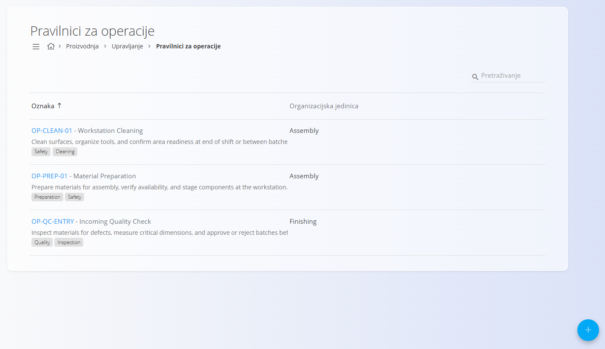
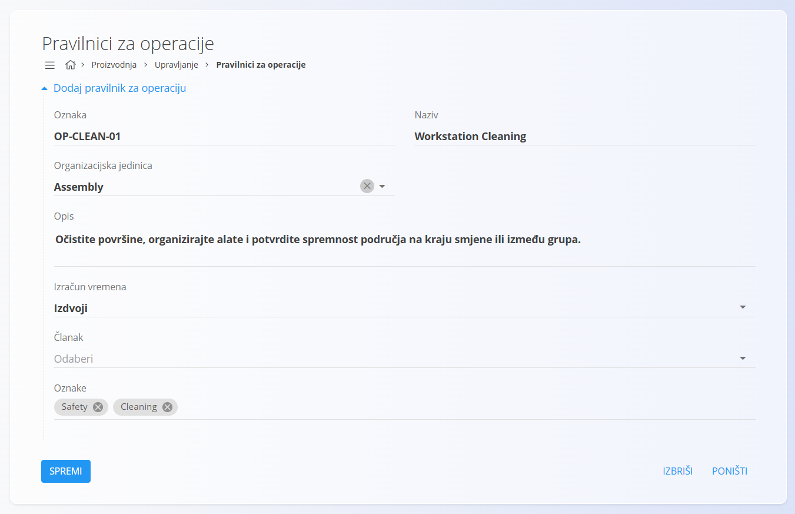
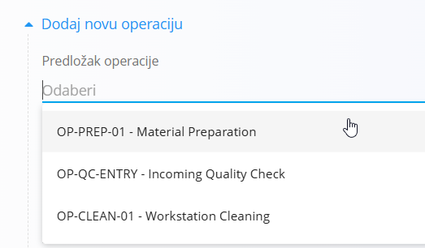

<!-- app_route: /management/processes/protocol-operation-templates -->
<!-- app_label: Pravilnici za operacije -->
<!-- canonical_source_url: https://github.com/Tom-PIT/Connected.Docs/blob/main/hr/Domene/Proizvodnja/Upravljanje/PravilniciZaOperacije.md -->
<!-- canonical_source_title: Pravilnici za operacije -->

# Pravilnici za operacije

Pravilnici za operacije definiraju predloške operacija koji se mogu ponovno koristiti i brzo dodavati u procese. Pomažu standardizirati nazive, opise, način izračuna vremena, oznake i ostala svojstva operacija u radnim tijekovima **Proizvodnje** i **Održavanja** (npr. montaža, pregled ili kalibracija).

Za pristup ovoj stranici otvorite **Proizvodnja / Upravljanje / Pravilnici za operacije** u [navigaciji](../../../Zajednicko/UI/Navigacija.md).

## Polja

| Polje | Opis |
|-------|------|
| **Oznaka** | Jedinstvena oznaka pravilnika. |
| **Naziv** | Naziv pravilnika koji se prikazuje prilikom odabira predloška operacije. |
| **Organizacijska jedinica** | Organizacijska jedinica kojoj je pravilnik namijenjen. Pogledajte [**Organizacijske jedinice**](OrganizacijskeJedinice.md). |
| **Opis** | Opis operacije i njezine namjene. |
| **Izračun vremena** | Određuje uključuje li se ili isključuje vrijeme pravilnika iz ukupnog trajanja operacije. |
| **Članak** | Neobavezni članak s uputama za izvođenje operacije. Pogledajte [**Baza znanja**](../../Znanje/BazaZnanja/BazaZnanja.md). |
| **Oznake** | Oznake za kategorizaciju pravilnika (npr. Proizvodnja, Održavanje). |

## Upravljanje

### Pregled

Na stranici su prikazani svi pravilnici za operacije sa sljedećim podacima:

- **Oznaka i naziv**
- **Organizacijska jedinica**
- **Opis**
- **Oznake**

Pravilnici omogućuju dosljedno definiranje operacija u verzijama procesa.

Klikom na redak otvara se uređivanje pravilnika.

## Dodavanje pravilnika za operaciju

Kliknite [**gumb akcije**](../../../Zajednicko/UI/AkcijskiGumb.md) i odaberite **Dodaj pravilnik za operaciju**.

Ispunite sljedeća polja:

- **Oznaka**
- **Naziv**
- **Organizacijska jedinica**
- **Opis**
- **Izračun vremena**
- **Članak** (neobavezno)
- **Oznake**

Kliknite **Dodaj** za spremanje pravilnika.

## Uređivanje pravilnika za operaciju

Otvorite pravilnik s popisa.

Možete promijeniti:

- Naziv
- Organizacijsku jedinicu
- Opis
- Izračun vremena
- Članak
- Oznake

Kliknite **Spremi** za primjenu promjena.

## Korištenje pravilnika pri stvaranju operacija

Pravilnici za operacije mogu se koristiti prilikom dodavanja novih operacija u verziju procesa.

Za korištenje pravilnika:

1. Otvorite verziju procesa.
2. Otvorite **Operacije**.
3. Kliknite **Dodaj novu operaciju**.
4. Odaberite pravilnik u polju **Predložak operacije**.

Sustav automatski popunjava unaprijed definirana polja iz odabranog pravilnika.

Po potrebi možete izmijeniti bilo koje polje prije spremanja operacije.

## Brisanje pravilnika za operaciju

Otvorite pravilnik s popisa i kliknite **Izbriši**.

Nakon potvrde pravilnik se trajno uklanja iz sustava. Brisanje pravilnika ne utječe na operacije koje su prethodno stvorene na temelju njega.
