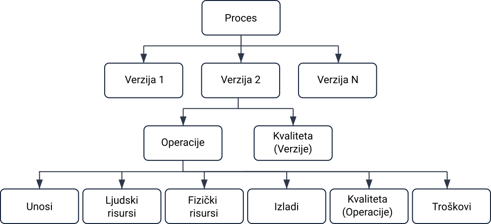
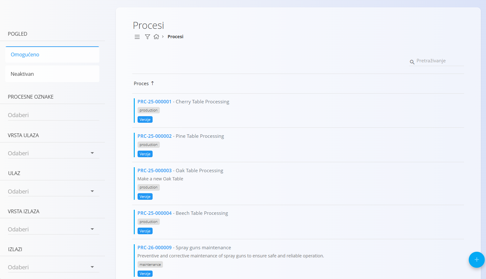
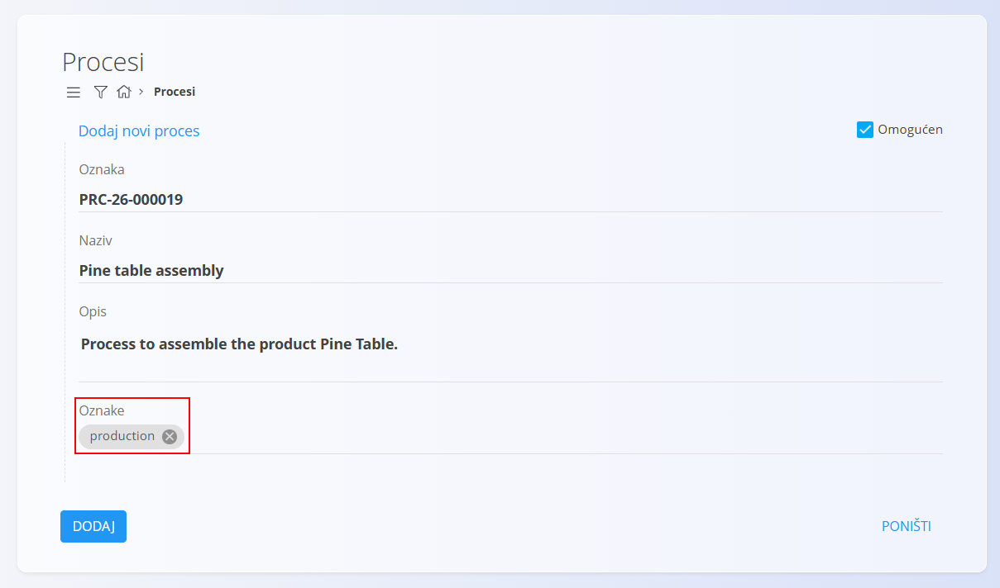
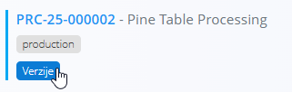
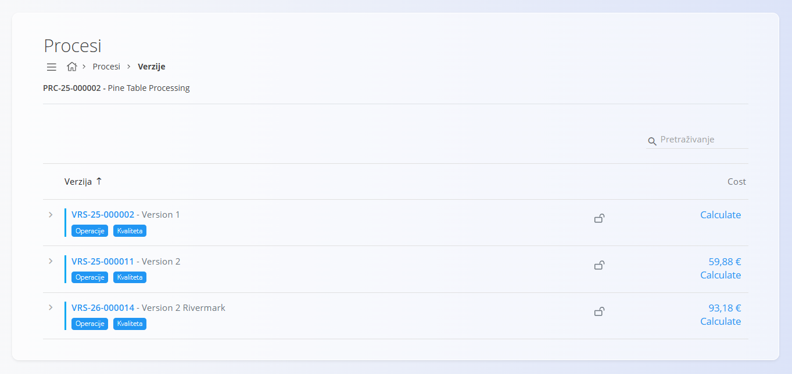
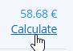
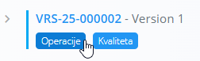
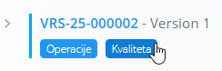

<!-- app_route: /management/processes -->
<!-- app_label: Procesi -->
<!-- canonical_source_url: https://github.com/Tom-PIT/Connected.Docs/blob/main/hr/Domene/Proizvodnja/Upravljanje/Procesi.md -->
<!-- canonical_source_title: Procesi -->

# Procesi

Procesi definiraju strukturirane korake koji se koriste u **Proizvodnji** i **Održavanju** za pretvaranje ulaza u izlaze (gotove proizvode, poluproizvode ili servisiranu opremu). Oni predstavljaju osnovu operativnih tijekova rada te se koriste u **dokumentima** za izračun materijala, resursa, radnog opterećenja i koraka izvršavanja:

- **[Proizvodni nalozi](../Dokumenti/ProductionOrders.md)** za proizvodne procese
- **[Nalozi za održavanje](../../Održavanje/Dokumenti/MaintenanceOrders.md)** za procese održavanja

Ova stranica omogućuje stvaranje i upravljanje procesima, njihovim verzijama i operativnom strukturom.

Proces može sadržavati jednu ili više **verzija**, primjerice različite verzije za različite veličine proizvoda ili varijante održavanja. Svaka verzija sadrži niz [**operacija**](Operations.md) koje definiraju ulaze, resurse (ljudske i fizičke), izlaze i zahtjeve kvalitete.

Za pristup ovoj stranici otvorite **Proizvodnja / Upravljanje / Procesi** u [navigaciji](../../../Zajednicko/UI/Navigacija.md). Procesi su zajednički te mogu biti označeni za korištenje u proizvodnji ili održavanju.

> [!TIP]
> Za cjeloviti prikaz rada pogledajte video vodič **[Processes and versions](https://www.youtube.com/watch?v=4svpFCm7rkk)**.

## Shema

<strong>Proces</strong>

| Polje | Opis |
|-------|------|
| [**Oznaka**](../../../Zajednicko/UI/OznakeDokumenata.md) | Automatski generirana oznaka procesa (nije moguće uređivati). |
| **Naziv** | Naziv procesa (obavezno). |
| **Opis** | Kratki opis namjene procesa. |
| **Oznake** | Oznake za grupiranje ili kategorizaciju procesa (npr. **Proizvodnja**, **Održavanje**). |

<strong>Verzija</strong>

| Polje | Opis |
|-------|------|
| [**Oznaka**](../../../Zajednicko/UI/OznakeDokumenata.md) | Automatski generirana oznaka verzije (nije moguće uređivati). |
| **Naziv** | Naziv verzije (obavezno). |
| **Opis** | Dodatni opis verzije (nije obavezno). |
| **Članak** | Poveznica na članak iz [**Baze znanja**](../../Znanje/Znanje/BazaZnanja.md) koji opisuje verziju procesa. |

## Popis

Popis procesa prikazuje sve konfigurirane procese. Svaki red sadrži oznaku procesa, naziv, opis i oznake. Za pronalaženje procesa prema oznaci ili nazivu koristite **Pretraživanje**.

Na lijevoj strani dostupni su sljedeći filtri:

- **Pogled** – Omogućeno / Neaktivno
- **Oznake procesa** (npr. Proizvodnja, Održavanje)
- **Vrsta ulaza**
- **Ulaz**
- **Vrsta izlaza**
- **Izlazi**

## Dodavanje procesa

1. Kliknite [akcijski gumb](../../../Zajednicko/UI/AkcijskiGumb.md) i odaberite **Novi** ili **Kopiraj postojeći**.
2. Unesite sljedeće podatke:
    - **Naziv** – Obavezno.
    - **Opis** – Nije obavezno.
    - **Oznake** – Nisu obavezne, ali su **potrebne** kako bi proces bio dostupan u određenom području.
        - Dodajte oznaku **Proizvodnja** kako bi proces bio dostupan prilikom izrade novog [**Proizvodnog naloga**](../Dokumenti/ProductionOrders.md).
        - Dodajte oznaku **Održavanje** kako bi proces bio dostupan prilikom izrade novog [**Naloga za održavanje**](../../Održavanje/Dokumenti/MaintenanceOrders.md).

    

3. Kliknite **Dodaj**.

> [!IMPORTANT]
> Oznake određuju gdje se proces može koristiti. Ako procesu nije dodijeljena odgovarajuća oznaka (npr. **Proizvodnja** ili **Održavanje**), neće biti dostupan prilikom izrade dokumenata u tom području, primjerice [**Proizvodnog naloga**](../Dokumenti/ProductionOrders.md) ili [**Naloga za održavanje**](../../Održavanje/Dokumenti/MaintenanceOrders.md).

## Uređivanje procesa

Za uređivanje postojećeg procesa:

1. Odaberite proces iz popisa.
2. Po potrebi izmijenite **Naziv**, **Opis** ili **Oznake**.
3. Kliknite **Spremi**.

## Verzije

Svaki proces može sadržavati više **verzija**, što omogućuje poboljšavanje ili izmjenu procesa tijekom vremena uz zadržavanje prethodnih verzija.

Na zaslonu verzija možete:

- Dodati novu verziju
- Urediti ili onemogućiti verziju
- Zaključati verziju
- Otvoriti verziju i upravljati njezinim operacijama i konfiguracijom

Verzija sadrži:

- Osnovne podatke o verziji
- Popis **operacija**
- Mogućnost omogućavanja ili onemogućavanja verzije
- Mogućnost zaključavanja verzije radi sprječavanja izmjena
- Izračun i analizu troška verzije

### Izračun troška verzije

Na zaslonu **Verzije** moguće je procijeniti **trošak proizvodnje po komadu** za odabranu verziju procesa.

Svaka verzija prikazuje stupac **Trošak** sa sljedećim opcijama:

- **Izračunaj** – izračunava procijenjeni trošak proizvodnje za odabranu verziju.
- **Vrijednost troška** – posljednji izračunati trošak proizvodnje po komadu.

Klikom na **Izračunaj** sustav procjenjuje trošak proizvodnje jednog proizvoda koristeći odabranu verziju procesa. U izračun su uključeni:

- **Cijene materijala** definirane u cjenicima [**Materijala dobavljača**](../../Supply/Management/SupplierMaterials.md)
- **Ljudski resursi** prema cijenama definiranim u [**Troškovima resursa**](../../Resources/Management/ResourcesCosts.md)
- **Fizički resursi** (strojevi i radne stanice) prema [**Troškovima resursa**](../../Resources/Management/ResourcesCosts.md)
- **Dodatni troškovi** definirani u šifrarniku [**Troškovi**](../../Supply/Management/Expenses.md)

Ako se verzija promijeni (primjerice operacije, materijali ili resursi), preporučuje se ponovno pokrenuti izračun.

Klikom na **vrijednost troška** otvara se detaljna stranica [**Analize troška verzije**](../Analytics/VersionCostView.md), koja prikazuje kompletnu strukturu troška.

### Operacije unutar verzije

Verzija sadrži niz **[operacija](Operacije.md)** koje predstavljaju pojedine korake procesa. Primjeri operacija u proizvodnji su rezanje, bojanje, montaža i pakiranje, dok u održavanju mogu uključivati pregled, podmazivanje ili kalibraciju.

Za pregled operacija kliknite gumb **[Operacije](Operacije.md)**.

Svaka operacija može sadržavati:

- **[Unosi](Unosi.md)** – materijale ili artikle koji se troše
- **[Ljudski resursi](LjudskiResursi.md)** – zaposlenike ili radna mjesta
- **[Fizički resursi](FizickiResursi.md)** – strojeve ili opremu
- **[Izlazi](Izlazi.md)** – proizvedene materijale ili artikle
- **[Kvaliteta](KontrolniPopisiKvalitete.md)** – dodijeljene kontrolne popise i zahtjeve kvalitete
- **[Troškovi](TroskoviOperacije.md)** – troškovi povezani s operacijom

## Kvaliteta u verzijama procesa

Gumb **[Kvaliteta](KontrolniPopisiKvalitete.md)** otvara konfiguraciju kvalitete za odabranu verziju procesa ili operaciju. Na ovoj stranici moguće je dodijeliti jedan ili više [**Kontrolnih popisa**](../../Kvaliteta/Upravljanje/KontrolniPopisi.md), koji određuju korake kontrole kvalitete tijekom izvršavanja.

> [!NOTE]
> Kontrolni popisi mogu se dodijeliti cijeloj **verziji procesa** (primjenjuju se na cijeli proces) ili pojedinačnim **operacijama** (izvršavaju se tijekom određene operacije).

## Brisanje procesa

Proces je moguće izbrisati samo ako **nije korišten u dokumentima** (npr. proizvodnim ili radnim nalozima) i **nije povezan s drugim procesima**.

Za brisanje odaberite proces iz popisa i kliknite **Izbriši**.

Nakon potvrde proces će biti trajno uklonjen. Ako je proces u upotrebi, sustav će prikazati poruku o pogrešci.