<!-- app_route: /management/processes -->
<!-- app_label: Procesi -->
<!-- canonical_source_url: https://github.com/Tom-PIT/Connected.Docs/blob/main/hr/Domene/Proizvodnja/Upravljanje/ProcesiIzrada.md -->
<!-- canonical_source_title: Kako kreirati proces -->

# Kako kreirati proces

Procesi definiraju kako se materijali, resursi, operacije i kontrole kvalitete povezuju za izvođenje određene aktivnosti.

Procesi se koriste u cijelom sustavu, u domenama **Proizvodnja** i **Održavanje**. Definiraju redoslijed operacija, potrebne resurse, utrošene materijale, proizvedene izlaze i zahtjeve kvalitete koji će se kasnije koristiti prilikom kreiranja proizvodnih ili naloga za održavanje.

Ovaj vodič objašnjava kako kreirati potpuni proces, konfigurirati njegovu verziju i operacije, dodijeliti resurse i materijale te ga pripremiti za izvođenje.

Primjer u ovom vodiču prikazuje **proizvodni proces** za izradu proizvoda **Oak Wood Chair**, no isti postupak vrijedi i za procese održavanja.

> [!NOTE]
> - Ovaj vodič pretpostavlja da su potrebni materijali, resursi i kontrolni popisi kvalitete već kreirani. Više informacija potražite u dokumentaciji:
>    * [**Materijali**](../../Imovina/Materijali/README.md)
>    * [**Resursi**](../../Resursi/Upravljanje/Resursi.md)
>    * [**Kontrolni popisi kvalitete**](../../Kvaliteta/Upravljanje/KontrolniPopisi.md)
> - Za detaljnije informacije o procesima i njihovim komponentama pogledajte dokumente navedene u odjeljku [**Sljedeći koraci**](#sljedeći-koraci).

## Korak 1: Kreiranje novog procesa

Otvorite **Proizvodnja / Upravljanje / Procesi**.

1. Kliknite [akcijski gumb](../../../Zajednicko/UI/AkcijskiGumb.md).
2. Odaberite **Novi**.
3. Unesite:
   * **Naziv**
   * **Opis**
   * **Oznake**
4. Kliknite **Dodaj**.

Proces je sada kreiran.

> [!IMPORTANT]
> Provjerite je li dodijeljena oznaka **Production**, inače proces neće biti dostupan prilikom kreiranja proizvodnih naloga.

### Primjer

- **Naziv:** *Oak wood chair*
- **Opis:** *Proizvodni proces za izradu stolica od hrastovine*
- **Oznake:** *Production*

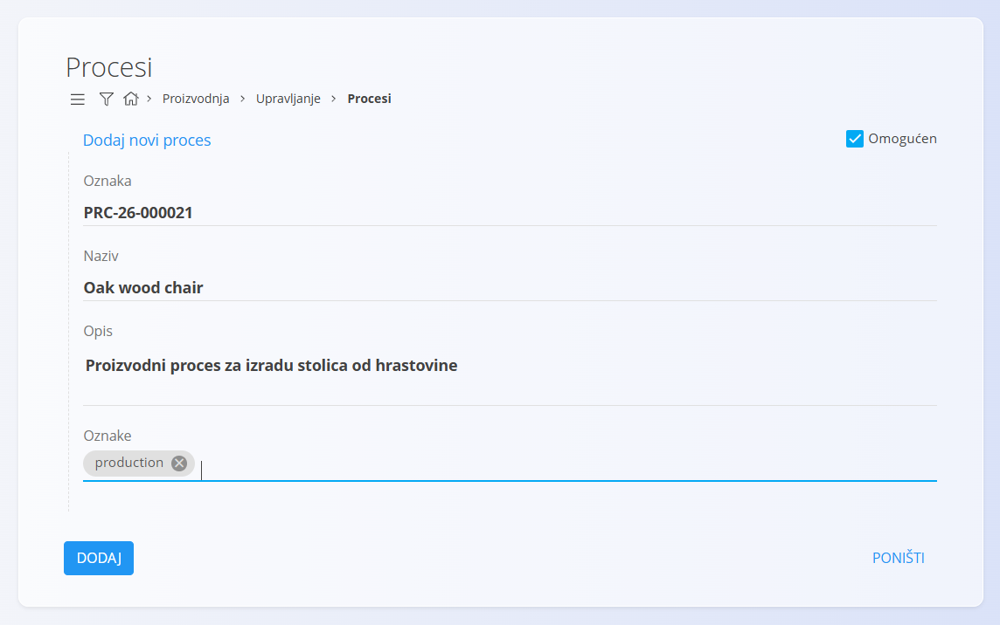

## Korak 2: Kreiranje verzije procesa

Svaki proces može sadržavati jednu ili više verzija.

U ovom primjeru kreirat ćemo verziju **Standard version**.

1. Na popisu procesa pronađite novokreirani proces.
2. Kliknite **Verzije** ispod naziva procesa.

   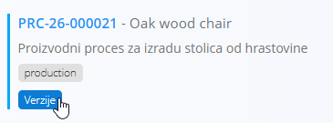

   Prikazuje se popis svih verzija procesa. Budući da je riječ o novom procesu, popis je u početku prazan.

3. Kliknite [akcijski gumb](../../../Zajednicko/UI/AkcijskiGumb.md).
4. Unesite:
   * **Naziv**
   * **Opis**
   * **Članak** (nije obavezno) – koristite ovo polje za povezivanje procesa s odgovarajućim člankom iz [**Baze znanja**](../../Znanje/BazaZnanja/BazaZnanja.md), primjerice s uputama za montažu.
5. Kliknite **Dodaj**.

Verzija je sada spremna za konfiguraciju.

### Primjer

- **Naziv:** *Standard version*
- **Opis:** *Standardni proizvodni proces za izradu stolica od hrastovine*

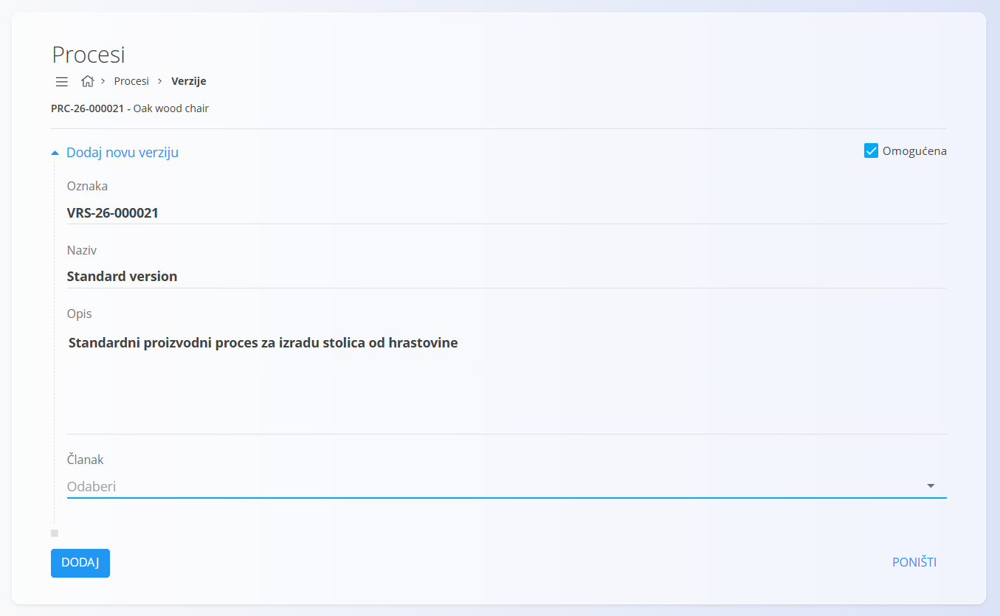

## Korak 3: Dodavanje operacija

Operacije definiraju pojedinačne korake koji čine verziju procesa.

Za dodavanje operacija:

1. Vratite se na popis verzija procesa.
2. Kliknite **Operacije** ispod novokreirane verzije.

   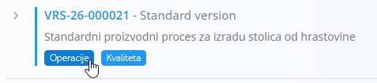

   Prikazuje se popis operacija. Budući da je riječ o novoj verziji, popis je u početku prazan.

3. Kliknite [akcijski gumb](../../../Zajednicko/UI/AkcijskiGumb.md) i odaberite **Novi**.
4. Unesite:
   * **Naziv**
   * **Opis** (nije obavezno)
   * **Redoslijed**
   * **Uvjet za početak**
   * **Podstatus aktivacije**
   * **Utjecaj vremena**
   * **Zadana organizacijska jedinica**
   * **Članak** (nije obavezno)
   * **Oznake** (nije obavezno)

5. Kliknite **Dodaj**.
6. Ponovite postupak dok ne dodate sve potrebne operacije.

Operacije se prikazuju prema vrijednosti polja **Redoslijed**.

### Primjer

| Redoslijed | Operacija |
|------------|-----------|
| 0 | Cut components |
| 1 | Assemble chair |
| 2 | Sand surfaces |
| 3 | Final inspection |
| 4 | Packaging |

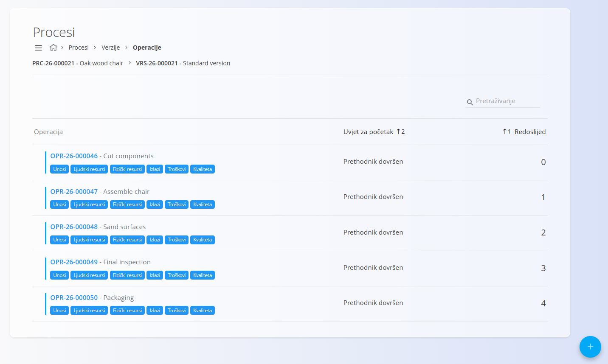

## Korak 4: Konfiguracija ulaza

Ulazi definiraju materijale ili stavke koje se troše tijekom izvođenja operacije.

1. Na popisu operacija pronađite željenu operaciju.
2. Kliknite **Ulazi** ispod naziva operacije. Prikazuje se popis ulaza za tu operaciju. Budući da je riječ o novoj operaciji, popis je prazan.
3. Kliknite [akcijski gumb](../../../Zajednicko/UI/AkcijskiGumb.md) i odaberite **Novi**.
4. Odaberite željeni materijal.
5. Definirajte potrebnu količinu.
6. Kliknite **Dodaj**.

Ponovite postupak za sve potrebne materijale.

### Primjer

Za operaciju **Cut components** dodajemo:

- *Raw Oak Board*
- *Oak wood*

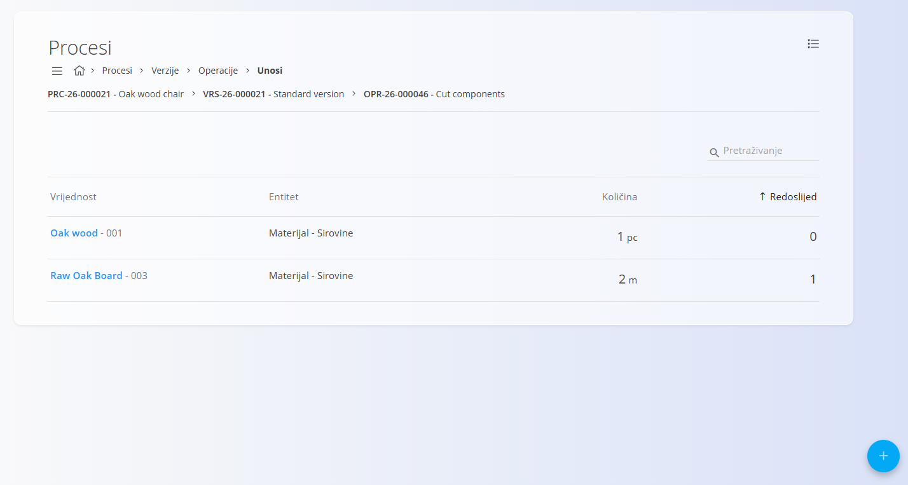

## Korak 5: Konfiguracija resursa

Resursi definiraju ljude i opremu potrebne za izvođenje operacije.

### Ljudski resursi

1. Kliknite **Ljudski resursi** ispod naziva operacije.
2. Kliknite [akcijski gumb](../../../Zajednicko/UI/AkcijskiGumb.md) i odaberite **Novi**.
3. Odaberite vrstu resursa i resurs te unesite procijenjeno trajanje operacije.
4. Kliknite **Dodaj**.

### Fizički resursi

1. Kliknite **Fizički resursi** ispod naziva operacije.
2. Kliknite [akcijski gumb](../../../Zajednicko/UI/AkcijskiGumb.md) i odaberite **Novi**.
3. Odaberite vrstu resursa i resurs te unesite procijenjeno trajanje operacije.
4. Kliknite **Dodaj**.

### Primjer

Za operaciju **Assemble chair**:

Ljudski resursi:

- *Operator*

Fizički resursi:

- *Assembly station 1*

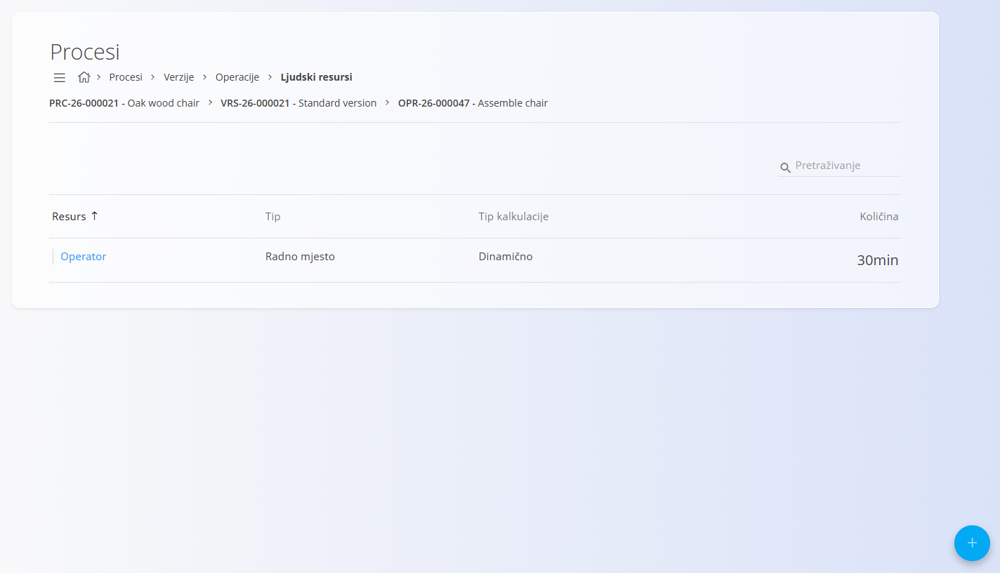

## Korak 6: Konfiguracija izlaza

Izlazi definiraju proizvode ili stavke koje nastaju izvođenjem operacije.

1. Na popisu operacija odaberite željenu operaciju.
2. Kliknite **Izlazi** ispod naziva operacije.
3. Kliknite [akcijski gumb](../../../Zajednicko/UI/AkcijskiGumb.md) i odaberite **Novi**.
4. Odaberite izlazni materijal.
5. Definirajte proizvedenu količinu.
6. Kliknite **Dodaj**.

### Primjer

Za završnu operaciju dodajemo:

- *Oak Wood Chair*

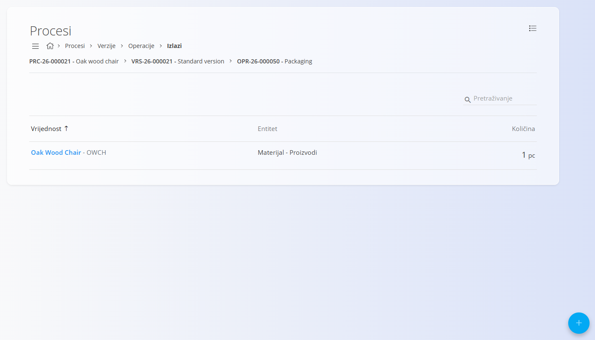

## Korak 7: Dodavanje kontrola kvalitete

Kontrolni popisi kvalitete mogu se dodijeliti verziji procesa ili pojedinoj operaciji.

1. Pronađite verziju procesa ili operaciju koju želite konfigurirati.
2. Kliknite **Kvaliteta** ispod naziva operacije.
3. Kliknite [akcijski gumb](../../../Zajednicko/UI/AkcijskiGumb.md).
4. Odaberite željeni kontrolni popis i način izvođenja.
5. Kliknite **Dodaj**.

### Primjer

Operaciji **Final inspection** dodijelite:

- *Final product inspection*

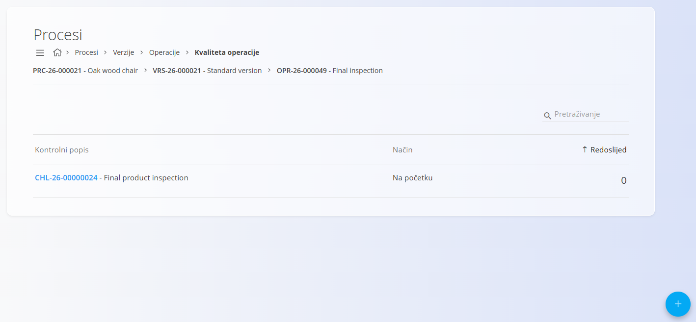

## Korak 8: Izračun troška verzije

Nakon što su konfigurirani materijali, resursi, izlazi i troškovi, moguće je izračunati procijenjeni trošak verzije procesa.

1. Vratite se na zaslon **Verzije**.
2. U stupcu **Trošak** kliknite **Calculate**.

Sustav izračunava procijenjeni trošak na temelju:

- troškova materijala,
- troškova ljudskih resursa,
- troškova fizičkih resursa,
- dodatnih troškova.

### Primjer

Izračunajte trošak proizvodnje jednog proizvoda **Oak Wood Chair** koristeći verziju **Standard version**.

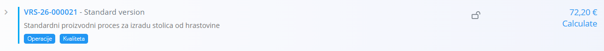

## Korak 9: Korištenje procesa

Proces je sada spreman za korištenje u operativnim dokumentima.

Ovisno o dodijeljenim oznakama, može se odabrati prilikom kreiranja:

- [Proizvodnih naloga](../Dokumenti/ProizvodniNalozi.md)
- [Naloga za održavanje](../../Odrzavanje/Dokumenti/NaloziZaOdrzavanje.md)

### Primjer

Kreirajte novi proizvodni nalog i odaberite:

- Proces: **Oak Wood Chair**
- Verzija: **Standard version**

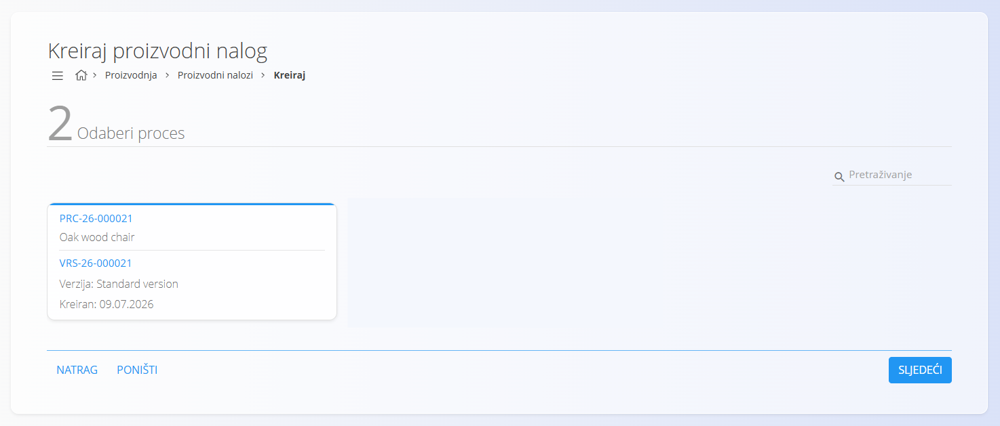

Sustav automatski generira operacije definirane u odabranoj verziji procesa.

## Sljedeći koraci

Za detaljnije informacije pogledajte:

- [**Procesi**](Procesi.md)
- [**Operacije**](Operacije.md)
- [**Unosi**](Unosi.md)
- [**Izlazi**](Izlazi.md)
- [**Ljudski resursi**](LjudskiResursi.md)
- [**Fizički resursi**](FizickiResursi.md)
- [**Kvaliteta — Kontrolni popisi izvođenja**](KontrolniPopisiKvalitete.md)