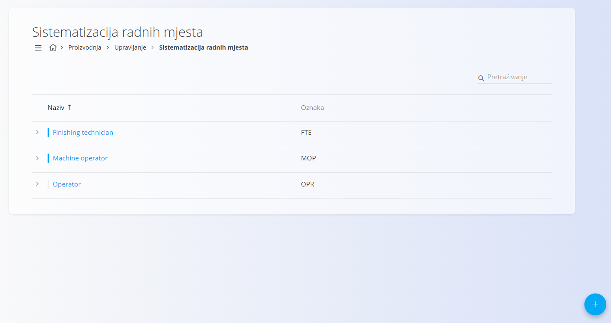
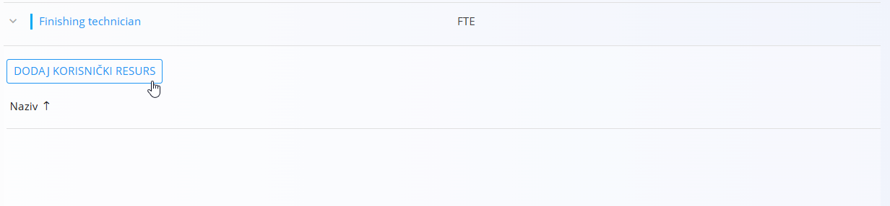
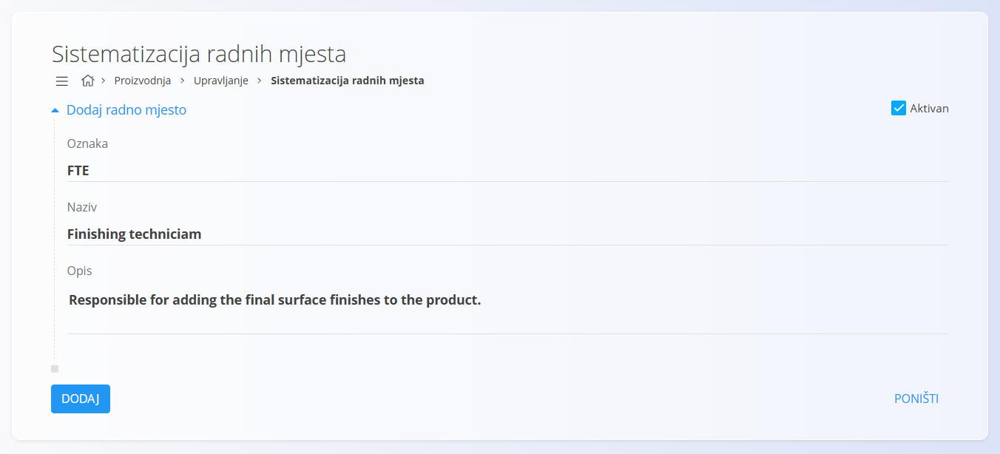

<!-- app_route: /management/resources/job-positions -->
<!-- app_label: Sistematizacija radnih mjesta -->
<!-- canonical_source_url: https://github.com/Tom-PIT/Connected.Docs/blob/main/hr/Domene/Proizvodnja/Upravljanje/SistematizacijaRadnihMjesta.md -->
<!-- canonical_source_title: Sistematizacija radnih mjesta -->

# Sistematizacija radnih mjesta

Stranica **Sistematizacija radnih mjesta** služi za upravljanje radnim mjestima koja se koriste u proizvodnim i održavateljskim procesima. Radna mjesta dodjeljuju se korisnicima kako bi se mogla koristiti prilikom planiranja, evidentiranja rada i izvođenja proizvodnih operacija.

Za pristup ovoj stranici otvorite **Proizvodnja / Upravljanje / Sistematizacija radnih mjesta** u [navigaciji](../../../Zajednicko/UI/Navigacija.md).

## Shema

| Polje | Opis |
|-------|------|
| **Oznaka** | Jedinstvena oznaka radnog mjesta. |
| **Naziv** | Naziv radnog mjesta. |
| **Opis** | Opis odgovornosti ili namjene radnog mjesta. |
| **Aktivan** | Označava može li se radno mjesto dodjeljivati korisnicima. |

## Popis

Popis prikazuje sva definirana radna mjesta.

Za svaki zapis prikazani su:

- Naziv
- Oznaka

Za pronalaženje zapisa koristite **Pretraživanje**.

Svaki zapis sadrži indikator statusa:

- **Plava** oznaka označava aktivno radno mjesto.
- **Siva** oznaka označava neaktivno radno mjesto.

Kliknite strelicu lijevo od zapisa kako biste proširili njegove podatke.

Unutar proširenog prikaza kliknite **Dodaj korisnički resurs** za dodjelu jednog ili više korisnika tom radnom mjestu.

## Radnje

Za dodavanje novog radnog mjesta kliknite [akcijski gumb](../../../Zajednicko/UI/AkcijskiGumb.md).

### Dodavanje radnog mjesta

Unesite:

- **Oznaku**
- **Naziv**
- **Opis** (nije obavezno)
- **Aktivan**

Kliknite **Dodaj**.

## Uređivanje radnog mjesta

Kliknite naziv radnog mjesta u popisu.

Po potrebi izmijenite podatke, a zatim kliknite **Spremi**.

## Brisanje radnog mjesta

Za brisanje otvorite željeno radno mjesto i kliknite **Izbriši**.

> [!WARNING]
> Radno mjesto moguće je obrisati čak i ako su mu dodijeljeni korisnici.