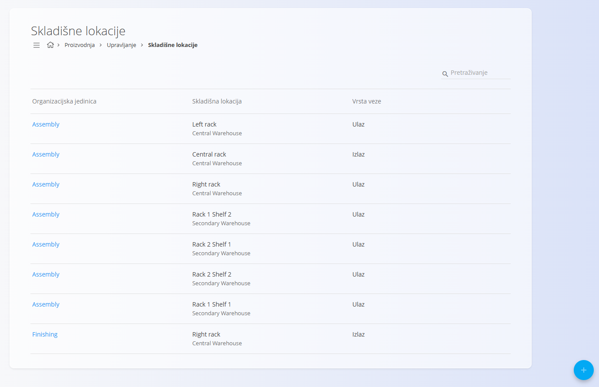
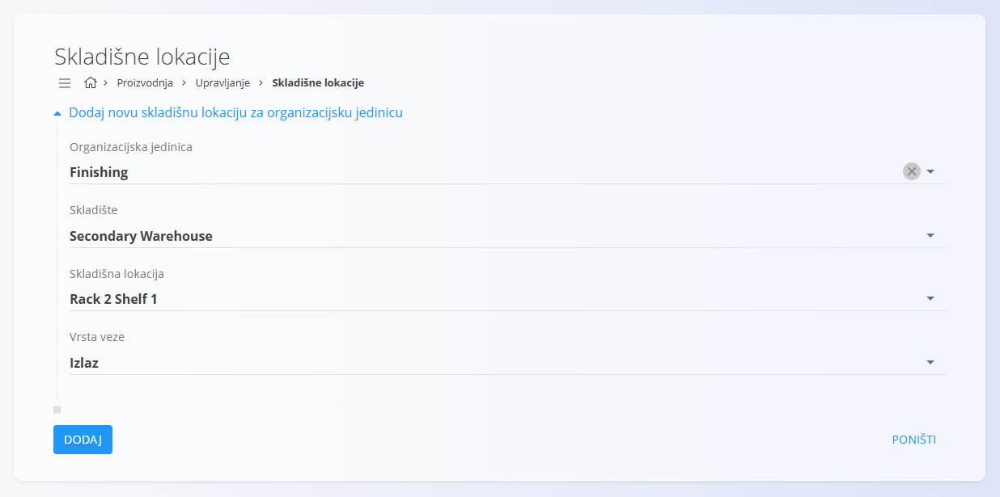
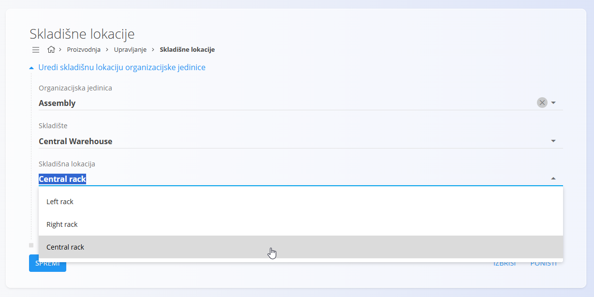

<!-- app_route: /management/organization-units/warehouse-locations -->
<!-- app_label: Skladišne lokacije -->
<!-- canonical_source_url: https://github.com/Tom-PIT/Connected.Docs/blob/main/hr/Domene/Proizvodnja/Upravljanje/SkladisneLokacije.md -->
<!-- canonical_source_title: Skladišne lokacije -->

# Skladišne lokacije

Stranica **Skladišne lokacije** povezuje [organizacijske jedinice](OrganizacijskeJedinice.md) sa skladišnim lokacijama kako bi se odredilo odakle pojedina organizacijska jedinica preuzima materijal i gdje odlaže proizvedene artikle.

Za pristup ovoj stranici otvorite **Proizvodnja / Upravljanje / Skladišne lokacije** u [navigaciji](../../../Zajednicko/UI/Navigacija.md).

> [!TIP]
> Za detaljan prikaz rada pogledajte video **[Warehouse locations](https://www.youtube.com/watch?v=qR3o0CpIGpo)**.

## Shema

| Polje | Opis |
|-------|------|
| [**Organizacijska jedinica**](OrganizacijskeJedinice.md) | Organizacijska jedinica kojoj se dodjeljuje skladišna lokacija. |
| [**Skladište**](../../Logistika/Upravljanje/Skladista.md) | Skladište u kojem se nalazi odabrana skladišna lokacija. |
| [**Skladišna lokacija**](../../Logistika/Upravljanje/Lokacije.md) | Skladišna lokacija koja se koristi za ulaz ili izlaz. |
| **Vrsta veze** | Određuje koristi li se lokacija za **Ulaz** ili **Izlaz**. |

## Popis

Popis prikazuje sve dodijeljene skladišne lokacije.

Za svaki zapis prikazani su:

- Organizacijska jedinica
- Skladišna lokacija
- Vrsta veze

Za pronalaženje zapisa koristite **Pretraživanje**.

Kliknite naziv organizacijske jedinice za otvaranje podataka o zapisu.

## Radnje

Kliknite [akcijski gumb](../../../Zajednicko/UI/AkcijskiGumb.md).

Dostupne su sljedeće radnje:

- **Uvoz**
- **Novi**

### Uvoz skladišnih lokacija

Kliknite **Uvoz** za uvoz podataka iz CSV datoteke.

### Dodavanje skladišne lokacije

Kliknite **Novi**.

Odaberite:

- [**Organizacijsku jedinicu**](OrganizacijskeJedinice.md)
- [**Skladište**](../../Logistika/Upravljanje/Skladista.md)
- [**Skladišnu lokaciju**](../../Logistika/Upravljanje/Lokacije.md)
- **Vrstu veze** (**Ulaz** ili **Izlaz**)

Kliknite **Dodaj**.

> [!NOTE]
> - Ista skladišna lokacija ne može biti istovremeno definirana kao **Ulaz** i **Izlaz** za istu organizacijsku jedinicu.
> - Svaka organizacijska jedinica može imati samo jednu izlaznu skladišnu lokaciju.
> - Organizacijske jedinice, skladišta i skladišne lokacije preuzimaju se iz odgovarajućih šifrarnika.

## Uređivanje skladišne lokacije

Kliknite zapis u popisu.

Po potrebi izmijenite podatke.

Kliknite **Spremi**.

## Brisanje skladišne lokacije

Za brisanje odaberite zapis iz popisa i kliknite **Izbriši**.

> [!NOTE]
> Brisanjem se uklanja samo veza između organizacijske jedinice i skladišne lokacije. Skladište i skladišna lokacija ostaju dostupni u modulu **Logistika**.