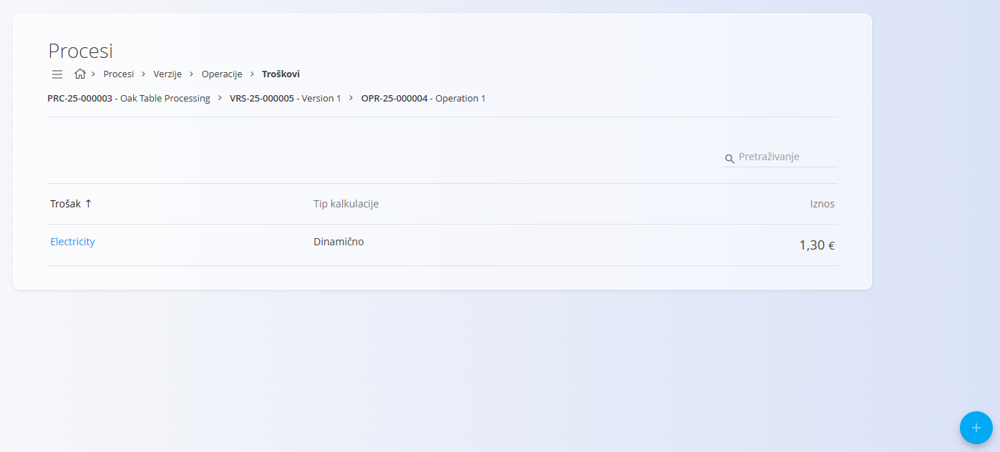
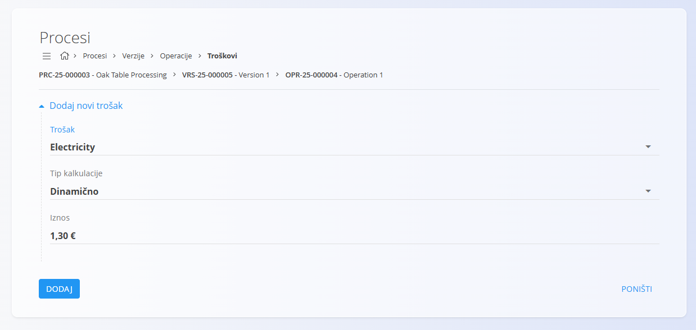

<!-- app_route: /management/processes -->
<!-- app_label: Procesi -->
<!-- app_navigation_hint: Otvorite proces, odaberite verziju, kliknite Operacije, a zatim otvorite Troškovi za odgovarajuću operaciju. -->
<!-- canonical_source_url: https://github.com/Tom-PIT/Connected.Docs/blob/main/hr/Domene/Proizvodnja/Upravljanje/TroskoviOperacije.md -->
<!-- canonical_source_title: Troškovi operacije -->

# Troškovi operacije

Troškovi operacije predstavljaju dodatne **troškove** povezane s pojedinom **operacijom** unutar verzije procesa. Ti se troškovi uključuju u izračun ukupnog troška proizvodnje artikla.

Za pristup ovoj stranici otvorite **Proizvodnja / Upravljanje / [Procesi](Procesi.md)** u [navigaciji](../../../Zajednicko/UI/Navigacija.md), odaberite verziju procesa, kliknite [**Operacije**](Operacije.md), a zatim **Troškovi** za željenu operaciju.

## Shema

| Polje | Opis |
|-------|------|
| **Trošak** | Vrsta troška koja se primjenjuje na operaciju (npr. električna energija, prijevoz i sl.). |
| **Tip kalkulacije** | Određuje način izračuna troška: **Dinamično** ili **Statično**. |
| **Iznos** | Novčani iznos troška. |

## Popis

Popis prikazuje sve troškove povezane s odabranom operacijom.

Za svaki trošak prikazani su:

- Naziv troška
- Tip kalkulacije
- Iznos

Za pronalaženje troškova koristite **Pretraživanje**.

## Dodavanje troška operaciji

1. Kliknite [akcijski gumb](../../../Zajednicko/UI/AkcijskiGumb.md) u donjem desnom kutu.
2. Ispunite potrebna polja.

    

3. Kliknite **Dodaj**.

## Uređivanje troška operacije

1. Odaberite trošak iz popisa.
2. Po potrebi izmijenite podatke.
3. Kliknite **Spremi**.

## Brisanje troška operacije

Za brisanje odaberite trošak iz popisa i kliknite **Izbriši**.

Nakon potvrde, trošak će biti uklonjen s operacije.