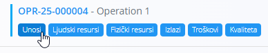
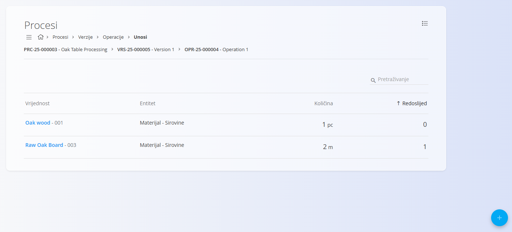
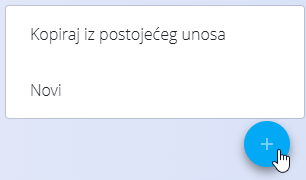
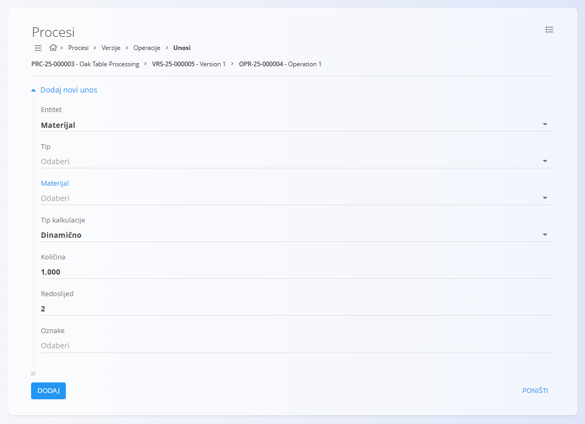

<!-- app_route: /management/processes -->
<!-- app_label: Unosi -->
<!-- app_navigation_hint: Otvorite proces, odaberite verziju, kliknite Operacije, a zatim otvorite Unose za odgovarajuću operaciju. -->
<!-- canonical_source_url: https://github.com/Tom-PIT/Connected.Docs/blob/main/hr/Domene/Proizvodnja/Upravljanje/Unosi.md -->
<!-- canonical_source_title: Unosi -->

# Unosi

Unosi definiraju **materijale potrebne** za izvođenje operacije unutar verzije procesa. Svaki unos određuje koji je materijal potreban, u kojoj mjernoj jedinici i količini te kako se njegova količina izračunava.

Unosima se upravlja unutar pojedine **operacije**.

Za pristup ovoj stranici otvorite **Proizvodnja / Upravljanje / [Procesi](Procesi.md)** u [navigaciji](../../../Zajednicko/UI/Navigacija.md), otvorite verziju procesa, kliknite [**Operacije**](Operacije.md), a zatim **Unosi** za željenu operaciju.

> [!TIP]
> Za detaljan prikaz rada pogledajte video **[Inputs & Outputs](https://www.youtube.com/watch?v=647sT70tNZc)**.

## Shema

| Polje | Opis |
|-------|------|
| **Entitet** | Odaberite odnosi li se unos na **Materijal** ili **Oznaku materijala**. |
| **Tip** | Vrsta materijala. Dostupne vrijednosti ovise o odabranom entitetu. |
| **Materijal** | Materijal koji će se koristiti u operaciji. Dostupni materijali ovise o odabranom tipu. |
| **Tip kalkulacije** | Određuje način izračuna količine: **Dinamično** ili **Statično**. |
| **Količina** | Potrebna količina materijala. Mjerna jedinica preuzima se s odabranog materijala. |
| **Redoslijed** | Određuje redoslijed prikaza unosa (počevši od 0). |
| **Oznake** | Opcionalne oznake za grupiranje i filtriranje unosa. |

## Popis

Popis prikazuje sve unose povezane s odabranom operacijom.

Za svaki unos prikazani su:

- Vrijednost
- Entitet
- Količina
- Redoslijed

Za pronalaženje unosa koristite **Pretraživanje**.

### Izbornik

Izbornik u gornjem desnom kutu omogućuje sljedeću radnju:

- **Izbriši sve unose** – Briše sve unose povezane s operacijom.

## Dodavanje unosa

1. Kliknite [akcijski gumb](../../../Zajednicko/UI/AkcijskiGumb.md) u donjem desnom kutu i odaberite jednu od sljedećih mogućnosti:

    - **Kopiraj iz postojećeg unosa**
    - **Novi**

    

2. Ispunite potrebna polja.

    
3. Kliknite **Dodaj**.

## Uređivanje unosa

1. Odaberite unos iz popisa.
2. Po potrebi izmijenite podatke.
3. Kliknite **Spremi**.

## Brisanje unosa

Za brisanje odaberite unos iz popisa i kliknite **Izbriši**.

Nakon potvrde, unos će biti uklonjen s operacije.