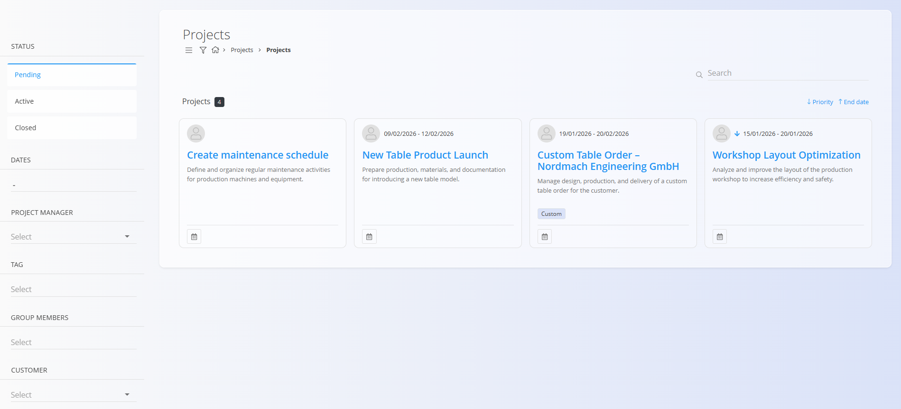
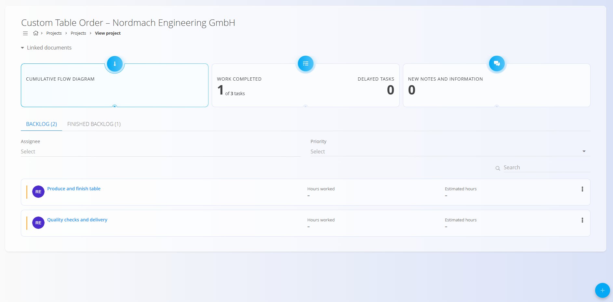
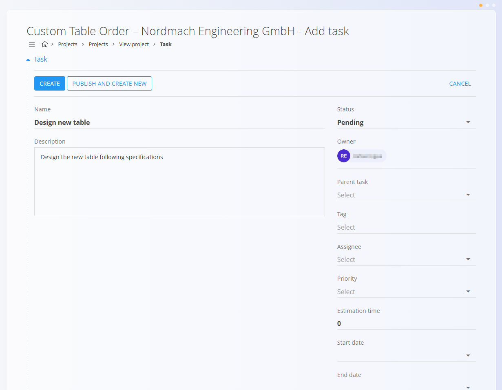
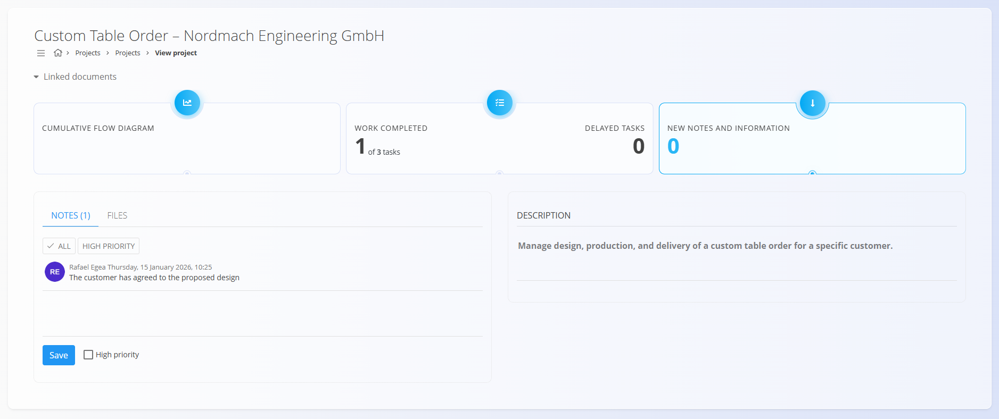

<!-- app_route: /projects/projects -->
<!-- app_label: Projects -->
<!-- canonical_source_url: https://github.com/Tom-PIT/Connected.Docs/blob/main/en/Domains/Projects/Documents/Projects.md -->
<!-- canonical_source_title: Projects -->

# Projects

The **Projects** area provides an overview of ongoing and completed projects and serves as the main workspace for **tracking progress and executing tasks** within a project.

Projects are created and configured in **[Project management](../Management/ProjectsManagement.md)**.  
This section focuses on **working with existing projects**: monitoring status, viewing tasks, and collaborating during execution.

To access projects, go to **Projects / Projects** in the [navigation](../../../Zajednicko/UI/Navigacija.md).

## Project lifecycle

Projects can be in one of the following states:
- **Pending** — Planned but not yet started
- **Active** — Currently in execution
- **Closed** — Completed projects

The project status reflects overall progress and is managed from **[Project management](../Management/ProjectsManagement.md)**.

## Projects overview

The Projects page displays all available projects as cards.

Each project card shows:
- **Project name**
- **Short description**
- **Planned date range**
- **Tags** (if defined)
- **Priority indicator** (if defined)

Click on a project card to open the **project view**.

### Filters and sorting

Use the filters on the left to narrow down the list:

- **Status**
  - Pending
  - Active
  - Closed
- **Dates**
- **Project manager**
- **Tag**
- **Group members**
- **Customer**

Projects can also be sorted by **priority** or **end date** using the controls in the top-right corner.

## Project view

Click a project to open the **project view**, which provides a complete overview of the project and its execution status.

The project view is divided into three main areas:
- Project overview and indicators
- Tasks (backlog and finished)
- Notes and attachments

## Project overview and indicators

At the top of the project view, key indicators provide a quick summary of project execution.

All indicators are **clickable** and open additional views or details:
- **Cumulative flow diagram** opens a visual representation of task flow over time
- **Work completed** shows progress based on finished tasks
- **Delayed tasks** highlights tasks that are overdue
- **New notes and information** opens the **notes view** for the project

These indicators help users quickly assess project status without navigating away from the project.

## Tasks overview

Below the indicators, the project displays its tasks.

Tasks are always created **inside a project** and represent the actual work required to complete it.

From this view, users can:
- See all tasks belonging to the project
- Check task status and priority
- Open individual tasks
- Track worked and estimated hours (if defined)

This screen provides a **project-level overview** of tasks.  
Detailed task execution, effort logging, and status handling are also covered in **[Tasks](Tasks.md)**.

## Create a new task

Tasks are created **from inside a project**.

Click the [action button](../../../Common/UI/ActionButton.md) in the project view to open the **Add task** form.

The task creation form includes:
- **Name**
- **Description**
- **Status**
- **Owner**
- **Assignee**
- **Priority**
- **Estimated time**
- **Start date**
- **End date**

> [!NOTE]
>
> For a detailed description of task fields and management, see the dedicated [**Tasks**](Tasks.md) documentation.

When the task is ready, click **Create**. 

If you need to create multiple tasks for the project, you can use the button **Publish and create new**, which publishes the task and takes you to a new form to create a new one.

After creation, the task immediately becomes part of the project backlog. 

## Notes and collaboration

Each project includes a **Notes** section used for communication and documentation during execution.

From this section, users can:
- Add notes related to the project
- Mark notes as high priority
- Attach files and documents
- Review the project description

Notes provide a central place for project-related decisions, updates, and shared information.