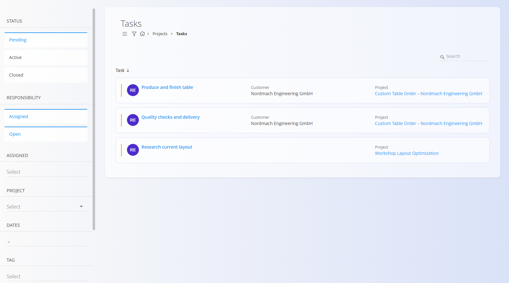
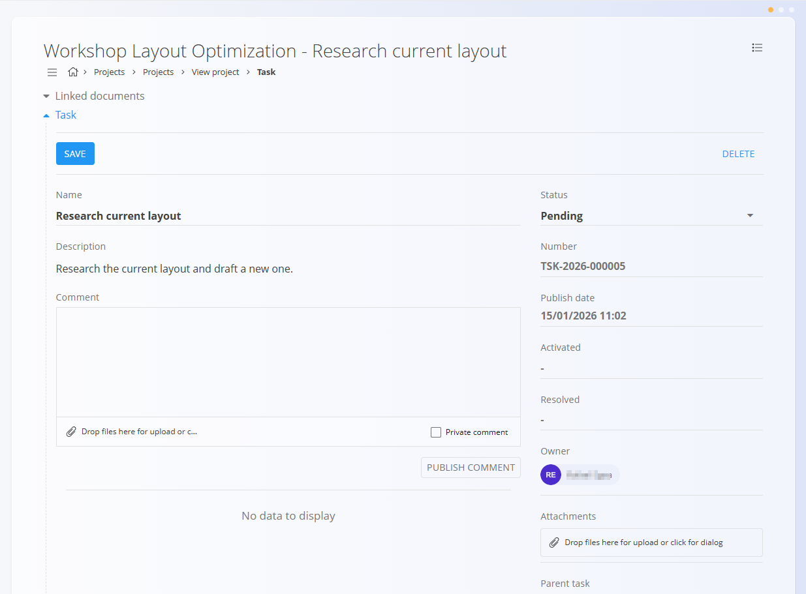
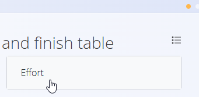
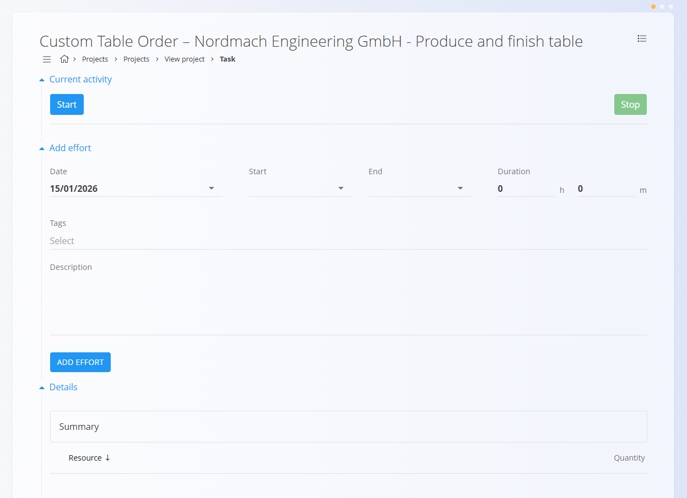
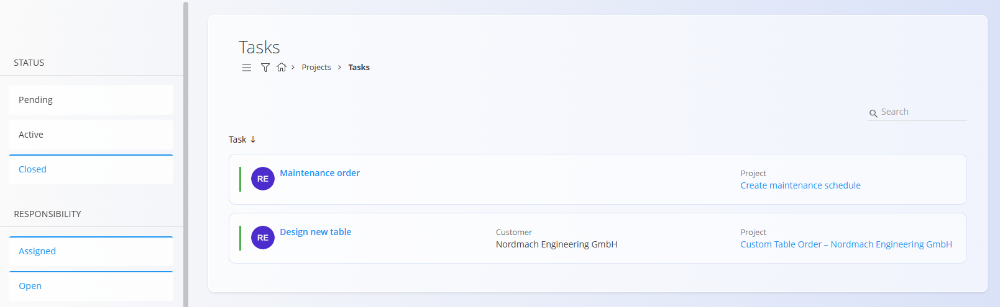

<!-- app_route: /projects/tasks -->
<!-- app_label: Tasks -->
<!-- canonical_source_url: https://github.com/Tom-PIT/Connected.Docs/blob/main/en/Domains/Projects/Documents/Tasks.md -->
<!-- canonical_source_title: Tasks -->

# Tasks

The **Tasks** screen provides a centralized view of all project tasks.  
It is used by both managers and workers to track progress, open individual tasks, and record work.

Tasks always belong to a **project** and cannot exist independently.

To access the Tasks screen, navigate to **Projects / Tasks** in the [navigation](../../../Zajednicko/UI/Navigacija.md).

## Schema

| Field           | Description                                                      |
|-----------------|------------------------------------------------------------------|
| **Name**        | Task title shown in lists and project views (required)            |
| **Description** | Detailed explanation of the work to be done                       |
| **Status**      | Current state of the task based on the **Kanban columns** defined for the [project](../Management/ProjectsManagement.md) |
| **Task number** | Automatically assigned unique identifier                          |
| **Publish date**| Date and time when the task was created                           |
| **Owner**       | User responsible for the task                                     |
| **Assignee**    | User assigned to execute the task                                 |
| **Estimated time** | Estimated effort or duration for the task                      |
| **Start date**  | Planned start date                                                |
| **End date**    | Planned end date                                                  |
| **Attachments** | Files uploaded to support task execution (documents, images, etc.)|
| **Parent task** | (Optional) Link to another task for hierarchical structure        |

## Tasks list

The list shows tasks across all projects that match the selected filters.

Each task card displays:
- **Task name**
- **Customer**
- **Project**
- **Current status**

Click a task to open its **task detail view**.

### Filters

The left panel allows filtering tasks by:

- **Status**
  - Pending
  - Active
  - Closed
- **Responsibility**
  - Assigned
  - Open
- **Assigned**
- **Project**
- **Dates**
- **Tag**
- **Customer**
- **Project manager**

Filters can be combined to quickly narrow down relevant tasks.

## Edit a task

Click a task to open the **task detail screen**, where users can review information, add comments, attach files, and record work.

## Create a task

Tasks are created **from within a project**, not from the task list.

To create a task:
1. Open a project from the [**Projects**](Projects.md) screen 
2. Click the [action button](../../../Common/UI/ActionButton.md)
3. Fill in the task details and create the task  

## Tasks user flow

Tasks support a simple, flexible workflow that reflects how work is carried out in practice.  
As work progresses, users update the **task status**, optionally record **effort**, and add **comments or attachments** as needed.

### 1. Start work on a task

When a worker opens a task from the task list or from a project:

- The task details are displayed
- The current **status** reflects the task’s position in the project workflow
- Comments, attachments, and previous activity are visible

Tasks are ready to be worked on immediately after creation.

### 2. Update the task status (Kanban workflow)

Each task has a **Status** field.  
The available status values come from the **Kanban columns defined for the project**.

Typical examples:
- To do
- In preparation
- In process
- Done

As work progresses, the worker updates the task by:
1. Selecting a new **Status** from the dropdown
2. Saving the task

This allows the task to move through the project workflow step by step, providing clear visibility for both workers and managers.

> The task lifecycle (Pending → Active → Closed) is driven by these status changes.

### 3. Record effort (optional)

While working on a task, users can record the time spent on it.  
Effort tracking is **optional** and depends on company-specific rules.

To record effort:
1. Open the **Effort** section from the task detail view using the action menu
   
   

2. Choose a recording method  
3. Save the effort entry  

#### Automatic (Start / Stop)

- Click **Start** to begin tracking
- Work on the task
- Click **Stop** to finish

The system records the time interval automatically.

#### Manual entry

Users can also enter effort manually by specifying:
- Date
- Start and end time *or* total duration
- Tags (optional)
- Description (optional)

Click **Add effort** to save the entry.

Multiple effort records can be added to the same task.

### 4. Collaborate during execution

During task execution, users can:
- Add comments to share updates or notes
- Attach documents, images, or files
- Mark comments as private or high priority

This keeps all task-related communication in one place.

### 5. Complete a task

Once the work is finished:
1. The worker updates the **Status** to the final Kanban column (for example *Done*)
2. The worker or manager (depending on company policy) sets the task as **Closed**

Closed tasks:
- Remain visible when the **Closed** filter is enabled
- Keep a full history of comments, attachments, and recorded effort

