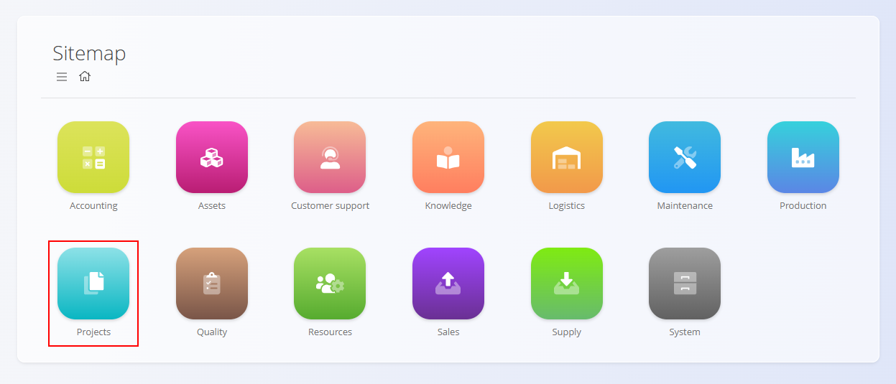
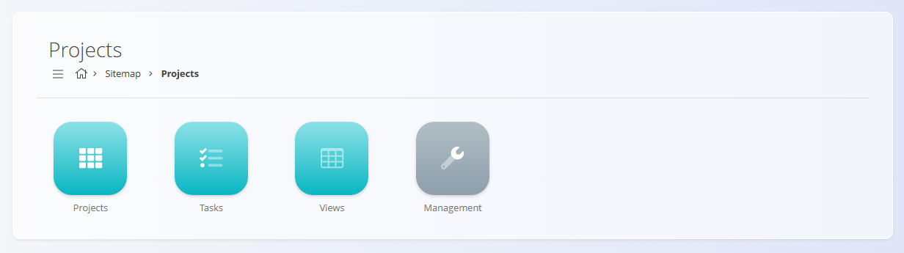
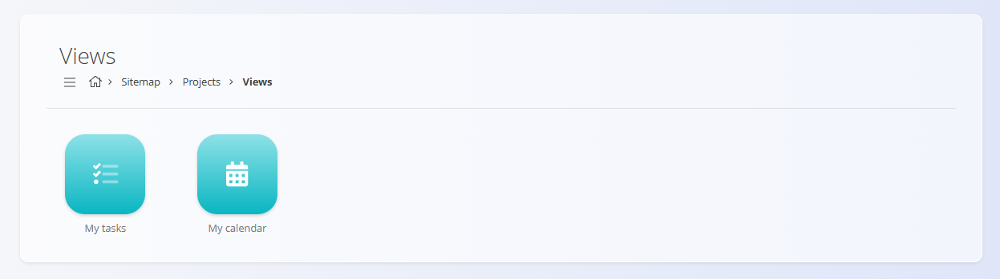
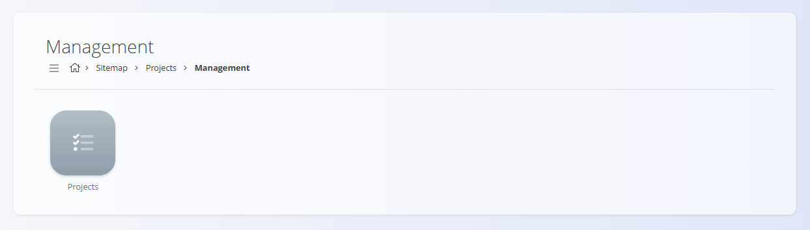

<!-- app_route: /sitemap/projects -->
<!-- app_label: Projects -->
<!-- canonical_source_url: https://github.com/Tom-PIT/Connected.Docs/blob/main/en/Domains/Projects/README.md -->
<!-- canonical_source_title: Projects -->

# Projects

The **Projects** domain supports structured planning, execution, and tracking of project-based work within your organization.  
It provides tools for organizing projects, managing tasks, monitoring progress, and offering personalized views for users involved in project execution.

The Projects domain is typically used for **internal initiatives**, **cross-department activities**, or **non-production work** that requires coordination, task tracking, and visibility over time.

To access this domain, navigate to **Projects** in the [navigation](../../Zajednicko/UI/Navigacija.md).

> [!NOTE]  
> The available domains and features depend on each company’s configuration and enabled modules.

## What is included in the Projects domain?

The domain is organized into several functional areas:

- **Projects** – Project definitions and high-level structure  
- **Tasks** – Execution units within projects  
- **Views** – Personalized and analytical views of project tasks  
- **Management** – Configuration and supporting definitions for projects

## Projects

The [**Projects**](Documents/Projects.md) screen is the central place where projects are reviewed and managed.

Each project typically represents a **goal-oriented initiative** with:
- a defined scope
- a timeline
- assigned participants
- a set of related tasks

Projects provide the structural container for tasks and allow progress to be tracked at a higher level.

Projects act as an organizational layer that groups tasks, users, and deadlines into a single, manageable unit.

## Tasks

The [**Tasks**](Documents/Tasks.md) screen focuses on the **execution layer** of project work.

Tasks represent individual units of work that:
- are assigned to users or teams
- have statuses and priorities
- can be tracked over time
- contribute to the progress of a project
- always belong to a specific project

This section is typically used by team members performing the actual work.

## Views

The **Views** section provides **user-oriented and analytical perspectives** on tasks and projects.

Available views include:

- [**My tasks**](Views/MyTasks.md) – A personalized list of tasks assigned to the current user
- [**My calendar**](Views/MyCalendar.md) – A calendar-based view of tasks and deadlines

These views are designed to help users:
- prioritize work
- understand deadlines
- manage workload efficiently

Views are **read-only** and do not create or modify tasks or projects directly.

## Management

The [**Project management**](Management/ProjectsManagement.md) section contains configuration and master data that define how the Projects domain behaves.

This area is typically used by administrators or power users to:
- define project-related settings
- configure task behavior
- manage supporting data used across projects

Changes made here affect how projects and tasks are structured and displayed throughout the domain.

> [!TIP]
> See all management entries in the **[Management Index](../../ManagementIndex.md)**.

## Projects Workflow Overview

A typical workflow within the Projects domain follows these steps:

### **1. Project definition**
- A project is created to represent a specific initiative or objective.

### **2. Task planning**
- Tasks are defined and associated with a project (or managed independently).
- Responsibilities and deadlines are assigned.

### **3. Task execution**
- Users work on tasks, update progress, and complete assigned work.

### **4. Monitoring and coordination**
- Progress is monitored through task lists and calendar views.
- Managers and participants gain visibility into workload and status.

## Summary

The Projects domain provides a structured environment for organizing and executing project-based work.  
It enables:

- clear project organization  
- task-based execution  
- personal task visibility  
- calendar-driven planning  
- cross-team coordination  

It supports teams in managing work that does not fit into transactional or production-driven processes, while remaining fully integrated into the broader system.
