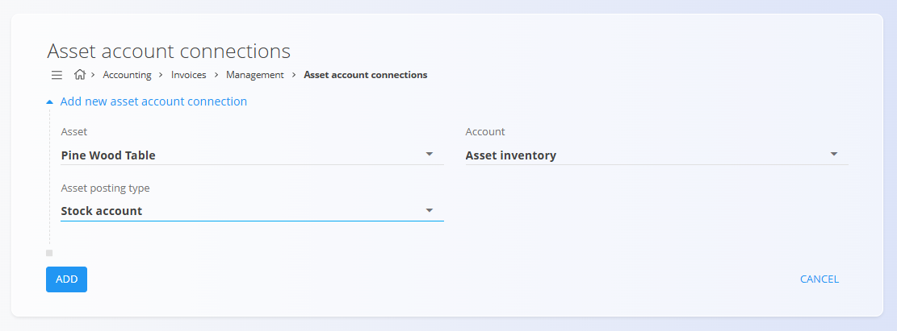

<!-- app_route: /management/ledger/asset-account-connections -->
<!-- app_label: Asset account connections -->
<!-- canonical_source_url: https://github.com/Tom-PIT/Connected.Docs/blob/main/en/Domains/Accounting/Management/Invoices/AssetAccountConnections.md -->
<!-- canonical_source_title: Asset account connections -->

# Asset account connections

The **Asset account connections** screen defines how individual assets are linked to ledger accounts for accounting postings created from invoices. This configuration determines which accounts are used when an asset is sold, stocked, or otherwise involved in invoice-related postings.

To access this screen, go to **Accounting / Invoices / Management / Asset account connections** in the [navigation](../../../../Zajednicko/UI/Navigacija.md).

## Overview

Asset account connections:

* Link a specific **asset** to a specific **ledger account**
* Are evaluated during invoice posting
* Allow different posting behavior depending on the **asset posting type**

These connections do not create postings by themselves. They provide posting rules that are used when invoices referencing the asset are processed.

## Schema

| Field              | Description                                                  |
| ------------------ | ------------------------------------------------------------ |
| **Asset**             | The asset to which the account connection applies.           |
| **Asset posting type** | Defines the accounting context in which the account is used. |
| **Account**            | Account from the [**Chart of accounts**](../Ledger/ChartOfAccounts.md) used for the selected posting type.           |

### Asset posting type

The **Asset posting type** determines *when* the selected account is used. Available options may include:

* **Domestic revenue account** – Used when the asset is sold on the domestic market
* **Revenue account in Europe markets** – Used for sales within European markets
* **Revenue account in non-Europe markets** – Used for sales outside European markets
* **Stock account** – Used to represent the inventory value of the asset

> [!NOTE]
> Each posting type represents a different accounting scenario. Multiple account connections can be defined for the same asset, one per posting type.

## List view

The list view displays all defined asset account connections.

Each row shows:
* **Asset**
* **Asset posting type**
* **Account**

## Actions

### Add an asset account connection

To create a new asset account connection:

1. Click the [action button](../../../../Common/UI/ActionButton.md) to add a new entry
2. Select the **Asset**
3. Select the **Asset posting type**
4. Select the **Account** to be used for that posting type
5. Click **Add** to save the connection or **Cancel** to discard it

### Practical examples

The following examples illustrate typical and realistic asset account connections.

#### Example: Finished product – domestic sales

* **Asset:** Cherry Wood Table
* **Asset posting type:** Domestic revenue account
* **Account:** Sales revenue

This connection defines which revenue account is used when the asset is sold domestically.

#### Example: Finished product – inventory value

* **Asset:** Cherry Wood Table
* **Asset posting type:** Stock account
* **Account:** Inventory

This connection links the asset to its inventory account and is used to represent stock value.

#### Example: Finished product – European sales

* **Asset:** Oak Wood Table
* **Asset posting type:** Revenue account in Europe markets
* **Account:** Sales revenue

This allows differentiated revenue posting based on sales region.

## Delete an asset account connection

An asset account connection can be deleted only if it is not required by existing invoice postings.

To delete a connection, open it in edit mode and select **Delete**.

> [!WARNING]
> Removing asset account connections may prevent invoices involving the asset from being posted correctly.
